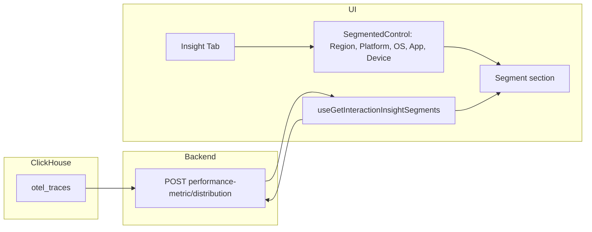

# Insight Tab — Phase 1: Segment Description

## Scope (Phase 1 only)

- **Segment description**: Show which segments drive "poor" interactions for **five dimensions**: **Region**, **Platform**, **OS version**, **App version**, **Device model**. For each dimension, show segment value and percentage of poor interactions (e.g. "Android 60%, iOS 40%").
- **API**: Use the **same API** as Regional Insights and Platform Insights: **POST `/v1/interactions/performance-metric/distribution`** ([Constants.ts](pulse-ui/src/constants/Constants.ts) `DATA_QUERY`). No new backend endpoint. No MV; queries hit `otel_traces` via this existing API.
- **Out of scope for Phase 1**: Major issues section, poor_traces table, issues API, issue detail links.

"Poor" is defined as `SpanAttributes['pulse.interaction.user_category'] = 'Poor'` only (not StatusCode). Only spans with `PulseType = 'interaction'` and matching `SpanName` (interaction name) are considered.

---

## 1. ClickHouse and backend: no changes

- **No new tables, MVs, or backend endpoints.** Regional Insights and Platform Insights use **POST `/v1/interactions/performance-metric/distribution`** ([ClickhouseMetricService](backend/server/src/main/java/org/dreamhorizon/pulseserver/service/interaction/ClickhouseMetricService.java)) with `QueryRequest` (dataType, timeRange, select, filters, groupBy). The backend builds a SELECT from `otel_traces` and supports:
  - **Filters**: arbitrary field + operator + value (e.g. `PulseType`, `SpanName`, and `**SpanAttributes['pulse.interaction.user_category']` = 'Poor'** for poor-only).
  - **Select**: `USER_CATEGORY_POOR` (count), `COL(field)` for any column (e.g. `Platform`, `OsVersion`, `AppVersion`, `DeviceModel`, `GeoState` per [PulseOtelSemcov](pulse-ui/src/constants/PulseOtelSemcov.ts) / schema).
  - **GroupBy**: any list of select aliases (e.g. `region`, `platform`).
- So the **existing API already supports** segment breakdown: frontend sends the same request shape with an extra filter for poor and the desired COL + groupBy per dimension. **No backend changes required** for Phase 1.

---

## 2. Frontend: Insight tab with Segment section only

### 2.1 Add "Insight" tab

- In [CriticalInteractionDetails.tsx](pulse-ui/src/screens/CriticalInteractionDetails/CriticalInteractionDetails.tsx):
  - Add `"insight"` to `VALID_TABS` and `<Tabs.Tab value="insight">Insight</Tabs.Tab>`.
  - Add `<Tabs.Panel value="insight">` that renders a new `Insight` component, passing `interactionName`, `startTime`, `endTime`, and optional `filterValues`.
- Sync tab with URL (e.g. `?tab=insight`).

### 2.2 Insight component (Phase 1)

- **Segment description section only** — implementation similar to [Analysis.tsx](pulse-ui/src/screens/CriticalInteractionDetails/components/InteractionDetailsMainContent/components/Analysis/Analysis.tsx) (SegmentedControl + one section).
  - **SegmentedControl** with five options: **Region**, **Platform**, **OS Version**, **App Version**, **Device Model**.
  - For the selected dimension, show one chart (e.g. reuse [PlatformDonutChart](pulse-ui/src/screens/CriticalInteractionDetails/components/InteractionDetailsMainContent/components/Analysis/components/PlatformDonutChart.tsx) with data mapped to segment value + percentage). Use same loading/error/empty pattern as [RegionalInsightsSection](pulse-ui/src/screens/CriticalInteractionDetails/components/InteractionDetailsMainContent/components/Analysis/sections/RegionalInsightsSection.tsx) / [PlatformInsightsSection](pulse-ui/src/screens/CriticalInteractionDetails/components/InteractionDetailsMainContent/components/Analysis/sections/PlatformInsightsSection.tsx): `AnalysisSectionSkeleton`, `ErrorAndEmptyStateWithNotification`, and section-specific constants.
- **Major issues section**: Not implemented in Phase 1 (placeholder or "Coming in Phase 2" is fine).
- Use existing patterns: time range and filters from parent; same props style as `AnalysisSectionProps` where applicable.

### 2.3 Data fetching (existing API)

- Reuse `**useGetDataQuery`** (same as [useGetRegionalInsights](pulse-ui/src/screens/CriticalInteractionDetails/components/InteractionDetailsMainContent/components/Analysis/hooks/useGetRegionalInsights/useGetRegionalInsights.ts) / [useGetPlatformInsights](pulse-ui/src/screens/CriticalInteractionDetails/components/InteractionDetailsMainContent/components/Analysis/hooks/useGetPlatformInsights/useGetPlatformInsights.ts)): POST `/v1/interactions/performance-metric/distribution` with:
  - **dataType**: `TRACES`
  - **timeRange**: `startTime`, `endTime`
  - **filters**: `PulseType = 'interaction'`, `SpanName = interactionName`, `**SpanAttributes['pulse.interaction.user_category']` = 'Poor'** (poor-only), plus any `dashboardFilters` via existing `FILTER_MAPPING`
  - **select**: `USER_CATEGORY_POOR` (alias e.g. `count`), `COL(dimensionColumn)` with alias matching groupBy (e.g. `COL(GeoState)` alias `region`, or `COL(Platform)` alias `platform`, etc.)
  - **groupBy**: `[region]` or `[platform]` or `[osVersion]` or `[appVersion]` or `[deviceModel]` depending on selected dimension
- New hook `**useGetInteractionInsightSegments`** (or one hook per dimension, similar to Regional/Platform): builds the above request for the **selected dimension only**, calls `useGetDataQuery`, then maps rows to `{ value, count }` and computes **percentage** (count / sum(count) * 100) client-side. Fetch only when the segment section is active (e.g. `shouldFetch` when Insight tab + that dimension selected), same pattern as Analysis sections.

---

## 3. Data flow (Phase 1)

---

## 4. Implementation order (Phase 1)

1. **Frontend only**: Add Insight tab and Insight component with SegmentedControl (five dimensions) and one segment section; hook `useGetInteractionInsightSegments` (or per-dimension hooks) that call **existing** `useGetDataQuery` with poor-only filter + `USER_CATEGORY_POOR` + `COL(dimension)` + `groupBy`; compute percentages from counts; reuse AnalysisSectionSkeleton, ErrorAndEmptyStateWithNotification, PlatformDonutChart; add segment error/empty constants.
2. **Backend / ClickHouse**: No changes. If the existing API does not accept the filter field `SpanAttributes['pulse.interaction.user_category']` (e.g. escaping issues), add minimal backend support for this filter; otherwise no backend work.

---

## 5. Testing (Phase 1)

- **UI**: Render Insight tab and segment section; verify each dimension fetches via existing API with poor filter; verify percentages (sum to 100 per dimension); empty/error states. Optionally mock `useGetDataQuery` or the distribution endpoint.
- **Backend**: No new code; existing API tests remain. If a new filter was added for user_category, add a unit test for that filter in the request builder.

---

## 6. Notes

- **Existing API:** The performance-metric/distribution endpoint already supports arbitrary filters (field/operator/value). The frontend must send the ClickHouse expression for the attribute: use field `**SpanAttributes['pulse.interaction.user_category']`** and value `**Poor`** (EQ). If the backend escapes or rejects this field name, add a dedicated filter constant or small backend change to support it.
- **One request per dimension:** Like Regional (one groupBy region) and Platform (one groupBy platform), the segment view can call the API once per selected dimension when that dimension is active; no need to fetch all five in one call unless desired (e.g. for preloading).
- **Filtering:** Same `dashboardFilters` as Analysis can be passed in the request filters for parity.
- **Future:** If segment queries become slow, introduce an MV/table and a dedicated segment endpoint later.

