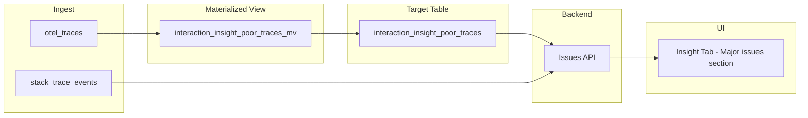

# Insight Tab — Phase 2: Major Issues

## Scope (Phase 2 only)

- **Major issues during poor interactions**: Show a **list of concrete issues** (specific crash/ANR groups — each with GroupId, title, event type) that are **most frequent** in poor interactions, with count per issue. Each row links to the **issue detail** in App Vitals: `/projects/:projectId/app-vitals/:groupId`.
- **Prerequisites**: Phase 1 done (Insight tab exists; segment description section and segments API are in place). This phase adds the poor_traces MV, issues API, and the Major issues UI section.

"Poor" is defined as `SpanAttributes['pulse.interaction.user_category'] = 'Poor'` only. Only spans with `PulseType = 'interaction'` and matching `SpanName` (interaction name) are considered.

---

## 1. ClickHouse: poor interaction traces table and MV

### 1.1 Poor interaction traces table and MV

**Purpose:** Store **which traces** are poor interaction spans (one row per poor span). At query time, the backend joins this with `stack_trace_events` (TraceId, GroupId, Title, EventName) to get the **concrete issues** that occurred in those traces, then aggregates by GroupId to return the list of most frequent issues.

**Target table (single-node, [backend/ingestion/clickhouse-otel-schema.sql](backend/ingestion/clickhouse-otel-schema.sql)):**

```sql
CREATE TABLE IF NOT EXISTS otel.interaction_insight_poor_traces
(
    ProjectId LowCardinality(String),
    Date Date,
    InteractionName LowCardinality(String),
    TraceId String
)
ENGINE = MergeTree
PARTITION BY toYYYYMM(Date)
ORDER BY (ProjectId, InteractionName, Date, TraceId);
```

**MV:** On insert into `otel_traces`, for each row that is an interaction span and is "poor", emit one row with that span's TraceId and interaction name.

- Source: `otel.otel_traces`
- WHERE: `PulseType = 'interaction'` AND `SpanAttributes['pulse.interaction.user_category'] = 'Poor'`
- SELECT: `ProjectId`, `toDate(Timestamp) AS Date`, `ifNull(SpanAttributes['pulse.interaction.name'], SpanName) AS InteractionName`, `TraceId`

**Issues at read time:** The issues API joins `interaction_insight_poor_traces` with `stack_trace_events` (see Backend section). No pre-aggregated issues table; concrete issues are computed at query time.

### 1.2 Schema files to update

- **[backend/ingestion/clickhouse-otel-schema.sql](backend/ingestion/clickhouse-otel-schema.sql)**: Add `interaction_insight_poor_traces` table and its MV.
- **[backend/ingestion/clickhouse-replicated-tiered-schema.sql](backend/ingestion/clickhouse-replicated-tiered-schema.sql)** (cluster): Add `interaction_insight_poor_traces_local` and MV from `otel_traces_local`; add Distributed view if needed.

### 1.3 Backfill (optional)

For historical data, run a one-time backfill for `interaction_insight_poor_traces` (same filter as MV). Run once after deployment if needed. Avoid overlapping backfill to prevent double-count.

---

## 2. Backend: Issues API

### 2.1 Endpoint

- **Issues breakdown**  
  `GET /v1/insights/interactions/:interactionName/issues`  
  Query params: `start`, `end` (ISO date or datetime).  
  Response: list of **concrete issues** `{ groupId, title, eventName, count, percentage? }` ordered by count descending. Each item is a specific crash/ANR group from `stack_trace_events`. The UI links each row to **issue detail**: `/projects/:projectId/app-vitals/:groupId`.

### 2.2 Query pattern

- Resolve `projectId` from current context.
- **Issues query:** Join `interaction_insight_poor_traces` with `stack_trace_events`:
  - `SELECT GroupId, Title, EventName, count() AS count FROM otel.stack_trace_events WHERE ProjectId = ? AND TraceId IN (SELECT TraceId FROM otel.interaction_insight_poor_traces WHERE ProjectId = ? AND InteractionName = ? AND Date BETWEEN ? AND ?) GROUP BY GroupId, Title, EventName ORDER BY count DESC`.
- Backend returns list of concrete issues (groupId, title, eventName, count). Use safe parameterization; validate interactionName and start/end; set timeout on QueryConfiguration.

### 2.3 Files to add/touch

- Extend existing insight resource (from Phase 1) with the issues endpoint.
- Extend service/DAO to run the issues query and map to issue DTOs (groupId, title, eventName, count).
- New: DTO for issue breakdown so the frontend can link to `/app-vitals/:groupId`.

---

## 3. Frontend: Major issues section

### 3.1 Insight component (Phase 2 addition)

- **Major issues section**
  - List of **concrete issues** (specific crash/ANR groups) that are most frequent in poor interactions: each row shows **issue title** (and optionally event type label) and **count**. Ordered by count descending.
  - **Navigation:** Each row is clickable and links to **issue detail**: `/projects/:projectId/app-vitals/:groupId`. Use existing App Vitals issue detail route.
- Loading/error/empty states for the issues list (e.g. "No issues in this period" when empty).

### 3.2 Data fetching

- New hook `useGetInteractionInsightIssues` that calls `GET /v1/insights/interactions/:interactionName/issues` with `startTime`, `endTime` (and project from context).
- Insight component calls both `useGetInteractionInsightSegments` (Phase 1) and `useGetInteractionInsightIssues` (Phase 2), or a single hook that returns `{ segments, issues }`.

### 3.3 Issue display

- Each row shows **title** (from API) and optionally **event type** label (from eventName: e.g. "Crash", "ANR"). Link text can be the title or "View issue" with aria-label including the title. Use `useProjectContext().projectId` to build the issue detail URL.

---

## 4. Data flow (Phase 2 addition)



---

## 5. Implementation order (Phase 2)

1. **ClickHouse**: Add `interaction_insight_poor_traces` table and MV to [clickhouse-otel-schema.sql](backend/ingestion/clickhouse-otel-schema.sql); mirror for replicated if used.
2. **Backend**: Add issues endpoint, extend service/DAO for the join query, add issue DTOs.
3. **Frontend**: Add Major issues section to the existing Insight component; implement `useGetInteractionInsightIssues` and issue list with links to `/app-vitals/:groupId`.
4. **Optional**: One-time backfill for `interaction_insight_poor_traces`; document.

---

## 6. Testing (Phase 2)

- **Backend**: Unit tests for issues query shape and DTO mapping; integration test with test data in `interaction_insight_poor_traces` and `stack_trace_events`.
- **UI**: Render Major issues list; verify links go to correct issue detail page; empty/error states.
- **Schema**: Verify new DDL applies; no regression on segment API.

---

## 7. Notes

- **Linking assumption:** Issues are included only when the exception's TraceId in `stack_trace_events` matches a TraceId in `interaction_insight_poor_traces` (same trace as a poor interaction span). If the SDK sends crash/ANR in a different trace, those won't appear.
- **Concrete issues source:** Issues come from `stack_trace_events` (GroupId, Title, EventName) joined with `interaction_insight_poor_traces` by TraceId. groupId is used for the detail link; eventName for display label.
- **Replicated schema**: Same pattern as Phase 1 — `*_local` table + MV, Distributed view if cluster.
