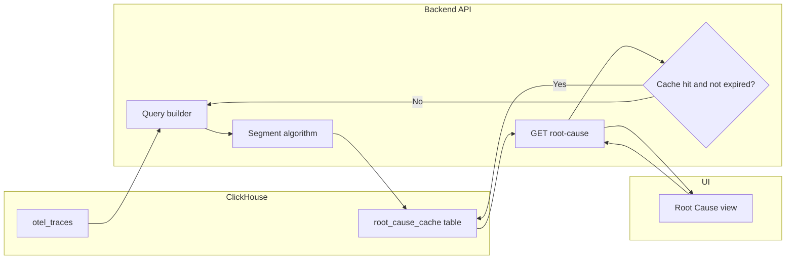

# Root Cause Analysis – Implementation Plan (main branch)

Source: [doc/root-cause-analysis-plan.md](doc/root-cause-analysis-plan.md). This plan turns the spec into actionable phases.

---

## Scope

- **Output:** Top Contributing Segments only — each segment has a **Metric | Value | Baseline | Delta** table (APDEX, Error Rate, Poor User %, Duration P50/P95, Crash Rate, ANR Rate, Frozen Frame Rate, Slow Frame Rate, Volume).
- **Thresholds:** **Configurable** (e.g. application config or env). **Default: 75%** for both (1) first dimension and (2) adding further dimensions.
- **Modes:** (1) **Hierarchical** when some segment reaches the first-dimension threshold and sub-segments stay ≥ add-dimension threshold. (2) **Flat** when no segment reaches thresholds: output top segment value **per dimension separately** (e.g. Platform – Android, Location – Rajasthan, Network – Jio).
- **Data and cache:** **On-demand:** First request for a given (tenant, project, interaction, date) runs the algorithm on `otel_traces` (configurable lookback, default 7 days), writes the result to a **ClickHouse cache table**, and returns it. Subsequent requests for the same key **within the cache TTL** (e.g. **24 hours from `cached_at`**) are served **from cache only** (no recomputation). **Union** for problematic count (error OR poor, no double-count). No scheduled/cron pipeline.
- **Edge cases (to resolve in implementation):** Total problematic = 0 → "everything is good"; no data for tenant → "no data available" / "NA"; exact API response shape still under discussion per spec.

---

## Architecture (high level)




- **API (read-through):** On `GET /v1/interactions/:name/root-cause` (optional date), resolve cache key (e.g. tenant + project + interaction name + date). **If cache hit and not expired** (e.g. `cached_at` within last 24h): return cached payload. **If cache miss or expired:** run the segment selection algorithm against `otel_traces` (configurable lookback), compute baseline + segments + deltas, **write** to the ClickHouse cache table, then return. Optionally use **single-flight** per cache key (lock or dedupe) so concurrent first requests for the same key do not all run the algorithm.
- **UI:** Under Critical Interaction Details, a view that calls the API and renders Metric | Value | Baseline | Delta per segment. **First request** may take several seconds; show loading state and consider timeout (e.g. 30–60s).

---

## Phase 1 – Data and metrics foundation

**Goal:** Reuse or add the building blocks for querying interaction traces and problematic count; design the cache table.

- **Confirm schema:** Ensure [backend/ingestion/clickhouse-otel-schema.sql](backend/ingestion/clickhouse-otel-schema.sql) `otel_traces` supports the required columns and attributes (e.g. `SpanAttributes['app.interaction.frozen_frame_count']`, `app.interaction.slow_frame_count`). Main already uses these for performance metrics.
- **Metrics registry / config:** Define a small config or registry listing metrics for interaction traces — volume, apdex, error_rate, poor_user_pct, duration_p50, duration_p95, crash_rate, anr_rate, frozen_frame_rate, slow_frame_rate. Reuse expressions from [ClickhouseConstants](backend/server/src/main/java/org/dreamhorizon/pulseserver/constant/ClickhouseConstants.java) / [ClickhouseMetricService](backend/server/src/main/java/org/dreamhorizon/pulseserver/service/interaction/ClickhouseMetricService.java) where they exist.
- **Query builder:** Implement (or reuse) a component that, given interaction name, time range, tenant/project, list of metric keys, and optional dimensions/filters, builds a single ClickHouse SELECT against `otel_traces` and runs it via [ClickhouseQueryService](backend/server/src/main/java/org/dreamhorizon/pulseserver/client/chclient/ClickhouseQueryService.java). Support GROUP BY dimension(s) for segment queries and no GROUP BY for baseline.
- **Problematic count (union):** Add a way to get per-segment and total **union** count (error OR poor, distinct). Used by the segment selection algorithm.
- **Configurable thresholds and lookback:** Add configuration for first dimension threshold (default 75), add-dimension threshold (default 75), and lookback days (default 7). Algorithm and API use these at runtime.
- **Cache table design:** See **Cache table schema** below. Create the table in the same schema file(s) as other otel tables ([backend/ingestion/clickhouse-otel-schema.sql](backend/ingestion/clickhouse-otel-schema.sql)).

---

## Cache table schema

Table: e.g. `otel.root_cause_cache` (or `root_cause_cache` in the same DB as `otel_traces`).


| Column           | Type                                | Description                                                                                                                                                                                                                                                       |
| ---------------- | ----------------------------------- | ----------------------------------------------------------------------------------------------------------------------------------------------------------------------------------------------------------------------------------------------------------------- |
| tenant_id        | String (UUID or project identifier) | Tenant/project scope.                                                                                                                                                                                                                                             |
| project_id       | String                              | Project scope (if separate from tenant).                                                                                                                                                                                                                          |
| interaction_name | String                              | Critical interaction name (e.g. "Contest Join").                                                                                                                                                                                                                  |
| date             | Date                                | Analysis date / cache key date (e.g. last day of the lookback window, or date requested).                                                                                                                                                                         |
| mode             | LowCardinality(String)              | `'hierarchical'` or `'flat'`.                                                                                                                                                                                                                                     |
| baseline         | String (JSON)                       | JSON object: metric key → value (e.g. `{"volume": 3855, "apdex": 0.56, "error_rate": 6.9, ...}`). All metrics from the registry (volume, apdex, error_rate, poor_user_pct, duration_p50, duration_p95, crash_rate, anr_rate, frozen_frame_rate, slow_frame_rate). |
| segments         | String (JSON)                       | JSON array of segment objects (see **Algorithm output** below). Each segment has a label, dimensions, metrics map, and deltas map.                                                                                                                                |
| cached_at        | DateTime64(3) or DateTime           | When this row was computed. Used for TTL: if `now() - cached_at` > configured TTL (e.g. 24h), treat as expired.                                                                                                                                                   |


**Primary key / uniqueness:** `(tenant_id, project_id, interaction_name, date)` so that one row per interaction per date is stored; upsert on write.

**Alternative:** Store baseline as fixed columns (e.g. `baseline_volume`, `baseline_apdex`, …) instead of JSON if querying by metric is needed; segments can remain JSON for flexibility (variable number of segments, nested structure).

---

## Algorithm output

The segment selection algorithm produces a single result object that is both returned by the API and written to the cache table. Structure:

**Root fields**

- **mode:** `"hierarchical"` or `"flat"` — whether segments form a drill-down path or are independent per-dimension.
- **baseline:** Object `metricKey → value` for the overall interaction over the lookback window (no dimension filter). Keys: `volume`, `apdex`, `error_rate`, `poor_user_pct`, `duration_p50`, `duration_p95`, `crash_rate`, `anr_rate`, `frozen_frame_rate`, `slow_frame_rate`. Values are numbers (or null if not applicable).
- **segments:** Array of segment objects (see below). In **hierarchical** mode: ordered drill-down (a) → (b) → (c). In **flat** mode: one segment per dimension (e.g. Platform – Android, Location – Rajasthan, Network – Jio).

**Segment object (each element of `segments`)**


| Field      | Type   | Description                                                                                                                                               |
| ---------- | ------ | --------------------------------------------------------------------------------------------------------------------------------------------------------- |
| label      | String | Display label, e.g. "Android", "Android + App 3.4.5", "Platform – Android".                                                                               |
| dimensions | Object | Dimension key → value, e.g. `{ "Platform": "android" }` or `{ "Platform": "android", "AppVersion": "3.4.5" }`. For flat mode, one dimension per segment.  |
| metrics    | Object | Metric key → value for this segment (same keys as baseline).                                                                                              |
| deltas     | Object | Metric key → delta % (percentage change vs baseline). Formula: `((Value - Baseline) / Baseline) * 100`; for Volume optionally `(Value / Baseline) * 100`. |


**Edge-case outputs**

- **Total problematic count = 0:** Return a result with `mode: "hierarchical"` (or `"flat"`), `baseline` populated, `segments: []`, and a flag or message indicating "everything is good" (exact shape TBD).
- **No data for tenant:** Return no row / cache miss and API responds with "no data available" or "NA" (exact shape TBD).

**Example (hierarchical)**

```json
{
  "mode": "hierarchical",
  "baseline": { "volume": 3855, "apdex": 0.56, "error_rate": 6.9, "poor_user_pct": 14.7, "duration_p50": 1041, "duration_p95": 3238, "crash_rate": 1.1, "anr_rate": 1.2, "frozen_frame_rate": 0.5, "slow_frame_rate": 3.0 },
  "segments": [
    { "label": "Android", "dimensions": { "Platform": "android" }, "metrics": { "volume": 2100, "apdex": 0.12, ... }, "deltas": { "volume": 54.5, "apdex": -78.6, ... } },
    { "label": "Android + App 3.4.5", "dimensions": { "Platform": "android", "AppVersion": "3.4.5" }, "metrics": { ... }, "deltas": { ... } },
    { "label": "Android + App 3.4.5 + Jio", "dimensions": { "Platform": "android", "AppVersion": "3.4.5", "NetworkProvider": "Jio" }, "metrics": { ... }, "deltas": { ... } }
  ]
}
```

**Example (flat)**

```json
{
  "mode": "flat",
  "baseline": { "volume": 3855, "apdex": 0.56, ... },
  "segments": [
    { "label": "Platform – Android", "dimensions": { "Platform": "android" }, "metrics": { ... }, "deltas": { ... } },
    { "label": "Location – Rajasthan", "dimensions": { "GeoState": "Rajasthan" }, "metrics": { ... }, "deltas": { ... } },
    { "label": "Network – Jio", "dimensions": { "NetworkProvider": "Jio" }, "metrics": { ... }, "deltas": { ... } }
  ]
}
```

This structure is what the API returns and what is stored in the cache table (`baseline` and `segments` as JSON in the columns above).

---

## Phase 2 – Segment selection algorithm and read-through API

**Goal:** Implement the segment selection algorithm (configurable thresholds, default 75%; flat fallback), and the **read-through API** that computes on cache miss and caches for the TTL. **No scheduled pipeline or cron.**

- **Configuration:** Expose thresholds and lookback (e.g. `root_cause.first_dimension_threshold_pct`, `root_cause.add_dimension_threshold_pct`, `root_cause.lookback_days`; or env). Defaults: 75, 75, 7. Add optional **cache TTL** (e.g. `root_cause.cache_ttl_hours`, default 24).
- **Algorithm in code:** Same as before: total problematic count (union) over configured lookback; first dimension (threshold); add dimensions (threshold); flat fallback when thresholds not met. Baseline and segment metrics via query builder; delta calculation per spec.
- **API – read-through logic:**
  1. Resolve cache key: tenant, project, interaction name, date (from query param or default).
  2. **Read** from the ClickHouse cache table. If row exists and `cached_at` is within the configured TTL (e.g. last 24h), **return** cached result.
  3. If **cache miss or expired:** (Optionally acquire a single-flight lock per cache key to avoid thundering herd.) Run the algorithm for this interaction and date (using configured lookback), compute baseline + segments + deltas, **write** to the cache table (upsert by key, set `cached_at` = now), then return the result. Release lock if used.
- **API contract:** `GET /v1/interactions/:name/root-cause` (optional query param for date). Response: `{ baseline, segments, cachedAt, mode? }`. On no data or total problematic = 0: return structure that supports edge cases per spec (exact fields TBD).
- **Integration:** Expose the endpoint from [InteractionController](backend/server/src/main/java/org/dreamhorizon/pulseserver/resources/interaction/InteractionController.java) or a dedicated root-cause resource. **Do not** add a cron job or scheduled pipeline.

---

## Phase 3 – UI

**Goal:** A view under Critical Interaction Details that displays Top Contributing Segments from the API.

- **Placement:** Add a "Root Cause" or "Insight" section/tab under [CriticalInteractionDetails](pulse-ui/src/screens/CriticalInteractionDetails/). Reuse existing patterns for time range and filters from parent.
- **Data:** Call `GET .../interactions/:name/root-cause` (with date if needed). Handle **loading** (first request can take several seconds), **error**, and edge cases (no data, everything is good). Consider request timeout (e.g. 30–60s).
- **Render:** For each segment (hierarchical or flat), render the **Metric | Value | Baseline | Delta** table; show dimension combo or flat labels. Reuse or add a small table component.

---

## Implementation order

1. **Phase 1:** Schema check; metrics config/registry; query builder + union problematic count; configurable thresholds and lookback; design and create ClickHouse cache table.
2. **Phase 2:** Algorithm (configurable thresholds, flat fallback); baseline/segment queries and delta calculation; **read-through API** (check cache → compute on miss/expiry, write cache, return); optional single-flight per cache key; no pipeline job.
3. **Phase 3:** Frontend view, API integration, loading and edge-case handling.

---

## Key files and references

- **Spec:** [doc/root-cause-analysis-plan.md](doc/root-cause-analysis-plan.md) — algorithm, metrics, delta formula, edge cases.
- **Backend:** [ClickhouseQueryService](backend/server/src/main/java/org/dreamhorizon/pulseserver/client/chclient/ClickhouseQueryService.java), [ClickhouseConstants](backend/server/src/main/java/org/dreamhorizon/pulseserver/constant/ClickhouseConstants.java), [ClickhouseMetricService](backend/server/src/main/java/org/dreamhorizon/pulseserver/service/interaction/ClickhouseMetricService.java), [InteractionDao](backend/server/src/main/java/org/dreamhorizon/pulseserver/dao/interaction/InteractionDao.java).
- **ClickHouse schema:** [backend/ingestion/clickhouse-otel-schema.sql](backend/ingestion/clickhouse-otel-schema.sql).
- **UI:** [CriticalInteractionDetails](pulse-ui/src/screens/CriticalInteractionDetails/).

---

## Open decisions (from spec)

- **Edge-case messaging:** Exact API response shape and user-facing copy for "everything is good" and "no data available" / "NA" to be finalised during implementation.
- **Cache TTL:** 24 hours from `cached_at` (recommended) vs same calendar day; make configurable (e.g. `root_cause.cache_ttl_hours`).
- **Single-flight:** Whether to implement per-key locking or request coalescing so concurrent first requests for the same interaction/date do not all run the algorithm.
- **Thresholds and lookback:** Configurable (config or env). Defaults: 75%, 75%, 7 days.
- **Flat mode:** Which dimensions to include (all six vs top N) and one value per dimension vs top N per dimension — spec says "top segment value per dimension" (singular).

