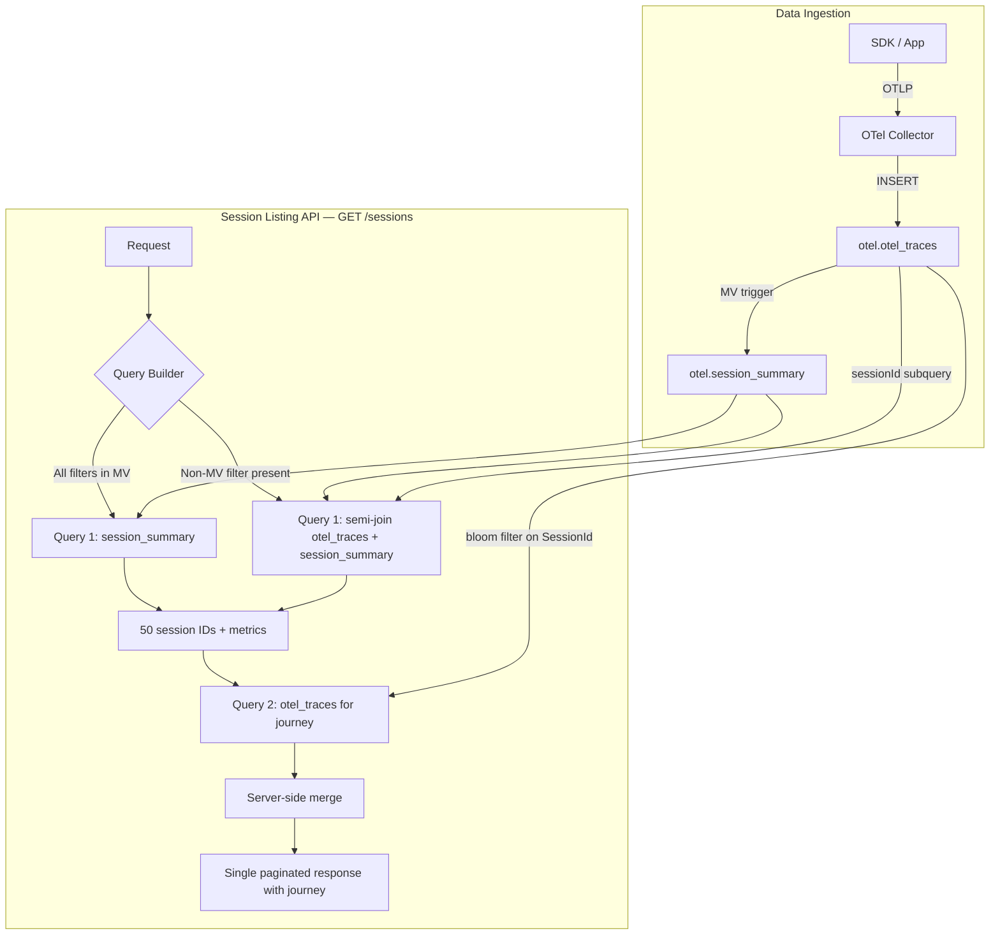
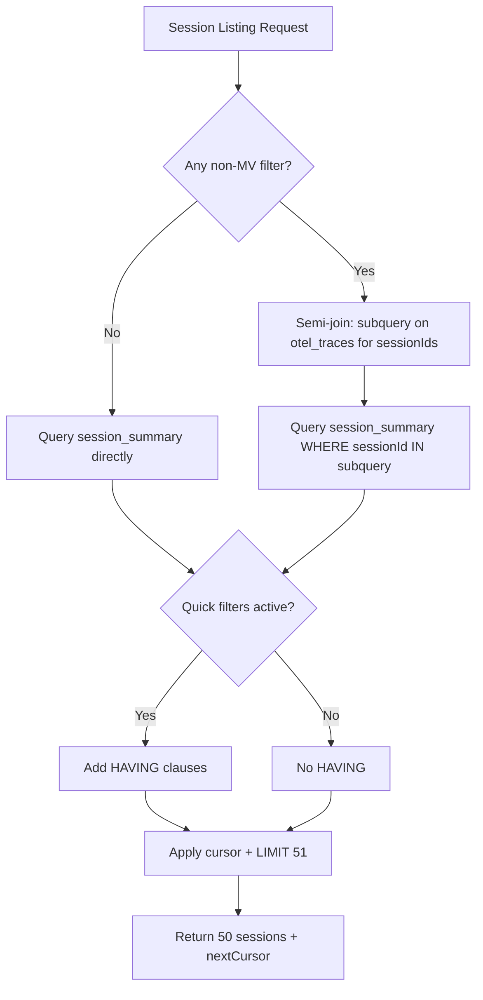

# Session Listing Backend — Design Document

> Author: Aniket Raj
> Status: WIP
> Last updated: 2026-02-27

---

## Table of Contents

1. [Overview and Goals](#1-overview-and-goals)
2. [Data Model](#2-data-model)
3. [Query Strategies — Session Listing](#3-query-strategies--session-listing)
4. [Issue Categories](#4-issue-categories)
5. [Quick Filters](#5-quick-filters)
6. [Advanced Filters](#6-advanced-filters)
7. [Sorting](#7-sorting)
8. [Pagination](#8-pagination)
9. [Journey](#9-journey)
10. [Search](#10-search)
11. [Schema Changes Needed](#11-schema-changes-needed)
12. [Assumptions](#12-assumptions)
13. [Architecture Diagram](#13-architecture-diagram)

---

## 1. Overview and Goals

The session listing backend powers the **session listing page** — a paginated table of sessions with key metrics, filterable by quick filters and advanced filters.

> **Note:** Session detail page is out of scope for this document and will be designed separately.

### Listing page columns

| Column | Description |
|--------|-------------|
| `sessionId` | Unique session identifier |
| `startTime` | Earliest span timestamp in the session (ISO 8601) |
| `durationMs` | Time between first and last span (milliseconds) |
| `user` | UserId if available |
| `qualityScore` | Average apdex score across interaction spans (0–1, 2 decimals; null if no interactions) |
| `issues` | Per-category issue counts (network errors, crashes, ANR, etc.) |
| `platform` | Android / iOS |
| `journey` | Ordered list of screens/pages visited |

---

## 2. Data Model

### Source table: `otel.otel_traces`

The primary data store for all spans. Key columns and materialized columns:

```
ENGINE = MergeTree
PARTITION BY toYYYYMMDD(Timestamp)
ORDER BY (ProjectId, ServiceName, PulseType, SpanName, Timestamp)
```

| Column | Type | Source |
|--------|------|--------|
| `Timestamp` | DateTime64(9, 'UTC') | Direct |
| `TraceId` | String | Direct |
| `SpanId` | FixedString(16) | Direct |
| `SpanName` | LowCardinality(String) | Direct |
| `SpanAttributes` | Map(LowCardinality(String), String) | Direct |
| `ResourceAttributes` | Map(LowCardinality(String), String) | Direct |
| `Duration` | Int64 | Direct (nanoseconds) |
| `StatusCode` | LowCardinality(String) | Direct |
| `Events.Name` | Array(LowCardinality(String)) | Direct |
| `ProjectId` | LowCardinality(String) | MATERIALIZED from `ResourceAttributes['project.id']` |
| `PulseType` | LowCardinality(String) | MATERIALIZED from `SpanAttributes['pulse.type']` |
| `SessionId` | String | MATERIALIZED from `SpanAttributes['session.id']` |
| `UserId` | String | MATERIALIZED from `SpanAttributes['user.id']` |
| `Platform` | LowCardinality(String) | MATERIALIZED from `ResourceAttributes['os.name']` |
| `AppVersion` | LowCardinality(String) | MATERIALIZED from `ResourceAttributes['app.build_name']` |
| `OsVersion` | LowCardinality(String) | MATERIALIZED from `ResourceAttributes['os.version']` |
| `DeviceModel` | LowCardinality(String) | MATERIALIZED from `ResourceAttributes['device.model.name']` |
| `NetworkProvider` | LowCardinality(String) | MATERIALIZED from `SpanAttributes['network.carrier.name']` |
| `GeoCountry` | LowCardinality(String) | MATERIALIZED from `SpanAttributes['geo.country.iso_code']` |
| `GeoState` | LowCardinality(String) | MATERIALIZED from `SpanAttributes['geo.region.iso_code']` |

### Pre-aggregated table: `otel.session_summary`

One row per (ProjectId, SessionId), maintained by a materialized view.

```
ENGINE = AggregatingMergeTree
ORDER BY (ProjectId, sessionId)
```

| Column | Type | Merge behavior |
|--------|------|----------------|
| `ProjectId` | LowCardinality(String) | Key |
| `sessionId` | String | Key |
| `startTime` | SimpleAggregateFunction(min, DateTime64) | Keeps earliest |
| `endTime` | SimpleAggregateFunction(max, DateTime64) | Keeps latest |
| `userId` | SimpleAggregateFunction(any, String) | Keeps any non-empty |
| `platform` | SimpleAggregateFunction(any, LowCardinality(String)) | Keeps any |
| `appVersion` | SimpleAggregateFunction(any, LowCardinality(String)) | Keeps any |
| `osVersion` | SimpleAggregateFunction(any, LowCardinality(String)) | Keeps any |
| `apdexSum` | SimpleAggregateFunction(sum, Float64) | Accumulated |
| `apdexCount` | SimpleAggregateFunction(sum, UInt64) | Accumulated |
| `networkErrors` | SimpleAggregateFunction(sum, UInt64) | Accumulated |
| `interactionErrors` | SimpleAggregateFunction(sum, UInt64) | Accumulated |
| `crashCount` | SimpleAggregateFunction(sum, UInt64) | Accumulated |
| `anrCount` | SimpleAggregateFunction(sum, UInt64) | Accumulated |
| `nonFatal` | SimpleAggregateFunction(sum, UInt64) | Accumulated |
| `slowInteractionCount` | SimpleAggregateFunction(sum, UInt64) | Accumulated |
| `frozenFrameCount` | SimpleAggregateFunction(sum, Float64) | Accumulated |
| `spanCount` | SimpleAggregateFunction(sum, UInt64) | Accumulated |

### How the Materialized View works

The MV (`otel.session_summary_mv`) is attached to `otel_traces` and fires on every INSERT batch. It does **not** query existing data — it only sees the rows in the current INSERT.

**Write pipeline:**

1. SDK sends spans → OTel Collector batches them → INSERT into `otel_traces`.
2. The MV intercepts the inserted rows, runs a `GROUP BY (ProjectId, SessionId)` over *just that batch*, and writes partial aggregates to `session_summary`.
3. `session_summary` may now have **multiple rows per session** (one per INSERT batch that contained spans for that session).

**Background merge:**

ClickHouse's `AggregatingMergeTree` engine periodically merges data parts. During a merge, rows with the same `ORDER BY` key `(ProjectId, sessionId)` are collapsed using each column's merge function:

| `SimpleAggregateFunction` | Merge behavior |
|---------------------------|----------------|
| `min(startTime)` | Keeps the smallest value across all partial rows |
| `max(endTime)` | Keeps the largest value |
| `any(userId)` | Keeps any non-empty value |
| `any(platform)` | Keeps any non-empty value |
| `sum(crashCount)` | Adds values together |

After a merge, one session = one row. But merges are **asynchronous** — you can't assume they've happened yet at query time.

**Why queries must re-aggregate:**

Because partial rows may not yet be merged, every read query on `session_summary` must use `GROUP BY sessionId` with matching functions (`min`, `max`, `sum`, `any`). This is safe and idempotent: if the row is already merged, the GROUP BY is a no-op over a single row; if not, it correctly combines partial rows.

```sql
-- Correct: re-aggregates in case of unmerged partials
SELECT sessionId, min(startTime) AS startTime, sum(crashCount) AS crashCount, ...
FROM otel.session_summary
WHERE ...
GROUP BY sessionId

-- Wrong: reads raw rows which may be partial
SELECT sessionId, startTime, crashCount, ...
FROM otel.session_summary
WHERE ...
```

**Write overhead:**

The MV piggybacks on the INSERT pipeline — it is not a separate background job or trigger. The cost is a small GROUP BY over the batch (typically a few hundred rows) at insert time. Measured overhead: +10-20% write latency, ~95% baseline throughput. Storage overhead is ~5-10% (summary table is much smaller than raw spans).

---

## 3. Query Strategies — Session Listing

### Strategy A: Direct query on `otel_traces` (no MV)

```sql
SELECT
  SessionId AS sessionId,
  min(Timestamp) AS startTime,
  toUInt64(dateDiff('millisecond', min(Timestamp), max(Timestamp))) AS durationMs,
  any(UserId) AS user,
  round(avgIf(
    toFloat64OrNull(SpanAttributes['pulse.interaction.apdex_score']),
    SpanAttributes['pulse.interaction.apdex_score'] != ''
  ), 2) AS qualityScore,
  countIf(StatusCode = 'Error') AS networkErrors,
  countIf(ifNull(SpanAttributes['pulse.interaction.is_error'], '') = 'true') AS interactionErrors,
  countIf(PulseType = 'device.crash') AS crashCount,
  countIf(PulseType = 'device.anr') AS anrCount,
  countIf(PulseType = 'non_fatal') AS nonFatal,
  countIf(ifNull(SpanAttributes['pulse.interaction.user_category'], '') = 'Poor') AS slowInteractionCount,
  sum(toFloat64OrZero(SpanAttributes['app.interaction.frozen_frame_count'])) AS frozenFrameCount,
  any(Platform) AS platform,
  arraySlice(
    arrayFilter(
      x -> x != '',
      arrayMap(t -> t.2, arraySort(t -> t.1, groupArray((
        Timestamp,
        coalesce(
          nullIf(trimBoth(SpanAttributes['page.url']), ''),
          nullIf(trimBoth(SpanAttributes['screen.name']), ''),
          SpanName
        )
      ))))
    ), 1, 10
  ) AS journey
FROM otel.otel_traces
WHERE ProjectId = {projectId}
  AND Timestamp >= {startTime}
  AND Timestamp <= {endTime}
  AND SessionId != ''
GROUP BY SessionId
ORDER BY startTime DESC, SessionId DESC
LIMIT 51
```

**Pros:**
- Simple, single-table query.
- Full flexibility — any SpanAttribute can be used in filters.
- Journey capped to 10 screens for listing preview; full journey available on session detail.

**Cons:**
- Scans ALL spans for the project in the time range, then hash-aggregates by SessionId.
- Multiple SpanAttributes map lookups per row (6+).
- LIMIT 51 only saves on output; full aggregation + sort must complete first.

### Strategy B: Query on `session_summary` MV

```sql
SELECT
  sessionId,
  min(startTime) AS startTime,
  toUInt64(dateDiff('millisecond', min(startTime), max(endTime))) AS durationMs,
  any(userId) AS user,
  if(sum(apdexCount) > 0, round(sum(apdexSum) / sum(apdexCount), 2), null) AS qualityScore,
  sum(networkErrors) AS networkErrors,
  sum(interactionErrors) AS interactionErrors,
  sum(crashCount) AS crashCount,
  sum(anrCount) AS anrCount,
  sum(nonFatal) AS nonFatal,
  sum(slowInteractionCount) AS slowInteractionCount,
  sum(frozenFrameCount) AS frozenFrameCount,
  any(platform) AS platform
FROM otel.session_summary
WHERE ProjectId = {projectId}
  AND startTime >= {startTime}
  AND startTime <= {endTime}
GROUP BY sessionId
ORDER BY startTime DESC, sessionId DESC
LIMIT 51
```

**Pros:**
- Scans ~1 row per session instead of ~41 spans per session.
- No map key lookups — all columns are pre-extracted.
- No journey array construction in memory.
- Fast at any scale.

**Cons:**
- Limited to pre-aggregated columns; can't filter on arbitrary SpanAttributes.
- Journey not in MV — fetched via a separate query on `otel_traces` for the 50 returned session IDs, then merged server-side (see [Section 9: Journey](#9-journey)).
- Adds write-time overhead (minimal) and storage (~5-10% extra).
- Requires backfill for existing data.

### Scaling comparison

| Sessions (7 days) | Avg spans/session | Strategy A: rows scanned | Strategy B: rows scanned |
|----|----|----|-----|
| 1K | 41 | 41K | 1K |
| 10K | 41 | 410K | 10K |
| 100K | 41 | 4.1M | 100K |
| 1M | 41 | 41M | 1M |
| 10M | 41 | 410M | 10M |

| Sessions | Strategy A (raw table) | Strategy B (MV e2e) |
|----|----|----|
| 1K | ~9 ms | ~13 ms |
| 1M | 0.3–2.3 sec (filter dependent) | 116–261 ms (filter dependent) |
| 10M | ~3–23 sec | ~0.9–2.3 sec |

> Numbers anchored on POC-validated actuals at 1K and 1M sessions, scaled linearly. Range depends on filter selectivity — plain listing is slowest, selective filters (DeviceModel, interaction name) are fastest. See [POC results](./session-listing-poc.md) for full breakdown.

### Write overhead comparison

| Metric | Without MV | With MV |
|--------|-----------|---------|
| Write latency per batch | Baseline | +10-20% (partial aggregation piggybacked on insert) |
| Write throughput | Baseline | ~95% of baseline |
| Storage | Baseline | +5-10% (summary table is small vs raw spans) |
| Complexity | 1 table | +1 table + 1 MV |

The MV piggybacks on the insert pipeline — it is not a separate query or trigger. Write overhead is negligible for an observability workload.

### Recommendation

- **< 100K sessions:** Strategy A works (drop journey from listing for safety).
- **100K+ sessions:** Strategy B recommended.
- Strategy B is an **additive** change — it doesn't modify `otel_traces` or existing writes.

---

## 4. Issue Categories

Each issue type is counted per session and returned as part of the listing response. The backend builds an `issues` array from the counts.

| Issue | Metric (per session) | ClickHouse expression |
|-------|---------------------|-----------------------|
| Network Error | Spans with error status | `countIf(StatusCode = 'Error')` |
| Interaction Error | Interactions that completed with error (SDK sets `pulse.interaction.is_error`) | `countIf(ifNull(SpanAttributes['pulse.interaction.is_error'], '') = 'true')` |
| Crash | Device crash events | `countIf(PulseType = 'device.crash')` |
| ANR | Application Not Responding events | `countIf(PulseType = 'device.anr')` |
| Non-Fatal | Non-fatal exceptions | `countIf(PulseType = 'non_fatal')` |
| Slow | Interactions with user_category = 'Poor' (SDK sets when duration exceeds upper threshold) | `countIf(ifNull(SpanAttributes['pulse.interaction.user_category'], '') = 'Poor')` |
| Frozen Frames | Sum of frozen frame counts across spans | `sum(toFloat64OrZero(SpanAttributes['app.interaction.frozen_frame_count']))` |

The API returns per-session counts (`networkErrors`, `crashCount`, etc.). The backend or frontend builds a display-friendly `issues` array, e.g.:
```json
[
  { "type": "CRASH", "count": 1, "severity": "CRITICAL" },
  { "type": "SLOW", "count": 3, "severity": "WARN" }
]
```

---

## 5. Quick Filters

Quick filters are toggle buttons on the listing page. They map to HAVING clauses on the session listing query. Multiple quick filters are combined with OR.

| Quick filter | Description | HAVING condition |
|---|---|---|
| **Failed interactions** | Sessions where at least one critical flow failed | `sum(interactionErrors) > 0` |
| **Errors and crashes** | Sessions with any error, crash, ANR, or non-fatal | `sum(networkErrors) > 0 OR sum(crashCount) > 0 OR sum(anrCount) > 0 OR sum(nonFatal) > 0` |
| **Slow** | Sessions with at least one slow interaction | `sum(slowInteractionCount) > 0` |

When all three quick filters are active:

```sql
-- ...GROUP BY sessionId
HAVING
    sum(interactionErrors) > 0
    OR sum(networkErrors) > 0
    OR sum(crashCount) > 0
    OR sum(anrCount) > 0
    OR sum(nonFatal) > 0
    OR sum(slowInteractionCount) > 0
ORDER BY startTime DESC, sessionId DESC
LIMIT 51
```

---

## 6. Advanced Filters

### UI pattern

The advanced filter UI supports multiple conditions with a **Match ALL / Match ANY** toggle:

- **Match ALL** — conditions combined with `AND`.
- **Match ANY** — conditions combined with `OR`.

Each condition has: **Category**, **Field**, **Operator**, **Value**.

### Filter categories and fields

#### Session Properties

| Field | Operators | Value type | Query target | In MV? |
|-------|-----------|-----------|-------------|--------|
| Duration | `>`, `<`, `between` | milliseconds | HAVING on `durationMs` | Yes (computed from startTime/endTime) |
| Quality Score | `>`, `<`, `between` | 0–1 | HAVING on `qualityScore` | Yes (apdexSum/apdexCount) |
| Span Count | `>`, `<` | number | HAVING on `sum(spanCount)` | Yes |
| Has User ID | `is empty`, `is not empty` | — | HAVING on `any(userId)` | Yes |

#### User Properties

| Field | Operators | Value type | Query target | In MV? |
|-------|-----------|-----------|-------------|--------|
| User ID | `equals` | string | WHERE `userId = ?` | Yes |

#### Device

| Field | Operators | Value type | Query target | In MV? |
|-------|-----------|-----------|-------------|--------|
| Platform | `equals`, `in` | Android, iOS | WHERE `platform IN (?)` | Yes |
| App Version | `equals`, `in` | version strings | WHERE `appVersion IN (?)` | Yes |
| OS Version | `equals`, `in` | version strings | WHERE `osVersion IN (?)` | Yes |
| Device Model | `equals`, `in` | model strings | Semi-join on `otel_traces` | **No** |
| Network Provider | `equals`, `in` | carrier names | Semi-join on `otel_traces` | **No** |

#### UI Interactions

| Field | Operators | Value type | Query target | In MV? |
|-------|-----------|-----------|-------------|--------|
| Interaction Name | `equals`, `in` | string | Semi-join on `otel_traces` (`PulseType = 'interaction'` + `SpanAttributes['pulse.interaction.name']`) | **No** |
| Failed Interactions | `>`, `=` | count | HAVING on `sum(interactionErrors)` | Yes |
| Slow Interactions | `>`, `=` | count | HAVING on `sum(slowInteractionCount)` | Yes |
| Frozen Frames | `>`, `=` | count | HAVING on `sum(frozenFrameCount)` | Yes |

#### Stability / Errors

| Field | Operators | Value type | Query target | In MV? |
|-------|-----------|-----------|-------------|--------|
| Crashes | `>`, `=` | count | HAVING on `sum(crashCount)` | Yes |
| ANRs | `>`, `=` | count | HAVING on `sum(anrCount)` | Yes |
| Non-fatals | `>`, `=` | count | HAVING on `sum(nonFatal)` | Yes |
| Network Errors | `>`, `=` | count | HAVING on `sum(networkErrors)` | Yes |

#### Geography (not in MV)

| Field | Operators | Value type | Query target | In MV? |
|-------|-----------|-----------|-------------|--------|
| Country | `equals`, `in` | ISO codes | Semi-join on `otel_traces` | **No** |
| Region / State | `equals`, `in` | ISO codes | Semi-join on `otel_traces` | **No** |

### Summary: MV vs non-MV filters

#### In MV (WHERE or HAVING on `session_summary` directly)

| Filter | MV column | Query clause |
|--------|-----------|-------------|
| Platform | `platform` | WHERE |
| App Version | `appVersion` | WHERE |
| OS Version | `osVersion` | WHERE |
| User ID | `userId` | WHERE (bloom_filter index) |
| Duration | computed from `startTime`/`endTime` | HAVING |
| Quality Score | `apdexSum`/`apdexCount` | HAVING |
| Span Count | `spanCount` | HAVING |
| Has User ID | `userId` | HAVING |
| Failed Interactions | `interactionErrors` | HAVING |
| Slow Interactions | `slowInteractionCount` | HAVING |
| Frozen Frames | `frozenFrameCount` | HAVING |
| Crashes | `crashCount` | HAVING |
| ANRs | `anrCount` | HAVING |
| Non-fatals | `nonFatal` | HAVING |
| Network Errors | `networkErrors` | HAVING |

These are per-session constants (`any`) or pre-aggregated counts (`sum`) already stored in `session_summary`. No scan of `otel_traces` needed.

#### Not in MV (semi-join subquery on `otel_traces`)

| Filter | Source column in `otel_traces` | Why not in MV |
|--------|-------------------------------|---------------|
| Device Model | `DeviceModel` | Per-session constant; could be added to MV but rarely filtered (<10% usage) |
| Network Provider | `NetworkProvider` | Per-session constant; same rationale as DeviceModel |
| Interaction Name | `SpanAttributes['pulse.interaction.name']` | Per-span attribute; a session has multiple interaction names — can't reduce to a single value |
| Country | `GeoCountry` | Per-span attribute; may vary within a session (user moves between regions) |
| Region / State | `GeoState` | Same as Country |

These require a semi-join: subquery extracts matching `SessionId`s from `otel_traces`, main query runs on `session_summary`.

> **Note:** DeviceModel and NetworkProvider are per-session constants and *could* be added to the MV as `SimpleAggregateFunction(any, LowCardinality(String))` if usage grows. This would eliminate the semi-join for those filters. See [POC results](./session-listing-poc.md) for performance at 1M sessions with and without semi-join.

#### Proposed additional filters (pending team discussion)

Based on analysis of production interaction spans, these filters could be valuable additions:

| Attribute | Source | Example value | Filter use case | MV feasible? |
|-----------|--------|---------------|----------------|-------------|
| **Network Connection Type** | `SpanAttributes['network.connection.type']` | `wifi`, `cellular`, `5g` | "Show sessions on cellular" — common debugging dimension for network issues | Yes — per-session constant, `any(...)` in MV |
| **Device Manufacturer** | `ResourceAttributes['device.manufacturer']` | `Google`, `Samsung`, `Xiaomi` | Coarser than DeviceModel — "all Samsung sessions". Useful for OEM-specific bugs | Yes — per-session constant, `any(...)` in MV |
| **Screen Name** | `SpanAttributes['screen.name']` | `com.fc.UserProfileScreen` | "Sessions that visited checkout screen" — useful for product/debugging | No — per-span, multiple per session. Semi-join |

If approved, Device Manufacturer and Network Connection Type would require adding materialized columns to `otel_traces` and new columns to the `session_summary` MV. Screen Name would use the existing semi-join path with no schema changes.

#### Skipped attributes (available in prod spans but not worth filtering on)

| Attribute | Why skip |
|-----------|----------|
| `app.installation.id` | Internal SDK ID, no user-facing value. Search by userId/sessionId covers this |
| `network.carrier.icc/mcc/mnc` | Too granular — carrier name is sufficient |
| `pulse.interaction.config.id` / `pulse.interaction.id` | Internal IDs, not useful as listing filters |
| `pulse.interaction.complete_time` | Already captured via apdex/user_category |
| `rum.sdk.version` / `telemetry.sdk.version` | Internal, useful for SDK team debugging but not product users |
| `app.interaction.slow_frame_count` / `analysed_frame_count` | Already rolled up into frozen frames; too granular |
| `device.model.identifier` | Internal codename (e.g. `sdk_gphone64_arm64`) — `device.model.name` is the user-friendly version |
| `os.description` / `os.type` | Too granular — `os.version` + `platform` is sufficient |
| Event-level attributes (`isLoggedIn`, `launchType`, `clientLocation`) | Stored in `Events.Attributes`, not `SpanAttributes` — querying requires array unpacking which is expensive |

### Query strategy by filter scenario

**Scenario 1: All filters are MV-compatible (common case, ~90% of usage)**

Query `session_summary` directly. Dimension filters go in WHERE, aggregate filters go in HAVING.

```sql
SELECT ...
FROM otel.session_summary
WHERE ProjectId = {projectId}
  AND startTime >= {startTime}
  AND platform = 'Android'
  AND appVersion IN ('2.0.0')
GROUP BY sessionId
HAVING sum(crashCount) > 0
ORDER BY startTime DESC, sessionId DESC
LIMIT 51
```

**Scenario 2: Any non-MV filter is present (~10% of usage)**

Use a semi-join: subquery on `otel_traces` to get matching session IDs, main query on `session_summary` for everything else.

```sql
SELECT ...
FROM otel.session_summary
WHERE ProjectId = {projectId}
  AND startTime >= {startTime}
  AND sessionId IN (
    SELECT DISTINCT SessionId
    FROM otel.otel_traces
    WHERE ProjectId = {projectId}
      AND Timestamp >= {startTime}
      AND Timestamp <= {endTime}
      AND DeviceModel = 'Pixel 7'
      AND SessionId != ''
  )
GROUP BY sessionId
HAVING sum(crashCount) > 0
ORDER BY startTime DESC, sessionId DESC
LIMIT 51
```

The subquery scans `otel_traces` but only needs to extract `SessionId` + the filter column — much cheaper than a full GROUP BY with all aggregations. The main query still benefits from the MV for aggregation and sorting.

**Backend query builder logic:**

```
if all advanced filters are MV-compatible:
    build query on session_summary with WHERE + HAVING
else:
    build subquery on otel_traces for non-MV filters -> set of sessionIds
    build main query on session_summary with WHERE sessionId IN (subquery) + HAVING
```

---

## 7. Sorting

The listing supports sorting by any pre-aggregated MV column. Default sort is `startTime DESC`.

### Sortable fields

| Field | Sort expression | Default direction |
|-------|----------------|-------------------|
| Start Time | `min(startTime)` | DESC (most recent first) |
| Duration | `dateDiff('millisecond', min(startTime), max(endTime))` | DESC (longest first) |
| Quality Score | `if(sum(apdexCount) > 0, sum(apdexSum) / sum(apdexCount), null)` | ASC (worst quality first) |
| Network Errors | `sum(networkErrors)` | DESC (most errors first) |
| Crashes | `sum(crashCount)` | DESC |
| ANRs | `sum(anrCount)` | DESC |
| Slow Interactions | `sum(slowInteractionCount)` | DESC |
| Span Count | `sum(spanCount)` | DESC (busiest first) |

All fields support both ASC and DESC. The "default direction" is what the UI uses when the user first clicks the column header.

### Not sortable

- **DeviceModel, NetworkProvider, Interaction Name, Geo** — non-MV columns. Sorting would require scanning `otel_traces`.
- **userId, platform, appVersion** — string/categorical fields with no meaningful sort order. Better served as filters.

### Query impact

Sorting changes only the `ORDER BY` clause — the MV aggregation cost is identical regardless of sort field. The `sessionId` tiebreaker ensures deterministic ordering when sort values are equal.

```sql
-- Example: sort by crashCount DESC
SELECT ...
FROM otel.session_summary
WHERE ...
GROUP BY sessionId
HAVING ...
ORDER BY sum(crashCount) DESC, sessionId DESC
LIMIT 51
```

### Interaction with pagination

The cursor must include the sort field value along with `sessionId`. See [Section 8: Pagination](#8-pagination).

---

## 8. Pagination

Cursor-based pagination using a composite cursor of `(sortValue, sessionId)`.

- **Page size:** 50 sessions.
- **LIMIT 51:** Return 50 rows to the client; if a 51st row exists, there is a next page.
- **Cursor:** The last row's `(sortValue, sessionId)` becomes the cursor for the next page. `sortValue` is the value of whichever field is being sorted on.
- **Next page condition (HAVING):** Depends on sort direction.
  - DESC: `({sortExpr}, sessionId) < ({cursorSortValue}, {cursorSessionId})`
  - ASC: `({sortExpr}, sessionId) > ({cursorSortValue}, {cursorSessionId})`

This works because `ORDER BY {sortField} {dir}, sessionId DESC` is deterministic — the `sessionId` tiebreaker ensures no two rows have the same cursor.

**Default sort (startTime DESC):**

```json
{
  "projectId": "project-123",
  "startTime": "2026-02-20T00:00:00Z",
  "endTime": "2026-02-27T00:00:00Z",
  "filters": {},
  "sortBy": "startTime",
  "sortDir": "DESC",
  "cursor": null
}
```

**Next page with custom sort (crashCount DESC):**

```json
{
  "projectId": "project-123",
  "startTime": "2026-02-20T00:00:00Z",
  "endTime": "2026-02-27T00:00:00Z",
  "filters": {},
  "sortBy": "crashCount",
  "sortDir": "DESC",
  "cursor": {
    "sortValue": 3,
    "sessionId": "abc123..."
  }
}
```

---

## 9. Journey

The journey is the ordered list of screens/pages visited during a session.

### Why journey is excluded from the MV

Journey requires collecting all spans in a session, sorting by timestamp, and extracting screen names. This cannot be incrementally aggregated — you need all spans present to produce the correct ordered list. `groupArray` in an AggregatingMergeTree would accumulate arrays across batches but cannot sort them correctly during merge. Therefore, journey is **not** stored in `session_summary`.

### Two-query approach (Strategy B / MV path)

Since the MV doesn't contain journey, the listing API uses two sequential queries and merges results server-side:

**Step 1 — List query:** Query `session_summary` for 50 sessions with metrics, filters, and pagination. Returns `sessionId` list + all numeric/metric columns.

**Step 2 — Journey query:** Query `otel_traces` for the full journey of those 50 sessions using their IDs.

**Step 3 — Server-side merge:** Attach journey arrays to the listing rows via a `HashMap<sessionId, journey>` lookup.

```
listing = query session_summary (50 rows)
sessionIds = listing.map(row -> row.sessionId)
journeyMap = query otel_traces for journey WHERE SessionId IN (sessionIds)
listing.forEach(row -> row.journey = journeyMap.get(row.sessionId))
return listing
```

### Journey query

```sql
SELECT
  SessionId,
  arrayFilter(
    x -> x != '',
    arrayMap(t -> t.2, arraySort(t -> t.1, groupArray((
      Timestamp,
      coalesce(
        nullIf(trimBoth(SpanAttributes['page.url']), ''),
        nullIf(trimBoth(SpanAttributes['screen.name']), ''),
        SpanName
      )
    ))))
  ) AS journey
FROM otel.otel_traces
WHERE ProjectId = {projectId}
  AND SessionId IN ({sessionIds})
  AND Timestamp >= {startTime}
GROUP BY SessionId
```

This returns the **full journey** (no cap). The query scans only spans for those 50 sessions (~2K rows at 41 spans/session) using the `bloom_filter` index on `SessionId`.

### Why no cap is needed

Capping journey to 10 screens was originally needed when journey was computed **inline** in the listing query (Strategy A), where `groupArray` + `arraySort` ran for *every session in the time range* (potentially thousands). At that scale, capping reduced per-session memory and sort cost significantly:

| Variant (Strategy A, 1K sessions) | Duration | Memory |
|---------|----------|--------|
| No journey | 11 ms | 1.7 MB |
| Journey (capped to 10) | 9 ms | 2.2 MB |
| Journey (full) | 31 ms | 2.7 MB |

With the separate journey fetch, the query only processes **50 sessions × ~41 spans = ~2K rows**. At this scale, `groupArray` + `arraySort` over 41 elements per session is trivially cheap — the difference between capped and full journey is negligible. Returning the full journey also gives the listing UI more flexibility (truncated preview with expand/tooltip without needing a separate API call).

### Why not a DB-side JOIN (CTE)?

An alternative is to combine the list + journey into one SQL query using a CTE:

```sql
WITH listing AS (SELECT ... FROM session_summary ...)
SELECT l.*, j.journey
FROM listing l LEFT JOIN (...journey subquery using listing IDs...) j ON ...
```

This doesn't work well in ClickHouse because CTEs are **inlined, not materialized** — ClickHouse substitutes the subquery text at every reference, so the listing aggregation would execute **twice** (once for the main SELECT, once for the `IN (SELECT ... FROM listing)` in the journey subquery). Two separate queries with server-side merge avoids this double execution.

### Latency

| Step | Validated latency (1M sessions) |
|------|-------------------|
| List from MV (50 sessions) | 87–232 ms (filter dependent) |
| Journey for 50 sessions (bloom filter) | ~29 ms |
| Server-side merge | < 1 ms |
| **Total** | **~116–261 ms** |

> Plain listing / quick filters: ~87 ms. Semi-join filters (DeviceModel, interaction name): ~211–232 ms. See [POC results](./session-listing-poc.md).

---

## 10. Search

### Supported search

- **Exact match on UserId or SessionId** — high performance, leverages materialized columns.
- When search is provided, add to WHERE: `AND (UserId = {search} OR SessionId = {search})`.

### Not supported (deferred)

- **Substring / fuzzy search on UserId or SessionId** — requires trigram or bloom_filter indexes; deferred.
- **Full-text search on log/exception messages** — requires a separate search engine (e.g. Elasticsearch) or ClickHouse full-text indexes on `otel_logs`; scoped out.

### Index recommendations

| Index | Table | Purpose |
|-------|-------|---------|
| `bloom_filter` on `SessionId` | `otel_traces` | Semi-join subqueries, journey fetch |
| `bloom_filter` on `userId` | `session_summary` | Exact match filter on userId in listing queries |

---

## 11. Schema Changes Needed

### 1. Add bloom_filter index on SessionId to `otel_traces`

```sql
ALTER TABLE otel.otel_traces ADD INDEX idx_session_id SessionId TYPE bloom_filter(0.01) GRANULARITY 1;
ALTER TABLE otel.otel_traces MATERIALIZE INDEX idx_session_id;
```

The `MATERIALIZE` step builds the index for existing data. New data gets the index automatically.

### 2. Add `appVersion` and `osVersion` to `session_summary` MV

These two columns are commonly used as listing page filters. Adding them to the MV avoids a semi-join fallback for the most common device filters.

The full MV DDL (including these columns) is in `backend/ingestion/session-summary-mv.sql`.

### 3. Backfill existing data

After creating the MV, run the backfill INSERT to populate `session_summary` from existing `otel_traces` data:

```sql
INSERT INTO otel.session_summary
SELECT
    ProjectId,
    SessionId AS sessionId,
    min(Timestamp) AS startTime,
    max(Timestamp) AS endTime,
    any(UserId) AS userId,
    any(Platform) AS platform,
    any(AppVersion) AS appVersion,
    any(OsVersion) AS osVersion,
    sumIf(toFloat64OrZero(SpanAttributes['pulse.interaction.apdex_score']),
          SpanAttributes['pulse.interaction.apdex_score'] != '') AS apdexSum,
    countIf(SpanAttributes['pulse.interaction.apdex_score'] != '') AS apdexCount,
    countIf(StatusCode = 'Error') AS networkErrors,
    countIf(ifNull(SpanAttributes['pulse.interaction.is_error'], '') = 'true') AS interactionErrors,
    countIf(PulseType = 'device.crash') AS crashCount,
    countIf(PulseType = 'device.anr') AS anrCount,
    countIf(PulseType = 'non_fatal') AS nonFatal,
    countIf(ifNull(SpanAttributes['pulse.interaction.user_category'], '') = 'Poor') AS slowInteractionCount,
    sum(toFloat64OrZero(SpanAttributes['app.interaction.frozen_frame_count'])) AS frozenFrameCount,
    count() AS spanCount
FROM otel.otel_traces
WHERE SessionId != ''
GROUP BY ProjectId, SessionId;
```

---

## 12. Assumptions

| Assumption | Basis |
|------------|-------|
| Average 41 spans per session | Prod measurement |
| SessionId and UserId are per-session constants | SDK sets these once at session start; they don't change mid-session |
| Platform, AppVersion, OsVersion don't change within a session | These are resource attributes set at app launch |
| SDK always writes valid floats for `pulse.interaction.apdex_score` | SDK contract; `toFloat64OrZero` / `toFloat64OrNull` handles edge cases |
| Journey deduplication (consecutive identical screens) is handled at the display layer | The query returns raw screen names in order; collapsing duplicates is a UI concern |
| `qualityScore` is null when no interaction spans exist in the session (no apdex data) | `avgIf` returns null when no rows match in Strategy A; `if(sum(apdexCount) > 0, ..., null)` in Strategy B. Frontend displays "—" or "N/A" |
| Quick filters are combined with OR (show sessions matching any active quick filter) | Product decision |
| Match ALL/ANY applies only among advanced filter conditions; quick filters are a separate OR group; both groups are combined with AND | Quick filters are separate toggle buttons; Match ALL/ANY toggle is only in the advanced filter UI |

---

## 13. Architecture Diagram



### Query routing decision tree


