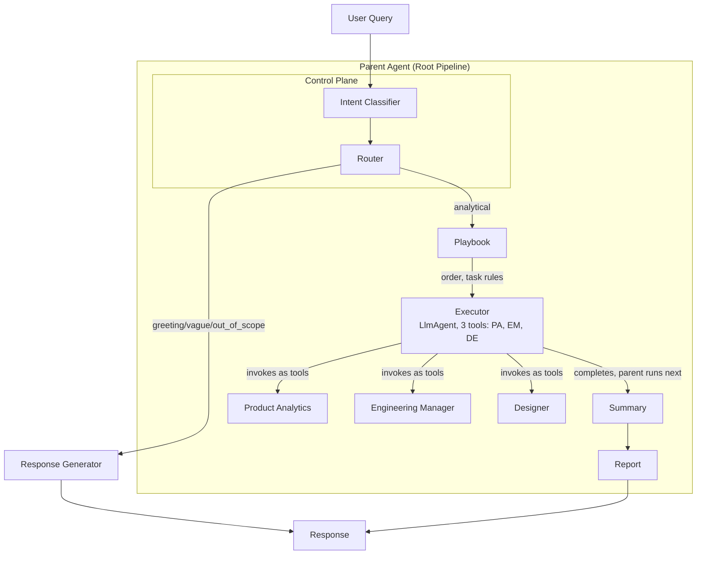

# Pulse AI Agent Architecture

This document describes the proposed architecture for the Pulse AI agent system, based on industry best practices and insights from production multi-agent systems (Agent Red, PostHog, Amplitude, Databricks).

---

## Table of Contents

1. [Design Principles](#design-principles)
2. [Hierarchy](#hierarchy)
3. [Architecture Overview](#architecture-overview)
4. [Architecture Diagram](#architecture-diagram)
5. [Component Responsibilities](#component-responsibilities)
6. [Executor Playbooks](#executor-playbooks)
7. [Intent Taxonomy](#intent-taxonomy)
8. [Implementation Order](#implementation-order)

---

## Design Principles

These principles are derived from production systems and "red pill" insights:

| Principle | Implementation |
|-----------|----------------|
| **Control plane outside LLM** | Intent + routing are separate nodes; the LLM never decides its own mode |
| **Routing is deterministic** | Once intent is known, routing is pure logic |
| **Unknown → help** | Vague/out-of-scope → clarification, never guess |
| **Playbooks over mega prompts** | Mode-specific playbooks, not one giant prompt |
| **Tool definitions matter** | Structured persona input schemas |
| **Architecture before code** | Lock the flow before implementation |

---

## Hierarchy

| Level | Component | Role |
|-------|-----------|------|
| **Parent (Root)** | Sequential pipeline | Intent → Router → Executor → Summary → Report |
| **Executor** | LlmAgent | Has **3 tools only**: PA, EM, DE |
| **Summary** | Separate agent | Parent pipeline step; runs after Executor |
| **Report** | Separate agent | Parent pipeline step; runs after Summary |

---

## Architecture Overview

The **Parent Agent (Root Pipeline)** runs a sequential flow:

```
Parent Agent (Root Pipeline)
    │
    ├── 1. Intent Classifier (Control Plane)
    ├── 2. Router (Control Plane — Deterministic)
    ├── 3. Executor (LlmAgent with 3 tools: PA, EM, DE)
    ├── 4. Summary (Parent pipeline step)
    └── 5. Report (Parent pipeline step)
```

```
User Query
    │
    ▼
┌─────────────────────────────────────────────────────────────────┐
│  LAYER 0: INTENT (Control Plane)                                 │
│  Intent Classifier — LLM, fast model, structured output           │
│  Output: intent, analytical_domain (if analytical)                 │
└─────────────────────────────────────────────────────────────────┘
    │
    ▼
┌─────────────────────────────────────────────────────────────────┐
│  LAYER 1: ROUTING (Control Plane — Deterministic)                 │
│  Router — Pure logic, no LLM                                      │
│  Input: intent, analytical_domain                                 │
│  Output: action (respond | execute), selected_personas, order      │
└─────────────────────────────────────────────────────────────────┘
    │
    ├─── [respond] ────────────────────────────────────────────────┐
    │         (greeting | vague | out_of_scope)                      │
    │                                                               ▼
    │                                              ┌────────────────────────────┐
    │                                              │  Response Generator        │
    │                                              │  Single LLM call           │
    │                                              │  → Response               │
    │                                              └────────────────────────────┘
    │
    └─── [execute] ───────────────────────────────────────────────┐
              (analytical)                                          │
              selected_personas, order, playbook                    │
                                                                   ▼
┌─────────────────────────────────────────────────────────────────┐
│  LAYER 2: EXECUTOR (Execution Plane)                              │
│  LlmAgent with 3 tools ONLY: PA, EM, DE                          │
│  Follows Router's plan + playbook. Calls personas per order.      │
│  Persona outputs → state                                         │
└─────────────────────────────────────────────────────────────────┘
    │
    ▼
┌─────────────────────────────────────────────────────────────────┐
│  LAYER 3: SPECIALISTS (Executor tools)                            │
│  ProductAnalytics | EngineeringManager | Designer                │
│  Each: LlmAgent with tools, structured input schema              │
└─────────────────────────────────────────────────────────────────┘
    │
    ▼
┌─────────────────────────────────────────────────────────────────┐
│  LAYER 4: SYNTHESIS (Parent pipeline steps)                      │
│  Summary → Report → [Optional: Critic] → Response                  │
│  Summary and Report are part of the parent agent, not Executor.   │
└─────────────────────────────────────────────────────────────────┘
```

---

## Architecture Diagram



---

## Component Responsibilities

### 1. Intent Classifier

| Aspect | Design |
|--------|--------|
| **Type** | LlmAgent or single LLM call |
| **Model** | Fast (e.g. GPT-4o-mini, Gemini Flash) |
| **Input** | User query |
| **Output** | Structured: `intent`, `analytical_domain`, `confidence` |
| **Intents** | `greeting` \| `vague` \| `analytical` \| `out_of_scope` |
| **Domains** (if analytical) | `funnel` \| `journey` \| `screen` \| `crash` \| `performance` \| `network` \| `ui` \| `multi` |
| **Fallback** | Unknown → `vague` (clarification) |

### 2. Router (Deterministic)

| Aspect | Design |
|--------|--------|
| **Type** | Pure Python, no LLM |
| **Input** | `intent`, `analytical_domain` |
| **Logic** | If non-analytical → `action: respond`; else → `action: execute`, `selected_personas`, `order` |
| **Domain → personas** | `funnel` → [PA]; `crash` → [EM]; `performance` → [EM]; `ui` → [DE]; `multi` / `root_cause` → [PA, EM] or [PA, EM, DE] |
| **Output** | `{ action, selected_personas?, order?, playbook_key? }` |

### 3. Response Generator (Non-analytical path)

| Aspect | Design |
|--------|--------|
| **Type** | Single LLM call |
| **When** | `action == respond` |
| **Input** | User query, intent (greeting/vague/out_of_scope) |
| **Output** | Short response (greeting, clarification, or polite decline) |

### 4. Executor (LlmAgent with 3 tools)

| Aspect | Design |
|--------|--------|
| **Type** | LlmAgent |
| **Tools** | **3 only**: ProductAnalyticsAgent, EngineeringManagerAgent, DesignerAgent |
| **Role** | Execute Router's plan; follows playbook for task formulation |
| **Flow** | Calls personas per Router's `order`; passes `{ task, user_query, prior_findings }` |
| **Context** | Pass prior persona outputs into next persona's `prior_findings` |
| **Note** | Summary and Report are **not** Executor tools; they are parent pipeline steps |

### 5. Specialists (PA, EM, DE)

| Aspect | Design |
|--------|--------|
| **Type** | LlmAgent with tools |
| **Input** | Structured: `task`, `user_query`, `prior_findings` |
| **Output** | Writes to state (`product_analytics_result`, etc.) |

### 6. Summary & Report (Parent pipeline steps)

| Aspect | Design |
|--------|--------|
| **Location** | Part of **parent agent**, not Executor tools |
| **Summary** | LlmAgent; reads persona outputs from state; synthesizes narrative |
| **Report** | LlmAgent; reads summary; creates charts, tables; final response |
| **Critic** (optional) | Validates before delivery (Agent Red style) |

---

## Executor Playbooks

The Executor receives a `playbook_key` from the Router and follows flow-specific instructions for task formulation and context passing. Playbooks define **how** to invoke each persona, not just **which** to call.

### Example playbooks

**ROOT_CAUSE PLAYBOOK**
- Call PA first with task: "Analyze user query. Focus on metrics, funnel, dropoff."
- Pass PA's full output to EM as `prior_findings`.
- EM task: "PA found: {prior_findings}. Investigate technical causes: crashes, performance, errors."
- If PA returns no actionable findings, still call EM with user query only.

**SINGLE_DOMAIN PLAYBOOK**
- Call only the relevant persona.
- Task: "Analyze user query. Focus on {domain}."
- No `prior_findings` needed.

**OVERVIEW PLAYBOOK**
- Call PA, EM, DE in sequence.
- Each gets: task = "Contribute your domain's perspective on: {query}"
- Pass prior findings to each subsequent persona for coherence.

### Playbook benefits

| Benefit | Description |
|---------|-------------|
| **Configurable behavior** | Add new flows by adding playbook entries, not code |
| **Explicit task formulation** | How to build `task` for each persona per flow |
| **Context rules** | When to pass full vs minimal `prior_findings` |
| **Error handling** | What to do if a persona returns empty |

---

## Intent Taxonomy

### Non-analytical intents (no specialists)

| Intent | Examples | Action |
|--------|----------|--------|
| **greeting** | "hi", "hello", "hey" | Respond conversationally |
| **chitchat** | "what can you do?", "how are you?" | Respond, list capabilities |
| **vague** | "tell me about my app", "what's going on?" | Ask for clarification |
| **out_of_scope** | "what's the weather?", unrelated | Politely decline or redirect |

### Analytical intents (route to specialists)

| Domain | Example queries | Primary persona |
|--------|-----------------|-----------------|
| **funnel** | "conversion rate", "where do users drop off?" | Product Analytics |
| **journey** | "user paths", "common flows" | Product Analytics |
| **screen** | "screen views", "most visited screens" | Product Analytics |
| **interactions** | "button clicks", "tap events" | Product Analytics |
| **crash** | "crash rate", "ANR", "stability" | Engineering Manager |
| **performance** | "app vitals", "startup time" | Engineering Manager |
| **network** | "API latency", "network errors" | Engineering Manager |
| **ui_layout** | "heatmap", "where do users tap?" | Designer |
| **session_replay** | "replay session", "watch user session" | Designer |
| **multi** | "why did conversion drop?" | PA → EM → Designer (sequential) |

---

## Implementation Order

1. **Intent Classifier** — Structured output schema, fast model
2. **Router** — Domain → personas mapping (pure logic)
3. **Response Generator** — Non-analytical path
4. **Executor** — LlmAgent with 3 persona tools (PA, EM, DE)
5. **Executor playbooks** — Flow-specific task formulation and context rules
6. **Structured persona input schemas** — `task`, `user_query`, `prior_findings`
7. **Summary, Report** — Parent pipeline steps (read from state)
8. **Critic** (optional) — Validate before delivery

---

## References

- [Agent Red: How It Works](https://agentredcx.com/docs/getting-started/how-it-works) — Six-agent pipeline
- [PostHog AI Architecture](https://posthog.com/handbook/engineering/ai/architecture) — Single-loop with modes
- [RudderStack Multi-Agent Analytics Spec](https://www.rudderstack.com/blog/multi-agent-ai-analytics-spec/) — Event schema for observability
- [Routing User Queries into Agentic AI Workflows](https://medium.com/@rishabh.b1910/routing-user-queries-into-agentic-ai-workflows-using-intent-detection-c68711b2d64a) — Intent as first-class node
- [Intent Routing for AI Agents](https://blog.gopenai.com/intent-routing-for-ai-agents-e075d64da6c9) — Middleware-driven phases
- [Redis AI Agent Architecture Patterns](https://redis.io/blog/ai-agent-architecture-patterns/) — Single vs multi-agent
