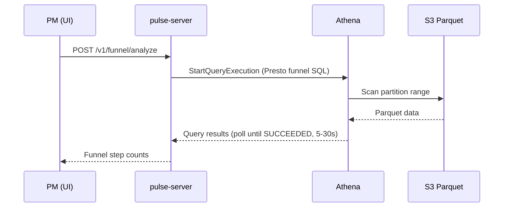
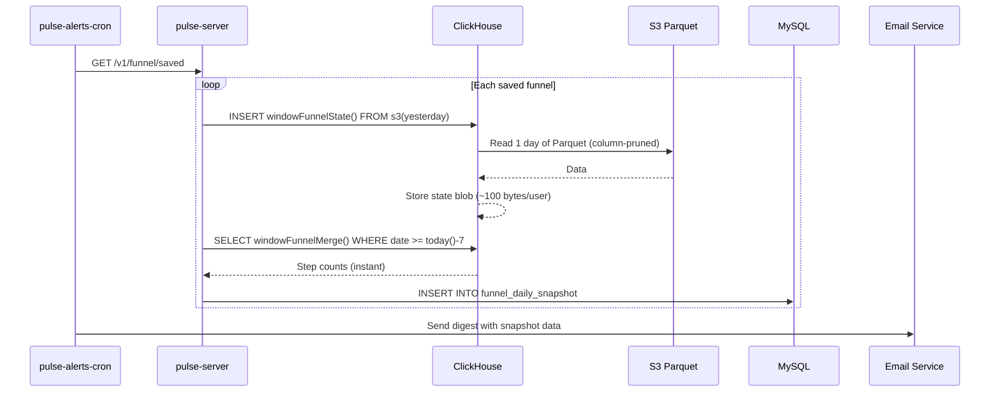
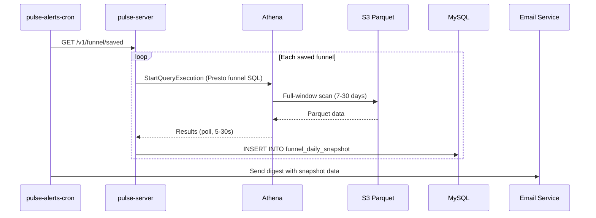
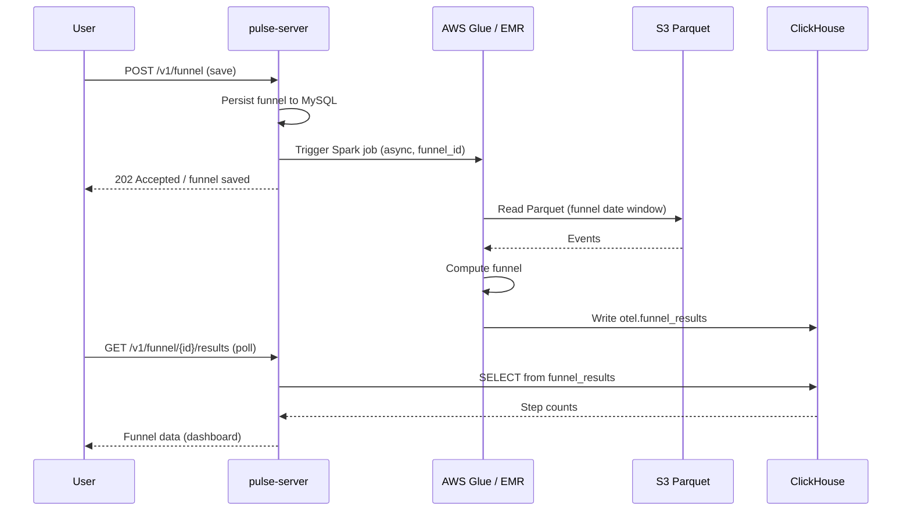
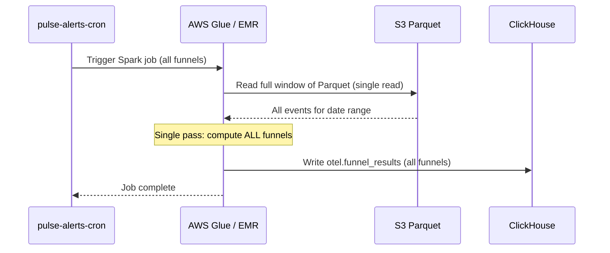

# Funnel Data Architecture Decision Document

**Confluence (canonical):** [Funnel & Journey Data Architecture Decision Document](https://dream11.atlassian.net/wiki/spaces/Pulse/pages/4775477367) — includes **Finalized approach (production)** and deprecates the old standalone [Finalized approach page](https://dream11.atlassian.net/wiki/spaces/Pulse/pages/4791042087). Publish updates via `docs/confluence-drafts/generate_funnel_data_architecture_decision_storage.py`.

## 1. Context and Problem Statement

### Feature Overview

Funnel Analysis lets product managers (PMs) define a sequence of in-app events (e.g. _App Open → Search → Add to Cart → Checkout_) and measure how many unique users (or sessions) complete each successive step within a configurable time window. The feature supports:

- **Ad-hoc exploration** — a PM picks events, adjusts filters, and iterates interactively.
- **Saved funnels with daily email reports** — a PM saves a funnel definition; the system evaluates it daily and emails a summary.

### Current Data Flow

```
Mobile SDKs (OTEL)
  ├─ Traces / Logs ──► OTEL Collector (4317/4318) ──► ClickHouse (otel DB)
  │                      otel_traces, otel_logs, stack_trace_events
  │
  └─ Custom Events ──► Vector (14317/14318) ──► S3 Parquet (per-project buckets)
                         [currently disabled in docker-compose]
                         Bucket: pulse-otel-{project_id}
                         Path:   vector-logs/YYYY-MM-DD/HH/
```

**ClickHouse** stores OTEL traces and logs with full span/log attributes. The existing funnel implementation (`FunnelServiceImpl`) already runs ClickHouse `windowFunnel()` queries against `otel_traces` and `otel_logs`.

**S3 Parquet** (via Vector) stores custom events in per-project buckets with date/hour partitioning. **Athena** exposes these as external tables (`pulse_athena_db.otel_data_{project_id}`) with partition projection for zero-maintenance discovery.

### The Fundamental Constraint

Funnels are **session-level sequential patterns**. `windowFunnel(W)` evaluates whether events occur in order within a sliding window of `W` seconds per user/session. This requires access to the **full event timeline** for every user across the selected date range — not just aggregates. Any architecture must efficiently serve this full-window scan pattern for both interactive and batch use cases.

### What Needs to Change

The current implementation queries ClickHouse tables that contain OTEL traces/logs. Custom events (the primary data source for product-analytics funnels) will flow through Vector to S3. We need to decide where funnel queries should read custom-event data from, how daily reports should be powered, and what the operational trade-offs are.

### Priority: Saved Funnels First

Pulse's immediate need is powering **daily email reports for saved funnels**. Ad-hoc exploration is a secondary concern that can tolerate higher latency. All approaches below are evaluated with this priority in mind.

---

## 2. Three Approaches

### Approach A — S3 Direct with Incremental State Aggregation

S3 remains the single source of truth for custom events. No raw custom-event data is loaded into ClickHouse. Instead, ClickHouse stores **only pre-aggregated intermediate funnel state** per saved funnel using `windowFunnelState()`/`windowFunnelMerge()` combinators.

| Scenario | Engine | Mechanism |
|----------|--------|-----------|
| Ad-hoc exploration | **Athena** | Presto `reduce()` / correlated subquery to emulate funnel logic against S3 Parquet |
| Daily email report (incremental) | **ClickHouse** | `windowFunnelState()` reads one day from S3 via `s3()`, stores state blob; `windowFunnelMerge()` produces instant report |
| Daily email report (read) | **MySQL** | Pre-computed snapshot from merged state |

**How it works:**

1. When a PM saves a funnel, a per-funnel state table is created in ClickHouse and backfilled from S3 for the last N days.
2. A daily cron job processes **only yesterday's data** from S3 for each saved funnel:
   ```sql
   INSERT INTO otel.funnel_{id}_states
   SELECT
       ProjectId,
       user_id AS UserId,
       toDate(timestamp) AS date,
       windowFunnelState(86400)(
           toDateTime(timestamp),
           event_name = 'app_open',
           event_name = 'search',
           event_name = 'add_to_cart',
           event_name = 'checkout'
       ) AS funnel_state
   FROM s3(
       's3://pulse-otel-{project_id}/vector-logs/{yesterday}/*/*.parquet',
       'Parquet'
   )
   GROUP BY ProjectId, user_id, date;
   ```
3. The report query merges per-day states — **instant** because it operates on kilobytes of state blobs, not gigabytes of raw events:
   ```sql
   SELECT level, count() AS users
   FROM (
       SELECT UserId, windowFunnelMerge(funnel_state) AS level
       FROM otel.funnel_{id}_states
       WHERE date >= today() - 7
       GROUP BY UserId
   )
   GROUP BY level ORDER BY level;
   ```
4. Result (5 rows per funnel) is written to MySQL `funnel_daily_snapshot`. Email service reads snapshots.
5. Ad-hoc exploration uses Athena via existing `QueryServiceImpl`.

**Per-funnel state table schema:**

```sql
CREATE TABLE otel.funnel_{id}_states (
    ProjectId    String,
    UserId       String,
    date         Date,
    funnel_state AggregateFunction(
        windowFunnel(86400), DateTime, UInt8, UInt8, UInt8, UInt8
    )
) ENGINE = AggregatingMergeTree()
PARTITION BY toYYYYMM(date)
ORDER BY (ProjectId, UserId);
```

**Key characteristics:**
- Zero raw data duplication — S3 is the only event store. State blobs are ~100 bytes/user/day.
- After cold start, daily runs read only one day of new data from S3.
- Report queries are instant (merge of pre-aggregated state).
- Uses ClickHouse's native `windowFunnelState()`/`windowFunnelMerge()` — correct cross-day session handling.
- Requires per-funnel state table lifecycle management (create/drop/recreate on funnel CRUD).

---

### Approach B — Daily Athena Job with Aggregated Snapshots

A daily cron job runs a full-window Athena funnel query for each saved funnel definition and stores the **aggregated result** (step counts) in MySQL. Ad-hoc exploration still uses Athena in real time.

| Scenario | Engine | Mechanism |
|----------|--------|-----------|
| Ad-hoc exploration | **Athena** | Presto funnel SQL against S3 Parquet |
| Daily email report | **MySQL read** | Pre-computed snapshot from daily Athena batch |

**How it works:**

1. A MySQL table stores funnel snapshots:
   ```sql
   CREATE TABLE funnel_daily_snapshot (
       id            BIGINT AUTO_INCREMENT PRIMARY KEY,
       funnel_id     VARCHAR(64) NOT NULL,
       run_date      DATE NOT NULL,
       step_index    INT NOT NULL,
       step_name     VARCHAR(255),
       user_count    BIGINT NOT NULL,
       conversion_pct DECIMAL(5,2),
       created_at    TIMESTAMP DEFAULT CURRENT_TIMESTAMP,
       UNIQUE KEY (funnel_id, run_date, step_index)
   );
   ```

2. Daily cron iterates over saved funnels → submits Athena query per funnel → polls for completion → writes step-level results to `funnel_daily_snapshot`.
3. Email service reads the snapshot rows — no query engine involved at report time.
4. Ad-hoc exploration uses the same Athena path.

**Key characteristics:**
- Daily reports are instant (MySQL read).
- No raw data duplication; S3 is the only event store.
- Daily batch cost is predictable (one Athena query per saved funnel per day).
- Ad-hoc queries still pay Athena scan costs.
- Athena funnel SQL must be implemented (no `windowFunnel()`).
- No ClickHouse involvement — simpler infrastructure.

---

### Approach C — Daily Spark Job (Selected Implementation)

A Spark job (AWS Glue or EMR Serverless) reads S3 Parquet files for the funnel's date window and computes funnel results. Results are written to **ClickHouse**. Two triggers: (1) **on save** — immediate job for the new funnel; (2) **daily** — batch job for all saved funnels.

| Scenario | Engine | Mechanism |
|----------|--------|-----------|
| Dashboard read | **ClickHouse** | Pre-computed funnel results from Spark |
| On funnel save | **Spark** | Triggered immediately, computes new funnel, writes to ClickHouse |
| Daily refresh | **Spark** | Runs once for all funnels, writes to ClickHouse |

**How it works:**

1. **On funnel save:** User defines and saves a funnel → pulse-server triggers a Spark job in the background. The job reads S3 Parquet for the funnel's date window (e.g. last 7 days), computes results, and writes to ClickHouse. User can view data on the dashboard once the job completes.
2. **Daily batch:** A cron triggers a Spark job once per day. The job reads S3 Parquet **once** for the required date window and computes all saved funnels in a single pass:
   ```python
   from pyspark.sql import functions as F, Window

   events = spark.read.parquet(
       f"s3://pulse-otel-{project_id}/vector-logs/{{2026-03-09..2026-03-15}}/*/*.parquet"
   )

   saved_funnels = load_saved_funnels()  # from pulse-server API or MySQL

   for funnel in saved_funnels:
       steps = funnel["steps"]  # ['app_open', 'search', 'add_to_cart', 'checkout']
       window_seconds = funnel["window_seconds"]

       relevant = events.filter(F.col("event_name").isin(steps))

       w = Window.partitionBy("user_id").orderBy("timestamp")
       with_seq = relevant.withColumn("rn", F.row_number().over(w))

       # Sequential matching: for each user, find the longest ordered
       # subsequence of steps within the time window
       step_map = {name: idx for idx, name in enumerate(steps)}
       matched = (
           with_seq
           .withColumn("step_idx", F.create_map(
               *[item for name, idx in step_map.items()
                 for item in (F.lit(name), F.lit(idx))]
           )[F.col("event_name")])
           .filter(F.col("step_idx").isNotNull())
       )

       # Compute max step reached per user using lag/lead window functions
       # to verify sequential ordering within the time window
       # ... (funnel sequence matching logic)

       result = matched.groupBy("max_step").agg(F.countDistinct("user_id").alias("users"))

       # Write to ClickHouse
       result.write.format("jdbc").options(
           url=clickhouse_jdbc_url,
           dbtable="otel.funnel_results",
           driver="com.clickhouse.jdbc.ClickHouseDriver"
       ).mode("append").save()
   ```
3. Results are written to ClickHouse `otel.funnel_results`. Dashboard reads from ClickHouse.
4. **On-save trigger:** When a user saves a funnel, pulse-server triggers an immediate Spark job for that funnel only. Once complete, data is available in ClickHouse for the dashboard.
5. **Daily job:** Runs once for all funnels, single-pass over S3 data, writes all results to ClickHouse.

**ClickHouse storage schema:**

```sql
CREATE TABLE otel.funnel_results (
    funnel_id     String,
    project_id    String,
    run_date      Date,
    step_index    UInt8,
    step_name     String,
    user_count    UInt64,
    conversion_pct Float64,
    created_at    DateTime DEFAULT now()
) ENGINE = MergeTree()
PARTITION BY toYYYYMM(run_date)
ORDER BY (funnel_id, run_date, step_index);
```

**Key characteristics:**
- **On-save + daily:** Immediate feedback on save (Spark job); daily refresh for all funnels.
- **Dashboard reads from ClickHouse** — instant, no query engine at read time.
- **Single-pass batch efficiency** — daily job reads S3 data once for all funnels.
- No raw data duplication; S3 is the only event store.
- Funnel sequence logic must be implemented in PySpark (no native `windowFunnel()`).
- **New infrastructure required** — AWS Glue or EMR Serverless is not in the current Pulse stack.
- No per-funnel ClickHouse tables — single shared `funnel_results` table.

---

## 3. Detailed Comparison

| Dimension | A — Incremental State | B — Athena Snapshots | C — Spark Job |
|-----------|----------------------|---------------------|---------------|
| **Correctness** | `windowFunnelState()`/`Merge()` guarantees correct cross-day session handling. Proven ClickHouse engine. | Athena full scan is correct but funnel SQL is manually crafted (no `windowFunnel()` in Presto). | Correct if PySpark funnel logic is implemented properly. Must be tested — no native funnel function. |
| **Ad-hoc latency** | 5–30 s (Athena). | 5–30 s (Athena). | 5–30 s (Athena). |
| **Daily report latency** | **Instant** (MySQL read). | **Instant** (MySQL read). | **Instant** (ClickHouse read). |
| **Daily batch time** | **< 1s per funnel** (reads 1 day of S3 data after cold start). | **5–30s per funnel** (Athena full-window scan per funnel). | **2–5 min total** (Glue/EMR startup + single-pass compute for all funnels). |
| **Per-query cost (daily)** | S3 GET costs only. **Near zero.** | Athena ~$5/TB scanned. ~$0.03/funnel/day. | Glue: ~$0.44/DPU-hour. **$0.50–$2.00/run** regardless of funnel count. |
| **Data reads per day** | 1 day × N funnels (N separate reads). | Full window × N funnels (N separate reads). | **Full window × 1** (single read, all funnels). |
| **Storage footprint** | S3 + ClickHouse state blobs (~90 MB). | S3 + MySQL snapshots (negligible). | S3 + ClickHouse funnel_results (negligible). |
| **Operational complexity** | **Moderate.** Per-funnel state table DDL lifecycle. | **Low.** Single cron with Athena polling. | **Moderate.** Glue/EMR job config, IAM roles, monitoring, PySpark code. |
| **Infrastructure required** | ClickHouse (already deployed) + S3 + MySQL. | Athena + S3 + MySQL. No ClickHouse needed. | **New:** AWS Glue or EMR Serverless + S3 + ClickHouse + MySQL. |
| **Code reuse** | `windowFunnelState()`/`Merge()` — ClickHouse-native. | Presto funnel SQL — must be written. | PySpark funnel logic — must be written and maintained. |
| **Failure modes** | S3 access errors. State table DDL failures. | Athena throttling / timeout. | Glue/EMR job failures. Longer recovery (re-run full job). |
| **Scalability ceiling** | Daily cost constant (1 day per funnel). Scales with funnel count. | Cost grows with funnel count × data volume. | Single-pass advantage shines at 50+ funnels. Cost scales with data volume, not funnel count. |

---

## 4. Architecture Diagrams

### 4.1 Data Flow

```mermaid
graph LR
    SDK[Mobile SDKs] -->|OTEL custom events| V[Vector]
    V -->|Parquet| S3[(S3 per-project buckets)]

    subgraph approachA [Approach A: Incremental State]
        S3 -->|"s3() 1 day"| CH_A["ClickHouse<br/>windowFunnelState()"]
        CH_A -->|"windowFunnelMerge()"| MERGE_A[Instant report]
        MERGE_A -->|Snapshot| MY_A[(MySQL)]
    end

    subgraph approachB [Approach B: Athena Snapshots]
        S3 -->|Full-window scan per funnel| ATH_B[Athena - daily batch]
        ATH_B -->|Snapshot| MY_B[(MySQL)]
    end

    subgraph approachC [Approach C: Spark Job (Selected)]
        S3 -->|"Full window, single read"| SPARK["Spark (Glue/EMR)<br/>all funnels in 1 pass"]
        SPARK -->|Results| CH_C[(ClickHouse<br/>funnel_results)]
        CH_C -->|Dashboard read| DASH[Dashboard]
    end

    S3 -->|Scan| ATH_AD[Athena - ad hoc]
```

### 4.2 Sequence — Ad-Hoc Exploration (All Approaches)



### 4.3 Sequence — Daily Email Report

#### Approach A (Incremental State)



#### Approach B (Athena batch)



#### Approach C (Spark job) — On Funnel Save



#### Approach C (Spark job) — Daily Batch



---

## 5. Cost Analysis

### Assumptions

| Parameter | Value |
|-----------|-------|
| Average project event volume | 1M custom events/day |
| Average event size (Parquet, compressed) | ~0.5 KB |
| Athena scan per funnel query (7-day window) | ~3.5 GB |
| Athena scan per funnel query (30-day window) | ~15 GB |
| Number of saved funnels (daily report) | 10 |
| On-save Spark jobs per day (new funnels) | ~5 (assumed) |

### 5.1 Athena Costs (Approach B daily + all ad-hoc)

Athena charges **$5 per TB scanned**. Parquet columnar format means only relevant columns are read (~30–50% of row size for funnel queries).

| Query Volume | Effective Scan/Query | Daily Cost | Monthly Cost |
|-------------|---------------------|------------|--------------|
| 10 ad-hoc queries/day (7-day window) | ~1.5 GB | $0.075 | **$2.25** |
| 50 ad-hoc queries/day (7-day window) | ~1.5 GB | $0.375 | **$11.25** |
| 10 daily report funnels (30-day window) | ~6 GB | $0.30 | **$9.00** |

### 5.2 ClickHouse State Storage Costs (Approach A)

| Metric | Value |
|--------|-------|
| State blob size per user per day | ~100 bytes |
| 100K users × 10 funnels × 90 days | ~90 MB |
| **Monthly cost** | **Negligible (<$0.01)** |

### 5.3 Spark / Glue Costs (Approach C)

AWS Glue charges **$0.44 per DPU-hour** (1 DPU = 4 vCPU + 16 GB RAM). EMR Serverless pricing is similar.

| Scale | DPUs | Runtime | Cost/Run | Monthly Cost (daily) |
|-------|------|---------|----------|---------------------|
| 1M events/day, 7-day window (~3.5 GB) | 2 DPU | ~5 min | ~$0.07 | **~$2.10** |
| 1M events/day, 30-day window (~15 GB) | 4 DPU | ~10 min | ~$0.29 | **~$8.70** |
| 10M events/day, 30-day window (~150 GB) | 10 DPU | ~20 min | ~$1.47 | **~$44.10** |

Cost is per-run and covers **all funnels** in a single job. Adding more funnels increases compute time marginally, not cost proportionally.

### 5.4 MySQL / ClickHouse Snapshot Costs (All Approaches)

| Metric | Value |
|--------|-------|
| Rows per funnel per day | 5 (one per step) |
| Row size | ~200 bytes |
| 10 funnels × 365 days | 18,250 rows (~3.5 MB) |
| **Monthly cost** | **Negligible (<$0.01)** |

### 5.5 On-Save Spark Costs (Approach C)

Each new funnel save triggers an on-demand Spark job. At ~5 new funnels/day, 2 DPU × 5 min each:

| Metric | Value |
|--------|-------|
| Cost per on-save job | ~$0.07 |
| 5 on-save jobs/day | ~$0.35/day |
| **Monthly cost** | **~$10.50** |

### 5.6 Cost Comparison Summary

| Cost Category | A — Incremental State | B — Athena Snapshots | C — Spark Job (Selected) |
|--------------|----------------------|----------------------|---------------------------|
| Ad-hoc queries (50/day) | $11.25/mo (Athena) | $11.25/mo (Athena) | N/A (dashboard reads from ClickHouse) |
| Daily reports (10 funnels) | **~$0.01/mo** (S3 GETs) | **$9.00/mo** (Athena) | **~$2.10/mo** (Glue daily) |
| On-save jobs (~5/day) | N/A | N/A | **~$10.50/mo** (Glue on-save) |
| Storage | ~$0.01/mo (state blobs) | ~$0.01/mo (MySQL) | ~$0.01/mo (ClickHouse) |
| **Total monthly** | **~$11.26** | **~$20.26** | **~$12.61** |

> **At 10M events/day with 50 funnels:**
> - Approach A: ~$11.30/mo (cost unchanged — reads 1 day per funnel)
> - Approach B: ~$56.25 ad-hoc + ~$45/mo daily = **~$101/mo** (scales with data × funnels)
> - Approach C: ~$44/mo daily + ~$10/mo on-save = **~$54/mo** (scales with data, not funnels)

---

## 6. Recommendation and Chosen Implementation

**Selected: Approach C — Spark pre-computation with ClickHouse storage (finalized)**

Pulse uses **Spark** (AWS Glue or EMR Serverless) to **pre-compute** funnel metrics for **all saved funnels across all projects** and **writes results to ClickHouse** (`otel.funnel_results`). The dashboard reads pre-computed data from ClickHouse via pulse-server — no heavy funnel scan at request time for saved funnels.

### 6.1 Finalized product requirements

| Requirement | Decision |
|-------------|----------|
| **Predefined filters** | Users can create funnels with **fixed filter dimensions** (e.g. city, network provider / carrier, OS version — fields present in **S3 Parquet** / Athena schema). Filters are part of the saved funnel definition in **MySQL** (`filters` / `filters_json` and step-level filters in `steps` / `steps_json` per [Schema Design](https://dream11.atlassian.net/wiki/spaces/Pulse/pages/4787011590)). Spark applies them when reading S3. **No** raw product-events table in ClickHouse. |
| **Conversion time** | **Static per funnel** — `window_seconds` is set when the funnel is defined and does not change per dashboard request. Saved-funnel results in ClickHouse are computed for that window. |
| **On-the-fly (explore) funnels** | Users can run **ad-hoc** funnel analysis (not necessarily saved). Computation runs **asynchronously** (background job): client receives **202 Accepted** + job identifier, polls job status, then fetches results when ready. Implementation can extend `POST /v1/funnel/analyze` (or a dedicated async endpoint) and reuse existing ClickHouse async-query patterns where applicable. On-the-fly results are **not** the same path as saved `funnel_results` until/unless written to a transient or cache table. |

### 6.2 Finalized technical approach (Spark → ClickHouse)

| Piece | Role |
|-------|------|
| **Spark (daily)** | Pre-computes **all** saved funnels for **all** projects in one (or few) job runs: single-pass S3 read per project where possible, column pruning, per-funnel filters and steps, writes rows to **`otel.funnel_results`**. |
| **Spark (on-save)** | When a user saves or updates a funnel, trigger an **on-save** job for that funnel (same logic, narrower scope), write to **`otel.funnel_results`**. |
| **ClickHouse** | **`otel.funnel_results`** holds pre-computed step counts and conversion % per `funnel_id`, `project_id`, `run_date`, `step_index`. Dashboard **`GET /v1/funnel/{id}/results`** reads only this table. |
| **S3** | Remains the source of truth for raw events (Vector Parquet per project bucket). Spark reads from S3; **no requirement** to stream raw events into ClickHouse for saved-funnel reads. |
| **On-the-fly** | Async job (Spark and/or ClickHouse long-running query) computes explore funnels; API returns job id + polling; results returned when complete. |

### Chosen Implementation Flow

```
┌─────────────────────────────────────────────────────────────────────────────────┐
│ 1. User saves funnel                                                             │
│    pulse-server → triggers Spark job (async, background)                         │
│    Spark reads S3 Parquet (funnel's date window) → computes → writes ClickHouse │
│    User sees data on dashboard once job completes                                │
├─────────────────────────────────────────────────────────────────────────────────┤
│ 2. Daily cron (e.g. 01:00 UTC)                                                   │
│    Triggers Spark job for ALL saved funnels                                      │
│    Spark reads S3 Parquet once (single pass) → computes all funnels              │
│    Writes all results to ClickHouse otel.funnel_results                         │
├─────────────────────────────────────────────────────────────────────────────────┤
│ 3. Dashboard read                                                                │
│    pulse-server queries ClickHouse otel.funnel_results                           │
│    Instant response (pre-computed data)                                         │
└─────────────────────────────────────────────────────────────────────────────────┘
```

### Implementation Components

| Component | Responsibility |
|-----------|----------------|
| **pulse-server** | On funnel save: persist definition to MySQL (including **predefined filters** + static **window_seconds**), trigger Spark job (async). Expose API for dashboard to read saved funnel results from ClickHouse. Expose **async** API for on-the-fly funnel explore (202 + job id + poll). |
| **Spark job (on-save)** | Triggered per new/updated funnel. Reads S3 Parquet for funnel's date window, applies funnel **filters** (city, carrier, OS version, etc.) and **steps**, static conversion window, writes to `otel.funnel_results`. |
| **Spark job (daily)** | Triggered by cron. Loads **all** saved funnels (all projects), reads S3 Parquet efficiently (single read per project where possible), computes **every** funnel with its filters, writes **all** results to `otel.funnel_results`. |
| **ClickHouse** | Stores **`otel.funnel_results`** — pre-computed funnel output only (see `backend/ingestion/clickhouse-funnel-results-schema.sql`). |
| **Dashboard** | Saved funnels: read via API from ClickHouse. Explore: submit async funnel, poll until complete, display results. |

### Funnel Lifecycle

| Event | Action |
|-------|--------|
| Funnel saved | Persist to MySQL. Trigger on-save Spark job. Job writes to ClickHouse when complete. |
| Funnel deleted | Remove from MySQL. Optional: delete rows from `otel.funnel_results` for that funnel_id. |
| Funnel definition changed | Update MySQL. Trigger on-save Spark job (recompute). Next daily job will also refresh. |
| Daily tick | Cron triggers Spark job for all funnels. Single pass, writes all to ClickHouse. |

### Pros

- **Immediate feedback on save** — user gets data once the on-save job completes (typically 2–5 min).
- **Single shared table** — no per-funnel DDL; `otel.funnel_results` holds all funnels.
- **Dashboard reads from ClickHouse** — instant, no heavy query at read time.
- **Daily batch efficiency** — one S3 read for all funnels.
- **Cost scales with data volume, not funnel count** — adding funnels has marginal cost impact.

### Cons

- **New infrastructure** — AWS Glue or EMR Serverless required.
- **On-save latency** — user waits 2–5 min for first data (can show "Computing..." state).
- **Custom funnel logic in PySpark** — must implement and test sequential event matching (no native `windowFunnel()`).
- **Job failure handling** — need retry, alerting, and optional manual re-trigger.

### Implementation Sketch

1. **ClickHouse schema:** Create `otel.funnel_results` table (see Approach C section).
2. **pulse-server:** On `POST /v1/funnel` (save): persist funnel to MySQL, enqueue or invoke Spark job with funnel_id and date range. Expose `GET /v1/funnel/{id}/results` that queries ClickHouse.
3. **Spark job (on-save):** Accept funnel_id, project_id, date range. Read S3 Parquet, compute funnel, write to ClickHouse. Report completion (e.g. webhook or status table).
4. **Spark job (daily):** Load all saved funnels from MySQL/API. Read S3 Parquet once. Compute all funnels. Write to ClickHouse (upsert or overwrite by run_date).
5. **Dashboard:** Poll or fetch funnel results from API; display step counts and conversion rates.
