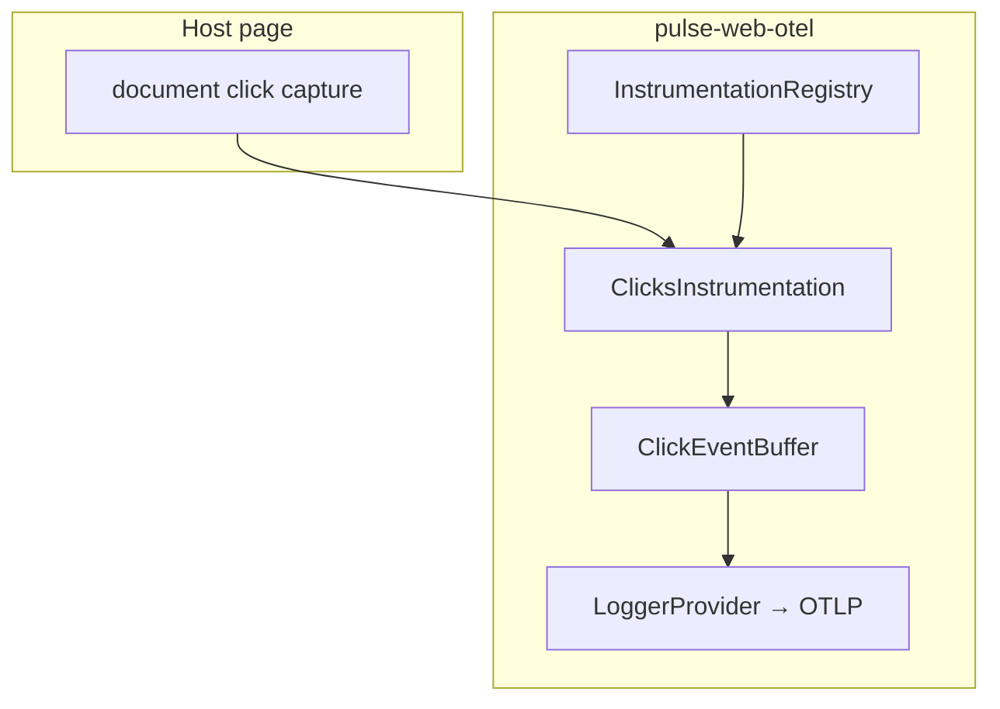
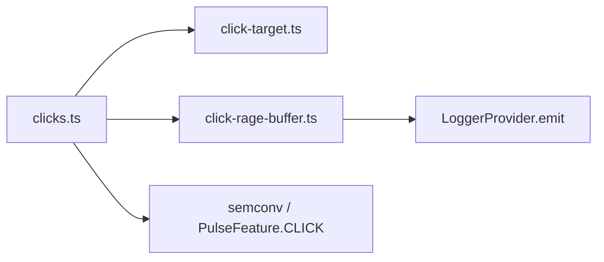
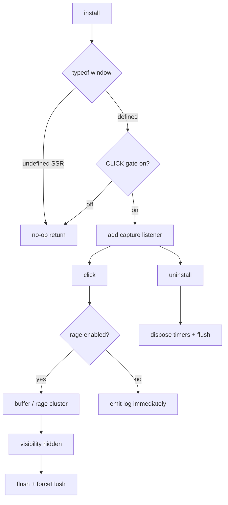

# Clicks Instrumentation — SPEC.md

Package: `@dreamhorizonorg/pulse-web`  
File: `pulse-web-otel/docs/instrumentations/clicks/SPEC.md`

---

## 1. Goal

Emit **OTLP log records** for user clicks with `pulse.type = app.click` and body `app.widget.click`, aligned with Android click telemetry. Uses **Plan B**: buffered emissions via `ClickEventBuffer` (rage clustering + delayed singleton taps) instead of firing one network payload per DOM click immediately (Plan A).

---

## 2. Assumptions

- **Android parity:** Same `pulse.type = app.click` and widget-oriented attributes as Android `ClickEventBuffer` / click pipeline.
- **Web-only additions:** Rage-click clustering in viewport pixel space; **text / ARIA label extraction** for `app.click.context` (`label=...`) — Android uses a different view hierarchy.
- **SSR:** No `window` / `document` → instrumentation `install()` is a no-op.
- **Capture context:** Password fields never get text labels; `aria-label` / `title` preferred over raw `innerText` when building context.

---

## 3. Requirements

**R1 — OTLP logs:** Not spans; `LoggerProvider.emit` with body `app.widget.click`.

**R2 — Good vs dead click:** `click.type` = good when an interactive element is resolved from `composedPath()`; dead click when only structural nodes / empty path.

**R3 — Coordinates:** Store viewport pixel X/Y plus normalized nx/ny when viewport width/height > 0.

**R4 — Rage detection:** Default cluster rule — **≥ 3 taps** within **2000 ms** window inside **50 dp** radius (scaled by `devicePixelRatio`); max **5** concurrent rage clusters. Emits one log with `click.is_rage=true`, `click.rage_count`.

**R5 — Buffering:** When rage buffer is enabled (default), individual taps are held until flush (visibility hidden) or rage resolution; when `instrumentations.clicks.rage.enabled === false`, each click emits immediately (Plan A–style path).

**R6 — Gating:** Subject to `InstrumentationRegistry` + `PulseFeature.CLICK` / local `instrumentations.clicks.enabled`.

---

## 4. Architectural Design

### Why Plan B (log-based buffering) over Plan A (immediate per-click emit)

**Plan A** (rejected): emit one OTLP log per click synchronously — simplest, but amplifies OTLP traffic on touch-heavy UIs and loses Android parity for rage clustering.

**Plan B** (chosen): mirror Android `ClickEventBuffer` — coalesce rapid taps, detect rage clusters, delay singleton emits until buffer flush / rage completion. Reduces duplicate noise and matches mobile analytics semantics (`ADR-clicks.md`, `PLAN-B-clicks-logs.md`).

### 4.1 HLD — registry and export boundary (Mermaid)

### 4.2 LD — internal modules (Mermaid)

### 4.3 Flows and edge cases (Mermaid)

---

## 5. LLD

### 5.1 Attribute table

Planning docs use **click.target** / **click.label**; shipped OTLP keys follow semconv (`app.widget.*`, `app.screen.coordinate.*`, `click.*`).

| Attribute key | Type | Source | Required | Notes |
|---|---|---|---|---|
| `pulse.type` | string | semconv | Yes | Always `app.click` |
| `app.widget.name` | string | DOM tag | If good click | **click.target** identity (tag, e.g. `BUTTON`) |
| `app.widget.id` | string | `id` / `data-testid` | No | Stable **click.target** id when present |
| `app.click.context` | string | aria/title/text | No | **click.label** — `label=...`, max 200 chars |
| `app.screen.coordinate.x` | number | `MouseEvent.clientX` | Yes | **click.x** |
| `app.screen.coordinate.y` | number | `MouseEvent.clientY` | Yes | **click.y** |
| `app.screen.coordinate.nx` | number | derived | No | Normalized X |
| `app.screen.coordinate.ny` | number | derived | No | Normalized Y |
| `device.screen.width` | number | `window.innerWidth` | Yes | Viewport |
| `device.screen.height` | number | `window.innerHeight` | Yes | Viewport |
| `click.type` | string | instrumentation | Yes | `good` / `dead` |
| `click.is_rage` | boolean | `ClickEventBuffer` | No | **click.rage** cluster |
| `click.rage_count` | number | `ClickEventBuffer` | No | Tap count in cluster |
| `session.id` | string | global attrs | Yes | sdk-core |
| `screen.name` | string | global attrs | No | sdk-core |
| `platform` | string | Resource | Yes | `web` |

### 5.2 Target extraction hierarchy (`click-target.ts`)

1. Walk `composedPath()` (fallback: parent chain).
2. First **interactive** element wins (`resolveInteractiveElement`): buttons, links, inputs, ARIA roles, etc.; skip bare `html`/`body`.
3. **Widget name:** tag name (SVG prefixed `svg:`).
4. **Widget id:** `element.id` or `data-testid`.
5. **Label / context:** `buildClickContextLabel` — **aria-label** → **title** → **innerText** (trimmed), formatted `label=<text>`.

### 5.3 Rage threshold (implementation)

| Parameter | Default |
|---|---|
| `timeWindowMs` | 2000 |
| `threshold` | 3 taps |
| `radiusDp` | 50 (converted to px × density) |

### 5.4 Buffer lifecycle

- **record(pending)** enqueues taps; rage clusters may emit early.
- **`visibilitychange` → hidden:** `buffer.flush()` then `loggerProvider.forceFlush()`.
- **`uninstall`:** `buffer.dispose()` — cancel timers + flush.

### 5.5 React SPA and Next.js client

- **React SPA:** `document` capture listener sees synthetic React clicks; `composedPath()` resolves portals correctly on supporting browsers.
- **Next.js App Router / Pages Router (client):** Same DOM semantics after hydration; soft navigations do not re-register instrumentation — clicks on `<Link>` use normal DOM events on the client.

---

## 6. Test Coverage

### 6.1 Scenario matrix (Given / When / Then)

| ID | Type | Given | When | Then | Tests |
|----|------|-------|------|------|-------|
| C-P1 | positive | CLICK on, rage on, `<button>` | user clicks button | `pulse.type=app.click`, good widget attrs | `clicks-instrumentation.test.ts` |
| C-P2 | positive | rage buffer | 3+ taps in window in radius | `click.is_rage`, `click.rage_count` | `click-rage-buffer.test.ts` |
| C-N1 | negative | CLICK gate off | install | no listener, no emit | `clicks-instrumentation.test.ts` |
| C-N2 | negative | dead click on `body` | click | `click.type=dead`, no widget attrs | `clicks-instrumentation.test.ts` |
| C-E1 | edge | rage disabled | singleton taps | immediate emit path | `click-rage-buffer.test.ts`, R5 |
| C-E2 | edge | SSR / no `window` | install | no-op | `clicks-instrumentation-ssr.test.ts` |
| C-E3 | edge | uninstall | click after dispose | silent | `clicks-instrumentation.test.ts` |

### `src/__tests__/clicks-instrumentation.test.ts`

- Emits `app.widget.click` with **good** click on `<button>` — widget name + coordinates + `pulse.type=app.click`.
- **Dead click** on bare `body` — `click.type=dead`, no widget attrs.
- **uninstall** removes listener — further clicks silent.
- **InstrumentationRegistry + clicks gate** — feature-off path skips install.

### `src/__tests__/click-target.test.ts`

- `eventComposedPath` fallback, `resolveInteractiveElement`, `widgetNameFromElement`, `widgetIdFromElement`, `buildClickContextLabel` (aria vs text, password suppression), interactive role detection.

### `src/__tests__/click-rage-buffer.test.ts`

- `ClickEventBuffer` clustering thresholds, radius behaviour, flush/dispose, rage emit vs individual emit, max cluster eviction.

---

## 7. Known Bugs & Gaps

### P0 (data contract — none identified)

No confirmed **P0** loss of `app.click` signals or wrong attribute mapping in the current implementation.

### Other gaps

- Remote rage tuning via backend SDK JSON deferred — local config only (`instrumentations.clicks.rage`).
- Very high-frequency taps outside rage window may still produce many singleton logs when rage disabled.

---

## 8. Redundancy & Cleanup Notes

Absorbed and **deleted**:

| Path |
|---|
| `pulse-web-otel/web-sdk-plan/v2-clicks/` (entire folder: DESIGN, ADR-clicks.md, PLAN-A/B, research, contract parity, README, touchpoints) |
| `pulse-web-otel/web-sdk-plan/v1/02-instrumentations/clicks.md` |

---

## 9. Open Questions

1. Should dead clicks be sampled separately from good clicks to reduce noise?
2. Should `captureContext` default flip to `false` for stricter privacy-by-default?
