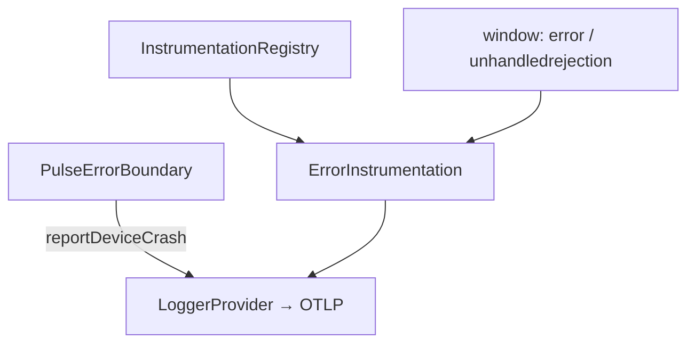
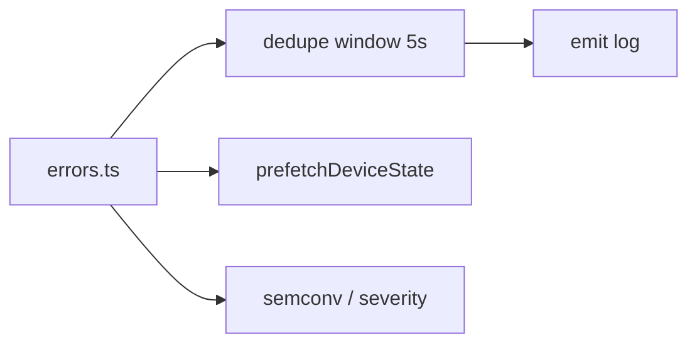
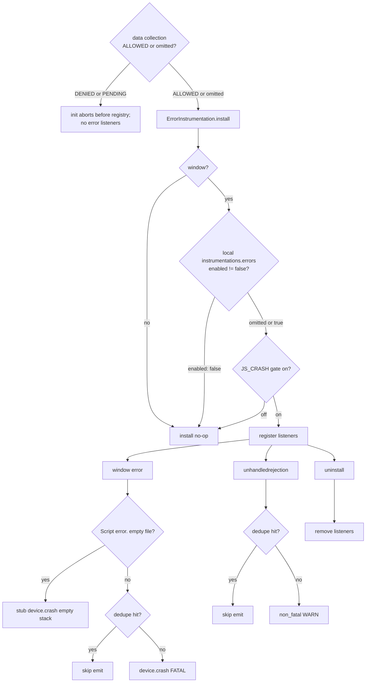

# Errors Instrumentation — SPEC.md

Package: `@dreamhorizonorg/pulse-web`  
File: `pulse-web-otel/docs/instrumentations/errors/SPEC.md`

---

## 1. Goal

Capture JavaScript failures as OTLP **log records** aligned with Pulse mobile semantics: fatal crashes (`pulse.type = device.crash`) and recoverable issues (`pulse.type = non_fatal`). Covers automatic listeners (`window.error`, `unhandledrejection`), manual SDK APIs (`Pulse.reportException`, `Pulse.reportDeviceCrash`, `Pulse.trackNonFatal`), optional device-state enrichment, deduplication, and React render errors via `PulseErrorBoundary`.

### 1.1 Authoritative implementation files


| Path                                            | Role                                                                                        |
| ----------------------------------------------- | ------------------------------------------------------------------------------------------- |
| `src/instrumentations/errors.ts`                | `window` / `unhandledrejection` listeners, dedupe, device state on automatic `device.crash` |
| `src/sdk.ts`                                    | `Pulse.reportException`, `Pulse.reportDeviceCrash`, `Pulse.trackNonFatal`                   |
| `src/utils/error-stack.ts`                      | `errorFilenameFromStack()` for manual `device.crash`                                        |
| `src/instrumentation-registry.ts`               | R6 gating via `shouldInstall` + `InstrumentationKeys.ERRORS`                                |
| `src/integrations/react/PulseErrorBoundary.tsx` | React render errors → `reportDeviceCrash`                                                   |


---

## 2. Assumptions

### 2.1 Behavioral Assumptions

- **Android / React Native parity:** Web maps to the same `pulse.type` values as Android `CrashReporter` / `NonFatalReporter`: `device.crash` for fatal paths, `non_fatal` for warnings and async failures.
- **Cross-origin script errors:** `"Script error."` with empty `filename` emits a **stub `device.crash`** with `exception.message = "Script error."` and empty stack/filename. This preserves crash counts without leaking third-party stacks — matching Android behaviour (always records a stub crash even without a full stack). *(Previously: silently dropped. Fixed in ISS-010.)*
- **`window` `"error"` fires for resource failures too:** The same event fires for some **resource load failures** (e.g. script/image). The handler normalises `e.error` or `e.message` into an `Error` and may emit `device.crash` even when the failure is not a classic uncaught exception. There is no separate suppression for that case today.
- **SSR / Node:** `ErrorInstrumentation.install()` returns immediately when `typeof window === "undefined"` — no listeners on the server. `PulseErrorBoundary` callers take effect only after client hydration (`Pulse.init` must have run).

### 2.2 Web vs Android Divergences

- **Unhandled promise rejection (web-only):** Browsers emit `unhandledrejection`; there is no direct Android analogue, but we classify it as `non_fatal` (WARN), not `device.crash`, matching the PLAN-B decision that sync uncaught exceptions are fatal-class.
- **No ANR (web-only):** Android ANR has no browser equivalent; not modeled.
- **`non_fatal.is_manual`:** Web sets `non_fatal.is_manual = true/false` on all non-fatal paths; Android (`PulseSDKInternal.trackNonFatal`) does not set this attribute. ClickHouse queries filtering on `non_fatal.is_manual` will not match Android events. Intentional web-only enrichment until Android aligns.
- **`non_fatal.type`:** Web `trackNonFatal(name)` sets `non_fatal.type = name`; Android `trackNonFatal(name, …)` sets `body = name` but does not set the `non_fatal.type` attribute. ClickHouse queries filtering on `non_fatal.type` will miss Android named non-fatals.
- **Thread attributes on `device.crash`:** Android `CrashReporter` sets `thread.id` and `thread.name` on every crash log. Web has no thread model; these attributes are absent on web `device.crash` signals. Intentional.
- **No dedup on Android:** Web `ErrorInstrumentation` suppresses duplicate fingerprints within a 5 s sliding window (`DEDUPE_WINDOW_MS`). Android `CrashReporter` has no equivalent dedup; repeated identical crashes can produce multiple log records. Web dedup is a browser-side optimisation with no Android counterpart.
- **Severity on `non_fatal`:** Web sets `severityNumber = WARN` / `severityText = "WARN"` on all non-fatal paths: `unhandledrejection`, `Pulse.reportException`, and `Pulse.trackNonFatal`. Android `trackNonFatal` does not call `setSeverity`, so its records show `UNSPECIFIED`. *(ISS-011 fixed: `trackNonFatal` in `sdk.ts` now sets `timestamp`, `severityNumber: WARN`, `severityText: "WARN"`.)*
- **Android `trackNonFatal(Throwable, …)` overload:** Android exposes a `trackNonFatal(Throwable, extraAttrs)` overload that populates `exception.type`, `exception.message`, and `exception.stacktrace` on the `non_fatal` log. Web has no such overload — `Pulse.trackNonFatal(name, attrs?)` is a named signal only and deliberately omits `exception.*`. Web callers who want to log a caught `Error` with a full stack should use `Pulse.reportException(error)` instead.

### 2.3 Platform Quirks (iOS WebKit)

- **`e.filename = "undefined"` (BUG-1 fixed):** iOS WebKit (JSC engine) sets `ErrorEvent.filename` to the string `"undefined"` instead of an empty string for certain error origins. The SDK explicitly guards against `e.filename === "undefined"` and normalizes to `"unknown"`. Standard browsers and Chrome/Firefox emit either a real URL or empty string; `"undefined"` is WebKit-specific.
- **Bare `@` stacktrace (BUG-2 fixed):** JSC produces `@` as the entire `Error.stack` string for anonymous `setTimeout` callbacks (e.g. `setTimeout(function() { throw err }, 0)`). The SDK detects `rawStack.trim() === "@"` and constructs a synthetic fallback frame `@{filename}:{lineno}:{colno}` from the `ErrorEvent` location fields. V8 and SpiderMonkey always produce at least one named frame; this case is WebKit/JSC-only.

---

## 3. Requirements

### Functional

**R1 — OTLP logs only:** No separate metric or span family for errors in this instrumentation; signals are `LoggerProvider` emits.

**R2 — `device.crash`:** Uncaught synchronous errors from `window.addEventListener("error", …)` → `severityNumber = FATAL`, `pulse.type = device.crash`.

**R3 — `non_fatal`:** Unhandled promise rejections → `pulse.type = non_fatal`, `severityNumber = WARN`, `non_fatal.is_manual = false`.

**R4 — Manual APIs:** `Pulse.reportException` / `Pulse.trackNonFatal` → `non_fatal`; `Pulse.reportDeviceCrash` → `device.crash` (see [sdk-core config-and-public-api/SPEC.md](../../sdk-core/config-and-public-api/SPEC.md) §5.6). **`trackNonFatal`** is a named non-fatal: log `body` = name, `non_fatal.type` = name; it does **not** populate `exception.*` (see §5.2). All manual APIs require `Pulse.init()` to have completed (`_initialized`); they do **not** consult `PulseFeature.JS_CRASH` or `instrumentations.errors.enabled` — only **automatic** listeners are gated (see R6).

**R5 — Dedupe:** Fingerprints + 5s sliding window (`DEDUPE_WINDOW_MS = 5000`) apply **only** to `**ErrorInstrumentation`** listeners (`window` `error` and `unhandledrejection`) in `src/instrumentations/errors.ts`. `**Pulse.reportException`**, `**Pulse.reportDeviceCrash**`, and `**Pulse.trackNonFatal**` do **not** use this dedupe cache; each call emits. `window` `error` fingerprint: ``${error.name}:${error.message}:${e.filename}:${e.lineno}:${e.colno}`` (includes `colno` to avoid collapsing two errors on the same line at different columns). *(ISS-016 fixed.)*

**R6 — Gating (automatic capture only):** `ErrorInstrumentation` is installed only when local config key `**errors`** is not `enabled: false` **and** remote `**PulseFeature.JS_CRASH`** is on (`InstrumentationRegistry.shouldInstall`). When gated off, automatic listeners are not registered; **manual** APIs in R4 still emit if the SDK is initialized (intentional so hosts can report while disabling auto-capture).

**R7 — Device state (automatic `device.crash` only):** Optional `battery.percent` and `storage.free` are prefetched inside `**ErrorInstrumentation`** and attached only to logs emitted from the `**window` `error*`* handler. `**Pulse.reportDeviceCrash**` (including `PulseErrorBoundary`) does **not** attach battery/storage today.

### Non-functional

- Listeners removed on `uninstall()`; battery `levelchange` listener detached to avoid leaks on SDK restart.
- **Logger scope:** `ErrorInstrumentation` uses `logs.getLogger("pulse-web-errors")` (literal scope string in `src/instrumentations/errors.ts`). Manual error APIs use the SDK’s primary logger from init (`src/sdk.ts`). Other instrumentations may use `PulseOtelLoggerScope` constants — scopes differ by design until unified in a future refactor.

---

## 4. Architectural Design

```text
InstrumentationRegistry.installAll()
  └─ ErrorInstrumentation (PulseFeature.JS_CRASH)
        ├─ prefetchDeviceState()  → battery + storage async
        ├─ window "error"         → device.crash log
        └─ window "unhandledrejection" → non_fatal log

React layer (optional)
  └─ PulseErrorBoundary.componentDidCatch
        └─ Pulse.reportDeviceCrash(error, { react.component_stack })
```

**Decision (ADR):** Keep log-based model; harden E2E and lifecycle docs rather than introducing spans/metrics for errors.

### 4.1 HLD — registry and signals



### 4.2 LD — handlers and dedupe



### 4.3 Flows and edge cases




---

## 5. LLD

### 5.1 Cross-cutting contract

- `**pulse.type**`, `**session.id**`, `**screen.name**`, `**platform` / resource** (`os.name = web`, etc.): same as `**sdk-core`** `[data-contract/SPEC.md](../../sdk-core/data-contract/SPEC.md)` §5 — global processors and resource merge apply to every log below unless noted.
- **Stable attribute keys** live in `src/semconv.ts` (`PulseWebSemconv.AttributeKey`, `PulseType`, `LogEventName`).

### 5.2 Attributes by emitter (canonical — matches code)

Each row is **Yes** = always set for that path, **No** = omitted, **Opt** = set when data available (or caller passes extra attrs).

#### 5.2.1 `ErrorInstrumentation` — `window` `error` → `device.crash`


| Attribute key                                                   | Required | Notes                                                                                                                                     |
| --------------------------------------------------------------- | -------- | ----------------------------------------------------------------------------------------------------------------------------------------- |
| `pulse.type`                                                    | Yes      | `device.crash`                                                                                                                            |
| `event.name`                                                    | Yes      | Same as OTLP `eventName`: `device.crash` (`PulseWebSemconv.LogEventName.DEVICE_CRASH`); duplicate on `Logger.emit` for collector indexing |
| `exception.type` / `exception.message` / `exception.stacktrace` | Yes      | From `e.error` if `Error`, else `new Error(e.message)`. Stack normalized: if absent or bare `"@"` (iOS WebKit JSC anonymous `setTimeout`), SDK synthesizes `@{filename}:{lineno}:{colno}` *(BUG-2 fixed)* |
| `error.filename`                                                | Yes      | `ErrorEvent.filename` normalized to `"unknown"` when empty **or** when browser emits literal string `"undefined"` (iOS WebKit quirk — *BUG-1 fixed*) |
| `error.lineno` / `error.colno`                                  | Yes      | From `ErrorEvent`                                                                                                                         |
| `url.path`                                                      | Yes      | `window.location.pathname`                                                                                                                |
| `non_fatal.is_manual`                                           | No       | Must not appear on this path                                                                                                              |
| `battery.percent`                                               | Opt      | From prefetch + `levelchange`                                                                                                             |
| `storage.free`                                                  | Opt      | From `navigator.storage.estimate()`                                                                                                       |
| `react.component_stack`                                         | No       | Not used on this path                                                                                                                     |


#### 5.2.2 `ErrorInstrumentation` — `unhandledrejection` → `non_fatal`


| Attribute key                                                   | Required | Notes                                                                      |
| --------------------------------------------------------------- | -------- | -------------------------------------------------------------------------- |
| `pulse.type`                                                    | Yes      | `non_fatal`                                                                |
| `event.name`                                                    | Yes      | `pulse.custom_non_fatal` (`PulseWebSemconv.LogEventName.CUSTOM_NON_FATAL`) |
| `exception.type` / `exception.message` / `exception.stacktrace` | Yes      | Reason coerced to `Error` when needed                                      |
| `non_fatal.is_manual`                                           | Yes      | `false`                                                                    |
| `url.path`                                                      | Yes      | `window.location.pathname`                                                 |
| `error.filename` / `error.lineno` / `error.colno`               | No       | Not emitted on this path                                                   |
| `battery.percent` / `storage.free`                              | No       | Not attached to automatic `non_fatal`                                      |


#### 5.2.3 `Pulse.reportException` → `non_fatal` (`src/sdk.ts`)


| Attribute key                                                   | Required | Notes                                       |
| --------------------------------------------------------------- | -------- | ------------------------------------------- |
| `pulse.type`                                                    | Yes      | `non_fatal`                                 |
| `event.name`                                                    | Yes      | `pulse.custom_non_fatal`                    |
| `exception.type` / `exception.message` / `exception.stacktrace` | Yes      | Argument normalised to `Error`              |
| `non_fatal.is_manual`                                           | Yes      | `true`                                      |
| `url.path`                                                      | Yes      | `pathname` when `window` defined, else `""` |
| Optional caller attrs                                           | Opt      | Spread from second argument                 |
| `error.filename` / lineno / colno                               | No       | Not emitted                                 |


#### 5.2.4 `Pulse.reportDeviceCrash` → `device.crash` (`src/sdk.ts`)


| Attribute key                                                   | Required | Notes                                                                                              |
| --------------------------------------------------------------- | -------- | -------------------------------------------------------------------------------------------------- |
| `pulse.type`                                                    | Yes      | `device.crash`                                                                                     |
| `event.name`                                                    | Yes      | `device.crash`                                                                                     |
| `exception.type` / `exception.message` / `exception.stacktrace` | Yes      | Argument normalised to `Error`                                                                     |
| `error.filename`                                                | Yes      | Best-effort parse via `errorFilenameFromStack()` in `src/utils/error-stack.ts`; may be `"unknown"` |
| `error.lineno` / `error.colno`                                  | No       | Not emitted (no `ErrorEvent` on manual path)                                                       |
| `url.path`                                                      | Yes      | Same rule as `reportException`                                                                     |
| Optional caller attrs                                           | Opt      | e.g. `react.component_stack` from boundary                                                         |
| `battery.percent` / `storage.free`                              | No       | Not merged from `ErrorInstrumentation` prefetch                                                    |


#### 5.2.5 `Pulse.trackNonFatal` → `non_fatal` (`src/sdk.ts`)


| Attribute key                                                   | Required | Notes                                                                                                                                                 |
| --------------------------------------------------------------- | -------- | ----------------------------------------------------------------------------------------------------------------------------------------------------- |
| `pulse.type`                                                    | Yes      | `non_fatal`                                                                                                                                           |
| `event.name`                                                    | Yes      | `pulse.custom_non_fatal`                                                                                                                              |
| `non_fatal.type`                                                | Yes      | Same string as log `body` (event name)                                                                                                                |
| `non_fatal.is_manual`                                           | Yes      | `true`                                                                                                                                                |
| `exception.type` / `exception.message` / `exception.stacktrace` | No       | **Omitted by design** — named signal, not an `Error`                                                                                                  |
| `url.path`                                                      | No       | **Omitted unless** the host includes it in the optional attributes argument                                                                           |
| `severityNumber` / `severityText`                               | Yes      | **`SeverityNumber.WARN` / `"WARN"`** — set explicitly in `sdk.ts` at call time. *(ISS-011 fixed.)* Android `trackNonFatal` does not set severity; records show `UNSPECIFIED` on Android — divergence documented in §2. |
| `timestamp`                                                     | Yes      | **`Date.now()` at call time** — set explicitly in `sdk.ts`. *(ISS-011 fixed.)* OTel default (export time) is not used.                                                                                                  |


### 5.3 React `PulseErrorBoundary`

- **Behaviour:** `componentDidCatch` calls `Pulse.reportDeviceCrash(error, { "react.component_stack": info.componentStack })`.
- **Requires:** `Pulse.init()` completed (`isInitialized()`); otherwise SDK no-ops.
- **Integration:** Wrap subtrees that should report render-phase failures; does not replace global `window.error` for non-React throws.

### 5.4 Next.js / SSR edge case

- Server components and SSR passes have **no `window`** — instrumentation does not register listeners during SSR.
- React errors during SSR are **not** captured by this browser instrumentation; host apps should rely on server-side error reporting separately. Client hydration enables `PulseErrorBoundary` + global handlers.

### 5.5 React SPA behaviour

- Global handlers attach to `window` after client `Pulse.init`. Same-origin JS errors and promise rejections surface as logs with full attributes.
- **Next.js App Router / Pages Router (client):** Once hydrated, behaviour matches SPA; route transitions do not re-install instrumentation — listeners remain for the tab lifetime.

## 6. Test Coverage

### 6.1 Scenario matrix (Given / When / Then)


| ID   | Type     | Given                                                                 | When                                                            | Then                                            | Tests                                                                                                                                                            |
| ---- | -------- | --------------------------------------------------------------------- | --------------------------------------------------------------- | ----------------------------------------------- | ---------------------------------------------------------------------------------------------------------------------------------------------------------------- |
| E-P1 | positive | gate on, uncaught throw                                               | `window` error                                                  | `device.crash`, FATAL                           | `m3.test.ts` TC1                                                                                                                                                 |
| E-P2 | positive | gate on                                                               | unhandled rejection                                             | `non_fatal`, WARN                               | `m3.test.ts` TC2                                                                                                                                                 |
| E-N1 | negative | remote `JS_CRASH` off                                                 | registry `installAll`                                           | `ErrorInstrumentation.install` not called       | `errors-instrumentation-gate-and-ssr.test.ts`                                                                                                                    |
| E-N2 | negative | cross-origin script                                                   | `"Script error."` empty file                                    | emit stub `device.crash` (empty stack/filename) | `m3.test.ts` TC12; §2 assumptions                                                                                                                                |
| E-N3 | negative | local `instrumentations.errors.enabled: false` (remote `JS_CRASH` on) | registry `installAll`                                           | `ErrorInstrumentation.install` not called       | `src/__tests__/errors-instrumentation-gate-and-ssr.test.ts` (local `instrumentations.errors.enabled: false` while remote `JS_CRASH` stays on)                   |
| E-E1 | edge     | dedupe (R5)                                                           | duplicate fingerprint within 5s                                 | second emit suppressed                          | `m3.test.ts` TC6 (burst), TC7 (window resets after 6s) — `window` `error` path; TC19 (rejection burst), TC20 (rejection window reset) — `unhandledrejection` path |
| E-E2 | edge     | SSR                                                                   | no `window`                                                     | install no-op                                   | `errors-instrumentation-gate-and-ssr.test.ts`                                                                                                                    |
| E-E3 | edge     | uninstall                                                             | subsequent error                                                | no emit                                         | `m3.test.ts` — `describe("uninstall")`                                                                                                                           |
| E-E4 | edge     | `ErrorInstrumentation` not installed                                  | `window` error                                                  | no emit                                         | `m3.test.ts` TC13                                                                                                                                                |
| E-N4 | negative | SDK not initialized                                                   | `Pulse.reportException` / `reportDeviceCrash` / `trackNonFatal` | no emit                                         | `src/__tests__/sdk-public-methods.test.ts` — “before SDK is initialized” / early calls to manual error APIs                                                      |


**Traceability:** E-N3 (R6 local kill-switch) → `errors-instrumentation-gate-and-ssr.test.ts`. E-E4 (“no listener”) → `m3.test.ts` TC13. E-N4 (“no init”) → `sdk-public-methods.test.ts` early-call cases. E-E1 dedupe covers both the `window` `error` path (TC6, TC7) and `unhandledrejection` path (TC19, TC20); no Playwright E2E for rejection dedupe burst — Vitest-only. Consent `DENIED` / `PENDING` is **E-N0**-shaped (no SDK init → no listeners) — covered by `src/__tests__/integration-simplified-init.test.ts` TC-C2, TC-C3 and §4.3 node `Z0`; not duplicated as a separate §6.1 row.

### 6.2 Playwright E2E (`examples/ecommerce-demo/e2e/`)

Master index: `[../../sdk-core/test-coverage/SPEC.md](../../sdk-core/test-coverage/SPEC.md)` §6.3. **Mock OTLP:** `e2e/m3-errors.spec.ts` — tag **@M3-errors** (contract, lifecycle, gate/consent). **ClickHouse:** `e2e/m3-ch.spec.ts` — tag **@M3-CH** (TC1–TC6, TC9–TC10, TC12). **`trackNonFatal`** OTLP also in `e2e/m1.spec.ts` (not under **@M3-errors**). Boundary extras: `e2e/m15.spec.ts`, `e2e/m16-ch.spec.ts`.

- Uncaught error / unhandled rejection / manual `reportException` / boundary `device.crash`
- Dedupe window, fingerprint separation, rejection normalization, cross-origin silence, timestamp, coexisting `window.onerror`
- `js_crash` gate off; `DENIED` / `PENDING` consent — no init, zero exports (`src/__tests__/integration-simplified-init.test.ts` TC-C2, TC-C3)

**Previously known E2E gaps — now closed (nextjs-demo):**

- **Local `instrumentations.errors.enabled: false` (E-N3):** Added to `examples/nextjs-demo/e2e/nextjs-demo.spec.ts`. `pulse-provider.tsx` reads `window.__TEST_PULSE_ERRORS_DISABLED` (set via `page.addInitScript` before page load) and passes `instrumentations: { errors: { enabled: false } }` to `PulseProvider` at init time. Test asserts zero `device.crash` exports after dispatching a `window` `error` with the kill-switch active.
- **`unhandledrejection` dedupe burst/reset (E-E1):** Two tests added to `examples/nextjs-demo/e2e/nextjs-demo.spec.ts` — burst (3× same rejection within 5s → 1 export) and window reset (same rejection before + after 5s → 2 exports). Error object stored on `window` between evaluate calls to ensure identical fingerprint for the window-reset case.

### `src/__tests__/error-instrumentation-device-state.test.ts`

Scenarios (from file header and bodies):

- **Battery:** `navigator.getBattery()` resolves → `battery.percent` on emitted `device.crash` log; `levelchange` updates cached percent; `uninstall()` removes listener.
- **Storage:** `navigator.storage.estimate()` resolves → `storage.free` stamped on crash path.
- **Degradation:** missing `getBattery`, rejected `getBattery`, rejected `estimate` — no throw; logs still emit without optional attrs.
- **Rejections:** non-Error reasons (string, null, object) coerced to `Error` for `non_fatal` path.
- **Dedupe / fingerprinting:** see `src/__tests__/m3.test.ts` for burst/dedupe scenarios alongside core contract tests.

### `src/__tests__/m3.test.ts` (related contract coverage)

- TC1 — uncaught JS error → `device.crash` (FATAL, lineno/colno, no `non_fatal.is_manual`).
- TC2 — unhandled rejection → `non_fatal` (WARN, `is_manual=false`).
- TC3 — manual `reportException` / `reportDeviceCrash` paths.
- TC15/TC16 — string / undefined rejection coercion.
- Battery omitted paths still emit `device.crash` when APIs unavailable.

---

## 7. Known Bugs & Gaps

### P0 (data contract — none identified)

No known **P0** issues (wrong/missing ClickHouse attributes or silent drops) in the current `errors.ts` / boundary path beyond documented cross-origin silence.

### Known limitations (platform / parity vs Android)

These are **documented behaviour**, not untracked bugs. They exist because the browser and the JVM are different environments.

1. **No immediate flush after automatic fatal (`device.crash` from `window` `error`).** On **Android**, after the process records an uncaught crash, the crash reporter **waits up to several seconds** for the logging pipeline to **force-flush** so the crash line is less likely to be lost when the app exits. On **web**, the handler calls `logger.emit` and relies on normal batching, periodic export, and the SDK’s `**pagehide`** flush when the user leaves the page. If the tab is killed instantly with no further JavaScript running, **that last crash log might not reach the server** — rarer than on mobile, but possible. We do not block the main thread on a flush inside the error handler today.
2. **No `heap.free` on automatic web `device.crash`.** On **Android**, crash enrichment can include **free Java heap** bytes from the JVM. On **web**, we attach optional **battery** and **storage** hints where APIs exist, but there is **no standard, cross-browser “free heap” field** wired into this instrumentation. Dashboards that expect the same `heap.free` column as Android will not see it on web unless we adopt something like Chrome-only `performance.memory` (non-standard) in a future change.

### Other gaps

- ~~`**trackNonFatal` missing `timestamp` and severity (ISS-011)**~~ **Fixed.** `src/sdk.ts` `trackNonFatal` now sets `timestamp: Date.now()`, `severityNumber: SeverityNumber.WARN`, `severityText: “WARN”` — matching `reportException` / automatic promise failures. Android `trackNonFatal` still does not set severity (`UNSPECIFIED`); divergence documented in §2.
- **Severity taxonomy vs Android:** Unhandled rejection is `non_fatal` on web; some teams expect “crash” semantics — documented as intentional in PLAN-B.
- **React 18 Strict Mode:** Double mount/unmount in dev may interact with boundary reset patterns; not exhaustively E2E’d.

Doc alignment (emitters, gating, dedupe, device state, `window` `error` semantics, test anchors E-E3–E-E4 / E-N4, §5.2 `event.name`, §6.2 E2E file paths, §1.1, §4.3, §6.1 E-N3 / E-E1 traceability, known limitations above) is captured in **§1.1, §2, §3 (R4–R7), §4.3, §5.1–5.2, §6.1–6.2, §7** as of this SPEC revision. **Implementation audit / gap tracker:** `[../../REVIEW_Errors-Web-vitals-Network.md](../../REVIEW_Errors-Web-vitals-Network.md)`.

---

## 8. Redundancy & Cleanup Notes

Files absorbed into this SPEC and **deleted** (triple-eval):


| Deleted path                                                                                |
| ------------------------------------------------------------------------------------------- |
| `pulse-web-otel/web-sdk-plan/v1-errors/DESIGN.md`                                           |
| `pulse-web-otel/web-sdk-plan/v1-errors/ADR-errors.md`                                       |
| `pulse-web-otel/web-sdk-plan/v1-errors/01-research-errors-ecosystem-and-industry.md`        |
| `pulse-web-otel/web-sdk-plan/v1-errors/02-research-errors-otel-js-browser-and-pulse-sdk.md` |
| `pulse-web-otel/web-sdk-plan/v1-errors/03-touchpoints-matrix.md`                            |
| `pulse-web-otel/web-sdk-plan/v1-errors/04-contract-parity.md`                               |
| `pulse-web-otel/web-sdk-plan/v1-errors/PLAN-B-errors-log-signals.md`                        |
| `pulse-web-otel/web-sdk-plan/v1-errors/HANDOFF-NEXT-AGENT.md`                               |
| `pulse-web-otel/web-sdk-plan/v1-errors/README.md`                                           |
| `pulse-web-otel/web-sdk-plan/v1/02-instrumentations/errors.md`                              |


---

## 9. Open Questions

1. ~~**ISS-010** — Should unhandled promise rejection ever escalate to `device.crash`?~~ **Decided: No.** Keep `non_fatal` WARN — Sentry (mechanism `onunhandledrejection`, `error` level, not `fatal`) and PostHog (regular `$exception`, no escalation) both treat unhandled rejections as non-fatal. Escalating would diverge from industry standard. If escalation is needed for specific cases, add opt-in config.
2. ~~**ISS-011** — Should cross-origin errors emit a scrubbed `device.crash` vs silence entirely?~~ **Decided + Fixed:** Emit stub `device.crash` with empty stack — preserves crash counts, matches Android behaviour. Implemented in `errors.ts`.

