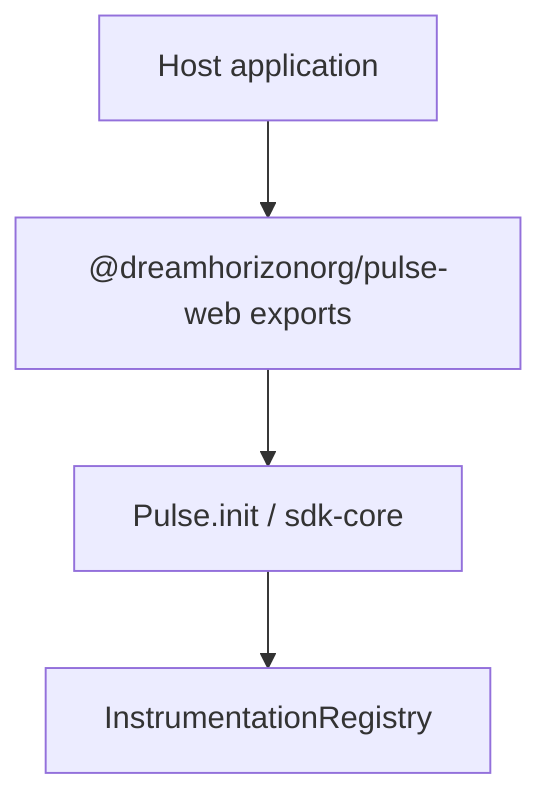
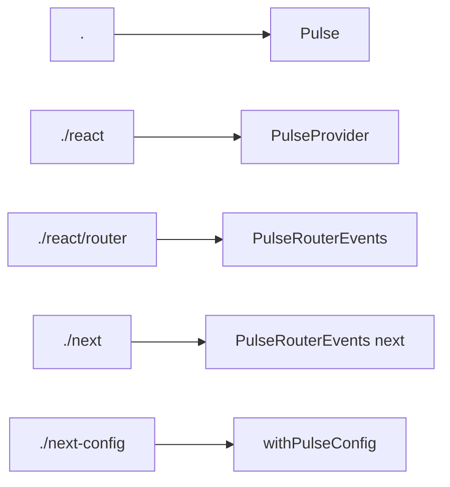
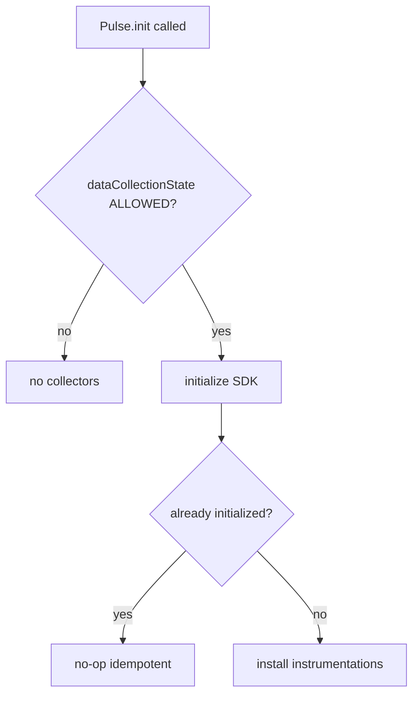

# Host Application Integration — SPEC.md

Package: `@dreamhorizonorg/pulse-web` (`pulse-web-otel/package.json`)  
File: `pulse-web-otel/docs/instrumentations/integration/SPEC.md`

---

## 1. Goal

Single **entry-point guide** for shipping Pulse Web in a browser application: install the npm package, choose the correct **`exports` subpath**, call **`Pulse.init`** with required consent + API key, optionally wrap React/Next layers, and deep-link to **`sdk-core`**, **`react-integration`**, and **`nextjs-integration`** SPECs for implementation detail.

---

## 2. Assumptions

- **Browser bundle:** Default `@dreamhorizonorg/pulse-web` targets browsers (`window` present). SSR-only contexts skip browser initialization.
- **Consent-first:** Without **`PulseDataCollectionConsent.ALLOWED`**, the SDK installs **no** collectors — legal baseline.

---

## 3. Requirements

**R1 — Install:** Add `@dreamhorizonorg/pulse-web` from npm (workspace / tarball per internal publishing docs).

**R2 — Choose entry:**

| Need | Import |
|---|---|
| Vanilla / framework-agnostic | `@dreamhorizonorg/pulse-web` → `Pulse.init` |
| React root provider | `@dreamhorizonorg/pulse-web/react` |
| React Router v6 screen names | `@dreamhorizonorg/pulse-web/react/router` |
| Next.js client helpers | `@dreamhorizonorg/pulse-web/next` |
| `next.config` wrapper + maps | `@dreamhorizonorg/pulse-web/next-config` |

**R3 — Minimal config:** Provide **`apiKey`** + **`dataCollectionState`** — see **`sdk-core`** [`config-and-public-api/SPEC.md`](../../sdk-core/config-and-public-api/SPEC.md) for full `PulseWebConfig` and `Pulse.*` surface.

**R4 — Shutdown:** Long-lived SPAs usually omit teardown; tests may call **`Pulse.shutdown()`** via provider prop — see **`react-integration`** SPEC.

**R5 — Domain allowlist (ops):** After integrating, the host application's origin must be added to the Pulse S3 CORS allowlist (`pulse-otel-config` bucket) before the SDK can fetch remote config in a browser. Without this, `OPTIONS` preflight to `/config/*` returns 403 and the SDK cannot load feature gates or remote sampling config.

```bash
# Run once per new customer domain — update existing rule, do not replace
aws s3api put-bucket-cors \
  --bucket pulse-otel-config \
  --cors-configuration '{
    "CORSRules": [{
      "AllowedOrigins": [
        "https://*.pulse-ux.com",
        "https://*.amplifyapp.com",
        "https://<customer-domain>",
        "http://localhost:3000"
      ],
      "AllowedMethods": ["GET", "HEAD"],
      "AllowedHeaders": ["*"],
      "MaxAgeSeconds": 7200
    }]
  }'
```

> Note: this is a manual step until project registration in the Pulse backend automates it.

---

## 4. Architectural Design

```
npm install @dreamhorizonorg/pulse-web

Vanilla
  import { Pulse } from "@dreamhorizonorg/pulse-web";
  await Pulse.init({ apiKey, dataCollectionState, ... });

React
  import { PulseProvider } from "@dreamhorizonorg/pulse-web/react";
  <PulseProvider config={...}>{app}</PulseProvider>

React Router
  import { PulseRouterEvents } from "@dreamhorizonorg/pulse-web/react/router";

Next.js (client)
  import { PulseRouterEvents } from "@dreamhorizonorg/pulse-web/next";
  // App Router: wraps useNextAppRouterTracking

Next.js (build)
  const { withPulseConfig } = require("@dreamhorizonorg/pulse-web/next-config");
```

### 4.1 HLD — package entry vs core SDK 



### 4.2 LD — export subpaths 



### 4.3 Flows — consent and double init 



---

## 5. LLD

### 5.1 `package.json` exports (truth)

See **`pulse-web-otel/package.json`** → **`exports`**. Canonical keys:

- **`"."`** — core SDK (`Pulse`, instrumentations via init).
- **`"./react"`** — `PulseProvider`, `usePulse`, `PulseErrorBoundary`.
- **`"./react/router"`** — `useRouterTracking`, `PulseRouterEvents` (peer: `react-router-dom`).
- **`"./next"`** — Next client/server helpers (`PulseRouterEvents`, App/Pages hooks, `createPulseInstrumentationHandler`).
- **`"./next-config"`** — `withPulseConfig`, source-map upload utilities.

Published **`types`** + **`import`** / **`require`** pairs resolve to `dist/*`.

### 5.2 `Pulse.init` contract

- **Required:** `apiKey`, `dataCollectionState`.
- **Async:** returns **`Promise<void>`** — await before relying on telemetry (`Pulse.whenReady()`).
- **Singleton:** double init no-op — details in **`sdk-core`** [`architecture-and-bootstrap/SPEC.md`](../../sdk-core/architecture-and-bootstrap/SPEC.md).

### 5.3 Consent + gates

- **`dataCollectionState`:** `ALLOWED` \| `DENIED` \| `PENDING` — only **`ALLOWED`** enables collectors.
- **Remote config / feature gates:** fetched post-init — **`sdk-core`** [`remote-config-features-and-sampling/SPEC.md`](../../sdk-core/remote-config-features-and-sampling/SPEC.md).

### 5.4 React (`PulseProvider`)

- Wrap the tree once at root — **`react-integration`** SPEC §5.
- **`shutdownOnUnmount`** defaults **`false`** — keeps **`Pulse`** running when a
  provider unmounts (typical SPA / nested layouts). Use **`true`** for strict
  teardown or Vitest suites — behaviour + StrictMode microtask guard:
  `src/__tests__/pulse-provider.test.tsx`.

### 5.5 Next.js

- **Runtime:** `@dreamhorizonorg/pulse-web/next` — **`nextjs-integration`** SPEC §5.
- **Build:** `@dreamhorizonorg/pulse-web/next-config` — source maps §5.3–5.4 there.

### 5.6 Platform CORS configuration

The SDK fetches remote config from `pulse-otel-config` S3 via CloudFront (`/config/*`). The bucket is private (OAC) with `AllowedOrigins` scoped to known domains. A new integration requires the host app origin to be added to the CORS rule — see **R5** above. Failure symptom: `OPTIONS /config/projects/<id>/pulse-config.json` returns 403; SDK falls back to defaults silently.

### 5.7 SSR / Node `instrumentation.ts`

- Server **`onRequestError`** helper ships logs separately — does **not** replace browser **`Pulse.init`** for RUM.

### 5.8 Developer ergonomics / API critique

**Canonical punch list:** [`../../known-gaps-tradeoffs-and-plan.md`](../../known-gaps-tradeoffs-and-plan.md) §1–§4 (gaps, tradeoffs, open questions, plan / archive). This integration guide intentionally **does not** duplicate that list.

### 5.9 Export hooks: config key `beforeSendData` vs inner `beforeSend*`

- **Config surface (`PulseWebConfig`):** the field is **`beforeSendData`**
  (matches Android `PulseBeforeSendData` / RN docs). Do **not** rename to
  generic `beforeSend` on the config object without a coordinated cross-SDK
  major.
- **Many RUM guides** use the word “`beforeSend`” generically — in Pulse Web,
  that behaviour lives under **`beforeSendData`**, and the **typed callback
  object** uses inner keys **`beforeSend`**, **`beforeSendSpan`**,
  **`beforeSendLog`**, **`beforeSendMetric`** (see **`sdk-core`**
  [`config-and-public-api/SPEC.md`](../../sdk-core/config-and-public-api/SPEC.md)
  §5.1.5b and [`exporters-and-persistence/SPEC.md`](../../sdk-core/exporters-and-persistence/SPEC.md)).

### 5.10 Cross-platform manual error APIs (parity)

| Intent | Web (`@dreamhorizonorg/pulse-web`) | Android (`PulseSDK`) | React Native (`Pulse` / native) |
| --- | --- | --- | --- |
| Recoverable error / exception | `Pulse.reportException(err, attrs?)` → `non_fatal` | `trackNonFatal(throwable, …)` / `trackNonFatal(name, …)` | `Pulse.reportException(…)` (bridges to Android `trackNonFatal`) |
| Named non-fatal | `Pulse.trackNonFatal(name, attrs?)` → `non_fatal` | `trackNonFatal(name, …)` | `trackNonFatal` on native modules |
| Fatal / boundary-style crash | `Pulse.reportDeviceCrash(err, attrs?)` → `device.crash` | Fatal path via crash pipeline (see Android errors instrumentation) | Platform-specific; JS uses `reportException` with fatal flag where applicable |

**Note:** naming differs by platform; **`pulse.type`** values align (`non_fatal`,
`device.crash`). Normative web behaviour: **`errors`** SPEC + **`sdk-core`**
[`config-and-public-api/SPEC.md`](../../sdk-core/config-and-public-api/SPEC.md)
§5.6. A single shared JS method name across web and Android would need an ADR.

---

## 6. Test Coverage

### 6.1 Scenario matrix (Given / When / Then)

| ID | Type | Given | When | Then | Tests |
|----|------|-------|------|------|-------|
| I-P1 | positive | ALLOWED + valid apiKey | `Pulse.init` | SDK ready, exports resolve | `integration-simplified-init.test.ts`, `sdk-lifecycle.test.ts` |
| I-N1 | negative | consent not ALLOWED | init | no collectors | `sdk-lifecycle.test.ts` |
| I-E1 | edge | double `Pulse.init` | second call | no-op | `sdk-lifecycle.test.ts` |
| I-E2 | edge | CORS not allowlisted | remote config fetch | 403 fallback defaults | **gap** — no dedicated Vitest; see `remote-config.ts` / `m1.test.ts` fetch mocks |

Integration smoke: `src/__tests__/integration-simplified-*.test.ts`, `package-exports.test.ts` (paths per repo).

### 6.2 Playwright E2E

End-to-end catalogue (all Playwright `test()` titles, React + Next demos): [`../../sdk-core/test-coverage/SPEC.md`](../../sdk-core/test-coverage/SPEC.md) §6.3–§6.5. CI gate: `yarn e2e:web-sdk-gates` from `pulse-web-otel/`.

### Integration is validated indirectly via:

- Core lifecycle tests — **`sdk-core`** [`test-coverage/SPEC.md`](../../sdk-core/test-coverage/SPEC.md).
- React provider/router tests — **`react-integration`** SPEC §6.
- Next hooks/config tests — **`nextjs-integration`** SPEC §6.

---

## 7. Known Bugs & Gaps

### P0:

Follow **`sdk-core`** SPEC §7 — **P0** items affect emitted telemetry globally.

### Other gaps

- Workspace demos may alias the package name — external CRA/Vite apps must use published **`exports`** as-is.

---

## 8. Redundancy & Cleanup Notes

Legacy planning **`web-sdk-plan/INTEGRATION.md`** had **no** standalone file in-repo at consolidation time; scattered integration guidance now lives here plus framework SPECs. **`agent-runtime/`** notebooks were removed separately per PRD (non-instrumentation).

---

## 9. Open Questions

1. Publish scoped README excerpt mirroring §5.1 for npmjs.com landing?
