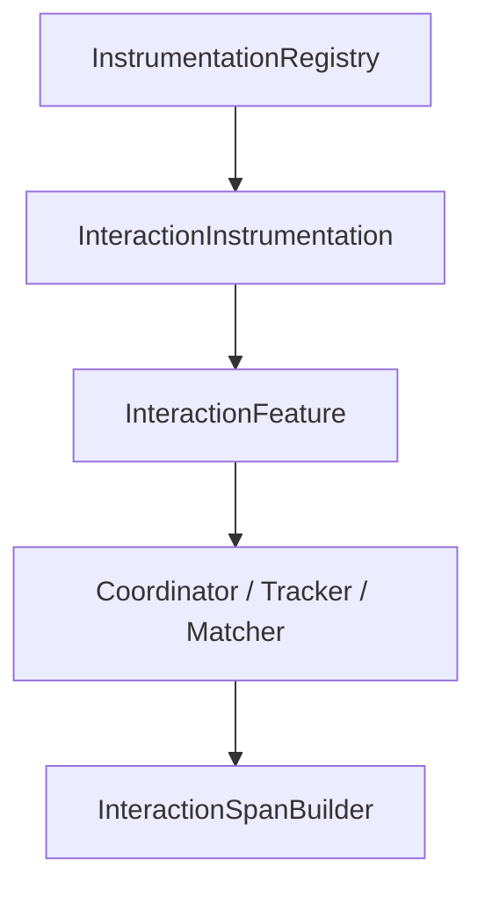
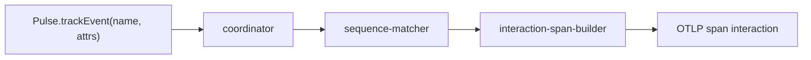
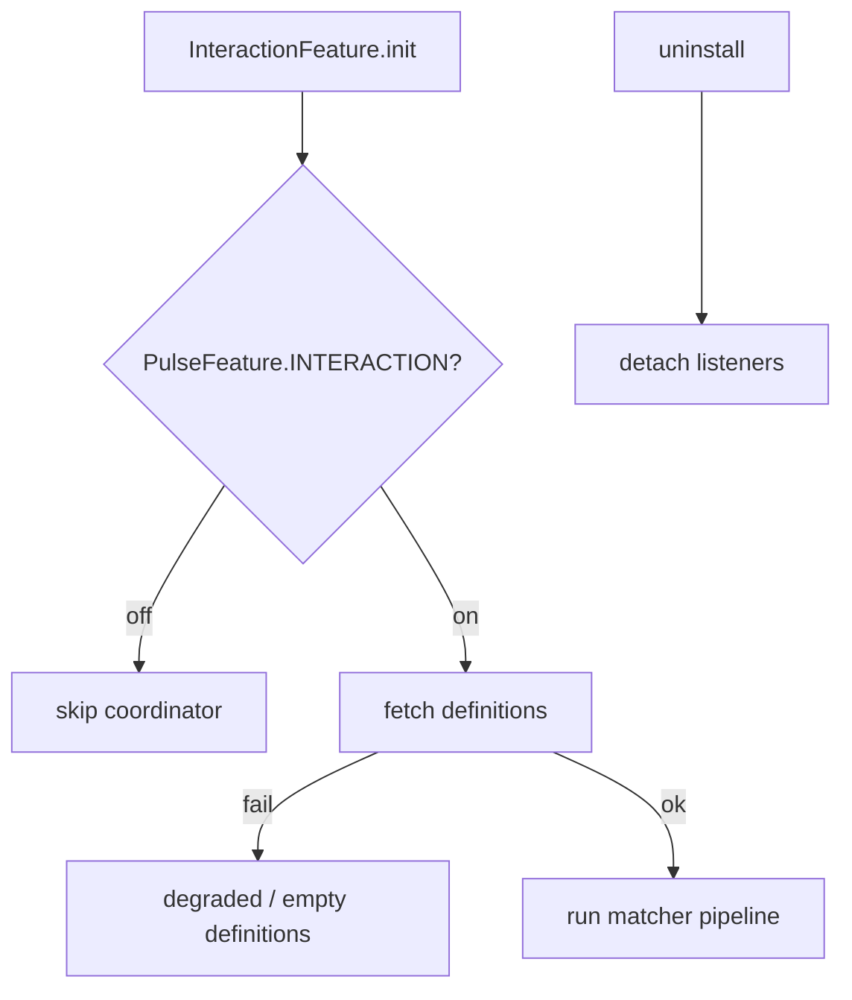

# Interactions Feature — SPEC.md

Package: `@dreamhorizonorg/pulse-web`  
File: `pulse-web-otel/docs/instrumentations/interactions/SPEC.md`

---

## 1. Goal

The **interactions feature** is **distinct from raw click instrumentation** (`app.click` logs). It matches **named interaction sequences** defined in remote config by consuming events fed via `Pulse.trackEvent(name, attrs)`, then emits **OTel spans** for completed sequences using **`pulse.type = interaction`** and **`pulse.interaction.*`** span attributes (see §5.1). **Click heatmaps** are **deferred** — not part of this subsystem.

> **Current intake:** events enter the matcher via (a) explicit `Pulse.trackEvent()` calls, (b) `app.click` logs automatically bridged by `InteractionLogProcessor` (ISS-I01 — shipped), and (c) eligible span ends (`screen_load`, `screen_session`, `network.*`) reverse-fed by `InteractionContextSpanProcessor` (ISS-I04 — shipped). `navigation.ts` screen-name steps must still be fed manually until ISS-I13 is resolved.

---

## 2. Assumptions

- **Heatmap:** **Deferred** — see §7 / §9; matrix scenarios captured historically in planning docs only.
- **Mobile parity gap:** Android/RN may expose different named-flow primitives — web relies on DOM click + screen signals only.

---

## 3. Requirements

**R1 — Feature class:** `InteractionFeature` wires coordinator, config fetcher, tracker, matcher, span builder.

**R2 — Remote definitions:** Interaction definitions fetched from Pulse backend using API key / endpoint (see `interactions-config-fetcher`).

**R3 — Gate:** Local config `instrumentations.interactions.enabled` must be honoured, and the remote feature gate **`PulseFeature.INTERACTION`** (`"interaction"` in remote template) must allow the feature — see `InteractionFeature.init` / `instrumentation-registry.ts` mapping **`InstrumentationKeys.INTERACTIONS` → `PulseFeature.INTERACTION`**.

**R4 — SDK wiring:** `InteractionInstrumentation` registers separately from base registry batch in places — exposes `trackEvent` passthrough for testing.

---

## 4. Architectural Design

### Coordinator / tracker / matcher / builder pipeline

```text
InteractionInstrumentation.install()
  └─ InteractionFeature.init()
        ├─ ConfigFetcher → merged definitions
        ├─ Coordinator subscribes to click + navigation internal events
        ├─ Tracker holds partial sequence state per session
        ├─ SequenceMatcher tests events vs configured patterns
        └─ SpanBuilder emits OTel records when a sequence completes
```

### 4.1 HLD — feature vs registry



### 4.2 LD — data path



> **Note:** `app.click` logs are bridged automatically via `InteractionLogProcessor` (ISS-I01 — shipped). Eligible span ends (`screen_load`, `screen_session`, `network.*`) are reverse-fed via `InteractionContextSpanProcessor` (ISS-I04 — shipped). `navigation.ts` screen-name steps remain manual pending ISS-I13.

### 4.3 Flows — gate and config failure



---

## 5. LLD

### 5.1 Span attributes (completed interaction)

**Canonical keys:** `PulseWebSemconv` in `src/semconv.ts` (`PulseType.INTERACTION`, `InteractionAttributeKey.*`). **Emission:** `InteractionSpanBuilder.emitInteraction` in `src/interactions/interaction-span-builder.ts` (reads internal props via `INTERACTION_PROP_KEYS` in `src/constants/interactions/interaction-constants.ts`).

| Attribute key | Type | Set where | Required | Notes |
|---|---|---|---|---|
| `pulse.type` | string | span builder | Yes | **Literal** `interaction` — `PulseWebSemconv.PulseType.INTERACTION` (not configurable per definition). |
| `pulse.interaction.id` | string | span builder | Yes | `PulseInteraction.id` (stable id for this completion). |
| `pulse.interaction.name` | string | span builder | Yes | From props `pulse.interaction.name` if present, else interaction display name. |
| `pulse.interaction.config.id` | string | span builder | Yes | Remote definition id; **`""`** if missing. |
| `pulse.interaction.config.name` | string | span builder | Yes | Definition / config name (same as coordinator `interaction.name` in typical paths). |
| `pulse.interaction.complete_time` | number (ns) | span builder | Yes | **Nanoseconds** — duration to complete (`TIME_TO_COMPLETE_IN_NANO`); **not** `duration_ms`. |
| `pulse.interaction.apdex_score` | number | span builder | Yes | `0.0` when `pulse.interaction.is_error` is true. |
| `pulse.interaction.user_category` | string | span builder | Yes | One of `Excellent` \| `Good` \| `Average` \| `Poor` (`PulseWebSemconv.InteractionUserCategory` / `INTERACTION_TIME_CATEGORY`). Forced to `Poor` on error. |
| `pulse.interaction.is_error` | boolean | span builder | Yes | |
| `pulse.interaction.error.type` | string | span builder | If error | Set only when `is_error`; otherwise omitted. |
| `pulse.interaction.error.message` | string | span builder | If error | Set only when `is_error`; otherwise omitted. |
| `session.id` | string | global attrs processor | Yes | Injected on export by `src/processors/global-attrs-processor.ts` — **not** set inside `InteractionSpanBuilder`. |
| `screen.name` | string | global attrs processor | No | Same as `session.id` row — global injection when available. |
| `platform` | string | resource | Yes | `web` — resource contract; see sdk-core data contract. |

**Span events (not attributes):** `InteractionSpanBuilder.emitInteraction()` adds two categories via `span.addEvent(name, props, timeMs)`:
- **Step events** (`pulse.internal.events` / `LOCAL_EVENTS`) — sequence-advancing steps.
- **Marker events** (`pulse.internal.marker_events` / `MARKER_EVENTS`) — ambient mid-sequence signals (crash, non_fatal) sliced to the interaction window. Fixed in ISS-I02 (shipped).

### 5.2 Algorithm (high level)

1. Normalised click / navigation events enter **Coordinator**.
2. **Tracker** maintains candidates per active definition.
3. **SequenceMatcher** advances state machine; timeout/eviction rules apply.
4. On terminal match, **SpanBuilder** emits telemetry.

### 5.3 React / Next.js

- Runs in browser after **`Pulse.init`**.
- **Event intake (three paths):**
  1. Explicit `Pulse.trackEvent(eventName, attrs)` from app code.
  2. `app.click` logs auto-bridged by `InteractionLogProcessor` — `pulse.type === app.click` → `trackEvent(body, attrs, timeMs)` (ISS-I01, shipped).
  3. Eligible span ends reverse-fed by `InteractionContextSpanProcessor` — `screen_load`, `screen_session`, `network.*` → `trackEvent(pulseType, spanAttrs, timeMs)` (ISS-I04, shipped).
  - Screen / route step names via `navigation.ts` must still be fed manually until ISS-I13 is resolved.
- Requires **`PulseFeature.INTERACTION`** gate on and `instrumentations.interactions.enabled` not `false`.

---

## 6. Test Coverage

### 6.1 Scenario matrix (Given / When / Then)

| ID | Type | Given | When | Then | Tests |
|----|------|-------|------|------|-------|
| INT-P1 | positive | gate on, definitions loaded | sequence completes | span `pulse.type=interaction` + `pulse.interaction.*` | `interactions-span-builder.test.ts` |
| INT-N1 | negative | INTERACTION gate off | init | coordinator not started | `interaction-feature.test.ts` |
| INT-E1 | edge | config fetch fails | runtime | matcher idle / definitions empty | **gap** — document in open questions |
| INT-E2 | edge | uninstall | pending partial | no leak | coordinator tests |

### 6.2 Playwright E2E (`examples/ecommerce-demo/e2e/`)

Master index: [`../../sdk-core/test-coverage/SPEC.md`](../../sdk-core/test-coverage/SPEC.md) §6.3 — **`@M2 interactions e2e`** + **`@M2 interactions edge cases`**: happy paths (1/2/3-event), timeouts, sequence violations, blacklist (global/local), apdex tiers, overlapping configs, out-of-order timestamps, config fetch unavailable (no span, SDK alive), property-operator matrix, user id mid-flow, shared-prefix branching, plus exploratory middle-step behaviour.

### Files (each exercises scenarios described in filename)

1. `src/__tests__/interaction-feature.test.ts`
2. `src/__tests__/interaction-instrumentation.test.ts`
3. `src/__tests__/interactions-coordinator.test.ts`
4. `src/__tests__/interactions-tracker.test.ts`
5. `src/__tests__/interactions-config-fetcher.test.ts`
6. `src/__tests__/interactions-sdk-wiring.test.ts`
7. `src/__tests__/interactions-sequence-matcher.test.ts`
8. `src/__tests__/interactions-span-builder.test.ts`
9. `src/__tests__/interactions-events-utils.test.ts`

Plus `interaction-feature-integration.test.ts` for cross-module flows.

---

## 7. Known Bugs & Gaps

### ~~P1: Marker events not exported to span timeline (ISS-I02)~~ — Fixed

~~`pulse.internal.marker_events` is built by `interaction-sequence-matcher.ts` and stored in interaction `props`, but `InteractionSpanBuilder.emitInteraction()` only loops `LOCAL_EVENTS` — marker events are never added via `span.addEvent()`. Android adds both step events and marker events to the span. Fix: second loop in `emitInteraction()` over `MARKER_EVENTS`.~~

**Fixed (ISS-I02):** `InteractionSpanBuilder.emitInteraction()` now has a second loop over `MARKER_EVENTS` → `span.addEvent()`. Covered by 5 unit tests in `interactions-span-builder.test.ts` and `@marker` E2E in both ecommerce-demo and nextjs-demo.

### P2: Heatmap deferred

**Heatmap / rage grid** analytics — **deferred** future work (not a runtime bug).

### P0

No **P0** data-contract defects — **§5.1** matches `semconv.ts` / `InteractionSpanBuilder` (2026-05-14).

---

## 8. Redundancy & Cleanup Notes

Deleted after triple-eval:

| Path |
|---|
| `pulse-web-otel/web-sdk-plan/interactions/INTERACTION-SCENARIO-MATRIX.md` |

---

## 9. Open Questions

1. ~~When remote definitions fail to fetch, should sequences silently disable or retry backoff?~~ **Resolved (ISS-I05):** No retry. On fetch failure the coordinator runs with empty / stale `localStorage` cache — matches Android behaviour. The 30-min refresh timer continues so the next poll may recover. Exponential retry (1–2 attempts) can be added later if needed.
