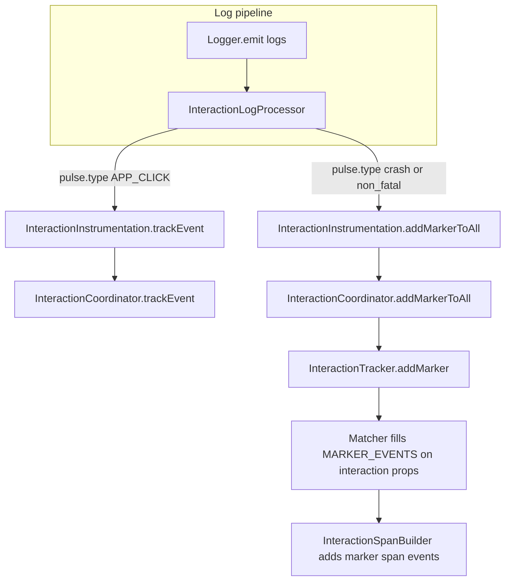

---

name: Interaction log processor (clicks + log markers) + span MARKER_EVENTS
overview: "Single delivery unit: `InteractionLogProcessor` mirrors Android `InteractionLogListener` — (1) forward `**pulse.type` = app.click** string-body logs to `trackEvent` with `CUSTOM_EVENT` dedupe; (2) on `pulse.type` device.crash or non_fatal, call `addMarkerToAll`. Span builder emits `MARKER_EVENTS` on the interaction span. Network `**network.`* client spans** are out of scope (defer). No `SdkContext` / `NetworkInstrumentation` changes for markers."
todos:

- id: marker-chain
content: "addMarkerToAll on InteractionCoordinator → InteractionFeature → InteractionInstrumentation (full delegation); processor holds only InteractionInstrumentation ref"
status: pending
- id: marker-span-builder
content: interaction-span-builder.ts — after localEvents loop, emit MARKER_EVENTS via toLocalEvents + span.addEvent
status: pending
- id: processor-impl
content: "InteractionLogProcessor onEmit: branch A APP_CLICK + non-empty body → trackEvent (never relax to all string bodies); branch B device.crash|non_fatal → addMarkerToAll; hrTime→ms; null instr guards"
status: pending
- id: sdk-wire
content: sdk.ts — register processor in log pipeline; setInstrumentation after registerAndInstall; setInstrumentation(null) before _providerCleanup
status: pending
- id: unit-tests
content: "interaction-log-processor.test.ts — click bridge + marker branch matrix (device.crash, non_fatal, custom_event no marker, session.start neither, null instr); interactions-span-builder + interactions-coordinator; interactions-sdk-wiring [3]; clicks integration; optional instrumentation defensive"
status: pending
- id: e2e-m2
content: "m2-interactions — @click-bridge + rage; marker E2E — in-flight flow + emit non_fatal or device.crash via Pulse API, complete flow, assert span events include marker between steps (not fetch/500)"
status: pending
- id: marker-network-span-defer
content: "Document / backlog only — network.0|4xx|5xx are client SPANS, not logs; needs span processor or SdkContext hook — separate workstream"
status: pending
isProject: false

---

# Interactions: unified `InteractionLogProcessor` + `MARKER_EVENTS` on spans

## Architecture (Android parity)

`InteractionLogListener` handles both **event forwarding** and **marker enrichment** in one `onEmit`. Web matches that with **one** `[InteractionLogProcessor](pulse-web-otel/src/processors/interaction-log-processor.ts)` and **no** extra `SdkContext` surface for ISS-I03.

## Design decision: Branch A is `APP_CLICK` only (do not relax)

**Do not** change Branch A to "any string body except `CUSTOM_EVENT`." Keep `**pulse.type === APP_CLICK`** as the only `trackEvent` trigger.

1. **Double-fire:** `device.crash` and `non_fatal` logs have string bodies. A relaxed Branch A would call `trackEvent` **and** Branch B would call `addMarkerToAll` — a crash would become both an interaction step and a marker.
2. **Lifecycle contamination:** `session.start`, `screen_load`, `screen_session`, `web_vital`, etc. have string bodies and are not `CUSTOM_EVENT`. Forwarding them would spam `checkAndAdd` on every load for configs that never named those steps.
3. **Android parity is clicks, not generic logs:** `ClicksInstrumentation` emits `**APP_CLICK`** logs; the processor bridges those into interaction tracking so apps need not `Pulse.trackEvent` every click. Scope is not "all logs."
4. **Test contract:** The processor matrix requires `session.start` → **neither** branch; relaxing Branch A breaks that invariant.
5. **Maintenance:** A skip-list for "all except X" grows with every new `pulse.type`. **APP_CLICK-only** is a closed gate.

Optional extra guard: early-return when `pulse.type === CUSTOM_EVENT` is redundant if Branch A is APP_CLICK-only, but an explicit check in code can still document intent next to `Pulse.trackEvent` parity.

## Web gap (explicit deferral)

| Signal                                                    | Path today                                       | In this plan                                                                                                                                                                                                                 |
| --------------------------------------------------------- | ------------------------------------------------ | ---------------------------------------------------------------------------------------------------------------------------------------------------------------------------------------------------------------------------- |
| `device.crash`, `non_fatal`                               | OTLP **logs** → `InteractionLogProcessor.onEmit` | **In scope:** `addMarkerToAll` branch                                                                                                                                                                                        |
| `app.widget.click` (logs with `pulse.type` **app.click**) | OTLP **logs**                                    | **In scope:** `trackEvent` bridge branch — **APP_CLICK only** (see design decision below)                                                                                                                                    |
| `network.0` / `network.4xx` / `network.5xx`               | Client **spans** (Fetch/XHR), not log records    | **Out of scope:** log processor never sees them. Android `network.change`-style **log** is not the same as Web's span model. **Follow-up:** frontmatter todo `marker-network-span-defer` (span processor or dedicated hook). |

## Implementation

### 1. Delegation chain (`addMarkerToAll`)

Order of work (stubs can return no-op until coordinator exists):

1. `[interaction-coordinator.ts](pulse-web-otel/src/interactions/interaction-coordinator.ts)` — `addMarkerToAll(name, attrs?, timeMs?)` → `toInteractionLocalEvent` + `tracker.addMarker(ev)` for each tracker (mirror `trackEvent` fan-out).
2. `[interaction-feature.ts](pulse-web-otel/src/interactions/interaction-feature.ts)` — `addMarkerToAll(...)` with **same gates** as `trackEvent`: `interactionsEnabledByConfig`, `gate.isEnabled(INTERACTION)`, `initialized` (if markers should not apply before config load, match `trackEvent`).
3. `[interaction.ts` (Instrumentation)](pulse-web-otel/src/instrumentations/interaction.ts) — `addMarkerToAll(...)` → `this.feature?.addMarkerToAll(...)`.

Processor **only** references `InteractionInstrumentation`, never the coordinator.

### 2. Span builder — emit stored markers

`[interaction-span-builder.ts](pulse-web-otel/src/interactions/interaction-span-builder.ts)`: after the `localEvents` `addEvent` loop, `toLocalEvents(p[MARKER_EVENTS])` and `span.addEvent` (same snippet as before).

### 3. `InteractionLogProcessor.onEmit`

**Branch A — click bridge (`trackEvent`)**

- Parse string body (reuse `[logRecordBodyAsString](pulse-web-otel/src/utils/session-sampling-rate.ts)` or equivalent); empty → return.
- **Gate:** `attributes[pulse.type] === APP_CLICK` only (same as `[clicks.ts](pulse-web-otel/src/instrumentations/clicks.ts)`). If not `APP_CLICK` → skip Branch A (do not use a growing "string body minus skip list" rule).
- Optional defensive early-return: `pulse.type === CUSTOM_EVENT` (redundant with APP_CLICK-only but documents parity with `[Pulse.trackEvent](pulse-web-otel/src/sdk.ts)` logging).
- `instrumentation.trackEvent(body, attrs, timeMs)` with `timeMs` from `hrTimeToMilliseconds(logRecord.hrTime)` (or observed time — pick one, test it).
- If `instrumentation == null` → return (no throw).

**Branch B — log-based markers (after A, or structured as mutually exclusive by `pulse.type`)**

- Read `pulse.type` from log attributes.
- If `**DEVICE_CRASH`** or `**NON_FATAL**` (`[PulseWebSemconv.PulseType](pulse-web-otel/src/semconv.ts)`): `instrumentation.addMarkerToAll(body, attrs, timeMs)` (body = log body string, typically exception message for these log types).
- Only `**DEVICE_CRASH**` and `**NON_FATAL**` invoke `addMarkerToAll` (not `APP_CLICK`, `CUSTOM_EVENT`, `session.start`, etc.).
- `instrumentation == null` → return (no throw).

**Ordering / exclusivity:** Evaluate **Branch B** on marker `pulse.type` first (or use `else if` so crash/non_fatal never also run the click bridge). Crash/non_fatal logs are not `APP_CLICK`, so they should only hit **Branch B**.

### 4. SDK wiring

`[sdk.ts](pulse-web-otel/src/sdk.ts)`: unchanged from prior plan except processor implements both branches:

- `buildInitContext`: insert `InteractionLogProcessor` **after** `globalAttrsProcessor`, **before** `filterProcessor`.
- `installInstrumentations`: after `registerAndInstall(interactionInstrumentation, …)`, `interactionLogProcessor.setInstrumentation(interactionInstrumentation)`.
- `shutdown`: `setInstrumentation(null)` **before** `_providerCleanup()`.
- `createProviders` 4th arg is `logProcessors` — mocks use index `**[3]`**.

Consent: full init requires `ALLOWED`; no E2E for "initialized + DENIED." Optional `getIsDataCollectionAllowed` on processor if you want symmetry with `[Pulse.trackEvent](pulse-web-otel/src/sdk.ts)` for future runtime consent.

## Unit tests

### `[interaction-log-processor.test.ts](pulse-web-otel/src/__tests__/interaction-log-processor.test.ts)`

| Case                                                              | Expected                                                                                     |
| ----------------------------------------------------------------- | -------------------------------------------------------------------------------------------- |
| `pulse.type` = `device.crash`                                     | `addMarkerToAll` once (mock instrumentation)                                                 |
| `pulse.type` = `non_fatal`                                        | `addMarkerToAll` once                                                                        |
| `pulse.type` = `custom_event`                                     | `addMarkerToAll` **not** called; `trackEvent` **not** called from bridge (CUSTOM_EVENT skip) |
| `pulse.type` = `session.start` (no APP_CLICK / crash / non_fatal) | neither `trackEvent` nor `addMarkerToAll`                                                    |
| `instrumentation` null                                            | no throw                                                                                     |

Plus existing click-bridge / `hrTime` / `forceFlush` / `shutdown` cases.

### Other files

- `[interactions-span-builder.test.ts](pulse-web-otel/src/__tests__/interactions-span-builder.test.ts)` — marker `addEvent` cases (order, empty, malformed, error span + markers).
- `[interactions-coordinator.test.ts](pulse-web-otel/src/__tests__/interactions-coordinator.test.ts)` — `addMarkerToAll` fans out totwo trackers.
- `[interactions-sdk-wiring.test.ts](pulse-web-otel/src/__tests__/interactions-sdk-wiring.test.ts)` — processor in `createProviders` args `[3]`; optional direct `onEmit` for wiring.

**Remove** any unit test obligation for "network failure invokes SdkContext hook" from this PR.

## E2E (`[m2-interactions.spec.ts](pulse-web-otel/examples/ecommerce-demo/e2e/m2-interactions.spec.ts)`)

**Click bridge:** `@click-bridge`, `@click-bridge-rage` — unchanged (real click + `emitEvent` step 2; `[m3-clicks.spec.ts](pulse-web-otel/examples/ecommerce-demo/e2e/m3-clicks.spec.ts)` helpers).

**Log-based markers (replaces fetch/500 plan):**

1. Seed two-step interaction; `emitEvent` step_1 — flow in flight.
2. In page context, call public API (`**Pulse.reportException`** for `non_fatal`, or `**Pulse.reportDeviceCrash**` for `device.crash` — match real exports on `window`/demo).
3. `emitEvent` step_2 — complete sequence successfully (or assert error span if flow requires; align with matcher).
4. Assert interaction OTLP span **events** include a marker whose **name** matches the log body (or contract name you define) and timestamp **between** step_1 and step_2.

**Remove from this scope:** E2E that asserts `network.500` / `network.0` on the interaction span via fetch (that belongs to **network-span follow-up**).

Optional third E2E: successful two-step flow **without** crash/non_fatal → span events = step events only (no extra marker events from errors).

## Implementation order

1. **marker-chain** — coordinator + feature + instrumentation `addMarkerToAll`.
2. **marker-span-builder** + span-builder unit tests.
3. **processor-impl** — both `onEmit` branches in one file.
4. **sdk-wire**.
5. **unit-tests** — processor matrix + wiring + coordinator + span builder.
6. **e2e-m2** — bridge + log-marker scenarios.
7. **marker-network-span-defer** — ticket/doc only; no code in this PR.

## What stays unchanged

- `[ClicksInstrumentation](pulse-web-otel/src/instrumentations/clicks.ts)` — no edits.
- `[NetworkInstrumentation](pulse-web-otel/src/instrumentations/network.ts)` — no edits for this feature.
- `[SdkContext](pulse-web-otel/src/types/instrumentation-registry.ts)` — no new fields for markers in this PR.

No new `pulse.type` values for log-marker scope; use existing `device.crash` and `non_fatal`.