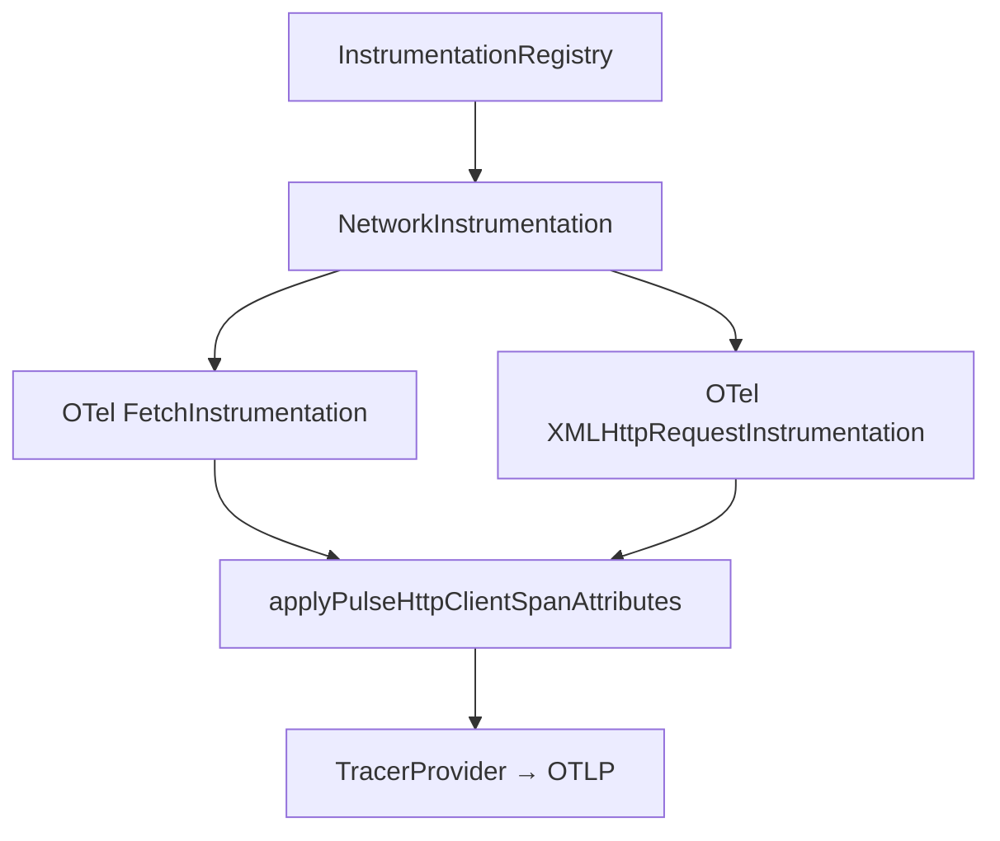
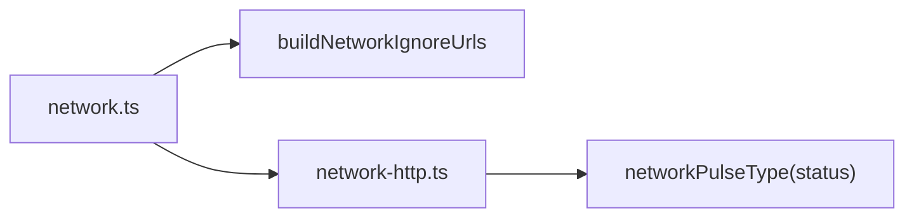
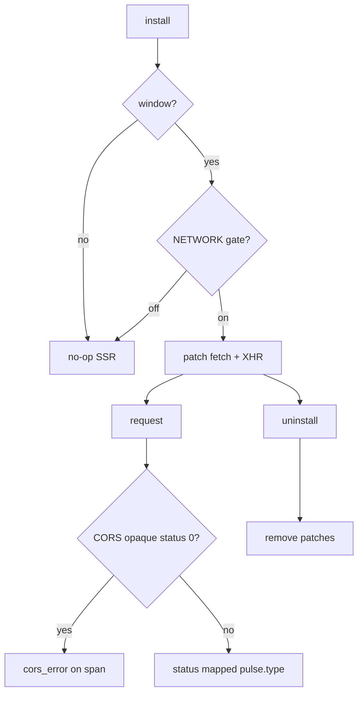

# Network Instrumentation — SPEC.md

Package: `@dreamhorizonorg/pulse-web`  
File: `pulse-web-otel/docs/instrumentations/network/SPEC.md`

---

## 1. Goal

Capture **outbound HTTP/HTTPS** calls from the browser as **OTel client spans** using upstream `FetchInstrumentation` and `XMLHttpRequestInstrumentation`, then stamp **Pulse** semconv + `pulse.type` for ClickHouse parity with Android network reporting.

---

## 2. Assumptions

- **Android parity:** `pulse.type` is derived from HTTP status via `networkPulseType()` → values like `network.200`, `network.0` (unknown), not a free-text `"http"` label — see **AMENDMENT** / `network-http.ts` for the product decision.
- **Web divergences:** CORS can yield **opaque** responses (`status === 0`); **no** raw TCP/UDP; **no** automatic request **body** capture from `fetch` (async body; optional GraphQL path reserved).
- **Browser only:** `install()` no-ops when `window` is undefined.

---

## 3. Requirements

**R1 — Spans, not logs:** Network uses the **tracer** provider and client span processors.

**R2 — Both mechanisms:** Patch **fetch** and **XMLHttpRequest** (OTel instrumentations).

**R3 — URL ignore list:** Build from **collector** `endpointBaseUrl` + optional `instrumentations.network.blockedUrls` so OTLP self-traffic is not double-traced.

**R4 — Attributes:** `applyPulseHttpClientSpanAttributes` sets URL, method, status, duration (from Resource Timing when available), optional header capture, `pulse.type`, error classification (`cors_error`, `4xx`, `5xx`, `network_error`).

**R5 — Optional trace propagation:** `propagateTraceHeaderCorsUrls` passed through when configured (CORS-safe list).

---

## 4. Architectural Design

### Plan B — HTTP client spans (chosen)

**Plan B (chosen):** Reuse OpenTelemetry **Fetch** + **XHR** auto-instrumentations; centralize Pulse attribute mapping in `applyPulseHttpClientSpanAttributes` — one place for semconv and product rules.

**Plan C** (OTel spec-only, no `pulse.type`): rejected — product needs `pulse.type` for dashboards.

**Plan D** (custom fetch patch only): rejected — XHR still required for legacy stacks.

### 4.1 HLD — tracer and ignore list

### 4.2 LD — URL filter + pulse typing

### 4.3 Flows and edge cases

---

## 5. LLD

### 5.1 `pulse.type` and `http.*` semconv (implementation truth)

| Attribute key | Type | Source | Required | Notes |
|---|---|---|---|---|
| `pulse.type` | string | `networkPulseType(status)` | Yes | Pattern `network.<code>`; e.g. `network.200`. **AMENDMENT:** replaces early `http` token — **the `pulse.type` field is distinct from the `http.*` semconv keys** and must be read together with `http.request.method` / `http.response.status_code` for full HTTP context. |
| `http.request.method` | string | request / span | Yes | Stable semconv key (**http.method** naming in older docs refers here) |
| `http.response.status_code` | long | response / XHR | If known | Omitted on some failures |
| `url.full` | string | sanitized URL | Yes | Query may be stripped per privacy |
| `http.duration` | long (ms) | Resource Timing | No | **Maps from** RUM `http.request_duration_ms` **concept** in planning docs |
| `http.request.body.size` | long | content-length | No | When header present |
| `http.response.body.size` | long | content-length | No | **Planning `http.response_size` →** `http.response.body.size` |
| `server.address` / `server.port` | string / long | URL parse | Yes | |
| `session.id` / `screen.name` | string | global processors | Per sdk-core | On span via processor |
| `platform` | string | Resource | Yes | `web` |

### 5.2 URL filtering / exclusion

- `buildNetworkIgnoreUrls(endpointBaseUrl, blockedUrls)` always excludes **Pulse collector** traffic to the current **endpoint base** to avoid feedback loops.
- App-specific **blocked URL** regex list from `instrumentations.network.blockedUrls` extends ignore rules.

### 5.3 Fetch vs XHR

- **Fetch:** `applyCustomAttributesOnSpan` receives `Request` / `RequestInit` + `Response`; method/status from `getOtelHttpRequestMethodFromSpan` + `resolveFetchStatus`; `Response` may lack body for CORS.
- **XHR:** callback runs at `readyState === DONE` only; `responseURL` and `getResponseHeader` for size and optional response headers; method from span or span name.

### 5.4 CORS and status 0

- **Status 0** → `error_type = cors_error`, span error — common for opaque cross-origin responses.

### 5.5 React SPA / Next.js

- **React SPA:** same-origin and CORS fetches from the client bundle are captured.
- **Next.js App Router / Pages Router (client):** `fetch` in client components and `getServerSideProps` **network** (server) is **out of scope** for this browser instrumentation — only code running in the **browser** with `window` is instrumented.
- **SSR:** no `NetworkInstrumentation` on the server in this package.

---

## 6. Test Coverage

### 6.1 Scenario matrix (Given / When / Then)

| ID | Type | Given | When | Then | Tests |
|----|------|-------|------|------|-------|
| N-P1 | positive | gate on | same-origin fetch | span with `pulse.type` pattern | `network-instrumentation.test.ts` |
| N-N1 | negative | URL in ignore list | fetch to collector | no child span / skipped | R3 |
| N-E1 | edge | CORS opaque | status 0 | `cors_error` classification | `network-http.test.ts`, §5.4 |
| N-E2 | edge | SSR | install | no-op | `network-instrumentation.test.ts` |
| N-E3 | edge | uninstall | new request | not traced | **gap** — double-uninstall idempotency covered in `network-instrumentation.test.ts`; no assertion yet that a fetch after uninstall stays untraced |

### 6.2 Playwright E2E (`examples/ecommerce-demo/e2e/`)

Master index: [`../../sdk-core/test-coverage/SPEC.md`](../../sdk-core/test-coverage/SPEC.md) §6.3 — **`@M4 network e2e`**: Network Lab (GET 200, XHR timeout/abort, 404), contract rows P1–P5, OTLP URL exclusion P5, gate G1, error taxonomy E1–E5, local disable E2, consent C1.

### `src/__tests__/network-instrumentation.test.ts` / `network-http.test.ts`

- Ignore URL builder (collector excluded + custom patterns).
- `applyPulseHttpClientSpanAttributes` — method, status, `pulse.type`, duration, CORS error, header capture, GraphQL meta when body provided in tests.
- Uninstall disables both instrumentations.

### Lab scenarios (from `MANUAL-NETWORK-LAB-SCENARIOS.md`)

- CORS / credentialed / API error paths exercised in the ecommerce demo and captured in test matrix (absorbed manual steps into this §6 as **documented** validation paths — file removed in cleanup).

---

## 7. Known Bugs & Gaps

### P0 (data contract — none identified at synthesis)

No new **P0** items filed for the current `network.ts` + `network-http.ts` contract.

### Other gaps

- Optional **GraphQL** body path not wired from default Fetch (async) — noted in `network-http.ts` comments.

---

## 8. Redundancy & Cleanup Notes

**Canonical contract:** this SPEC plus `src/instrumentations/network.ts` and `src/utils/network-http.ts`.

Historical planning and superseded one-pagers remain under the repo for traceability (not deleted):

| Path | Role |
|---|---|
| `pulse-web-otel/web-sdk-plan/v3-network/` | Archived network design / amendments |
| `pulse-web-otel/web-sdk-plan/v1/02-instrumentations/network.md` | Superseded v1 one-pager (still in repo for history) |
| `pulse-web-otel/examples/ecommerce-demo/MANUAL-NETWORK-LAB-SCENARIOS.md` | Removed manual lab file; scenarios absorbed into §6 |

---

## 9. Open Questions

1. Should `pulse.type` eventually unify to a single `http` token plus attributes (breaking change)?
2. Should fetch **request** body size be estimated when `Request` has readable stream?
