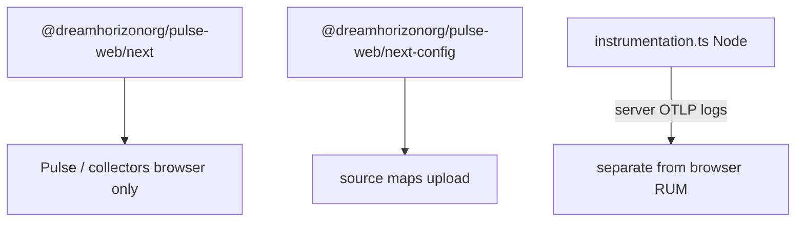
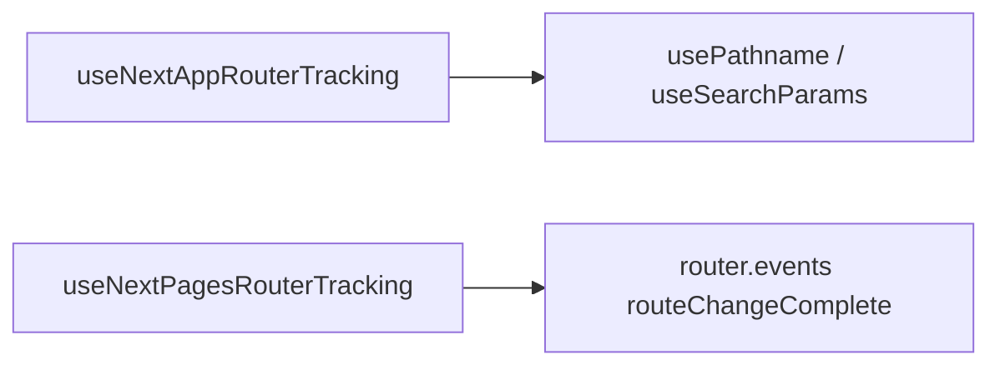
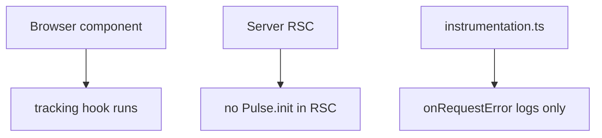

# Next.js Integration — SPEC.md

Package: `@dreamhorizonorg/pulse-web`  
File: `pulse-web-otel/docs/instrumentations/nextjs-integration/SPEC.md`

---

## 1. Goal

Document **Next.js-specific** integration: App Router tracking (`useNextAppRouterTracking`, `PulseRouterEvents`), Pages Router tracking (`useNextPagesRouterTracking`), optional **`instrumentation.ts`** server error hook, and **build-time** `withPulseConfig` / source map upload (`next-config` entry).

---

## 2. Assumptions

- **Web-only** — same as React adapter; Next extends behaviour for SSR/RSC boundaries.
- **Distinction:** **App Router** vs **Pages Router** — different hooks; never mix in one route tree.

---

## 3. Requirements

**R1 — Client screen names:** App Router uses `usePathname` + `useSearchParams`; Pages Router uses `router.events.on('routeChangeComplete')`. SPA **`screen_load` / `screen_session`** in the core SDK require **History API** mutations (`pushState` / `popstate`); align with default Next client navigation — hash-only changes without History do not emit those spans (see **screen-signals** SPEC §7).

**R2 — Build:** `withPulseConfig` enables browser source maps + uploads `.map` files post-webpack emit.

**R3 — Server errors:** `createPulseInstrumentationHandler` (from `next` entry) posts OTLP-compatible logs for `onRequestError` when wired in root `instrumentation.ts`.

---

## 4. Architectural Design

```
Runtime (browser)
  @dreamhorizonorg/pulse-web/next
    ├─ useNextAppRouterTracking / PulseRouterEvents (client components)
    └─ useNextPagesRouterTracking

Build (node)
  @dreamhorizonorg/pulse-web/next-config
    └─ withPulseConfig → webpack emit hook → uploadSourceMaps()

Server (node/edge)
  instrumentation.ts → createPulseInstrumentationHandler
```

### 4.1 HLD — Next runtime vs build vs server (Mermaid)



### 4.2 LD — hooks per router (Mermaid)



### 4.3 Flows — client-only RUM (Mermaid)



---

## 5. LLD

### 5.1 App Router — `useNextAppRouterTracking`

- Uses **`usePathname`** + **`useSearchParams`** from `next/navigation`.
- Requires **Client Component** + **`Suspense`** boundary when search params included (Next requirement).
- Skips when `pathname === null` during static prerender phases.

### 5.2 Pages Router — `useNextPagesRouterTracking`

- Subscribes to **`routeChangeComplete`** via `next/router` `useRouter()`.
- Initial load: **`routeChangeComplete` does not fire** — first screen name still comes from URL/session pipeline; `skipInitial` semantics differ from App Router (documented in source).

### 5.3 `withPulseConfig` (`next-config`)

- Sets **`productionBrowserSourceMaps: true`**.
- Webpack **`emit`** hook collects `*.js.map` assets → **`uploadSourceMaps`** → optional delete from disk (`deleteAfterUpload`).

### 5.4 `upload-source-maps.ts`

- **When:** Node **build time** after client bundle emit.
- **Where:** `POST {serverUrl}/v1/symbolicate/file/upload` with `X-API-KEY` + multipart form.

### 5.5 `instrumentation.ts` hook

- **Runs in Node** for Next 15+ request error reporting — **not** a substitute for browser `Pulse.init`.
- Provide **`apiKey`**, **`collectorEndpoint`**, **`serviceName`**.

### 5.6 SSR / RSC / edge

- Browser hooks (**`useNext*Tracking`**) execute **only** in client components.
- **Prefetch:** `<Link prefetch>` does not itself change pathname until navigation — **`screen_load` timing** follows browser navigation + **`NavigationInstrumentation`** (see **screen-signals** SPEC).

### 5.7 Streaming / partial rendering

- Long-lived RSC streams may delay first paint — **Web Vitals** (`web-vitals` SPEC) reflect browser metrics independently of React flush.

---

## 6. Test Coverage

### 6.1 Scenario matrix (Given / When / Then)

| ID | Type | Given | When | Then | Tests |
|----|------|-------|------|------|-------|
| NX-P1 | positive | App Router client | pathname change | tracking hook updates screen name | `use-next-app-router-tracking.test.tsx` |
| NX-P2 | positive | build with withPulseConfig | webpack emit | maps uploaded | `with-pulse-config.test.ts` |
| NX-E1 | edge | `pathname === null` | prerender | hook skips | **gap** — behaviour documented in source (`use-next-app-router-tracking.ts`); add Vitest when prerender path is automated |
| NX-E2 | edge | Pages Router | first load | `routeChangeComplete` gap documented | `use-next-pages-router-tracking.test.tsx` |

### Vitest files

- `src/integrations/next/use-next-app-router-tracking.test.tsx`
- `src/integrations/next/use-next-pages-router-tracking.test.tsx`
- `src/integrations/next-config/with-pulse-config.test.ts`

### 6.2 Playwright E2E (`examples/nextjs-demo/e2e/`)

**Mock OTLP** (`nextjs-demo.spec.ts`): session.start on first load; `platform=web` resource; stable `session.id` across App Router navigations; `screen.name` on logs after `/` → `/products` → `/cart` hops; `PulseErrorBoundary` → `device.crash`; `reportException` → `non_fatal`; `reportDeviceCrash` → `device.crash`; `session.id` on error logs.

**ClickHouse** (`nextjs-demo.ch.spec.ts`): same flows asserted in `otel_logs` / crash tables when CH env is configured.

**Parity vs React ecommerce harness:** Session lifecycle depth (BFCache, batching, consent matrix, metering headers, installation persistence), **navigation spans** (`screen_load` / `screen_session`), web vitals, network, interactions, and clicks are **not** replayed in the Next demo — see [`../../sdk-core/test-coverage/SPEC.md`](../../sdk-core/test-coverage/SPEC.md) §6.4–§6.5 for the explicit gap table and recommended follow-ups.

---

## 7. Known Bugs & Gaps

### P0:

None filed at synthesis.

### P2: Hash-only navigation — no SPA screen signals

Next.js App Router and Pages Router both use History API by default — this is a non-issue for standard setups. However, if a Next.js app layer introduces hash-only navigation (custom router or legacy `<a href="#section">` SPA patterns) without History API calls, `NavigationInstrumentation` will not see those transitions.

**Fix:** Ensure client navigation flows through `router.push()` / `<Link>` (App Router) or `router.push()` / `<Link>` (Pages Router) — these drive History API mutations. See **screen-signals SPEC §7** for full detail.

### Other gaps

- Verify **`create-next-app` ESM resolution** for `@dreamhorizonorg/pulse-web/next` in clean installs (sdk-core critique).

---

## 8. Redundancy & Cleanup Notes

Deleted after triple-eval:

| Path |
|---|
| `pulse-web-otel/web-sdk-plan/nextjs/NEXTJS-INTEGRATION-PLAN.md` |

---

## 9. Open Questions

1. Should Pages Router hook merge query/hash parity with App Router options?
