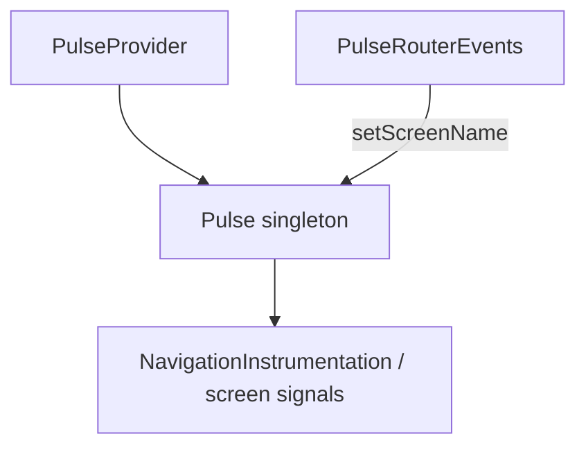
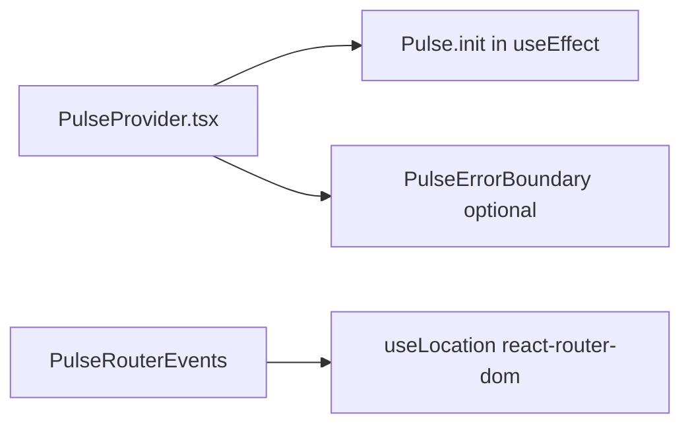
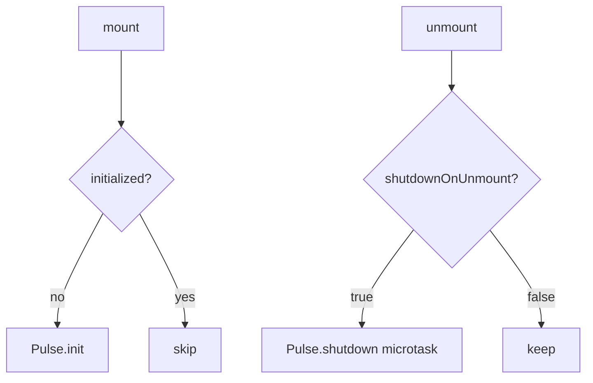

# React Integration — SPEC.md

Package: `@dreamhorizonorg/pulse-web` (see `package.json` `name`)  
File: `pulse-web-otel/docs/instrumentations/react-integration/SPEC.md`

---

## 1. Goal

Document the **React adapter** for Pulse Web: `PulseProvider` (init + context), `PulseErrorBoundary` (re-exports with provider), `PulseRouterEvents` + `useRouterTracking` (React Router v6 screen names), and the optional `@dreamhorizonorg/pulse-web/react/router` subpath for tree-shaking.

---

## 2. Assumptions

- **Web-only** — there is no Android/RN `PulseProvider`; native apps use platform SDKs.
- **React 18** — `useEffect` + StrictMode double-invoke handled via provider mount counter + microtask shutdown guard.
- **Peer deps:** `react-router-dom >= 6` only when importing `/react/router`.

---

## 3. Requirements

**R1 — Init:** `PulseProvider` calls `Pulse.init(config)` once when `Pulse.isInitialized()` is false (browser only).

**R2 — Context:** `usePulse()` returns singleton `Pulse` from context.

**R3 — Error boundary:** Optional `errorBoundaryFallback` wraps children with `PulseErrorBoundary`.

**R4 — Router tracking:** `useRouterTracking` / `PulseRouterEvents` call `Pulse.setScreenName` on pathname changes — **does not** itself emit `screen_load` / `screen_session` (see **`screen-signals`** SPEC — `NavigationInstrumentation` emits those as OTLP **spans**). Use **`BrowserRouter`** (History API); hash-only routing does not drive SPA screen signals (see screen-signals SPEC §7).

---

## 4. Architectural Design

```text
<PulseProvider config={...}>
  <PulseErrorBoundary>
    {children}
  </PulseErrorBoundary>
</PulseProvider>

<BrowserRouter>
  <PulseRouterEvents />   <!-- or useRouterTracking() -->
  <Routes>...</Routes>
</BrowserRouter>
```

### 4.1 HLD — React adapter vs core SDK



### 4.2 LD — provider props and router



### 4.3 Flows — StrictMode and shutdown



---

## 5. LLD

### 5.1 Package entrypoints

| Import path | Module | Purpose |
|---|---|---|
| `@dreamhorizonorg/pulse-web/react` | `dist/react.*` | `PulseProvider`, `usePulse`, `PulseErrorBoundary` |
| `@dreamhorizonorg/pulse-web/react/router` | `dist/react-router.*` | `useRouterTracking`, `PulseRouterEvents` |

### 5.2 `PulseProvider`

| Prop | Role |
|---|---|
| `config` | `PulseWebConfig` passed to `Pulse.init` |
| `shutdownOnUnmount` | default `false`; when `true`, microtask-guarded `Pulse.shutdown()` after last unmount |
| `errorBoundaryFallback` | passed to `PulseErrorBoundary` |

### 5.3 `useRouterTracking`

- Depends on **`useLocation`** from `react-router-dom`.
- Updates **`screen.name`** via `Pulse.setScreenName` when pathname (optional search) changes.
- Options: `format`, `includeSearch`, `skipInitial`.

### 5.4 `PulseErrorBoundary`

- Delegates to **`Pulse.reportDeviceCrash`** — see **`errors`** SPEC §5.2.

### 5.5 React 17 vs 18 concurrent mode

- Provider uses standard effect lifecycle; concurrent rendering does not change SDK singleton semantics.

### 5.6 Next.js App Router / Pages Router

- **Not used here** — see **`nextjs-integration`** SPEC for Next-specific hooks.

### 5.7 React SPA behaviour

- Full **`NavigationInstrumentation`** runs after **`Pulse.init`** regardless of React version — router adapter only keeps **`screen.name`** aligned.

---

## 6. Test Coverage

### 6.1 Scenario matrix (Given / When / Then)

| ID | Type | Given | When | Then | Tests |
|----|------|-------|------|------|-------|
| RE-P1 | positive | provider mounted | first render | single `Pulse.init` | `pulse-provider.test.tsx` |
| RE-N1 | negative | no BrowserRouter | `PulseRouterEvents` | runtime guard / doc gap | `use-router-tracking.test.tsx` (React router); Next-only: `pulse-router-events.test.tsx` |
| RE-E1 | edge | `shutdownOnUnmount` true | unmount | shutdown microtask | provider tests |
| RE-E2 | edge | pathname change | navigation | `setScreenName` called | router tests |

### 6.2 Playwright E2E (`examples/ecommerce-demo/e2e/`)

**`@M15`** PulseProvider / PulseErrorBoundary / `useRouterTracking` / StrictMode / `skipInitial` / `react.component_stack` — full titles in [`../../sdk-core/test-coverage/SPEC.md`](../../sdk-core/test-coverage/SPEC.md) §6.3.

### Vitest

- `src/__tests__/use-router-tracking.test.tsx` — pathname transitions → `setScreenName`.

---

## 7. Known Bugs & Gaps

### P0

None identified for React adapter layer at synthesis.

### P2: Hash-only routing — no SPA screen signals

`NavigationInstrumentation` patches `history.pushState` / `replaceState` and listens to `popstate`. Routers that only mutate `location.hash` (e.g. `HashRouter` from react-router-dom) without touching the History API emit **no** SPA `screen_load` / `screen_session` signals. The SDK behaves correctly given what it receives; this is user misconfiguration.

**Fix:** Use `<BrowserRouter>` (or `createBrowserRouter`) — the default for most React Router v6 apps. See **screen-signals SPEC §7** for full detail.

### Other gaps

- **SSR hydration:** Provider effect skipped on server — no `window`; align with Next SPEC for hybrid apps.

---

## 8. Redundancy & Cleanup Notes

No legacy planning folder — synthesised from `src/integrations/react/*` only.

---

## 9. Open Questions

1. Should `shutdownOnUnmount` default to `true` in test harness presets only?
