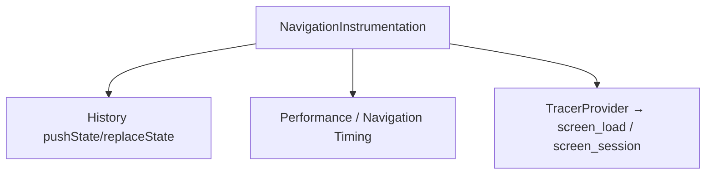
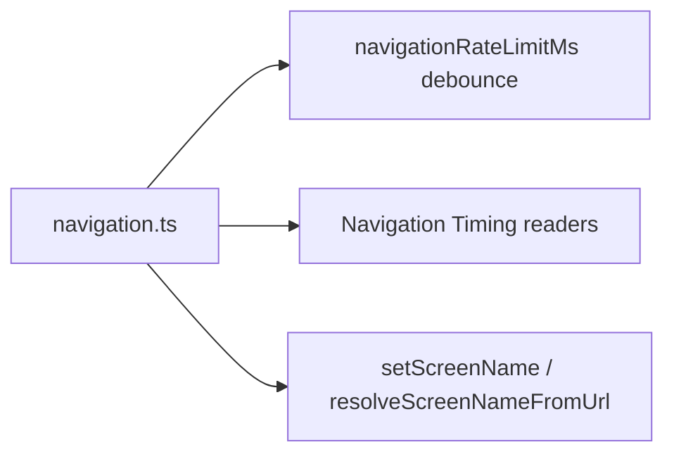
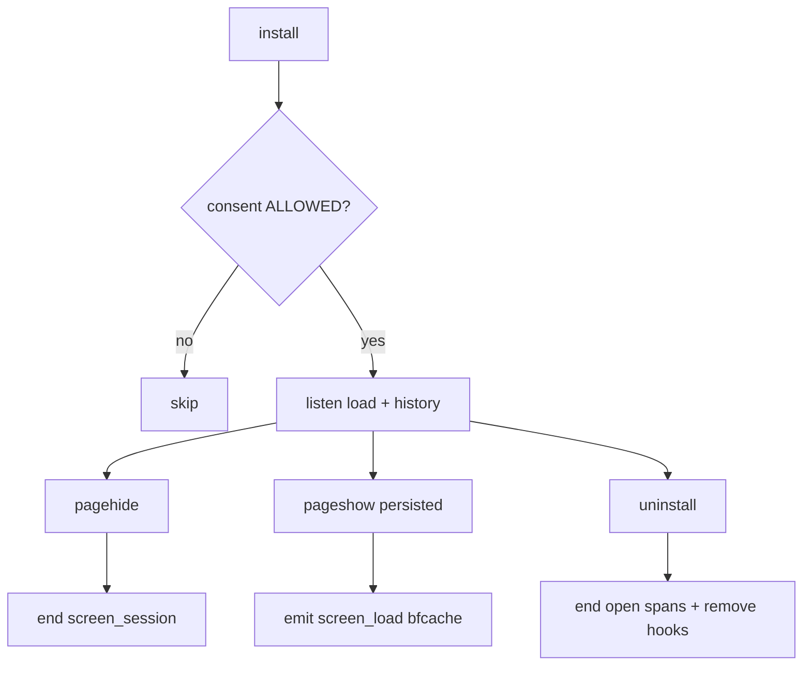

# Screen Signals (Navigation) — SPEC.md

Package: `@dreamhorizonorg/pulse-web`  
File: `pulse-web-otel/docs/instrumentations/screen-signals/SPEC.md`

---

## 1. Goal

Track **initial page load** and **SPA route transitions** using OTLP **client spans** (`sdk.tracer.startSpan` / `span.end()`), exported to **`otel_traces`**, with `pulse.type` values **`screen_load`** and **`screen_session`**, plus Navigation Timing-derived metrics on loads. Align naming with Android/RN screen analytics while documenting **web-specific** decisions (no separate **`screen_interactive`** signal — **TTI** lives on the **`screen_load`** span attributes).

**Migration note:** Earlier revisions emitted these signals via `LoggerProvider` log records (`otel_logs`). Web now matches Android by emitting **spans only** for `screen_load` / `screen_session` so Pulse Screens analytics (`dataType: TRACES`) can query them without UI/backend UNION changes.

---

## 2. Assumptions

- **`screen_load` / `screen_session`:** Shared conceptual model with Android — route entered vs session scoped to a screen.
- **`screen_interactive` (label):** **React Native** may emit a distinct **`screen_interactive`** span tied to `markContentReady()`. **Web does not** emit a separate `pulse.type = screen_interactive` span — **web-only** clarification (`tti` stamped on **`screen_load`** when Navigation Timing allows).
- **Consent:** Instrumentation skips install when `dataCollectionState === DENIED`.
- **Export shape:** `NavigationInstrumentation` uses **`sdk.tracer`** with **`ROOT_CONTEXT`** and **`SpanKind.INTERNAL`** so screen spans are not parented under unrelated active context. Before **`span.end()`**, spans use **`SpanStatusCode.OK`** (not unset).

---

## 3. Requirements

**R1 — Initial load:** After `load` (or immediately if document already loaded), emit a **`screen_load`** span with Navigation Timing fields where available (`page.load_time`, `ttfb`, `tti`, etc.). Span **`name`** is the literal **`screen_load`** (not the route string).

**R2 — SPA transitions:** Patch `history.pushState` / `replaceState` + listen to `popstate`; on meaningful route change (rate-limited), end the **`screen_session`** span for the previous screen, emit **`screen_load`** for the new screen with **`start.type` = `spa`**, then start a new **`screen_session`** span for dwell time.

**R2a — Rate limit / coalescing:** bursts of History updates **under 100 ms** apart **do not** apply the intermediate URL: the first update in a quiet window runs immediately; subsequent updates in that window **reset a trailing timer** so **one** transition runs after **100 ms** of quiet time, using the **final** `window.location` (avoids losing fast redirects / chained `replaceState`). Changing the threshold: edit `navigationRateLimitMs` in `navigation.ts` and this section.

**R3 — Screen naming:** Cold load uses `getCurrentScreenName()` (manual override + URL heuristics). **SPA transitions** stamp `screen.name` using **`resolveScreenNameFromUrl(config)`** — same pathname/heuristic/`routePatterns` rules as the processor but **without** a stale manual override, because History runs synchronously while framework integrations often call `setScreenName` in `useEffect`. The instrumentation then calls **`setScreenName`** with that value so clicks/errors align before the next render.

**R4 — Unload and BFCache restore:** `pagehide` ends the active **`screen_session`** span for time-on-screen. **`uninstall`** ends any open **`screen_session`** span. **`pageshow`** with **`event.persisted === true`** (back/forward cache restore) emits a synthetic **`screen_load`** with **`start.type` = `bfcache`** and starts a new **`screen_session`** for dwell from the restore instant. If an open dwell span still exists (some browsers, e.g. Safari on iOS, may omit **`pagehide`** before BFCache), the implementation ends it before emitting restore spans.

---

## 4. Architectural Design

### Navigation spans via History API + Performance

Patch History API for SPA parity with Android activity transitions; reuse Navigation Timing for cold loads. No dual emission: **do not** also emit log records for the same navigation events.

### 4.1 HLD — navigation instrumentation boundary



### 4.2 LD — `navigation.ts` modules



### 4.3 Flows — consent, BFCache, uninstall



---

## 5. LLD

### 5.1 Signal matrix

| Signal | `pulse.type` | OTel span `name` | Export |
|---|---|---|---|
| Route entered / cold load | `screen_load` | **`screen_load`** | OTLP span → **`otel_traces`** |
| Screen exit / time-on-screen | `screen_session` | **`screen_session`** | OTLP span → **`otel_traces`** |

### 5.2 Android / Web parity comparison

#### `screen_load`

| Attribute | Android | Web (implemented span) | Notes |
|---|---|---|---|
| **OTLP shape** | span → `otel_traces` | span → `otel_traces` | Aligned |
| **Span `name`** | — | **`screen_load`** (literal) | Not the route string |
| **`SpanStatus`** | OK | **`OK`** before `end()` | Same as interaction spans |
| `pulse.type` | `screen_load` | `screen_load` | Identical |
| `screen.name` | span attr | span attr | Identical |
| `last.screen.name` | span attr | span attr (SPA transition from prior screen) | Funnel / parity |
| `session.id` | span attr | span attr | Identical |
| `start.type` | hot/warm/cold | cold/reload/back_forward/**spa**/**bfcache** | Web adds `spa` (History) and `bfcache` (BFCache restore via `pageshow`) |
| Cold duration | span duration | **`performance.timeOrigin` → `timeOrigin + loadEventEnd`** (Navigation Timing) | Matches load interval |
| SPA duration | — | **~0** (`startTime` ≈ `endTime`, marker span) | Entry marker, not Nav Timing |
| `platform` | `android` (resource) | `web` (resource) | Same key |
| `page.load_time`, `tti`, `ttfb`, … | — | span attrs where available | Web-only |
| `navigation.type` | — | span attr (`navigate` / `reload` / `back_forward`) | Web-only |

#### `screen_session`

| Attribute | Android | Web (implemented span) | Notes |
|---|---|---|---|
| **OTLP shape** | span → `otel_traces` | span → `otel_traces` | Aligned |
| **Span `name`** | — | **`screen_session`** (literal) | Not the route string |
| **`SpanStatus`** | OK | **`OK`** before `end()` | |
| `pulse.type` | `screen_session` | `screen_session` at **`startSpan`** (identity) | Web sets identity attrs when the dwell span **starts**, not only at `end()` |
| `screen.name` | span attr | span attr (same screen for dwell; exit snapshot attrs at **`end`**) | Identical semantics; web splits identity vs exit attrs across two `setAttributes` calls |
| `last.screen.name` | span attr | span attr (screen before the exited screen) | Parity |
| `session.id` | span attr | span attr at **`startSpan`** | Same as `pulse.type` / `screen.name` |
| Duration | `otel_traces.Duration` | dwell span **`startTime`→`endTime`** | Matches time on screen |
| `session.duration_ms` / `session.duration` | — | set on span at **`end()`** only (with exit snapshot attrs) | Dashboard convenience |
| `url.path` / `page.title` | — | snapshot for **exited** screen at **`end()`** | Avoid post-navigation URL bleed |

### 5.3 `screen_interactive` naming (**web-only** note)

- **No standalone web span** with `pulse.type = screen_interactive` — **`tti`** is attached to **`screen_load`** on initial load when Navigation Timing allows.
- **React Native** retains different semantics for the **same enum string** — do not assume cross-SDK identity of behaviour.

### 5.4 React SPA

- History hook captures React Router / client routers using History API.

### 5.5 Next.js App Router

- Soft navigations use client-side History updates → **`screen_load`**/**`screen_session`** when pathname-backed screen name changes.

### 5.6 Next.js Pages Router

- `routeChangeComplete` flows through client History events — same instrumentation once screen name updates.

### 5.7 Initial vs SPA

- **Initial:** Navigation Timing on **`screen_load`** span duration and attrs.
- **SPA:** lighter **`screen_load`** (`start.type: spa`), marker span (**`startTime` ≈ `endTime`**, ~0 duration).

### 5.8 BFCache restore (`pageshow`)

- **`pagehide`** ends the prior dwell **`screen_session`** (when the browser fires it).
- **`pageshow`** with **`persisted === true`:** emit marker **`screen_load`** (`start.type: bfcache`, **`startTime` = `endTime`** = restore instant, same ~0-duration pattern as SPA), then start a new **`screen_session`** with identity attrs at **`startSpan`** time. Call **`PulseGlobalAttributesProcessor.setScreenName`** with the restored screen name (same as SPA path) so post-restore signals are not stale.
- **`enteredFromScreenName`** is **not** reset on restore so **`last.screen.name`** on the restore **`screen_load`** remains consistent with the funnel prior to BFCache.
- If a dwell **`screen_session`** is still open when restore runs (missing **`pagehide`**), end it first, then emit restore spans.

---

## 6. Test Coverage

### 6.1 Scenario matrix (Given / When / Then)

| ID | Type | Given | When | Then | Tests |
|----|------|-------|------|------|-------|
| SS-P1 | positive | consent ALLOWED | cold load | `screen_load` span | `navigation-instrumentation.test.ts` |
| SS-P2 | positive | SPA History change | route after debounce | `screen_load` + `screen_session` cycle | same |
| SS-N1 | negative | consent DENIED | install | no navigation hooks | same |
| SS-E1 | edge | BFCache | pageshow persisted | `start.type=bfcache` | same |
| SS-E2 | edge | uninstall | open dwell span | ended + hooks removed | same |
| SS-E3 | edge | rate limit | 2 pushState <100ms | single coalesced transition | R2a |

### `src/__tests__/navigation-instrumentation.test.ts`

- Hoisted **`mockTracer` / mock span** shape (`startSpan`, `setAttributes`, `setStatus`, `end`).
- **`screen_load`** / **`screen_session`** span names and `pulse.type` attrs.
- **`screen_interactive`** **not** present on web spans (explicit scan).
- Consent denied → instrumentation not installed.
- **BFCache:** `pageshow` with **`persisted: true`** (jsdom: `Object.assign(new Event("pageshow"), { persisted: true })`) → **`screen_load`** with **`start.type === "bfcache"`**; **`persisted: false`** does not trigger restore; **`pagehide`** then **`pageshow(persisted)`** synchronous chain.
- **In-flight `screen_session`:** first **`setAttributes`** after **`startSpan`** carries **`pulse.type`**, **`screen.name`**, **`session.id`**; final call before **`end()`** adds duration + exit **`url.path`** / **`page.title`** / **`last.screen.name`** only.

### `src/__tests__/screen-name-resolution.test.ts`

- Screen name resolution paths for global attrs processor (referenced from navigation).

### `examples/ecommerce-demo/e2e/screen-navigation.spec.ts`

Playwright OTLP capture: **`waitForSpan("screen_load" | "screen_session")`**, **`findAllSpans`**, gate-off asserts zero **`screen_load`** spans.

### 6.2 Playwright E2E scenario titles (`@ScreenNav`)

Full index: [`../../sdk-core/test-coverage/SPEC.md`](../../sdk-core/test-coverage/SPEC.md) §6.3 — **initial load** (`screen_load`, `start.type`, optional TTI); **SPA** (`screen_session`, post-nav `screen_load` + `spa` start.type, repeated navigations, product detail); **feature gate** on/off; **screen.name** / **url.path** / **session** attrs / **pulse.type** / numeric **session.duration**.

**Next.js demo:** App Router navigations assert **`screen.name` on log records** (not span-level `screen_load`/`screen_session` waits) — parity gap vs this SPEC’s primary ecommerce harness; see [`../nextjs-integration/SPEC.md`](../nextjs-integration/SPEC.md) §6.2.

---

## 7. Known Bugs & Gaps

### Resolved: logs vs traces for screen signals

Previously `navigation.ts` used **`logger.emit()`** → **`otel_logs`**. Web screen rows were invisible to Screens analytics (`otel_traces`-only queries). **Resolved:** spans via **`sdk.tracer`** → **`otel_traces`**.

### Resolved: Hash-only routers (integration guide gap)

**History-based routing required.** Instrumentation patches `history.pushState` / `replaceState` and listens to `popstate`. Routers that only mutate `location.hash` without touching the History API emit **no** SPA `screen_load` / `screen_session` signals — the SDK behaves correctly given what it receives; this is user misconfiguration, not a data contract break.

**Resolved:** Note now lives in both framework guides:

- `docs/instrumentations/react-integration/SPEC.md` §7 (P2: HashRouter gap)
- `docs/instrumentations/nextjs-integration/SPEC.md` §7 (P2: hash-only navigation gap)

### Resolved: BFCache restore (`pageshow` + `persisted`)

**Was:** No telemetry on BFCache restore after `pagehide` ended the dwell span. **Now:** `pageshow` with **`event.persisted === true`** emits **`screen_load`** (`start.type = bfcache`) and a new **`screen_session`**; see **§3 R4** and **§5.7**.

### P3: 100ms trailing window — clicks/errors may carry stale `screen.name`

**Not a dropped navigation.** `onRouteChange` uses a trailing debounce: when two `pushState` calls arrive < 100ms apart, the second cancels and resets the timer; when it fires it reads `window.location` (the final URL) and calls `applyRouteChange` — no navigation is lost.

The actual risk: during the trailing window `currentScreenName` still holds the first URL’s name. Any click or error fired in that window is tagged with the wrong `screen.name`. For auth redirects (common trigger) this is often a non-issue — little user interaction happens during a sub-100ms redirect chain. A human double-tap could mis-tag one or two events.

**Status:** by-design / known tradeoff, documented in R2a. Revisit if analytics show unexplained `screen.name` mismatches on short-lived screens (< 100ms dwell).

### Resolved: In-flight `screen_session` identity attrs

**Was:** Identity attrs only at **`end()`**, so started spans looked empty to any in-flight reader. **Now:** `pulse.type`, `screen.name`, and `session.id` are set immediately after **`startSpan`**; **`endActiveSessionSpan`** adds **`session.duration_ms`**, **`session.duration`**, and exit snapshot attrs only. See **§5.2** `screen_session` table and **§6** tests.

---

## 8. Verification

### Unit

```bash
cd pulse-web-otel && yarn test:run src/__tests__/navigation-instrumentation.test.ts
```

### E2E (ecommerce-demo)

```bash
cd pulse-web-otel/examples/ecommerce-demo && yarn e2e --grep "@ScreenNav" --project=chromium
```

**ClickHouse (`otel_traces`, not `otel_logs`):**

```sql
SELECT
  SpanName,
  SpanAttributes['pulse.type'] AS pulse_type,
  SpanAttributes['screen.name'] AS screen_name,
  Duration / 1e6 AS duration_ms
FROM otel.otel_traces
WHERE ProjectId = 'your-project'
  AND PulseType IN ('screen_load', 'screen_session')
  AND Timestamp >= now() - INTERVAL 1 HOUR
LIMIT 50;
```

---

## 9. Redundancy & Cleanup Notes

**Canonical contract:** this SPEC plus `src/instrumentations/navigation.ts`.

`web-sdk-plan/v4-screen-signals/` is **retained** as the design archive (`FINAL-PLAN.md`, ADR, touchpoints). The **Amendment** at the top of `FINAL-PLAN.md` overrides older sections that still describe three separate web signals including `screen_interactive` — web implementation follows the amendment (single `screen_load` with `tti`, no separate `screen_interactive` web signal).

| Path | Role |
|---|---|
| `pulse-web-otel/web-sdk-plan/v4-screen-signals/` | Locked plan + ADR + amendment (historical + authoritative amendment) |
| `pulse-web-otel/web-sdk-plan/v1/02-instrumentations/navigation.md` | Superseded v1 one-pager (still in repo for history) |

---

## 10. Open Questions

1. Should SPA `screen_load` include synthetic timing estimates? (Probably no — emit with available attrs only.)
2. **Resolved:** Logs vs spans — **spans** implemented for web/Android parity and Screens analytics.
