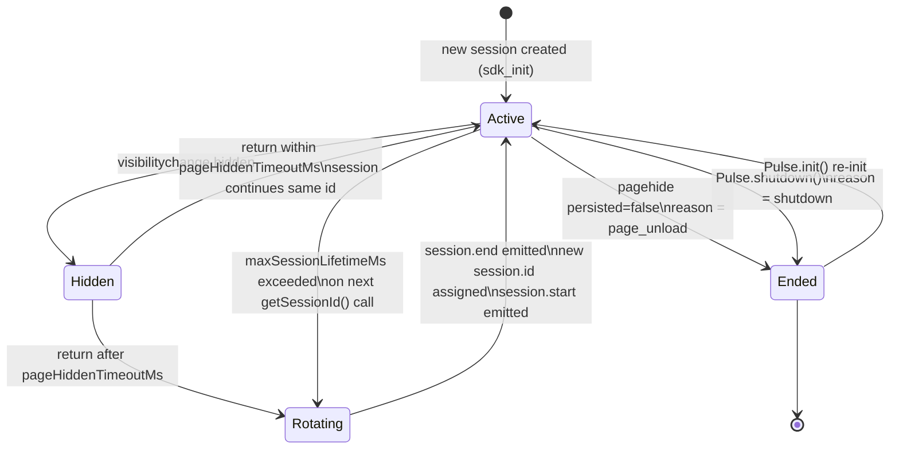
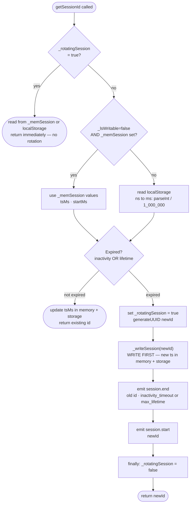
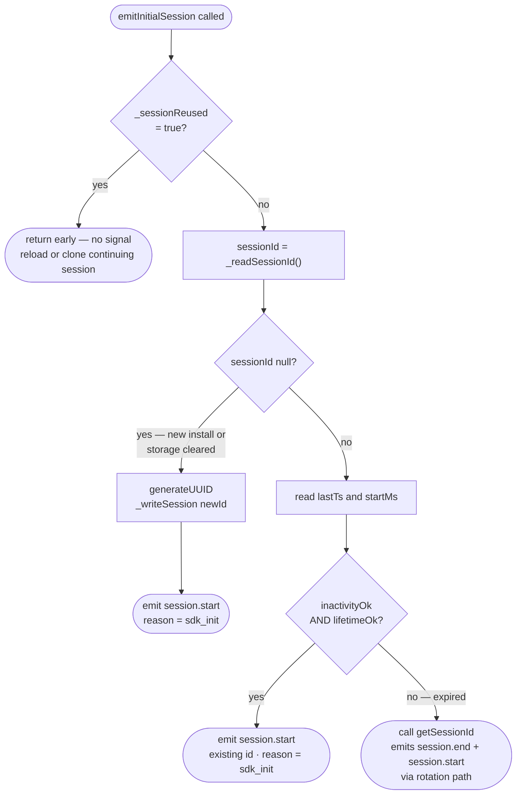
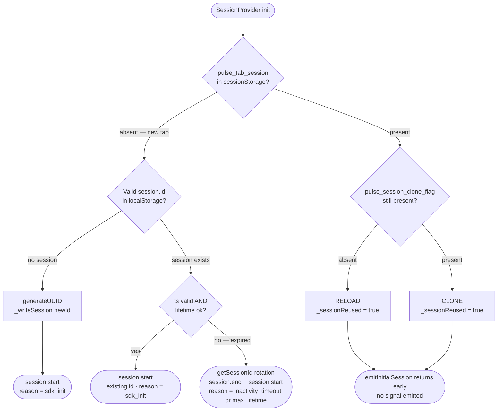

# Session Lifecycle — SPEC.md

Package: `@dreamhorizon/pulse-web`
Source: `pulse-web-otel/src/session.ts`

See also: [SDK Core SPEC](./SPEC.md) for the shared attribute contract and init flow.

---

## HLD — High Level Design

### Session within the SDK

```
┌──────────────────────────────────────────────────────────┐
│                      Pulse SDK                           │
│                                                          │
│  ┌────────────────────────────────────────────────────┐  │
│  │               SessionProvider                      │  │
│  │                                                    │  │
│  │  localStorage       sessionStorage    in-memory    │  │
│  │  ─────────────      ─────────────     ──────────   │  │
│  │  session_id         tab_session       _memSession  │  │
│  │  session_ts         clone_flag        _hiddenAtMs  │  │
│  │  session_start      hidden_at         _rotating    │  │
│  │  installation_id                      Session      │  │
│  │  user_id                                           │  │
│  └────────────────────┬───────────────────────────────┘  │
│                       │ getSessionId()                   │
│                       ▼                                  │
│  ┌────────────────────────────────────────────────────┐  │
│  │         GlobalAttributesProcessor                  │  │
│  │         stamps session.id on every signal          │  │
│  └────────────────────────────────────────────────────┘  │
│                       │                                  │
│  ┌────────────────────▼───────────────────────────────┐  │
│  │         SessionInstrumentation                     │  │
│  │         listens to onSessionChange()               │  │
│  │         emits session.start / session.end logs     │  │
│  └────────────────────────────────────────────────────┘  │
└──────────────────────────────────────────────────────────┘
```

### Session state machine



### Storage tier diagram

```
┌──────────────────────────────────────────────────────────────┐
│  localStorage  (shared across all tabs, survives restart)    │
│                                                              │
│  pulse_installation_id ──── stable UUID, never rotates       │
│  pulse_session_id      ──── current session UUID             │
│  pulse_session_ts      ──── last-activity timestamp (ns)     │
│  pulse_session_start   ──── session creation timestamp (ms)  │
│  pulse_user_id         ──── persisted user identity          │
│  pulse_user_properties ──── JSON: custom user props          │
└──────────────────────────────────────────────────────────────┘

┌──────────────────────────────────────────────────────────────┐
│  sessionStorage  (per-tab; survives reload, NOT new tab)     │
│                                                              │
│  pulse_tab_session        ── present = same tab reloaded     │
│  pulse_session_clone_flag ── present at init = cloned tab    │
│                              written on init, deleted on     │
│                              beforeunload                    │
│  pulse_session_hidden_at  ── hide timestamp for timeout      │
│                              check after Capacitor reload    │
└──────────────────────────────────────────────────────────────┘

┌──────────────────────────────────────────────────────────────┐
│  In-memory  (per SessionProvider instance, lost on reload)   │
│                                                              │
│  _memSession   ── { id, tsMs, startMs } mirrors localStorage │
│                   avoids localStorage read on every signal   │
│  _hiddenAtMs   ── when the tab was hidden (Date.now())       │
│  _rotatingSession ── re-entrancy guard during rotation       │
└──────────────────────────────────────────────────────────────┘
```

---

## LLD — Low Level Design

### `SessionProvider` — key fields and methods

```ts
class SessionProvider {
  // Timeouts (configurable via PulseWebConfig)
  inactivityTimeoutMs:   number  // default 30 min
  maxSessionLifetimeMs:  number  // default 4 hours
  pageHiddenTimeoutMs:   number  // default 15 min

  // In-memory cache — mirrors localStorage to avoid disk reads
  _memSession: { id: string; tsMs: number; startMs: number } | null

  // Re-entrancy guard — set true during rotation to prevent duplicate events
  _rotatingSession: boolean

  // Tab hide timestamp — written to sessionStorage for Capacitor resilience
  _hiddenAtMs: number | null

  // Key methods
  getSessionId(): string          // hot path — called on every signal emission
  emitInitialSession(): void      // called once by SessionInstrumentation on install
  onSessionChange(cb): void       // subscribe to start/end events
  shutdown(): void                // emit session.end(shutdown), clear storage
}
```

### `getSessionId()` — full decision tree



```
getSessionId()
  │
  ├─ _rotatingSession === true?
  │     └─ YES → read _readSessionId() from _memSession or localStorage, return it
  │
  ├─ Read _memSession (or localStorage if _memSession is null)
  │     lastTs = _memSession.tsMs  OR  parseInt(localStorage['pulse_session_ts'])
  │     startMs = _memSession.startMs OR parseInt(localStorage['pulse_session_start'])
  │
  ├─ Expiry check:
  │     inactivityExpired  = Date.now() - lastTs  > inactivityTimeoutMs
  │     lifetimeExpired    = Date.now() - startMs > maxSessionLifetimeMs
  │
  ├─ No expiry? → update _memSession.tsMs and localStorage ts → return existing id
  │
  └─ Expired:
        1. Set _rotatingSession = true
        2. newId = generateUUID()
        3. _writeSession(newId)              ← WRITE FIRST (new ts in storage)
              └─ updates localStorage + _memSession
        4. Emit SessionChangeEvent { type: 'end', reason: 'inactivity_timeout' }
              └─ GlobalAttrsProcessor calls getSessionId()
                    └─ _rotatingSession = true → returns newId immediately
        5. Emit SessionChangeEvent { type: 'start', reason: 'inactivity_timeout' }
        6. finally: _rotatingSession = false
        7. Return newId
```

### `emitInitialSession()` — boot routing logic



```
emitInitialSession()
  │
  ├─ _sessionReused === true? → return  (already handled by reload/clone detection)
  │
  ├─ sessionId = _readSessionId()
  │
  ├─ sessionId is null?
  │     └─ new install or storage cleared
  │           → generateUUID() → _writeSession(newId)
  │           → emit session.start(reason='sdk_init')
  │           → return
  │
  ├─ lastTs = _readSessionTs()
  ├─ startMs = _readSessionStart()
  ├─ inactivityOk = lastTs > 0 AND now - lastTs <= inactivityTimeoutMs
  ├─ lifetimeOk   = startMs === 0 OR now - startMs <= maxSessionLifetimeMs
  │
  ├─ inactivityOk AND lifetimeOk?
  │     └─ session is still valid (reload continuing a live session)
  │           → emit session.start(sessionId, reason='sdk_init')
  │
  └─ expired?
        └─ getSessionId()  ← triggers rotation path above
             emits session.end + session.start automatically
```

### `visibilityChangeListener` — background timeout handler

```
document.addEventListener('visibilitychange', handler)

handler():
  │
  ├─ document.hidden === true  (tab going to background)
  │     └─ _hiddenAtMs = Date.now()                         ← stored in memory
  │        sessionStorage['pulse_session_hidden_at'] = _hiddenAtMs  ← for Capacitor cold-start only
  │
  └─ document.hidden === false  (tab returning to foreground)
        │
        ├─ clearHiddenAt() — delete sessionStorage['pulse_session_hidden_at']
        │
        ├─ if (_hiddenAtMs === null) → return  (no hide recorded in this session, skip)
        │
        ├─ hiddenDuration = Date.now() - _hiddenAtMs   ← uses in-memory value, NOT sessionStorage
        ├─ _hiddenAtMs = null
        │
        ├─ hiddenDuration <= pageHiddenTimeoutMs?
        │     └─ session continues — no rotation
        │
        └─ hiddenDuration > pageHiddenTimeoutMs?
              ├─ _memSession = { ..._memSession, tsMs: 0 }  ← zero in-memory cache
              ├─ localStorage['pulse_session_ts'] = '0'     ← zero persistent cache
              └─ getSessionId()                             ← detects ts=0, rotates

Note: sessionStorage['pulse_session_hidden_at'] is written on hide but only READ by
the constructor (cold-start / Capacitor resume). The visible branch in the handler
always uses the in-memory _hiddenAtMs — if that is null (process was killed and
restarted), the constructor handles it via Case 4 instead.
```

### Clone detection algorithm

```
On every SessionProvider init:
  1. Write sessionStorage['pulse_session_clone_flag'] = '1'
  2. Write sessionStorage['pulse_tab_session'] = '1'    ← presence flag, NOT the session UUID

On every beforeunload:
  1. Delete sessionStorage['pulse_session_clone_flag']

Decision matrix at init time:
  pulse_tab_session absent                      → NEW TAB  → new session.id, emitInitialSession runs normally
  pulse_tab_session present, clone_flag absent  → RELOAD   → _sessionReused = true, emitInitialSession returns early
  pulse_tab_session present, clone_flag present → CLONE    → _sessionReused = true, emitInitialSession returns early
                                                             (current behavior: same as reload; no separate tab_clone signal)
```

### Storage read path — `_lsWritable` guard + fallback chain

The reads are not a simple "memory then disk" chain. `_lsWritable` controls which tier wins:

```
_lsWritable flag:
  true  — localStorage writes are confirmed working; reads come from localStorage
  false — writes failed (quota, disabled, SSR) OR rotation in progress;
          reads fall back to _memSession to avoid stale LS keys returning the
          old expired ID and causing re-rotation

_readSessionId():
  1. _memSession present AND _lsWritable=false  → return _memSession.id
  2. window === undefined (SSR)                 → return _memSession?.id ?? null
  3. localStorage.getItem(SESSION_ID_KEY)
  4. catch / fallback                           → _memSession?.id ?? null

_readSessionTs():
  1. _memSession present AND _lsWritable=false  → return _memSession.tsMs
  2. window === undefined (SSR)                 → return _memSession?.tsMs ?? 0
  3. localStorage.getItem(SESSION_TS_KEY)
        stored as nanoseconds → Math.floor(parseInt(ts) / 1_000_000) to get ms
        if empty              → _memSession?.tsMs ?? 0
  4. catch                                      → _memSession?.tsMs ?? 0

_readInstallationId()  (module-level, not on SessionProvider):
  1. _memoryInstallationId                  ← module-level var
  2. localStorage['pulse_installation_id']
  3. sessionStorage['pulse_installation_id']  ← Safari ITP fallback
  4. generate new UUID, write to all tiers
```

---

## 1. What a session is

A **session** is a continuous period of user activity in the app. It has:

- A unique `session.id` (UUID)
- A start time and an end time
- An `installation.id` that stays constant across all sessions on the same browser

Sessions are tracked so the team can answer questions like: "how long did this user spend in the app before crashing?", "how many screens did they see?", "did this user's session expire before they completed checkout?"

---

## 2. Storage layout

The SDK writes to two storage tiers. Understanding which tier holds what explains why sessions behave differently across reloads, new tabs, and duplicated tabs.

**localStorage** (shared across all tabs, survives browser restart):

| Key | What it stores |
|---|---|
| `pulse_installation_id` | Stable UUID for this browser install — never changes |
| `pulse_session_id` | Current session UUID |
| `pulse_session_ts` | Timestamp of the last activity, stored as **nanoseconds** (`nowMs * 1_000_000`). Readers convert back to ms for timeout comparisons. |
| `pulse_session_start` | When the current session started. Used for max-lifetime check. |
| `pulse_user_id` | Persisted user ID (set via `Pulse.setUserId`) |
| `pulse_user_properties` | JSON blob of custom user properties |

**sessionStorage** (per-tab only — survives reload, NOT new tabs or Cmd+T):

| Key | What it stores |
|---|---|
| `pulse_tab_session` | Written on init. Present on next init = same tab reloaded. |
| `pulse_session_clone_flag` | Written on init, deleted on `beforeunload`. Still present on next init = tab was duplicated. |
| `pulse_session_hidden_at` | Timestamp when the tab was hidden. Survives Capacitor/WebView full-reload on background+resume. |

---

## 3. Session start — the four cases

When `SessionProvider` initializes, it checks which of these four situations it's in:

### Case 1: Brand new tab (Cmd+T)
`sessionStorage["pulse_tab_session"]` is absent — this is a fresh tab.
- `SessionProvider` constructor reads localStorage: no valid session ID found (or ts expired).
- `emitInitialSession()` generates a new UUID, writes it, emits `session.start (reason=sdk_init)`.

### Case 2: Page reload (F5 / Cmd+R)
`sessionStorage["pulse_tab_session"]` is present AND `pulse_session_clone_flag` is absent (was deleted by `beforeunload` before the reload).
- `SessionProvider` sets `_sessionReused = true` — this is the same tab reloading.
- `emitInitialSession()` sees `_sessionReused` and returns without emitting. The session continues silently.

### Case 3: Duplicated tab (right-click → Duplicate)
`sessionStorage["pulse_tab_session"]` is present AND `pulse_session_clone_flag` is also present (copied from the original tab — `beforeunload` never ran on the original to delete it, so the clone inherited it).
- The SDK detects the clone flag and sets `_sessionReused = true` to skip re-emitting for the original tab's session.
- **Current behavior:** the existing localStorage session ID is reused and `emitInitialSession()` returns without emitting — same outcome as a reload from the SDK's perspective. There is no `tab_clone` reason in `SessionStartReason`; the duplicate tab does not get its own `session.start` in the current implementation.

**How the clone flag works:** written to sessionStorage on every init, deleted on `beforeunload`. A reload deletes it before the new page runs; a duplicated tab copies sessionStorage without ever running `beforeunload`, so the flag is still there on the clone's first init.

### Case 4: Returning after a cold-start absence (Capacitor / WebView)
In mobile WebView environments the app may be fully killed while in the background and cold-started on resume. When this happens, all in-memory state is lost but sessionStorage survives in some runtimes.

The `SessionProvider` constructor checks `pulse_session_hidden_at` from sessionStorage and `pulse_session_ts` from localStorage:
- If `pageHiddenAt` is present and `Date.now() - pageHiddenAt > pageHiddenTimeoutMs`, the session is treated as expired.
- `emitInitialSession()` detects the expired ts, calls `getSessionId()` for rotation.
- Emits `session.end (reason=inactivity_timeout)` + `session.start (reason=inactivity_timeout)`.

For a normal browser (non-cold-start), this same rotation happens via the `visibilitychange` handler described in §4 Trigger A.

### Session start — decision flowchart



---

## 4. Session rotation — the two triggers

A session **rotates** (current session ends, new one starts) in two situations:

### Trigger A: Background timeout

1. User switches away from the tab (minimise, switch app, open another tab).
2. `visibilitychange` → `hidden` fires. SDK records `_hiddenAtMs = Date.now()` and writes it to `sessionStorage["pulse_session_hidden_at"]`.
3. User comes back.
4. `visibilitychange` → `visible` fires. SDK checks `Date.now() - _hiddenAtMs`.
5. If elapsed > `pageHiddenTimeoutMs` (default **15 minutes**):
   - Zero out `pulse_session_ts` in both `_memSession` (in-memory cache) and localStorage.
   - Call `getSessionId()`, which detects the expired timestamp and rotates.
   - Emits `session.end` (reason = `"inactivity_timeout"`), then `session.start` (reason = `"inactivity_timeout"`).

> **Why zero `_memSession` too?**
> `_memSession` is an in-memory copy of the localStorage values, used to avoid hitting disk on every `getSessionId()` call. If only localStorage is zeroed but `_memSession` still holds the old (live) timestamp, `getSessionId()` reads the in-memory copy, sees a valid session, and skips rotation. Zeroing `_memSession.tsMs` forces it to see the expired value.

### Trigger B: Max session lifetime exceeded

Even without backgrounding, a session can't last forever. The default max lifetime is **4 hours**. Once `Date.now() - session_start > maxSessionLifetimeMs`, any call to `getSessionId()` (which happens on every signal emission) will trigger rotation.

---

## 5. Session end — the three cases

| Trigger | `session.end_reason` |
|---|---|
| Tab closed or navigated away (`pagehide` with `persisted=false`) | `page_unload` |
| Background timeout or max lifetime exceeded | `inactivity_timeout` |
| `Pulse.shutdown()` called | `shutdown` |

**BFCache guard:** if `pagehide` fires with `event.persisted = true`, the page is entering the browser's back-forward cache — it hasn't actually closed. The SDK skips `session.end` in this case. When the user presses back and the page is restored from BFCache, the session resumes.

**Tab close delivery:** on `pagehide`, the SDK calls `switchToKeepalive()` on the **trace and log exporters** (not the metrics periodic reader) before flushing. This switches from regular fetch to `keepalive: true` fetch, which the browser keeps alive even after the JavaScript context is torn down. This is what makes `session.end` reliably reach the collector on real Cmd+W close.

---

## 6. The `_rotatingSession` guard — preventing duplicate signals

`getSessionId()` can be called re-entrantly. Here is how:

1. `getSessionId()` decides to rotate.
2. It emits `session.end` via an OTel log.
3. `GlobalAttributesProcessor.onEmit` intercepts that log, needs the current `session.id` → calls `getSessionId()` again.
4. Without a guard, the second call sees the same expired timestamp and triggers another rotation → duplicate `session.end` + `session.start` burst.

**The fix — two parts:**

**Part 1 — write before emit:** the new `session.id` and a fresh timestamp are written to localStorage and `_memSession` *before* `session.end` is emitted. Any re-entrant `getSessionId()` call reads the new timestamp, sees a live session, and returns early.

**Part 2 — `_rotatingSession` flag:** set to `true` before emitting events, cleared in a `finally` block after. Any call while `true` skips all expiry logic and just reads the current ID from storage.

```
getSessionId() — rotation path:
  1. Check _rotatingSession → true? Read ID from storage and return immediately.
  2. Check expiry → expired.
  3. Set _rotatingSession = true
  4. Generate newId
  5. Write newId + new timestamp to localStorage + _memSession   ← WRITE FIRST
  6. Emit session.end (carries old id)
         └─ GlobalAttrsProcessor calls getSessionId() again
                └─ _rotatingSession = true → returns newId immediately
  7. Emit session.start (carries newId)
  8. finally: _rotatingSession = false
```

---

## 7. `emitInitialSession` — the first signal at SDK boot

`SessionInstrumentation` calls `emitInitialSession()` once when the SDK starts. Its job is to emit `session.start` exactly once, routing correctly between "continue existing session" and "rotation needed".

**Logic:**

1. No `session.id` in storage → create new session, emit `session.start (reason=sdk_init)`.
2. Session ID exists AND timestamp is recent AND session hasn't hit max lifetime → emit `session.start` for the existing session (it is continuing, not new).
3. Session ID exists BUT timestamp expired OR max lifetime hit → call `getSessionId()`, which handles rotation and emits `session.end` + `session.start`.

**Why not just always call `getSessionId()`?**
`getSessionId()` was originally called directly at boot. This worked for the rotation path but had a subtle bug on the "session is still valid" path — it would emit `session.start` via `getSessionId()`'s internal emit, then `emitInitialSession` would emit it again. The expiry check in `emitInitialSession` before routing to `getSessionId()` prevents that double-emit.

---

## 8. Session signals in ClickHouse

Both signals land in `otel.otel_logs`.

**`session.start` attributes:**

| Attribute | Value |
|---|---|
| `pulse.type` | `session.start` |
| `session.id` | new session UUID |
| `session.previous_id` | previous session UUID (empty string on first-ever session) |
| `session.start_reason` | `sdk_init` / `inactivity_timeout` / `max_lifetime` |

**`session.end` attributes:**

| Attribute | Value |
|---|---|
| `pulse.type` | `session.end` |
| `session.id` | session UUID being ended |
| `session.duration_ms` | `session.end timestamp - session.start timestamp` |
| `session.end_reason` | `page_unload` / `inactivity_timeout` / `shutdown` |

**Verification query:**

```sql
SELECT
  SessionId,
  PulseType,
  LogAttributes['session.start_reason'] AS start_reason,
  LogAttributes['session.end_reason']   AS end_reason,
  LogAttributes['session.duration_ms']  AS duration_ms,
  Timestamp
FROM otel.otel_logs
WHERE ProjectId = '<your-project-id>'
  AND PulseType IN ('session.start', 'session.end')
  AND SessionId = '<session-id>'
ORDER BY Timestamp ASC
```

Expected happy path: exactly one `session.start` row followed by one `session.end` row for the same `SessionId`.

---

## 9. Edge cases

| Scenario | What happens |
|---|---|
| `localStorage` disabled (private browsing, storage quota hit) | All storage ops are wrapped in try/catch. SDK falls back to in-memory. Session works but won't persist across page reloads. |
| Device sleeps while tab is in background | `_hiddenAtMs` is written to sessionStorage on hide. On resume, even if in-memory state was lost, the stored timestamp is used for the timeout check. |
| Tab duplicated via browser Duplicate | Clone flag detected. `_sessionReused = true` set — same outcome as a reload in current implementation. The duplicate continues the original session silently (no `session.start` emitted for the clone). |
| Back button (BFCache restore) | `event.persisted = true` on pagehide → no `session.end`. Session resumes on restore. |
| Two tabs open at the same time | Each tab has its own in-memory `SessionProvider` with its own `session.id`. They share localStorage keys but the in-memory ID is authoritative for signal tagging. `pulse_session_ts` is last-writer-wins across tabs — this is acceptable since inactivity timeout is coarse-grained. |
| `Pulse.shutdown()` called during async init | `_shuttingDown` flag is checked after the async chain settles. If set, providers are torn down immediately even though `_initialized` was just set. |

---

## 10. Test coverage

| Test file | What it covers |
|---|---|
| `src/__tests__/m1.test.ts` | installationId creation/reuse, session rotation on background timeout, clone detection, reload reuse, `emitInitialSession` expiry routing, `_memSession` cache bug regression, `_rotatingSession` guard |
| `src/__tests__/sdk-lifecycle.test.ts` | shutdown clears session state, re-init creates fresh session |
| `src/__tests__/m8.test.ts` | pagehide `session.end` delivery, BFCache guard, `page_unload` reason |
