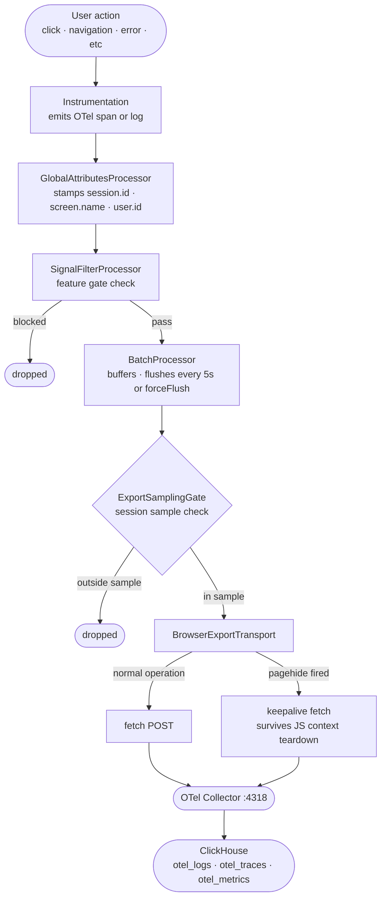
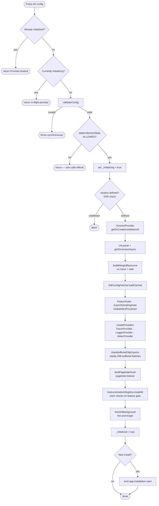

# SDK Core — SPEC.md

Package: `@dreamhorizon/pulse-web`
File: `pulse-web-otel/docs/instrumentations/sdk-core/SPEC.md`

---

## What this document covers

**SDK Core** — how the SDK starts up, what it sets up, and how it sends data.

Session lifecycle is covered in its own document: [SESSION-LIFECYCLE.md](./SESSION-LIFECYCLE.md)

All instrumentation SPEC files (network, clicks, web vitals, etc.) depend on this document for the shared attribute contract in §5.

---

## HLD — High Level Design

### System architecture

```
┌─────────────────────────────────────────────────────────┐
│                     Host App                            │
│  Pulse.init(config)    Pulse.setScreenName()            │
│  Pulse.trackEvent()    Pulse.setUserId()                │
└────────────────────┬────────────────────────────────────┘
                     │
                     ▼
┌─────────────────────────────────────────────────────────┐
│                Pulse SDK  (src/sdk.ts)                  │
│                                                         │
│  ┌─────────────┐  ┌──────────────┐  ┌───────────────┐  │
│  │ Consent     │  │ Feature Gate │  │ Remote Config │  │
│  │ Gate        │  │ + Sampling   │  │ Fetcher       │  │
│  └─────────────┘  └──────────────┘  └───────────────┘  │
│                                                         │
│  ┌──────────────────────────────────────────────────┐   │
│  │  SessionProvider  (src/session.ts)               │   │
│  │  session.id · userId · rotation                  │   │
│  │  clone detection · storage tiers                 │   │
│  │  installation.id via getOrCreateInstallationId() │   │
│  └──────────────────────────────────────────────────┘   │
│                                                         │
│  ┌──────────────────────────────────────────────────┐   │
│  │  GlobalAttributesProcessor                       │   │
│  │  stamps session.id, screen.name, user.id         │   │
│  │  on every signal at emit time                    │   │
│  └──────────────────────────────────────────────────┘   │
│                                                         │
│  Instrumentations (each gated by FeatureGate):          │
│  Session · Clicks · Network · Errors · WebVitals        │
│  ScreenLoad · ScreenSession · Interaction               │
└────────────────────────────┬────────────────────────────┘
                             │
                             ▼
┌─────────────────────────────────────────────────────────┐
│                OTel Export Pipeline                     │
│                                                         │
│  Traces  → BatchSpanProcessor      → POST /v1/traces    │
│  Logs    → BatchLogRecordProcessor → POST /v1/logs      │
│  Metrics → PeriodicExportingReader → POST /v1/metrics   │
│                                                         │
│  BrowserExportTransport:                                │
│    normal:   fetch  |  pagehide: keepalive fetch        │
│  IDB buffer: replay unsent batches on next init         │
└────────────────────────────┬────────────────────────────┘
                             │ OTLP HTTP (protobuf / JSON)
                             ▼
                   OTel Collector (:4318)
                             │
                             ▼
                       ClickHouse
                       otel.otel_logs / otel.otel_traces / otel.otel_metrics_*
```

### Signal flow — from user action to ClickHouse


```

### Component responsibilities

| Component | File | Responsibility |
|---|---|---|
| `PulseSDK` | `src/sdk.ts` | Singleton facade, init/shutdown orchestration |
| `SessionProvider` | `src/session.ts` | Session ID lifecycle, storage, rotation |
| `GlobalAttributesProcessor` | `src/processors/global-attrs-processor.ts` | Stamps shared attributes on every signal |
| `FeatureGate` | `src/feature-gate.ts` | Per-instrumentation on/off from remote config |
| `ExportSamplingGate` | `src/sampling/export-sampling-gate.ts` | Session-level sampling at export time |
| `SdkConfigFetcher` | `src/sdk-config/fetcher.ts` | Load/cache/refresh remote config |
| `InstrumentationRegistry` | `src/instrumentation-registry.ts` | Install/uninstall all instrumentations |
| `BrowserExportTransport` | `src/exporters/otlp-transport.ts` | HTTP transport with keepalive switching |
| `IdbSignalBuffer` | `src/persistence/` | IndexedDB buffer for crash recovery |

---

## LLD — Low Level Design

### `PulseSDK` — init state machine

```
         ┌─────────┐
         │  IDLE   │ ← module load / post-shutdown
         └────┬────┘
              │ init() called
              ▼
       ┌─────────────┐
       │ VALIDATING  │  validateConfig() — throws synchronously on bad config
       └──────┬──────┘
              │
       ┌──────▼──────┐
       │ CONSENT CHK │  dataCollectionState !== ALLOWED → back to IDLE (zero side effects)
       └──────┬──────┘
              │ ALLOWED
       ┌──────▼──────┐
       │INITIALIZING │  _initializing = true
       │             │  concurrent init() calls → return same in-flight promise
       └──────┬──────┘
              │ finishInit() async chain completes
       ┌──────▼──────┐
       │ INITIALIZED │  _initialized = true
       └──────┬──────┘
              │ shutdown() called
       ┌──────▼──────┐
       │ SHUTTING    │  uninstall all instrumentations
       │ DOWN        │  forceFlush all providers
       └──────┬──────┘  reset singleton → _instance = null
              │
         ┌────▼────┐
         │  IDLE   │ ← ready for re-init
         └─────────┘
```

Key fields on `PulseSDK`:

| Field | Type | Purpose |
|---|---|---|
| `_instance` | `PulseSDK \| null` | Module-level singleton |
| `_initialized` | `boolean` | True after `finishInit()` settles |
| `_initializing` | `boolean` | True during async bootstrap |
| `_shuttingDown` | `boolean` | Set before async shutdown chain begins |
| `_initPromise` | `Promise<void> \| null` | Shared across concurrent `init()` calls |

### Processor chain

```
Instrumentation emits span or log
        │
        ▼
PulseGlobalAttributesProcessor.onEmit(record)
  ├─ sessionProvider.getSessionId()  → 'session.id'
  ├─ currentScreenName               → 'screen.name'
  ├─ userId                          → 'user.id'
  └─ custom user properties          → 'pulse.user.*'
        │
        ▼
SignalFilterProcessor.onEmit(record)
  └─ featureGate.isEnabled(pulseType) === false → drop
        │
        ▼
ExportSamplingGate  (at BatchProcessor export time)
  └─ sessionSampleRate check → outside sample? drop batch entry
        │
        ▼
BatchSpanProcessor / BatchLogRecordProcessor
  └─ export() → BrowserExportTransport.send()
```

### `BrowserExportTransport` — transport switching

```
Normal operation
  └─ createPulseFetchTransport({ keepalive: false })

pagehide fires → prepareForDocumentUnload()
  └─ switchToKeepalive()
       └─ createPulseFetchTransport({ keepalive: true })
          browser keeps this request alive even after JS context is destroyed

Why not sendBeacon?
  sendBeacon() must be called synchronously. BatchLogRecordProcessor._flushAll()
  has multiple await steps before it reaches the transport. If a timer-triggered
  batch export is already in flight when pagehide fires, the async chain can
  exceed the browser's teardown window. keepalive fetch has no such constraint.
```

### `FeatureGate` — decision logic

```
isEnabled(feature):
  1. Find entry in sdkConfig.features where sdks includes 'pulse_web_js'
  2. No matching entry         → ENABLED  (default: all features on)
  3. sessionSampleRate === 0   → DISABLED
  4. sessionSampleRate === 1   → ENABLED
  5. 0 < rate < 1             → enabled if Math.random() < rate (session-stable)

InstrumentationRegistry.shouldInstall(key):
  configEnabled === false                 → false  (local kill switch; remote cannot re-enable)
  configEnabled !== false AND gate passes → true
```

### Remote config fetch sequence

```
Pulse.init()
  ├─ SdkConfigFetcher.loadCached()          ← synchronous
  │     └─ localStorage['pulse_sdk_config']
  │           ├─ valid JSON + valid shape → mergePulseSdkConfig(parsed)
  │           └─ missing / invalid        → DEFAULT_SDK_CONFIG (all features on)
  │
  └─ [post-init, fire-and-forget] SdkConfigFetcher.fetchInBackground()
        └─ fetch(configUrl, { 'X-API-KEY': apiKey })
              ├─ ok + valid + version changed
              │     → mergePulseSdkConfig(data)
              │     → localStorage.setItem('pulse_sdk_config', JSON.stringify(merged))
              └─ any other outcome → no-op

Config URL:
  localhost / 10.0.2.2 → http://localhost:8080/v1/configs/active/
  production           → pulse-otel-collector.pulse-ux.com/config/projects/{projectId}/pulse-config.json
```

---

## 1. What the SDK does

When a host app calls `Pulse.init(config)`, the SDK:

1. Checks consent — if the user hasn't allowed data collection, it stops here and does nothing.
2. Creates a session for this user/tab.
3. Reads the browser's user-agent to identify the OS and browser.
4. Sets up three OpenTelemetry signal pipelines: traces, logs, metrics.
5. Installs all the automatic instrumentations (session events, clicks, network calls, web vitals, errors, screen load times).
6. Listens for the page being closed (`pagehide`) so it can flush any unsent data.
7. Fetches an updated remote config in the background (feature flags, sampling rates).

After that, every user action the SDK tracks automatically emits signals that flow:

```
Browser (SDK) → OTLP HTTP POST → OTel Collector → ClickHouse
```

---

## 2. Singleton pattern

`Pulse` is a **module-level singleton** — there is exactly one instance per page load. You cannot `new Pulse()`. You call `Pulse.init()` once and then call methods on `Pulse` directly.

Calling `init()` more than once is safe:
- If init has already completed → returns `Promise.resolve()` immediately.
- If init is still in progress → returns the same in-flight promise (does not double-construct providers).

Calling any `Pulse.*` method before `init()` completes or after `shutdown()` is also safe — all methods are silent no-ops.

---

## 3. Init lifecycle (step by step)

```
Pulse.init(config)
  │
  ├─ 1. Already initialized? → return immediately (no-op)
  ├─ 2. Currently initializing? → return the same in-flight promise
  ├─ 3. Validate config — throw synchronously if apiKey is missing
  ├─ 4. Consent check — dataCollectionState !== ALLOWED → return (zero side effects)
  │
  └─ 5. Begin async bootstrap (finishInit):
        a. SSR guard — window === undefined → abort (Next.js / server render safe)
        b. SessionProvider — create or resume session, create installationId
        c. UA parse + OS version — reads browser/OS info (<200ms, uses Client Hints if available)
        d. Build OTel Resource — stamps os.name='web', project.id, service.name, app version
        e. Load remote config from localStorage cache (instant, synchronous)
        f. Set up FeatureGate, ExportSamplingGate, GlobalAttributesProcessor
        g. Restore persisted user identity (userId, user properties)
        h. Create OTel providers — TracerProvider, LoggerProvider, MeterProvider + OTLP exporters
        i. Drain IndexedDB — replay any unsent signals from a previous crashed session
        j. Register pagehide listener — flush all providers on tab close
        k. Register OTel global providers
        l. Install all instrumentations (each checks its own feature gate first)
        m. Fetch fresh remote config in background (fire-and-forget)
        n. Mark _initialized = true
        o. Emit app.installation.start if this is a brand-new install
```



**Key invariant:** Steps a–n run inside one async chain. The `_initializing` flag is set synchronously before the chain begins, so concurrent `init()` calls during those ~200ms return the same promise instead of double-constructing everything.

---

## 4. Consent gate

`dataCollectionState` must be `ALLOWED` for any signal to be emitted.


| Value     | Behavior                                                   |
| --------- | ---------------------------------------------------------- |
| `ALLOWED` | SDK runs normally                                          |
| `DENIED`  | SDK exits at step 4 — no session, no listeners, no signals |
| `PENDING` | Same as DENIED                                             |


The consent check happens in `init()` before any async work, so even the session UUID is not generated if consent is missing.

If consent changes at runtime, the host app must call `Pulse.shutdown()` then `Pulse.init()` again. The SDK does not support flipping consent live.

---

## 5. Feature gates and remote config

After `init()`, the SDK fetches a config JSON from the server in the background. This config controls which features are active and at what sampling rate.

**How it works:**

1. On `init()` — the SDK reads `localStorage["pulse_sdk_config"]` synchronously. If nothing is cached, defaults apply (everything on, 100% sampling).
2. After `init()` — a background `fetch` checks if the server has a newer version (by comparing `version` numbers). If newer, it overwrites the cache. Takes effect on the next page load.

**Per-instrumentation gate:** before installing any instrumentation (clicks, network, etc.), the SDK checks `FeatureGate.isEnabled(feature)`. If the remote config sets `sessionSampleRate = 0` for that feature, it won't install. Local `configEnabled: false` is a hard kill switch that remote config cannot override.

---

## 6. OTLP export pipeline

Three pipelines, one per signal type:

```
Traces  → BatchSpanProcessor      → PulseBrowserOtlpExporter → POST /v1/traces
Logs    → BatchLogRecordProcessor → PulseBrowserLogExporter  → POST /v1/logs
Metrics → PeriodicExportingReader → OtlpHttpMetricExporter   → POST /v1/metrics
```

**Transport switching on page close:** when `pagehide` fires, `prepareForDocumentUnload()` switches both trace and log exporters to `keepalive: true` fetch. This keeps the HTTP request alive even after the browser tears down the JavaScript context, so `session.end` and any buffered signals reliably reach the collector on real tab close (Cmd+W).

> Why not `sendBeacon`? `sendBeacon` must be called synchronously before JS context teardown. The OTel `BatchLogRecordProcessor._flushAll()` has multiple `await` steps before it actually calls the transport. If a timer-triggered batch export is in flight when the page closes, the async chain can exceed the teardown window. `keepalive: true` fetch survives regardless.

**IndexedDB buffer:** signals are written to an IndexedDB buffer before network send. If the page crashes or is force-killed, the next init replays any unsent batches from the IDB. This prevents signal loss on crash.

**Wire format:** JSON by default (`config.useProtobuf ?? false`). Set `config.useProtobuf: true` (or `export.format: "protobuf"` in config) to switch to protobuf. JSON is easier for DevTools inspection; protobuf is smaller on the wire.

---

## 7. Shared attribute contract

Every signal the SDK emits carries these attributes. Instrumentations may add their own on top but must not overwrite these keys.


| Attribute             | Type   | Where it comes from            | Required |
| --------------------- | ------ | ------------------------------ | -------- |
| `pulse.type`          | string | Each instrumentation           | Yes      |
| `session.id`          | string | GlobalAttributesProcessor      | Yes      |
| `installation.id`     | string | `getOrCreateInstallationId()` (module-level, `src/session.ts`) | Yes      |
| `project.id`          | string | Extracted from apiKey prefix   | Yes      |
| `service.name`        | string | Config `serviceName`           | Yes      |
| `os.name`             | string | OTel Resource — always `'web'` | Yes      |
| `user.id`             | string | GlobalAttributesProcessor      | No       |
| `screen.name`         | string | GlobalAttributesProcessor      | No       |
| `last.screen.name`    | string | GlobalAttributesProcessor      | No       |
| `metering.session.id` | string | Set once per SDK init          | Yes      |
| `os.version`          | string | UA / Client Hints parse        | No       |
| `browser.name`        | string | UA parse                       | No       |
| `app.build_name`      | string | Config `serviceVersion`        | No       |


`os.name = 'web'` is stamped in `buildMergedResource()` and cannot be overridden by the host app.

---

## 8. All `pulse.type` values


| pulse.type                 | Signal kind | Who emits it                                |
| -------------------------- | ----------- | ------------------------------------------- |
| `session.start`            | Log         | SessionInstrumentation                      |
| `session.end`              | Log         | SessionInstrumentation                      |
| `device.crash`             | Log         | ErrorInstrumentation, PulseErrorBoundary    |
| `non_fatal`                | Log         | ErrorInstrumentation, Pulse.reportException |
| `http`                     | Span        | NetworkInstrumentation                      |
| `app.click`                | Span        | ClicksInstrumentation                       |
| `web_vital`                | Log         | WebVitalsInstrumentation                    |
| `screen_load`              | Span        | NavigationInstrumentation                   |
| `screen_session`           | Span        | NavigationInstrumentation                   |
| `custom_event`             | Log         | Pulse.trackEvent                            |
| `app.installation.start`   | Log         | PulseSDK (first install only)               |
| `pulse.user.session.start` | Log         | PulseSDK.setUserId                          |
| `pulse.user.session.end`   | Log         | PulseSDK.setUserId                          |


---

## 9. Public API


| Method                                   | What it does                                                             |
| ---------------------------------------- | ------------------------------------------------------------------------ |
| `Pulse.init(config)`                     | Start the SDK. Returns `Promise<void>`.                                  |
| `Pulse.shutdown()`                       | Uninstall everything, flush all signals, reset singleton.                |
| `Pulse.whenReady()`                      | Resolves when init finishes. Safe to await before calling other methods. |
| `Pulse.isInitialized()`                  | Synchronous check — is init done?                                        |
| `Pulse.setScreenName(name)`              | Tag subsequent signals with the current screen/route name.               |
| `Pulse.setUserId(id | null)`             | Set or clear user identity. Emits user session transition signals.       |
| `Pulse.setUserProperty(key, value)`      | Add one custom user property (`pulse.user.<key>`).                       |
| `Pulse.setUserProperties(props)`         | Add multiple user properties in one call.                                |
| `Pulse.clearUserIdentity()`              | Clear persisted userId and all user properties.                          |
| `Pulse.trackEvent(name, attrs?)`         | Send a custom event signal (`pulse.type = custom_event`).                |
| `Pulse.reportException(error, attrs?)`   | Manual non-fatal error (`pulse.type = non_fatal`, WARN).                 |
| `Pulse.reportDeviceCrash(error, attrs?)` | Fatal crash signal (`pulse.type = device.crash`, FATAL).                 |
| `Pulse.trackNonFatal(name, attrs?)`      | Named non-fatal event (`pulse.type = non_fatal`).                        |


All methods are silent no-ops before `init()` completes or after `shutdown()`.

---

## 10. Config reference

```ts
{
  apiKey: string;                           // required — "projectId_secret"
  dataCollectionState: PulseDataCollectionConsent; // required — ALLOWED | DENIED | PENDING
  serviceName?: string;                     // identifies the app
  serviceVersion?: string;                 // app build version string
  globalAttributes?: Record<string, string>;  // attached to every signal
  resourceAttributes?: Record<string, string>; // attached to the OTel Resource (once per init)
  instrumentations?: InstrumentationConfig; // per-instrumentation on/off switches
  export?: { format: "protobuf" | "json" };
  logLevel?: PulseLogLevel;
  diskBuffering?: { enabled?: boolean; maxAgeMs?: number; maxCacheSizeBytes?: number };
  beaconRelayUrl?: string;              // relay for sendBeacon (not used by prepareForDocumentUnload — keepalive fetch is used instead)
  beforeSendData?: (signal) => signal | null; // drop or mutate signals before export
  endpoint?: string;                        // override collector URL (dev/testing)
  pageHiddenTimeoutMs?: number;             // session rotation timeout (default 15 min)
}
```

---

---

## 11. Test coverage


| Test file                                           | What it covers                                                                                                                          |
| --------------------------------------------------- | --------------------------------------------------------------------------------------------------------------------------------------- |
| `src/__tests__/m1.test.ts`                          | installationId, session rotation, config validation, resource attributes, feature gate, global attrs processor, session instrumentation |
| `src/__tests__/sdk-lifecycle.test.ts`               | singleton guards, double-init, shutdown, re-init, SSR abort, concurrent init race                                                       |
| `src/__tests__/sdk-public-methods.test.ts`          | trackEvent, reportException, reportDeviceCrash, setUserProperties, setScreenName — all no-op before init                                |
| `src/__tests__/m3.test.ts`                          | device.crash, non_fatal from onerror + unhandledrejection                                                                               |
| `src/__tests__/m8.test.ts`                          | pagehide listener count, BFCache guard, forceFlush on close, shutdown removes listener                                                  |
| `src/__tests__/integration-simplified-init.test.ts` | config surface validation, diskBuffering defaults, beforeSendData shape                                                                 |


