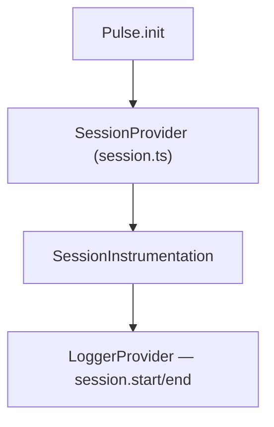
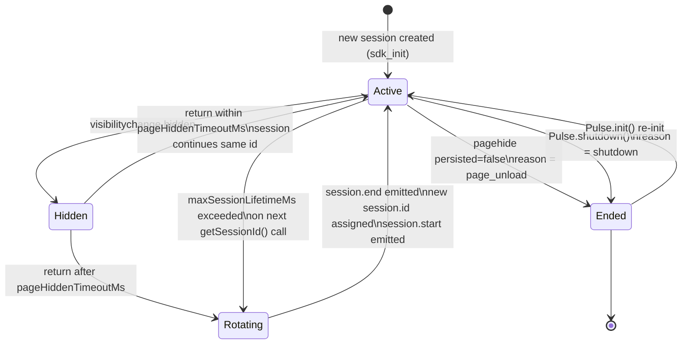
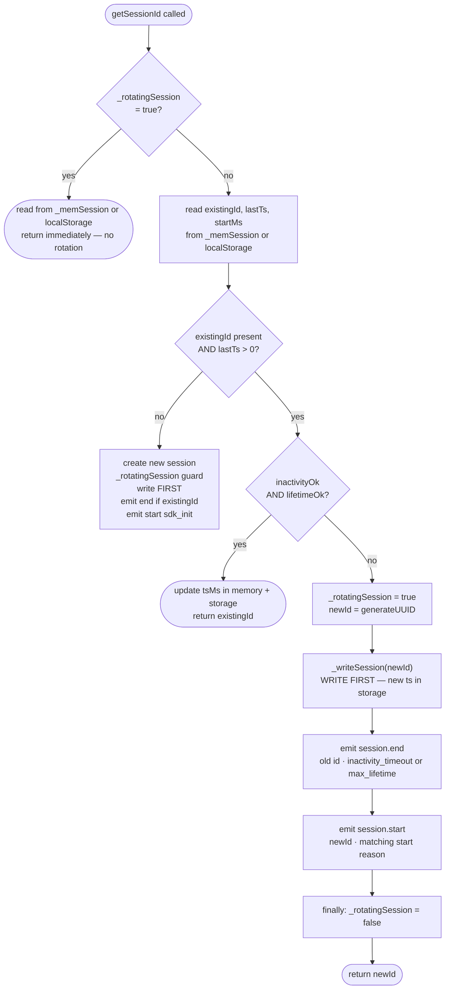
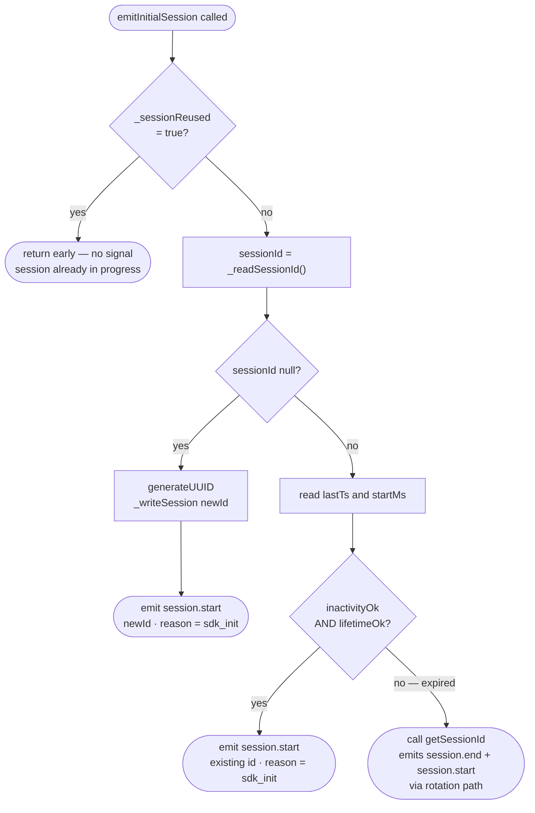
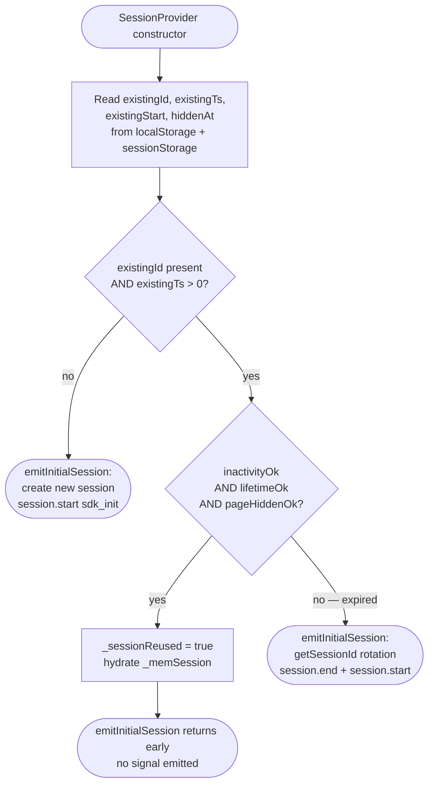

# Session Instrumentation — SPEC.md

Package: `@dreamhorizonorg/pulse-web`  
File: `pulse-web-otel/docs/instrumentations/session/SPEC.md`  
Implementation: `pulse-web-otel/src/session.ts`, `pulse-web-otel/src/instrumentations/session.ts`

See also: [SDK Core SPEC](../sdk-core/SPEC.md) for the shared attribute contract and init flow.

**Section index:** Some indexes still say “§6” for session **test coverage**; in this file that material is under **[§7. Test coverage](#7-test-coverage)** (operational behaviour is §6).

---

## 1. Goal

Define **browser session lifecycle** (`SessionProvider`), **persistence of installation and user identity**, and **OTLP log emission** for `session.start` / `session.end` via `SessionInstrumentation`.

---

## 2. Assumptions

- Same assumptions as SDK core — [`../sdk-core/assumptions/SPEC.md`](../sdk-core/assumptions/SPEC.md).
- `SessionInstrumentation` runs only after successful `Pulse.init` when the session feature is not locally disabled and remote gate allows it.

---

## 3. Requirements

**R6 — Session** (full text): [`../sdk-core/requirements/SPEC.md`](../sdk-core/requirements/SPEC.md).

### Functional (instrumentation)

**SR1 — session.start:** On new session (including first install), emit OTLP log with `pulse.type = session.start` and correct `session.id` / `session.previous_id` / `session.start_reason`.

**SR2 — session.end:** On rotation or shutdown path, emit `session.end` with duration and end reason attributes.

**SR3 — Uninstall:** `SessionInstrumentation.uninstall()` detaches `SessionProvider` subscription without throwing.

---

## 4. Architectural Design

### 4.1 HLD — component relationships

```
┌──────────────────────────────────────────────────────────┐
│                      Pulse SDK                           │
│                                                          │
│  ┌────────────────────────────────────────────────────┐  │
│  │               SessionProvider                      │  │
│  │                                                    │  │
│  │  localStorage       sessionStorage    in-memory    │  │
│  │  ─────────────      ─────────────     ──────────   │  │
│  │  session_id         tab_session       _memSession  │  │
│  │  session_ts         clone_flag        _hiddenAtMs  │  │
│  │  session_start      hidden_at         _rotatingSession │  │
│  │  _windowId           user_id                         │  │
│  └────────────────────┬───────────────────────────────┘  │
│                       │ getSessionId()                   │
│                       ▼                                  │
│  ┌────────────────────────────────────────────────────┐  │
│  │         GlobalAttributesProcessor                  │  │
│  │         stamps session.id on every signal          │  │
│  └────────────────────────────────────────────────────┘  │
│                       │                                  │
│  ┌────────────────────▼───────────────────────────────┐  │
│  │         SessionInstrumentation                     │  │
│  │         listens to onSessionChange()               │  │
│  │         emits session.start / session.end logs     │  │
│  └────────────────────────────────────────────────────┘  │
└──────────────────────────────────────────────────────────┘
```

`installation.id` (resource attribute) is **not** owned by `SessionProvider`; it comes from `getOrCreateInstallationId()` in `src/session.ts` (see [`../sdk-core/SPEC.md`](../sdk-core/SPEC.md) and resource construction in `src/resource.ts`).



### 4.2 Session state machine



### 4.3 Storage tier diagram

```
┌──────────────────────────────────────────────────────────────┐
│  localStorage  (shared across all tabs, survives restart)    │
│                                                              │
│  pulse_installation_id ──── stable UUID, never rotates       │
│  pulse_session_id      ──── current session UUID             │
│  pulse_session_ts      ──── last-activity timestamp (ns)     │
│  pulse_session_start   ──── session creation timestamp (ns)  │
│  pulse_user_id         ──── persisted user identity          │
│  pulse_user_properties ──── JSON: custom user props          │
└──────────────────────────────────────────────────────────────┘

┌──────────────────────────────────────────────────────────────┐
│  sessionStorage  (per-tab; survives reload, NOT new tab)     │
│                                                              │
│  pulse_tab_session        ── written on init; read to detect │
│                              same-tab navigation patterns    │
│  pulse_session_clone_flag ── written on init, deleted on     │
│                              beforeunload; copied to cloned  │
│                              tabs (clone detection marker)   │
│  pulse_session_hidden_at  ── hide timestamp for cold-start   │
│                              pageHiddenTimeoutMs check       │
└──────────────────────────────────────────────────────────────┘

┌──────────────────────────────────────────────────────────────┐
│  In-memory  (per SessionProvider instance, lost on reload)   │
│                                                              │
│  _memSession      ── { id, tsMs, startMs } mirrors LS        │
│                      avoids localStorage read on every call  │
│  _hiddenAtMs      ── when the tab was hidden (Date.now())    │
│  _rotatingSession ── re-entrancy guard during rotation       │
│  _windowId        ── unique UUID per page load, not          │
│                      persisted; distinguishes tabs sharing   │
│                      the same session ID                     │
└──────────────────────────────────────────────────────────────┘
```

---

## 5. LLD

### 5.1 `SessionProvider` — key fields and methods

```ts
class SessionProvider {
  // Timeouts (configurable via PulseWebConfig)
  inactivityTimeoutMs:   number  // default 30 min
  maxSessionLifetimeMs:  number  // default 4 hours
  pageHiddenTimeoutMs:   number  // default 15 min

  // In-memory cache — mirrors localStorage to avoid disk reads
  _memSession: { id: string; tsMs: number; startMs: number } | null

  // Re-entrancy guard — set true during rotation to prevent duplicate events
  _rotatingSession: boolean

  // Dedup guard — tracks which session ID has already had session.end emitted
  _emittedEndForSession: string | null

  // Tab hide timestamp — written to sessionStorage for Capacitor resilience
  _hiddenAtMs: number | null

  // When true, localStorage session keys are trusted; when false, reads prefer _memSession
  // (zombie LS after write failures — see _readSessionId / _readSessionTs)
  _lsWritable: boolean

  // Per-page-load UUID — not persisted; used to distinguish tabs sharing a session
  _windowId: string

  // Key methods
  getSessionId(): string          // hot path — called on every signal emission
  currentSessionId(): string | null  // non-rotating read; no expiry check
  emitInitialSession(): void      // called once by SessionInstrumentation on install
  onSessionChange(cb): () => void // subscribe to start/end events; returns unsub fn
  updateActivity(): void          // bumps session_ts without rotation check
  wasSessionReused(): boolean     // true if session was continued from previous load
  getWindowId(): string           // returns _windowId
  shutdown(): void                // emit session.end(shutdown), clear storage
}
```

### 5.2 `getSessionId()` — full decision tree



Text walkthrough:
```
getSessionId()
  │
  ├─ _rotatingSession === true?
  │     └─ YES → _readSessionId() from _memSession or localStorage, return it
  │
  ├─ Read existingId (_memSession first if _lsWritable=false, else localStorage)
  │   lastTs = stored as nanoseconds → Math.floor(parseInt / 1_000_000) to get ms
  │   startMs = same nanosecond → ms conversion
  │
  ├─ existingId present AND lastTs > 0?
  │     NO → new session path (also _rotatingSession-guarded):
  │           _writeSession(newId) — FIRST
  │           if existingId: emit session.end(inactivity_timeout)
  │           emit session.start(newId, existingId|"", sdk_init|inactivity_timeout)
  │           return newId
  │
  ├─ inactivityOk = now - lastTs <= inactivityTimeoutMs
  ├─ lifetimeOk   = (now - startMs) <= maxSessionLifetimeMs
  │
  ├─ Both ok? → update _memSession.tsMs and localStorage ts → return existingId
  │
  └─ Expired:
        1. rotationReason = lifetimeOk ? "inactivity_timeout" : "max_lifetime"
        2. Set _rotatingSession = true
        3. newId = generateUUID()
        4. _writeSession(newId)              ← WRITE FIRST
        5. Emit session.end(existingId, rotationReason)
              └─ GlobalAttrsProcessor calls getSessionId()
                    └─ _rotatingSession = true → returns newId immediately
        6. Emit session.start(newId, existingId, startReason)
        7. finally: _rotatingSession = false
        8. Return newId
```

### 5.3 `emitInitialSession()` — boot routing logic



Text walkthrough:
```
emitInitialSession()
  │
  ├─ _sessionReused === true? → return  (reload or valid unexpired session reuse)
  │
  ├─ sessionId = _readSessionId()
  │
  ├─ sessionId is null?
  │     └─ new install or storage cleared
  │           → generateUUID() → _writeSession(newId)
  │           → emit session.start(newId, "", "sdk_init")
  │           → return
  │
  ├─ lastTs = _readSessionTs()
  ├─ startMs = _readSessionStart()
  ├─ inactivityOk = lastTs > 0 AND now - lastTs <= inactivityTimeoutMs
  ├─ age = startMs > 0 ? (now - startMs) : 0
  ├─ lifetimeOk   = age <= maxSessionLifetimeMs
  │
  ├─ inactivityOk AND lifetimeOk?
  │     └─ valid session (e.g. getSessionId was called before install, ts is fresh)
  │           → emit session.start(sessionId, "", "sdk_init")
  │
  └─ expired?
        └─ getSessionId()  ← triggers rotation path
             emits session.end + session.start automatically
```

### 5.4 `visibilityChangeListener` — background timeout handler

```
document.addEventListener('visibilitychange', handler)

handler():
  │
  ├─ document.hidden === true  (tab going to background)
  │     └─ _hiddenAtMs = Date.now()
  │        sessionStorage['pulse_session_hidden_at'] = _hiddenAtMs
  │
  └─ document.hidden === false  (tab returning to foreground)
        │
        ├─ _clearHiddenAt() — delete sessionStorage['pulse_session_hidden_at']
        │
        ├─ if (_hiddenAtMs === null) → return  (no hide recorded this session)
        │
        ├─ hiddenDuration = Date.now() - _hiddenAtMs  (uses in-memory value)
        ├─ _hiddenAtMs = null
        │
        ├─ hiddenDuration <= pageHiddenTimeoutMs?
        │     └─ session continues — no rotation
        │
        └─ hiddenDuration > pageHiddenTimeoutMs?
              ├─ _memSession = { ..._memSession, tsMs: 0 }  ← zero in-memory cache
              ├─ localStorage['pulse_session_ts'] = '0'     ← zero persistent cache
              └─ getSessionId()                             ← detects ts=0, rotates
```

> **Why zero `_memSession` too?** `_memSession` is an in-memory copy used to avoid disk reads on every `getSessionId()` call. If only localStorage is zeroed but `_memSession` still holds a live timestamp, `getSessionId()` reads the cache, sees a valid session, and skips rotation. Zeroing `_memSession.tsMs` forces it to see the expired value.

`sessionStorage['pulse_session_hidden_at']` is written on hide but only READ by the constructor (cold-start / Capacitor resume). The visible branch always uses in-memory `_hiddenAtMs`. If that is null (process was killed and restarted), the constructor handles it.

### 5.5 Session reuse — constructor logic

The constructor checks whether an unexpired session exists in localStorage and reuses it if so, regardless of how the navigation arrived (reload, new tab, cross-origin redirect):

```
On SessionProvider constructor:
  1. Read existingId, existingTs, existingStart, hiddenAt from storage
  2. Compute: inactivityOk, lifetimeOk, pageHiddenOk
  3. If all three ok:
       _sessionReused = true
       _memSession = { id, tsMs, startMs }  ← hydrate from storage
       _lsWritable = true
  4. Always: write clone flag + tab session to sessionStorage
  5. Register beforeunload → delete clone flag
  6. Register pagehide → emit session.end(page_unload) [skips storage clear]
  7. Register pageshow → if persisted: updateActivity() [BFCache restore]
  8. Register visibilitychange → background timeout handler
```

This covers all navigation patterns:
- **Same-tab reload** — sessionStorage tab key present; session reused if unexpired
- **New tab (Cmd+T)** — sessionStorage absent; session reused if localStorage has an unexpired one (same tab-group / payment redirect return)
- **Cross-origin redirect return** — sessionStorage cleared by navigation; session reused from localStorage if unexpired (prevents duplicate session.start on payment flow return)
- **Tab duplicated** — clone flag copied; session reused; `_windowId` is different per load and distinguishes the two tabs

> **Previous behaviour (pre-payment-flow fix):** session reuse was gated on `hasCloneFlag || hasTabSession`. This correctly detected reloads but broke payment flows where the gateway redirect clears sessionStorage. Standard analytics behaviour (PostHog, Sentry, Mixpanel) is: any page load within the inactivity window continues the existing session.

### 5.6 `_rotatingSession` and `_emittedEndForSession` guards

Two guards prevent duplicate signals:

**Guard 1 — `_rotatingSession`:** re-entrancy guard. Set `true` before emitting any events during rotation; cleared in `finally`. Any re-entrant `getSessionId()` call (e.g. from `GlobalAttributesProcessor.onEmit`) reads this flag and returns the current ID immediately without re-entering rotation logic.

**Guard 2 — `_emittedEndForSession`:** dedup guard. Tracks which session ID has already had `session.end` emitted. Prevents double-emit in sequences like: `page_unload` fires `pagehide`, then `shutdown()` is also called. The second call sees the session ID already in `_emittedEndForSession` and skips the emit (but still clears storage on `shutdown()`).

```
Rotation path in getSessionId():
  1. _rotatingSession = true
  2. newId = generateUUID()
  3. _writeSession(newId)              ← WRITE FIRST (new ts in storage)
  4. Emit session.end(oldId)
       └─ GlobalAttrsProcessor calls getSessionId()
             └─ _rotatingSession = true → returns newId immediately
  5. Emit session.start(newId)
  6. finally: _rotatingSession = false
```

### 5.7 Storage read path — `_lsWritable` guard

```
_lsWritable flag:
  true  — localStorage writes confirmed; reads come from localStorage
  false — writes failed (quota, disabled, SSR) OR not yet written;
          reads fall back to _memSession to avoid stale LS keys
          returning an old expired ID and causing re-rotation

_readSessionId():
  1. _memSession present AND _lsWritable=false  → return _memSession.id
  2. window === undefined (SSR)                 → return _memSession?.id ?? null
  3. localStorage.getItem(SESSION_ID_KEY)
  4. catch                                      → _memSession?.id ?? null

_readSessionTs():
  1. _memSession present AND _lsWritable=false  → return _memSession.tsMs
  2. window === undefined (SSR)                 → return _memSession?.tsMs ?? 0
  3. localStorage.getItem(SESSION_TS_KEY)
        stored as nanoseconds → Math.floor(parseInt(ts) / 1_000_000) to get ms
        if empty              → _memSession?.tsMs ?? 0
  4. catch                                      → _memSession?.tsMs ?? 0

getOrCreateInstallationId() (module-level, not on SessionProvider):
  1. _memoryInstallationId (module-level var)
  2. localStorage['pulse_installation_id']
  3. sessionStorage['pulse_installation_id']  ← Safari ITP fallback
  4. generate new UUID, write to all tiers
```

---

## 6. Session behaviour and storage (operational reference)

### 6.1 What a session is

A **session** is a continuous period of user activity. It has:

- A unique `session.id` (UUID)
- A start time and an end time
- An `installation.id` that stays constant across all sessions on the same browser (`getOrCreateInstallationId()`, not a field on `SessionProvider`)

Sessions are tracked so teams can answer: "how long was this user active before the crash?", "how many screens did they see?", "did this user's session expire before checkout?"

### 6.2 Storage layout (key reference)

**localStorage** (shared across all tabs, survives browser restart):

| Key | What it stores |
|---|---|
| `pulse_installation_id` | Stable UUID for this browser install — never changes |
| `pulse_session_id` | Current session UUID |
| `pulse_session_ts` | Last-activity timestamp, stored as **nanoseconds** (`nowMs * 1_000_000`). Readers convert back to ms. |
| `pulse_session_start` | Session creation timestamp, stored as **nanoseconds**. Used for max-lifetime check. |
| `pulse_user_id` | Persisted user ID (set via `Pulse.setUserId`) |
| `pulse_user_properties` | JSON blob of custom user properties |

**sessionStorage** (per-tab — survives reload, NOT new tabs or Cmd+T):

| Key | What it stores |
|---|---|
| `pulse_tab_session` | Written on init; used for pattern detection |
| `pulse_session_clone_flag` | Written on init, deleted on `beforeunload`. Copied to cloned tabs → clone detection marker. |
| `pulse_session_hidden_at` | Timestamp when tab was hidden. Survives Capacitor/WebView full-reload on background+resume. |

### 6.3 Session start — navigation cases

When `SessionProvider` initializes, it checks localStorage for an unexpired session and routes accordingly.

### Case 1: No valid session in localStorage

No `session_id` in localStorage (fresh install) OR existing session is expired by inactivity / lifetime / page-hidden timeout.

- `_sessionReused` stays `false`.
- `emitInitialSession()` runs the full create-or-rotate path.
- Emits `session.start (reason=sdk_init)` for a brand-new session, or `session.end + session.start` for an expired one.

### Case 2: Valid unexpired session in localStorage

Any page load where localStorage has an unexpired `session_id` — covers reloads, new tabs within the inactivity window, cross-origin redirect returns (e.g. payment flow).

- `_sessionReused = true`; `_memSession` hydrated from storage.
- `emitInitialSession()` sees `_sessionReused` and returns early — no signal emitted.
- Session continues silently.

> This is the standard web analytics pattern (PostHog, Sentry, Mixpanel). A payment gateway redirect that clears sessionStorage no longer creates a duplicate session.

### Case 3: Capacitor / WebView cold-start after background

The app may be fully killed while backgrounded and cold-started on resume. In-memory state is lost but sessionStorage may survive (runtime-dependent). The constructor reads `pulse_session_hidden_at` from sessionStorage and applies `pageHiddenTimeoutMs` — if the hidden duration exceeded the timeout, the session is treated as expired and falls into Case 1.

#### Session start — decision flowchart



### 6.4 Session rotation — triggers

A session **rotates** (current ends, new starts) in two situations:

### Trigger A: Background timeout

1. User switches away from the tab.
2. `visibilitychange → hidden` fires. SDK records `_hiddenAtMs = Date.now()` and writes to `sessionStorage["pulse_session_hidden_at"]`.
3. User returns.
4. `visibilitychange → visible` fires. SDK checks `Date.now() - _hiddenAtMs`.
5. If elapsed > `pageHiddenTimeoutMs` (default **15 minutes**):
   - Zero `_memSession.tsMs` and `localStorage["pulse_session_ts"]`.
   - Call `getSessionId()` → detects expired ts → rotates.
   - Emits `session.end (inactivity_timeout)` → `session.start (inactivity_timeout)`.

### Trigger B: Max session lifetime exceeded

Even without backgrounding, any `getSessionId()` call (fired on every signal emission) checks `Date.now() - session_start > maxSessionLifetimeMs` (default **4 hours**) and rotates if exceeded.

- `session.end` reason: `max_lifetime`
- `session.start` reason: `max_lifetime`

### 6.5 Session end — cases

| Trigger | `session.end_reason` |
|---|---|
| Tab closed or navigated away (`pagehide` with `persisted=false`) | `page_unload` |
| Background timeout | `inactivity_timeout` |
| Max session lifetime exceeded | `max_lifetime` |
| `Pulse.shutdown()` called | `shutdown` |

**BFCache guard:** `pagehide` with `event.persisted = true` → page entering back-forward cache, not actually closed. SDK skips `session.end`. On BFCache restore (`pageshow` with `persisted=true`), `updateActivity()` is called to keep the session alive.

**Tab close delivery:** `pagehide` calls `_emitSessionEndSkipClear("page_unload")` — this variant does **not** clear localStorage keys so that a reload can reuse the session. The trace and log exporters are switched to `keepalive: true` fetch before flushing, ensuring the signal reaches the collector even after the JS context tears down.

**Dedup guard:** `_emittedEndForSession` prevents double-emitting `session.end` for the same session ID (e.g. if both `pagehide` and `shutdown()` fire in sequence).

### 6.6 Session signals in ClickHouse

Both signals land in `otel.otel_logs`. `SessionProvider` computes `durationNs` from wall-clock delta; `SessionInstrumentation` emits `session.duration_ms` as `Math.floor(durationNs / 1_000_000)` (integer ms).

**`session.start` attributes:**

| Attribute | Value |
|---|---|
| `pulse.type` | `session.start` |
| `session.id` | new session UUID |
| `session.previous_id` | previous session UUID (empty string on first-ever session) |
| `session.start_reason` | `sdk_init` / `inactivity_timeout` / `max_lifetime` |

**`session.end` attributes:**

| Attribute | Value |
|---|---|
| `pulse.type` | `session.end` |
| `session.id` | session UUID being ended |
| `session.duration_ms` | `floor(durationNs / 1_000_000)` where `durationNs` is `(now − session_start_ms) * 1e9` when start is known (else `0`) |
| `session.end_reason` | `page_unload` / `inactivity_timeout` / `max_lifetime` / `shutdown` |

**Verification query:**

```sql
SELECT
  SessionId,
  PulseType,
  LogAttributes['session.start_reason'] AS start_reason,
  LogAttributes['session.end_reason']   AS end_reason,
  LogAttributes['session.duration_ms']  AS duration_ms,
  Timestamp
FROM otel.otel_logs
WHERE ProjectId = '<your-project-id>'
  AND PulseType IN ('session.start', 'session.end')
  AND SessionId = '<session-id>'
ORDER BY Timestamp ASC
```

Expected happy path: one `session.start` row followed by one `session.end` row for the same `SessionId`.

### 6.7 Edge cases

| Scenario | What happens |
|---|---|
| `localStorage` disabled (private browsing, storage quota hit) | All storage ops are wrapped in try/catch. `_lsWritable=false`; SDK falls back to `_memSession`. Session works but won't persist across page reloads. |
| Device sleeps while tab is in background | `_hiddenAtMs` written to sessionStorage on hide. On resume, even if in-memory state was lost, the stored timestamp is used for the timeout check in the constructor. |
| Tab duplicated via browser Duplicate | Clone flag copied from original. Session reused if unexpired (same as any other valid-session load). `_windowId` differs per page load to distinguish the two tabs. No `tab_clone` start reason in current implementation. |
| Back button (BFCache restore) | `event.persisted = true` on `pagehide` → no `session.end`. `pageshow` with `persisted=true` calls `updateActivity()` to keep session alive. |
| Two tabs open simultaneously | Each tab has its own `SessionProvider` instance and `_windowId`. They share localStorage keys. `pulse_session_ts` is last-writer-wins — acceptable since inactivity timeout is coarse-grained. |
| Cross-origin redirect return (payment flow) | sessionStorage is cleared by the redirect. localStorage session is valid → `_sessionReused=true` → no duplicate `session.start`. |
| `Pulse.shutdown()` called during async init | `_shuttingDown` flag checked after async chain settles. If set, providers are torn down immediately even though `_initialized` was just set. |
| `getSessionId()` called before `install()` | Works; `emitInitialSession()` sees the session already has a fresh ts, emits `session.start(sdk_init)` without double-rotating. |

---

## 7. Test coverage

### 7.1 Scenario matrix

| ID | Type | Given | When | Then | Test file |
|----|------|-------|------|------|-----------|
| SE-P1 | positive | SESSION gate on | new install | `session.start` with correct ids + reason | `m1.test.ts` |
| SE-P2 | positive | valid session in LS | any page load | `_sessionReused=true`, no duplicate `session.start` | `m1.test.ts` |
| SE-N1 | negative | feature off | init | no session logs | `m1.test.ts` (no-install paths) |
| SE-E1 | edge | long background | visibility visible after timeout | rotation + `session.end`/`session.start` | `m1.test.ts`, `session-persistence.test.ts` |
| SE-E2 | edge | uninstall | provider change | subscription detached | `m1.test.ts` — uninstall stops session events |
| SE-E3 | edge | `_memSession` cache | localStorage backdated ts | rotation fires correctly | `m1.test.ts` — `_memSession` cache bug regression |
| SE-E4 | edge | re-entrant rotation | GlobalAttrsProcessor calls getSessionId during emit | `_rotatingSession` prevents duplicate | `m1.test.ts` |
| SE-E5 | edge | BFCache | pagehide persisted=true | no `session.end` emitted | `m8.test.ts` |
| SE-E6 | edge | page_unload | pagehide persisted=false | `session.end(page_unload)` with keepalive | `m8.test.ts` |

### 7.2 Test files

| Test file | What it covers |
|---|---|
| `src/__tests__/m1.test.ts` | installationId creation/reuse, session rotation on background timeout, session reuse, `emitInitialSession` expiry routing, `_memSession` cache regression, `_rotatingSession` guard |
| `src/__tests__/sdk-lifecycle.test.ts` | shutdown clears session state, re-init creates fresh session |
| `src/__tests__/m8.test.ts` | `pagehide` session.end delivery, BFCache guard, `page_unload` reason, keepalive exporter switch |
| `src/__tests__/session-persistence.test.ts` | session persistence across storage tiers |
| `src/__tests__/session-sampling-rate.test.ts` | session sampling behaviour |

### 7.3 Playwright E2E

Session lifecycle, identity, batching, BFCache, rotation/clone/reload, consent, and metering are covered under **`@M1`** / **`@M8`** tags in [`../sdk-core/test-coverage/SPEC.md`](../sdk-core/test-coverage/SPEC.md) §6.3.

Next.js demo: `session.start` + stable `session.id` across App Router navigations in `examples/nextjs-demo/e2e/` — see §6.4 parity matrix in the same file.

---

## 8. Known bugs & gaps

See [`../sdk-core/known-gaps-and-open-questions/SPEC.md`](../sdk-core/known-gaps-and-open-questions/SPEC.md) for session/identity gaps.

Notable current gaps:
- Cloned tabs share the same `session.id` and do not emit a distinct `session.start` for the new tab. `_windowId` distinguishes them in memory but there is no `tab_clone` start reason yet.
- `getPreviousSessionId()` reads `pulse_prev_session_id` from localStorage, which is not currently written by `_writeSession()` — may return empty string.

---

## 9. Redundancy & canonical sources

**Canonical implementation:** `src/session.ts` (lifecycle, storage, rotation) and `src/instrumentations/session.ts` (OTLP log mapping). This SPEC is the instrumentation contract; SDK bootstrap and exporters are in [`../sdk-core/`](../sdk-core/SPEC.md) topic SPECs (especially [`../sdk-core/exporters-and-persistence/SPEC.md`](../sdk-core/exporters-and-persistence/SPEC.md)).

---

## 10. Open questions

See [`../sdk-core/known-gaps-and-open-questions/SPEC.md`](../sdk-core/known-gaps-and-open-questions/SPEC.md) §9.
