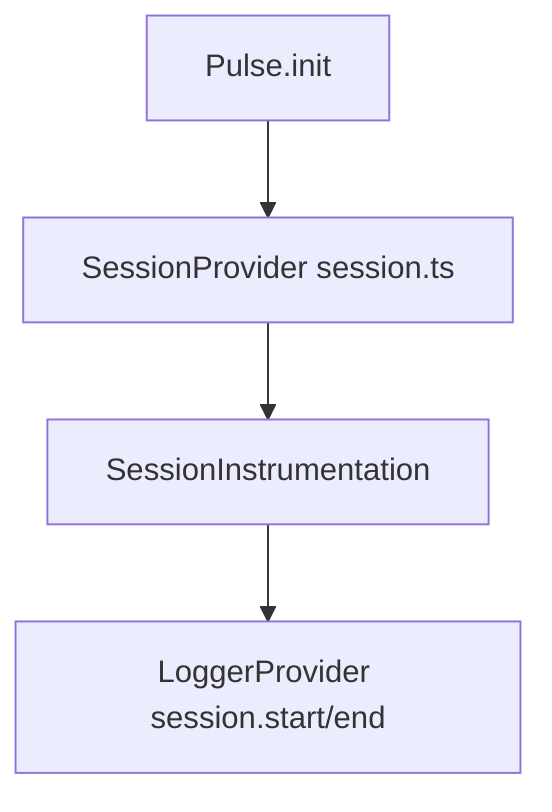
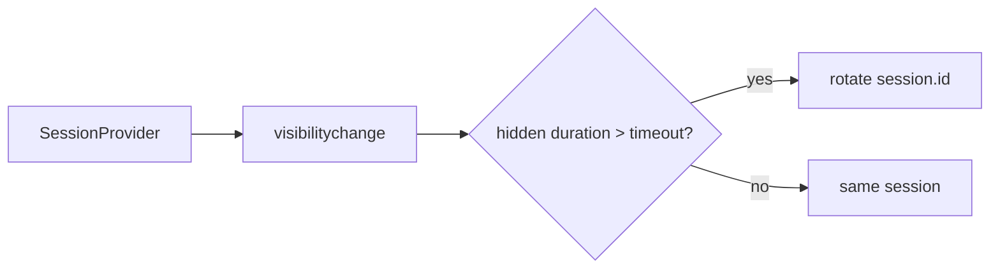
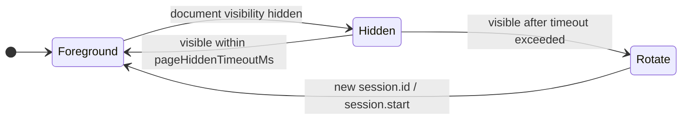

# Session Instrumentation — SPEC.md

Package: `@dreamhorizonorg/pulse-web`  
File: `pulse-web-otel/docs/instrumentations/session/SPEC.md`

---

## 1. Goal

Define **browser session lifecycle** (`SessionProvider`), **persistence of installation and user identity**, and **OTLP log emission** for `session.start` / `session.end` via `SessionInstrumentation`.

---

## 2. Assumptions

- Same assumptions as SDK core — [`../../sdk-core/assumptions/SPEC.md`](../../sdk-core/assumptions/SPEC.md).
- `SessionInstrumentation` runs only after successful `Pulse.init` when the session feature is not locally disabled and remote gate allows it.

---

## 3. Requirements

**R6 — Session** (full text): [`../../sdk-core/requirements/SPEC.md`](../../sdk-core/requirements/SPEC.md).

### Functional (instrumentation)

**SR1 — session.start:** On new session (including first install), emit OTLP log with `pulse.type = session.start` and correct `session.id` / `session.previous_id` / `session.start_reason` when applicable.

**SR2 — session.end:** On rotation or shutdown path, emit `session.end` with duration and end reason attributes.

**SR3 — Uninstall:** `SessionInstrumentation.uninstall()` detaches `SessionProvider` subscription without throwing.

---

## 4. Architectural Design

### 4.1 HLD — provider vs instrumentation (Mermaid)



### 4.2 LD — visibility-driven rotation (Mermaid)



```
Pulse.init → SessionProvider (session.ts)
  └─ SessionInstrumentation.install(sdk)
        └─ sessionProvider.onSessionChange → LoggerProvider.emit(session.start | session.end)
```

### 4.3 Session lifecycle states (Mermaid)



---

## 5. LLD

### 5.1 Session lifecycle (`src/session.ts`)

- `SessionProvider` constructs a `sessionId = crypto.randomUUID()` on creation.
- `installationId` is read from `localStorage["pulse_installation_id"]`; generated once on first load.
- `userId` is persisted to `localStorage["pulse_user_id"]`.
- Session rotation: if the tab is backgrounded for longer than `pageHiddenTimeoutMs`, the next `visibilitychange` to `visible` may rotate the session and drive `session.end` / `session.start`. **Default:** `DEFAULT_PAGE_HIDDEN_TIMEOUT_MS` in `src/session.ts` (**15 minutes**) unless the host passes `pageHiddenTimeoutMs` in `PulseWebConfig`.
- `wasNewInstallation()` returns `true` on the very first page load (no prior installation ID).

### 5.2 `SessionInstrumentation` (`src/instrumentations/session.ts`)

Subscribes to `SessionProvider` events and emits OTLP logs with semconv keys (`PulseWebSemconv.AttributeKey`, `PulseType`, `LogBody`). Triggers initial `session.start` via `emitInitialSession()`.

### 5.3 Cross-SPEC contracts

`pulse.type` table: [`../../sdk-core/data-contract/SPEC.md`](../../sdk-core/data-contract/SPEC.md).

---

## 6. Test Coverage

### 6.1 Scenario matrix (Given / When / Then)

| ID | Type | Given | When | Then | Tests |
|----|------|-------|------|------|-------|
| SE-P1 | positive | SESSION gate on | new install | `session.start` with ids | `m1.test.ts` per sdk-core test-coverage |
| SE-N1 | negative | feature off | init | no session logs | `m1.test.ts` (SessionInstrumentation block / no-install paths); no dedicated registry `SESSION` gate Vitest |
| SE-E1 | edge | long background | visibility visible after timeout | rotation + `session.end`/`session.start` | `session.ts` + persistence tests |
| SE-E2 | edge | uninstall | provider change | subscription detached | `m1.test.ts` — uninstall stops session events |

### 6.2 Additional suites

- [`../../sdk-core/test-coverage/SPEC.md`](../../sdk-core/test-coverage/SPEC.md) §5.3 — `m1.test.ts` (`SessionProvider`, `SessionInstrumentation`).
- `src/__tests__/session-persistence.test.ts`, `src/__tests__/session-sampling-rate.test.ts` — session persistence / sampling behaviour.

---

## 7. Known Bugs & Gaps

[`../../sdk-core/known-gaps-and-open-questions/SPEC.md`](../../sdk-core/known-gaps-and-open-questions/SPEC.md) where they touch identity/session UX.

---

## 8. Redundancy & Cleanup Notes

Prior `sdk-lifecycle.md` session fragments absorbed into this SPEC and [`../../sdk-core/architecture-and-bootstrap/SPEC.md`](../../sdk-core/architecture-and-bootstrap/SPEC.md).

---

## 9. Open Questions

[`../../sdk-core/known-gaps-and-open-questions/SPEC.md`](../../sdk-core/known-gaps-and-open-questions/SPEC.md) §9.
