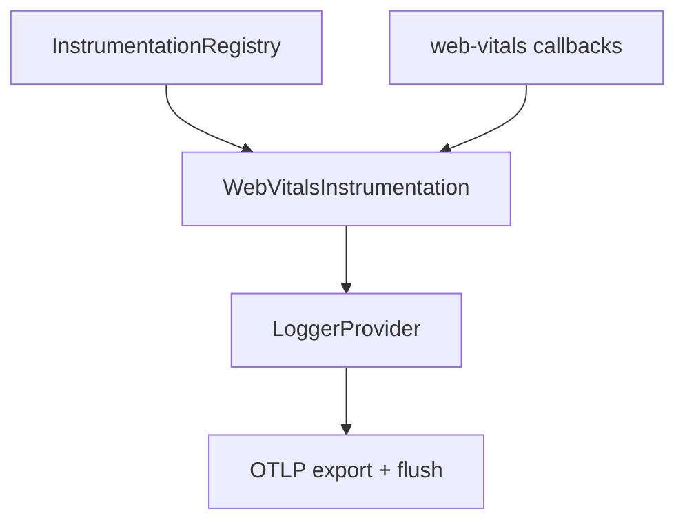
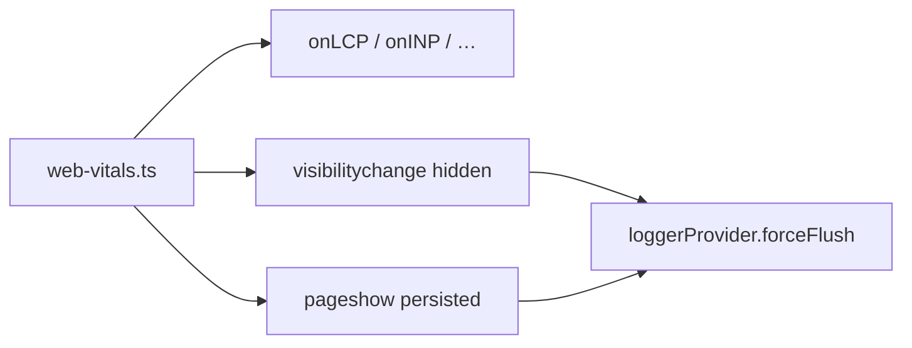
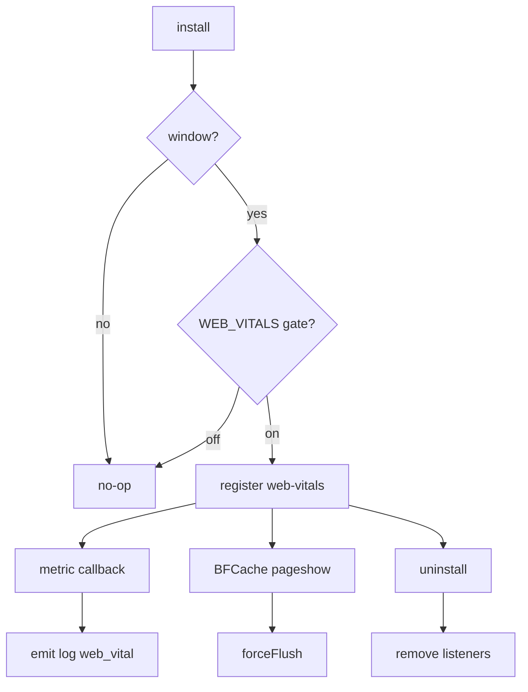

# Web Vitals Instrumentation — SPEC.md

Package: `@dreamhorizonorg/pulse-web`  
File: `pulse-web-otel/docs/instrumentations/web-vitals/SPEC.md`

---

## 1. Goal

Emit **Core Web Vitals** and related paint/timing signals as OTLP **log records** with `pulse.type = web_vital`, using the browser **`web-vitals`** library callbacks (`onLCP`, `onINP`, `onCLS`, `onFCP`, `onFID`, `onTTFB`). **Plan B:** log events (not OTel metrics histograms, not a separate dashboard-only UI channel).

---

## 2. Assumptions

- **Web-only — no Android/React Native parity:** Mobile SDKs do not emit browser CWV; this instrumentation exists only for `platform = web`.
- **FID deprecation:** Chrome pushes **INP** as the responsiveness metric; **FID** remains wired via `onFID` for older browsers / transitional reporting — treat INP as primary for interaction readiness.
- **`window` required:** `install()` returns immediately when `typeof window === "undefined"` (SSR/build).

---

## 3. Requirements

**R1 — OTLP logs:** Each metric emission uses `LoggerProvider` + body `web_vital` (semconv `LogBody.WEB_VITAL`).

**R2 — Metrics:** Register handlers for **LCP**, **INP**, **CLS**, **FCP**, **FID**, **TTFB** via `web-vitals` entrypoints.

**R3 — Attributes:** Every log includes `pulse.type`, `web_vital.name`, `web_vital.value`, `web_vital.rating`; optional `web_vital.navigation_type` when `Metric.navigationType` is set.

**R4 — Flush:** On `visibilitychange` → hidden and `pageshow` with `event.persisted` (BFCache restore), call `loggerProvider.forceFlush()` so Buffered batches exit before tab discard.

**R5 — Gating:** Subject to `InstrumentationRegistry` + `PulseFeature.WEB_VITALS` and local `instrumentations.webVitals.enabled`.

---

## 4. Architectural Design

### Why Plan B (log events) over Plan A (OTel metrics histogram)

**Plan A** (OTel metrics histogram): good for aggregation backends tuned for metrics pipelines; would duplicate schema work already normalized as logs in Pulse mobile/web alignment.

**Plan B** (chosen): OTLP **logs** mirror other Pulse semantic logs (`pulse.type`), reuse export filters and ClickHouse log pipelines, and carry Google `rating` buckets (`good` / `needs-improvement` / `poor`) verbatim.

**Plan C** (UI-only): rejected — no collector telemetry.

### 4.1 HLD — vitals vs export 

### 4.2 LD — handlers and flush hooks 

### 4.3 Flows and edge cases 

---

## 5. LLD

### 5.1 Signal type

| Attribute key | Type | Source | Required | Notes |
|---|---|---|---|---|
| `pulse.type` | string | semconv | Yes | Always `web_vital` |
| `web_vital.name` | string | `Metric.name` | Yes | `LCP`, `INP`, `CLS`, `FCP`, `FID`, `TTFB`, … |
| `web_vital.value` | number | `Metric.value` | Yes | Unit depends on metric (ms, score, …) |
| `web_vital.rating` | string | `Metric.rating` | Yes | `good` \| `needs-improvement` \| `poor` |
| `web_vital.navigation_type` | string | `Metric.navigationType` | No | When library provides it |
| `web_vital.context` | string | derived from `navigationType` | No | `pageload` (all current browsers); `navigation` when Chrome Soft Nav API is GA — Phase 2 |
| `web_vital.delta` | number | `Metric.delta` | No | Incremental change since last callback; emitted when `reportAllChanges: true` — Phase 2 |
| `navigation_id` | string (UUID v4) | `GlobalAttributesProcessor` | No | Reset per navigation by `NavigationInstrumentation`; enables per-route CLS/INP aggregation — Phase 2 |
| `session.id` | string | global attrs processor | Yes | Inherited on export |
| `screen.name` | string | global attrs processor | No | Inherited |
| `platform` | string | Resource (`os.name` and `platform` keys from `buildMergedResource`) | Yes | `web` |

**Phase 2 attributes** (`navigation_id`, `web_vital.delta`, `web_vital.context`) are planned but not yet implemented. See `PLAN-phase2-per-route-vitals.md`.

### 5.2 Metric coverage

| Metric | Role |
|---|---|
| **LCP** | Largest Contentful Paint |
| **INP** | Interaction to Next Paint (successor to FID for responsiveness) |
| **CLS** | Cumulative Layout Shift |
| **FCP** | First Contentful Paint |
| **FID** | First Input Delay (legacy; still subscribed for transitional dashboards) |
| **TTFB** | Time to First Byte |

### 5.3 React SPA behaviour

- Vitals run in the **browser** after hydration; React itself does not wrap the handlers — any SPA framework works as long as `window`/`document` exist.
- **Strict Mode** double-mount in dev may duplicate subscription lifecycle; instrumentation registers once per successful `install()` — rely on registry not calling `install` twice.

### 5.4 Next.js App Router behaviour

- **Soft navigations** (client-side transitions) cause `web-vitals` to report **new** metric rounds for the active route when the browser schedules fresh paints/interactions — no separate Pulse hook is required inside `web-vitals.ts`.
- **SSR:** server produces no vitals; first client paint drives LCP/FCP/TTFB for that navigation.

### 5.5 Next.js Pages Router behaviour

- Traditional route changes still run in one long-lived document — `web-vitals` continues across `routeChangeComplete`; BFCache `pageshow` flush covers restore scenarios.

---

## 6. Test Coverage

### 6.1 Scenario matrix (Given / When / Then)

| ID | Type | Given | When | Then | Tests |
|----|------|-------|------|------|-------|
| W-P1 | positive | gate on | LCP fires | log with `web_vital.*` attrs | `web-vitals-instrumentation.test.ts` |
| W-N1 | negative | gate off | install | no web-vitals subscription | same |
| W-E1 | edge | tab hidden | visibilitychange | `forceFlush` called | same |
| W-E2 | edge | BFCache restore | pageshow persisted | `forceFlush` | R4 |
| W-E3 | edge | uninstall | metric event | no emit | same |

### 6.2 Playwright E2E (`examples/ecommerce-demo/e2e/`)

Master index: [`../../sdk-core/test-coverage/SPEC.md`](../../sdk-core/test-coverage/SPEC.md) §6.3 — **`@WebVitals`**: TTFB, FCP, LCP, INP (tab hide), FID (Chromium), CLS; SPA flush + `screen.name`; feature gate off.

### `src/__tests__/web-vitals-instrumentation.test.ts`

- Registers `onLCP`, `onINP`, `onCLS`, `onFID`, `onFCP`, `onTTFB`.
- Emitted attributes include `pulse.type`, `web_vital.name`, `web_vital.value`, `web_vital.rating`.
- `visibilitychange` hidden → `forceFlush`; `pageshow` persisted → flush.
- Gate-off / uninstall removes listeners.

### Manual QA (absorbed from `examples/ecommerce-demo/MANUAL-WEB-VITALS-DEMO.md`)

- Enable **`pulse_web_js`** feature with `web_vitals` sample rate and mock config JSON path so logs are not blacklist-filtered.
- Optional env/query toggles: `VITE_PULSE_WEB_VITALS_ENABLED`, `?pulse_wv_enabled=` — merge into `PulseProvider` config for local opt-in/out.
- Use JSON OTLP format + collector when validating `/v1/logs` payloads during demo manual passes.

---

## 7. Known Bugs & Gaps

### P0 (data contract — none identified)

No confirmed **P0** incorrect vital values attributable to this instrumentation layer at synthesis time.

### Other gaps

- **FID vs INP product messaging:** dashboards should prefer INP where available.
- **Per-route CLS/INP:** Phase 1 exports cumulative values per route via `notifySoftNavigation()` flush. Phase 2 adds `reportAllChanges: true` on `onCLS`/`onINP` + `web_vital.delta` + `navigation_id` — enabling per-route aggregation in ClickHouse without any experimental browser API. `reportSoftNavs` (Chrome Soft Nav API) is not available in any released web-vitals npm version; `web_vital.context = "navigation"` will fire only when that API reaches GA. See `PLAN-phase2-per-route-vitals.md`.

---

## 8. Redundancy & Cleanup Notes

Deleted after triple-eval:

| Path |
|---|
| `pulse-web-otel/web-sdk-plan/v2-web-vitals/` (full folder) |
| `pulse-web-otel/web-sdk-plan/v1/02-instrumentations/web-vitals.md` |
| `pulse-web-otel/examples/ecommerce-demo/MANUAL-WEB-VITALS-DEMO.md` |

---

## 9. Open Questions

1. Should we drop `onFID` subscription once browser share is negligible?
2. ~~Should `navigation_id` become a first-class attribute once backend schema supports it?~~ **Resolved:** `navigation_id` uses map access only (`LogAttributes['navigation_id']`); no materialized column needed. Planned for Phase 2.
