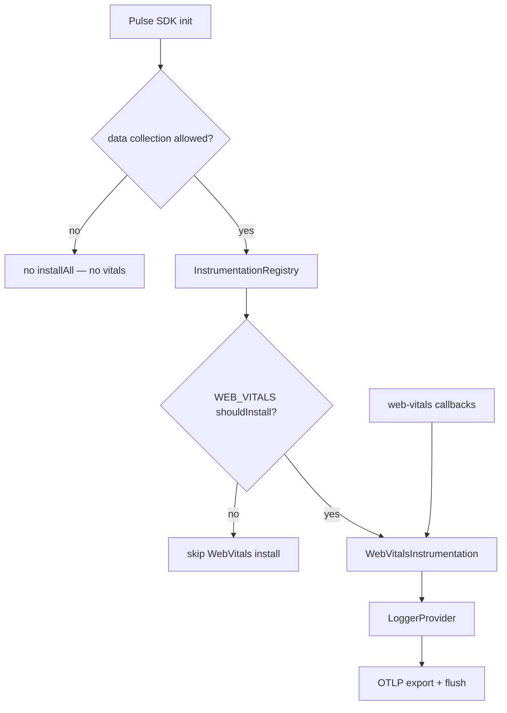
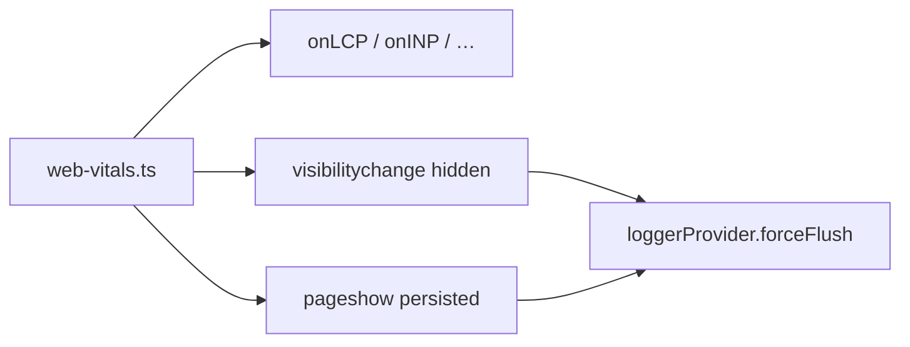
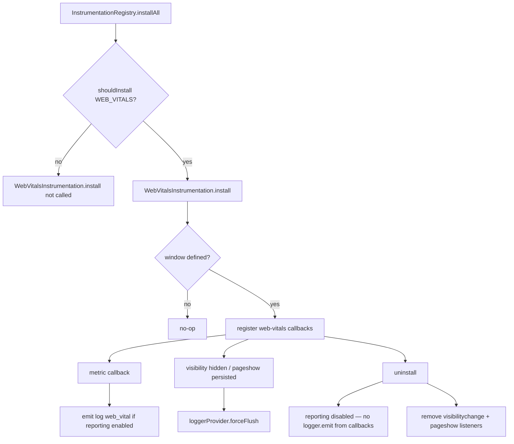

# Web Vitals Instrumentation — SPEC.md

Package: `@dreamhorizonorg/pulse-web`  
File: `pulse-web-otel/docs/instrumentations/web-vitals/SPEC.md`

---

## 1. Goal

Emit **Core Web Vitals** and related paint/timing signals as OTLP **log records** with `pulse.type = web_vital`, using the browser **`web-vitals`** library callbacks (`onLCP`, `onINP`, `onCLS`, `onFCP`, `onTTFB`). Signals are **logs**, not native OTel metrics histograms and not UI-only aggregates (see §4).

---

## 2. Assumptions

- **Web-only — no Android/React Native parity:** Mobile SDKs do not emit browser CWV; this instrumentation exists only for `platform = web`.
- **INP for responsiveness:** Google retired **FID** from the `web-vitals` v5 API; **INP** is the supported interaction-latency metric on `web-vitals` ^5.x.
- **`window` required:** `install()` returns immediately when `typeof window === "undefined"` (SSR/build).

---

## 3. Requirements

**R1 — OTLP logs:** Each metric emission uses `LoggerProvider` + body `web_vital` (semconv `LogBody.WEB_VITAL`).

**R2 — Metrics:** Register handlers for **LCP**, **INP**, **CLS**, **FCP**, **TTFB** via `web-vitals` entrypoints.

**R3 — Attributes:** Every log includes `pulse.type`, `web_vital.name`, `web_vital.value`, `web_vital.rating`, `web_vital.delta`, `web_vital.navigation_type`, and `web_vital.context` (from `Metric.navigationType` on `web-vitals` ^5.x: `soft-navigation` → `navigation`, else `pageload`). `navigation_id` is injected from `PulseGlobalAttributesProcessor` when set by `NavigationInstrumentation` (per-route aggregation). **Wire shape:** keys in §5.1 sourced from `Metric.*` or derived in the emit callback are set in `web-vitals.ts`. Keys sourced from **global attrs processor** or **Resource** are merged on export (same OTLP log record), not assigned only inside this file.

**R4 — Flush:** On `visibilitychange` → hidden and `pageshow` with `event.persisted` (BFCache restore), call `loggerProvider.forceFlush()` so Buffered batches exit before tab discard.

**R5 — Gating:** Subject to `InstrumentationRegistry` + `PulseFeature.WEB_VITALS` and local `instrumentations.webVitals.enabled`. Local `enabled: false` is a **kill switch** (remote gate cannot turn vitals back on).

**R6 — Registry single-owner install:** `InstrumentationRegistry.installAll()` must not double-register the same instrumentation instance if called twice without an intervening `uninstallAll()` (see `instrumentation-registry.ts`).

**R7 — Registry fault isolation:** If one registered instrumentation throws during `installAll()`, remaining instrumentations (including Web Vitals when gated on) must still be installed where applicable; `installAllCompleted` must settle consistently (see `instrumentation-registry.ts`).

### 3.1 Authoritative `src/` paths

| Path | Role |
|------|------|
| `src/instrumentations/web-vitals.ts` | `web-vitals` callbacks, OTLP log emit, post-`uninstall()` emit suppression, `visibilitychange` / `pageshow` flush listeners |
| `src/instrumentation-registry.ts` | Invokes `WebVitalsInstrumentation.install` only when `shouldInstall(WEB_VITALS)` passes |
| `src/sdk.ts` | Consent / collection policy: skips provider setup and `registry.installAll()` when collection is disallowed |
| `src/processors/global-attrs-processor.ts` | Merges `navigation_id`, `session.id`, `screen.name` (and related common attrs) onto log records at export |

---

## 4. Architectural Design

### Signal shape: OTLP logs (chosen)

Web vitals are emitted as **OTLP log records** with `pulse.type = web_vital` and body `web_vital`, consistent with other Pulse semantic logs.

**Why logs:** Reuses the same export path, filters, and ClickHouse log pipelines as the rest of web/mobile RUM logs; carries Google's `rating` text buckets (`good` / `needs-improvement` / `poor`) without defining a parallel metrics schema.

**Alternatives not used**

| Approach | Status | Reason |
|----------|--------|--------|
| Native **OTel metrics** (histograms / gauges for each vital) | Not used | Fits metrics-first backends well, but duplicates contract work already expressed as logs for Pulse mobile/web alignment. |
| **UI-only** vitals (no OTLP / no collector) | Rejected | No durable telemetry for operators or downstream analytics. |

### 4.1 HLD — vitals vs export

### 4.2 LD — handlers and flush hooks

### 4.3 Flows and edge cases

**Notes:** (1) **Consent** is enforced in `sdk.ts` before `installAll()` runs — same effect as “gate off” for vitals (instrumentation never installs). (2) **`web-vitals`** does not return unsubscribe handles; **`uninstall()`** clears Pulse-side reporting and DOM flush listeners so **no further OTLP vitals** are emitted even if the library still invokes callbacks.

---

## 5. LLD

### 5.1 Signal type

| Attribute key | Type | Source | Required | Notes |
|---|---|---|---|---|
| `pulse.type` | string | semconv | Yes | Always `web_vital` |
| `web_vital.name` | string | `Metric.name` | Yes | `LCP`, `INP`, `CLS`, `FCP`, `TTFB` (`web-vitals` v5+; **not** `FID` — removed upstream) |
| `web_vital.value` | number | `Metric.value` | Yes | Unit depends on metric (ms, score, …) |
| `web_vital.rating` | string | `Metric.rating` | Yes | `good` \| `needs-improvement` \| `poor` |
| `web_vital.navigation_type` | string | `Metric.navigationType` | Yes | Always set on `web-vitals` ^5.x `Metric` |
| `web_vital.context` | string | derived from `navigationType` | Yes | `soft-navigation` → `navigation`; any other `navigationType` → `pageload` |
| `web_vital.delta` | number | `Metric.delta` | Yes | On `web-vitals` ^5.x every metric includes `delta`; first report often `delta === value`; CLS/INP add incremental emissions when `reportAllChanges: true` on `onCLS` / `onINP` |
| `navigation_id` | string (UUID v4) | `PulseGlobalAttributesProcessor` (set by `NavigationInstrumentation`) | No | One id per cold/SPA/BFCache navigation; **omitted** until set — enables per-route CLS/INP aggregation |
| `session.id` | string | global attrs processor | Yes | Inherited on export |
| `screen.name` | string | global attrs processor | No | Inherited |
| `platform` | string | global attrs processor (`getCommonAttrs` sets `platform: "web"`) | Yes | Also see Resource / `buildMergedResource` for `os.name` and other resource fields per data-contract SPEC |

**Merged attributes:** For exported OTLP, rows above marked **global attrs processor** or **Resource** are applied in `PulseGlobalAttributesProcessor` / resource merge — Vitest for `navigation_id` shape: `global-attrs-processor.test.ts`; full merged log contract: `@WebVitals` Playwright (includes `platform` on vitals).

### 5.2 Metric coverage

| Metric | Role |
|---|---|
| **LCP** | Largest Contentful Paint |
| **INP** | Interaction to Next Paint (successor to FID for responsiveness) |
| **CLS** | Cumulative Layout Shift |
| **FCP** | First Contentful Paint |
| **TTFB** | Time to First Byte |

### 5.3 React SPA behaviour

- Vitals run in the **browser** after hydration; React itself does not wrap the handlers — any SPA framework works as long as `window`/`document` exist.
- **Strict Mode** double-mount in dev may duplicate subscription lifecycle; instrumentation registers once per successful `install()` — rely on registry not calling `install` twice.

### 5.4 Next.js App Router behaviour

- **Soft navigations** (client-side transitions) cause `web-vitals` to report **new** metric rounds for the active route when the browser schedules fresh paints/interactions — no separate Pulse hook is required inside `web-vitals.ts`.
- **SSR:** server produces no vitals; first client paint drives LCP/FCP/TTFB for that navigation.

### 5.5 Next.js Pages Router behaviour

- Traditional route changes still run in one long-lived document — `web-vitals` continues across `routeChangeComplete`; BFCache `pageshow` flush covers restore scenarios.

### 5.6 Per-metric behaviour: hard navigation vs SPA (same document)

Pulse registers each `web-vitals` callback **once** at install; it does **not** re-subscribe on route change. **Navigation semantics** (what fires on cold load vs client-only transition) come from the browser + `web-vitals` library. Pulse adds **`navigation_id`** (from `NavigationInstrumentation` + global attrs processor) on **exported** OTLP so you can slice CLS/INP by route in ClickHouse, and **`Pulse.notifySoftNavigation()`** (router hooks) to flush buffered logs after SPA transitions — see §6.2.

| Metric | Typical meaning on **first** document load | After **SPA** client-side navigation (same `document`, no full reload) |
|--------|---------------------------------------------|------------------------------------------------------------------------|
| **TTFB** | Time to first byte for this navigation | Still reflects the **initial** navigation timing for the document (not a new HTTP navigation). E2E asserts home TTFB keeps `screen.name` `/` after navigating away. |
| **FCP** | First contentful paint for this load | May update when new content paints; library-driven. |
| **LCP** | Largest contentful paint in the lifetime of this document | Can update when a larger paintable element appears (e.g. new route content). |
| **CLS** | Cumulative layout shift (with `reportAllChanges: true`, incremental callbacks + `delta`) | Continues in-document; **per-route** scores use `navigation_id` + `web_vital.delta` aggregation (see `PLAN-phase2-per-route-vitals.md`). |
| **INP** | Worst interaction latency (with `reportAllChanges: true`) | Continues; **per-route** worst uses `navigation_id` + latest `value` per id (same plan doc). |
| **`web_vital.context`** | `pageload` for normal navigations (`navigate`, `reload`, …) | `navigation` when the library reports `navigationType === "soft-navigation"` (requires Chrome Soft Nav API + experimental `web-vitals` build — **not** in the default npm entry we ship today; see §7). |

**Tests:** There is **no** per-metric matrix for “SPA vs hard reload” for every vital. Covered today: **cold load** paths for TTFB/FCP/LCP/CLS/INP in `@WebVitals`; **SPA-specific** assertion for **TTFB + `screen.name`** and **`screen_load` + `navigation_id`** after client nav; Vitest covers emit contract + `soft-navigation` → `web_vital.context` mapping in isolation. **Gap:** explicit E2E for “second route LCP/FCP only” (flaky / product-specific); BFCache flush path is Vitest-only (W-E6).

### 5.7 `web-vitals` dependency

- **Declared:** `web-vitals` **^5.x** in [`package.json`](../../../package.json) (resolve with lockfile in CI).
- **v5 upgrade (shipped):** `onFID` was **removed upstream**; Pulse follows **INP** for responsiveness. See Google’s [Upgrading to v5](https://github.com/GoogleChrome/web-vitals/blob/main/docs/upgrading-to-v5.md) for LCP/INP observer and browser-baseline notes (e.g. LCP finalization tied to trusted user input in newer Chromium).
- **Soft-navigation** (`reportSoftNavs` / `web-vitals/soft-navs`) remains **experimental** upstream until Chrome Soft Nav API is generally available in the library we depend on — see §7. Optional INP options such as `includeProcessedEventEntries` are available upstream; Pulse does not enable them by default.

---

## 6. Test Coverage

### 6.1 Scenario matrix (Given / When / Then)

| ID | Type | Given | When | Then | Tests |
|----|------|-------|------|------|-------|
| W-P1 | positive | WEB_VITALS gate on, `install()` runs | LCP callback fires | `logger.emit` with `web_vital.*` attrs + `LogBody.WEB_VITAL` | `web-vitals-instrumentation.test.ts` |
| W-N1 | negative | feature gate off **or** local `instrumentations.webVitals.enabled: false` | `InstrumentationRegistry.installAll()` **or** `PulseProvider` with kill switch URL | `onLCP` never registered **or** no `web_vital` OTLP | `web-vitals-instrumentation.test.ts` (`InstrumentationRegistry Web Vitals gate`); `@WebVitals` gate-off + `?pulse_wv_enabled=false` (`e2e/web-vitals.spec.ts`) |
| W-N2 | negative | `dataCollectionState` denies collection | `Pulse.init` | SDK does not finish init → `installAll` never runs — no vitals | `integration-simplified-init.test.ts` (TC-C2 / TC-C3); `sdk-lifecycle.test.ts` (`whenReady` + consent denied) |
| W-N1b | negative | Remote `web_vitals` gate **on**, local `?pulse_wv_enabled=false` (ecommerce demo) | Page load + interaction | No `web_vital` OTLP logs | `@WebVitals` · `e2e/web-vitals.spec.ts` |
| W-E1 | edge | installed | `visibilitychange` → hidden | `loggerProvider.forceFlush` | `web-vitals-instrumentation.test.ts` |
| W-E2 | edge | installed | `pageshow` with `persisted` | `forceFlush` | same |
| W-E3 | edge | installed then `uninstall()` | `web-vitals` invokes metric callback again | **No** `logger.emit` (reporting guard; library has no dispose API) | `web-vitals-instrumentation.test.ts` |
| W-E4 | edge | `navigation_id` set in processor | exported web_vital log | OTLP includes `navigation_id` | `@WebVitals` · `e2e/web-vitals.spec.ts`; `global-attrs-processor.test.ts` (unit attrs map) |
| W-E5 | edge | Playwright INP path | Chromium only | stable `PerformanceEventTiming` | `@WebVitals` INP test uses `test.skip` when `browserName !== "chromium"` |
| W-E6 | edge | BFCache restore | `pageshow` persisted | `forceFlush` | Vitest only; E2E **missing** (optional — flaky without flush spy) |
| W-REG1 | edge | `installAll` invoked twice without uninstall | second call | `onLCP` still registered once | `web-vitals-instrumentation.test.ts` |
| W-REG2 | edge | prior `registerAndInstall` throws | `installAll()` | Web Vitals still installs when gated on | `web-vitals-instrumentation.test.ts` |
| W-SPA-TTFB | positive | home loaded, then SPA nav to `/products` | vitals exported | TTFB log still has `screen.name` `/` (initial route) | `e2e/web-vitals.spec.ts` (SPA TTFB test) |
| W-SPA-NAV | positive | SPA client navigation | `navigation_id` on `web_vital` + `screen_load` | New id on spans/logs after nav | `e2e/web-vitals.spec.ts`; `global-attrs-processor.test.ts` |

### 6.2 Playwright E2E (`examples/ecommerce-demo/e2e/`)

**Master index:** [`../../sdk-core/test-coverage/SPEC.md`](../../sdk-core/test-coverage/SPEC.md) §6.3 — tag **`@WebVitals`** (`e2e/web-vitals.spec.ts`).

- **Metrics:** TTFB, FCP, LCP, INP (after tab hide + interaction), CLS (layout shift + tab hide); **never** `web_vital.name = FID` (`web-vitals` v5+; dedicated `@WebVitals` test).
- **Log attributes:** `navigation_id` on vitals; `web_vital.context` / `web_vital.delta` / `web_vital.navigation_type` from `web-vitals` ^5.x `Metric` (Playwright helper asserts `navigation_type` in the known set, `web_vital.value` ≥ 0, `session.id` UUID shape); `platform` = `web` on vitals; `screen.name` on vitals.
- **Internal audit IDs:** **VIT-12** name set = **LCP, INP, CLS, FCP, TTFB** only (no FID). **VIT-10** (FID-only) superseded by the “no FID log” test. **VIT-07** (zero `web_vital` before hide) is **not** asserted for INP/CLS — v5 + `reportAllChanges` can emit those metrics before synthetic `visibilitychange` when the OTLP batch fires.
- **SPA soft navigation:** `PulseRouterEvents` / `useRouterTracking` → `Pulse.notifySoftNavigation()` (`sdk.ts`) → `loggerProvider.forceFlush()` for buffered vitals — **`web-vitals.ts` does not** call `notifySoftNavigation`. Normal batch/export timing still applies.
- **Spans:** SPA `screen_load` includes `navigation_id` after client navigation.
- **Negative paths:** Remote feature gate off (no `web_vital` logs); local kill switch `?pulse_wv_enabled=false` wired from [`Root.tsx`](../../../examples/ecommerce-demo/src/Root.tsx) → `PulseProvider` `instrumentations.webVitals.enabled`.
- **Browsers:** INP test **skips** non-Chromium (see comments in the spec file).
- **Next.js demo:** Subset in `examples/nextjs-demo/e2e/web-vitals.spec.ts` — parity vs ecommerce in test-coverage **§6.4**.

### `examples/ecommerce-demo/src/read-manual-web-vitals-instrumentation.ts`

- URL / env parsing for local `instrumentations.webVitals.enabled` — merged in `Root.tsx`; unit: `src/__tests__/read-manual-web-vitals-instrumentation.test.ts`.

### `src/__tests__/web-vitals-instrumentation.test.ts`

- Registers `onLCP`, `onINP`, `onCLS`, `onFCP`, `onTTFB`; `onCLS` / `onINP` use `{ reportAllChanges: true }`.
- Emitted attributes include `pulse.type`, `web_vital.name`, `web_vital.value`, `web_vital.rating`, `web_vital.delta`, `web_vital.navigation_type`, `web_vital.context` per contract.
- `visibilitychange` hidden → `forceFlush`; `pageshow` persisted → flush.
- Registry gate-off and local `enabled: false` skip installation; `uninstall()` removes flush listeners and **suppresses** further `logger.emit` from metric callbacks.

### `src/__tests__/global-attrs-processor.test.ts`

- `navigation_id` omitted from `getCommonAttrsForMetrics()` until `setNavigationId`; present after set. (End-to-end presence on `web_vital` logs: `@WebVitals` Playwright.)

### Cross-cutting consent (SDK)

- Collection denied / pending at init prevents **all** instrumentations, including web vitals — see **`integration-simplified-init.test.ts`** and **`sdk-lifecycle.test.ts`** (not duplicated inside the vitals suite).

### Manual QA (absorbed from `examples/ecommerce-demo/MANUAL-WEB-VITALS-DEMO.md`)

- Enable **`pulse_web_js`** feature with `web_vitals` sample rate and mock config JSON path so logs are not blacklist-filtered.
- Optional env/query toggles: `VITE_PULSE_WEB_VITALS_ENABLED`, `?pulse_wv_enabled=` — merged in ecommerce **`Root.tsx`** into `PulseProvider` `config.instrumentations` for local opt-in/out (see `readManualWebVitalsInstrumentation` helper).
- Use JSON OTLP format + collector when validating `/v1/logs` payloads during demo manual passes.

---

## 7. Known Bugs & Gaps

### P0 (data contract — none identified)

No confirmed **P0** incorrect vital values attributable to this instrumentation layer at synthesis time.

### Other gaps

- **INP dashboards:** Prefer **INP** for responsiveness (FID is not emitted on `web-vitals` ^5.x).
- **Per-route CLS/INP:** `onCLS` / `onINP` use `reportAllChanges: true`; logs include `web_vital.delta`. `navigation_id` (from `NavigationInstrumentation` + global attrs processor) scopes vitals and `screen_load` spans per navigation. `web_vital.context` maps from `Metric.navigationType` (`soft-navigation` → `navigation`, else `pageload`). `reportSoftNavs` (Chrome Soft Nav API) is not in the default `web-vitals` npm entry yet. Design reference: `PLAN-phase2-per-route-vitals.md`.

---

## 8. Redundancy & Cleanup Notes

Deleted after triple-eval:

| Path |
|---|
| `pulse-web-otel/web-sdk-plan/v2-web-vitals/` (full folder) |
| `pulse-web-otel/web-sdk-plan/v1/02-instrumentations/web-vitals.md` |
| `pulse-web-otel/examples/ecommerce-demo/MANUAL-WEB-VITALS-DEMO.md` |

---

## 9. Open Questions

1. ~~Should we drop `onFID` subscription once browser share is negligible?~~ **Resolved:** `web-vitals` v5+ removed `onFID`; Pulse uses **INP** only for interaction latency in shipped vitals (see §5.2).
2. ~~Should `navigation_id` become a first-class attribute once backend schema supports it?~~ **Resolved:** `navigation_id` uses map access only (`LogAttributes['navigation_id']`); no materialized column needed. **Shipped** in SDK (see §5.1).
