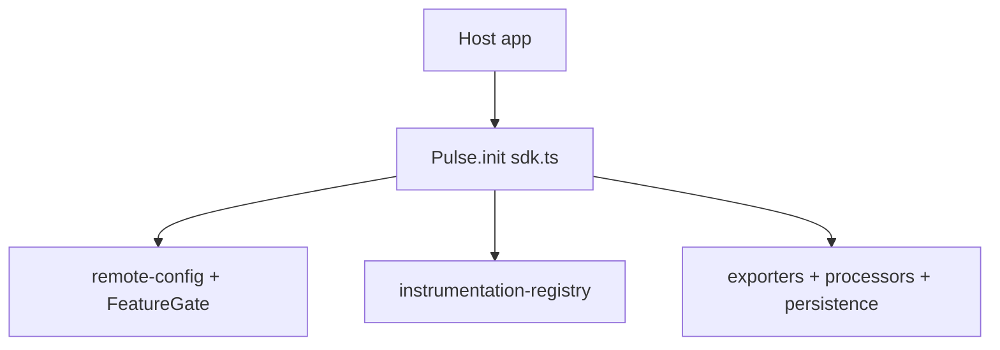
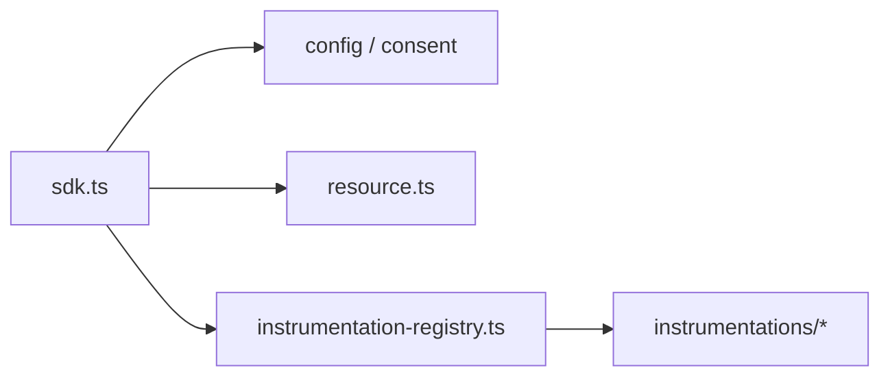
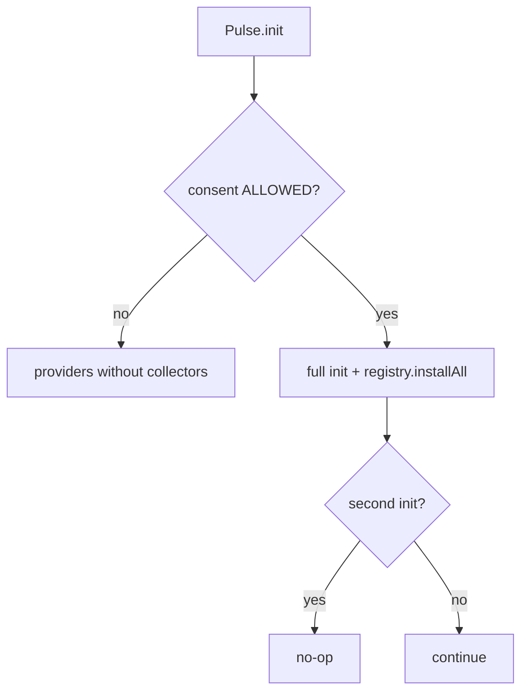

# SDK Core — SPEC.md

Package: `@dreamhorizonorg/pulse-web`  
File: `pulse-web-otel/docs/sdk-core/SPEC.md`

---

## 1. Goal

Define the **non-instrumentation core** of the Pulse Web SDK: bootstrap lifecycle, configuration, consent, remote config and gates, OTLP export pipeline, persistence, and the **`Pulse` public API**. **Session RUM** (`SessionProvider` + `SessionInstrumentation`) is specified in [`../instrumentations/session/SPEC.md`](../instrumentations/session/SPEC.md).

Topic SPECs live in **subfolders** of this directory, each with its own **`SPEC.md`** (same convention as [`../instrumentations/screen-signals/SPEC.md`](../instrumentations/screen-signals/SPEC.md)).

---

## 2. Assumptions

Summary: browser-only v0.1, bundled OTel, `localStorage` for cache/identity, Android/RN `pulse.type` parity, remote config cached then refreshed in background.

Authoritative list: [`assumptions/SPEC.md`](assumptions/SPEC.md).

---

## 3. Requirements

**R1–R10** and NFRs: [`requirements/SPEC.md`](requirements/SPEC.md).

---

## 4. Architectural Design

```
Host App
  │
  ▼
Pulse.init(config)          ← src/sdk.ts
  │
  ├─ setLevel + apiKey guard + validateConfig / consent / SessionProvider / UA / resource
  ├─ remote config cache + FeatureGate + ExportSamplingGate + processors
  ├─ createProviders + drainBufferedOtlpExports + pagehide + registry.installAll
  └─ fetchInBackground
```

### 4.1 HLD — init vs exporters (Mermaid)



### 4.2 LD — core modules (Mermaid)



### 4.3 Flows — consent and idempotent init (Mermaid)



Full tree and init step list: [`architecture-and-bootstrap/SPEC.md`](architecture-and-bootstrap/SPEC.md).

---

## 5. LLD

### 5.1 Topic SPEC index

| Topic | SPEC |
|--------|------|
| Assumptions | [`assumptions/SPEC.md`](assumptions/SPEC.md) |
| Requirements (R1–R10) | [`requirements/SPEC.md`](requirements/SPEC.md) |
| Architecture + bootstrap sequence | [`architecture-and-bootstrap/SPEC.md`](architecture-and-bootstrap/SPEC.md) |
| `pulse.type` + shared attributes | [`data-contract/SPEC.md`](data-contract/SPEC.md) |
| Config + consent | [`config-and-consent/SPEC.md`](config-and-consent/SPEC.md) |
| Remote config, feature gate, sampling | [`remote-config-features-and-sampling/SPEC.md`](remote-config-features-and-sampling/SPEC.md) |
| OTLP exporters + persistence | [`exporters-and-persistence/SPEC.md`](exporters-and-persistence/SPEC.md) |
| `Pulse.*` public API | [`public-api/SPEC.md`](public-api/SPEC.md) |
| Session lifecycle + logs | [`../instrumentations/session/SPEC.md`](../instrumentations/session/SPEC.md) |
| Vitest index | [`test-coverage/SPEC.md`](test-coverage/SPEC.md) |
| Known gaps + open questions | [`known-gaps-and-open-questions/SPEC.md`](known-gaps-and-open-questions/SPEC.md) |

### 5.2 Primary `src/` touchpoints

`src/sdk.ts`, `src/config.ts`, `src/consent.ts`, `src/remote-config.ts`, `src/feature-gate.ts`, `src/instrumentation-registry.ts`, `src/exporters.ts`, `src/before-send.ts`, `src/resource.ts`, `src/processors/`, `src/persistence/`, `src/sampling/`, `src/utils/ua-parser.ts`. Session: `src/session.ts`, `src/instrumentations/session.ts` → [`../instrumentations/session/SPEC.md`](../instrumentations/session/SPEC.md).

### 5.3 Topic LLD depth (§5 in each sub-SPEC)

Each topic file under `docs/sdk-core/<topic>/SPEC.md` has an expanded **§5 LLD** (not only §4 Mermaid): assumption→code mapping, per-requirement notes, shutdown ordering, config validation tables, processor/export details, registry↔feature map, test conventions, and gap-triage rubric. Start from the topic row in **§5.1** above.

---

## 6. Test Coverage

### 6.1 Requirement → coverage map

| Requirement area | Primary tests / SPEC |
|-------------------|----------------------|
| R1–R10 + NFRs | [`test-coverage/SPEC.md`](test-coverage/SPEC.md) §5–§6 |
| Bootstrap sequence | [`architecture-and-bootstrap/SPEC.md`](architecture-and-bootstrap/SPEC.md) + `sdk-lifecycle.test.ts` (see test-coverage) |
| Session | [`../instrumentations/session/SPEC.md`](../instrumentations/session/SPEC.md) §6 + `m1.test.ts` |

### 6.2 Scenario matrix (rollup)

| ID | Type | Given | When | Then | Tests |
|----|------|-------|------|------|-------|
| SDK-P1 | positive | valid config + ALLOWED | `Pulse.init` | `isInitialized` + registry installed | `sdk-lifecycle` / `m1` per test-coverage |
| SDK-N1 | negative | DENIED consent | init | no collectors / gated | `sdk-lifecycle.test.ts` — `shouldNoOpWhenConsentIsDenied` / `shouldNoOpWhenConsentIsPending` |
| SDK-E1 | edge | double init | second call | idempotent | `sdk.ts` |
| SDK-E2 | edge | pagehide | tab background | flush / persist per exporters SPEC | exporters SPEC |

### 6.3 Playwright E2E index

All Playwright scenario titles and the **Next.js vs React parity matrix** live in [`test-coverage/SPEC.md`](test-coverage/SPEC.md) §6.3–§6.5. Package script: `yarn e2e:web-sdk-gates`.

---

## 7. Known Bugs & Gaps

[`known-gaps-and-open-questions/SPEC.md`](known-gaps-and-open-questions/SPEC.md).

---

## 8. Redundancy & Cleanup Notes

See [`known-gaps-and-open-questions/SPEC.md`](known-gaps-and-open-questions/SPEC.md) §8.

---

## 9. Open Questions

See [`known-gaps-and-open-questions/SPEC.md`](known-gaps-and-open-questions/SPEC.md) §9.
