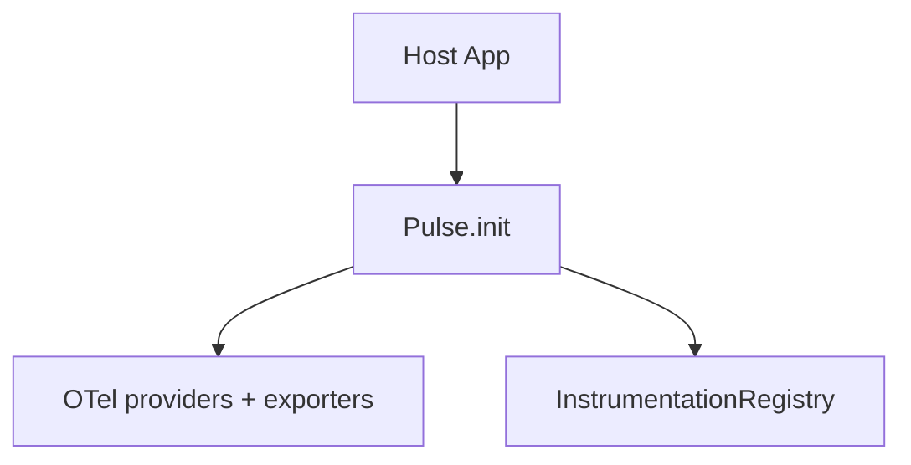
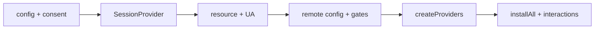
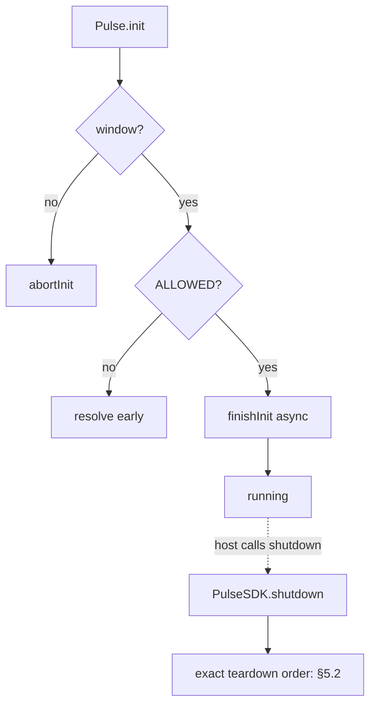
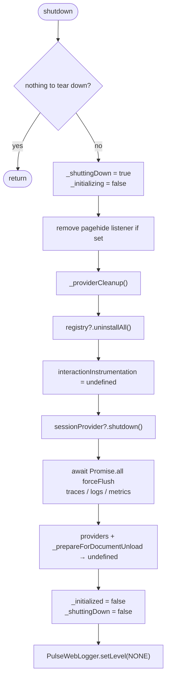

# SDK Core — Architecture and bootstrap — SPEC.md

Package: `@dreamhorizonorg/pulse-web`  
File: `pulse-web-otel/docs/sdk-core/architecture-and-bootstrap/SPEC.md`

---

## 1. Goal

Describe **bootstrap architecture** and the **ordered `Pulse.init` sequence** from host call through provider wiring, registry install, and background config fetch.

---

## 2. Assumptions

See [`../assumptions/SPEC.md`](../assumptions/SPEC.md).

---

## 3. Requirements

Covers **R1** (init completion), **R5** (shutdown teardown of listeners + flush), and sequencing implied by **R2–R4, R8–R10** — see [`../requirements/SPEC.md`](../requirements/SPEC.md).

---

## 4. Architectural Design

```
Host App
  │
  ▼
Pulse.init(config)          ← singleton facade (src/sdk.ts)
  │
  ├─ PulseWebLogger.setLevel(config.logLevel)
  ├─ empty apiKey guard → warn + return (no validateConfig)
  ├─ validateConfig()        ← src/config.ts
  ├─ isDataCollectionAllowed()  ← src/consent.ts
  ├─ SessionProvider         ← src/session.ts
  ├─ UA parse + OS version   ← src/utils/ua-parser.ts  (async <200ms)
  ├─ buildMergedResource()   ← src/resource.ts  (os.name=web, platform=web stamped here)
  │
  ├─ SdkConfigFetcher.loadCached()  ← localStorage → PulseSdkConfig
  ├─ FeatureGate(sdkConfig)         ← src/feature-gate.ts
  ├─ ExportSamplingGate(sdkConfig)  ← src/sampling/export-sampling-gate.ts
  ├─ PulseGlobalAttributesProcessor ← src/processors/global-attrs-processor.ts
  ├─ SignalFilterProcessor           ← src/processors/signal-filter-processor.ts
  │
  ├─ createProviders(exporterConfig, resource, processors)  ← src/exporters.ts
  │     └─ WebTracerProvider + LoggerProvider + MeterProvider
  │
  ├─ drainBufferedOtlpExports()  ← src/persistence/drain-buffered-exports.ts
  ├─ bindPagehideFlush()         ← pagehide → forceFlush all providers
  ├─ bindGlobalProviders()       ← OTel global provider registration
  │
  ├─ InstrumentationRegistry.installAll()  ← src/instrumentation-registry.ts
  │     ├─ SessionInstrumentation
  │     ├─ ClicksInstrumentation
  │     ├─ WebVitalsInstrumentation
  │     ├─ NetworkInstrumentation
  │     ├─ NavigationInstrumentation
  │     └─ ErrorInstrumentation
  │
  ├─ InteractionInstrumentation (registered separately)
  │
  └─ SdkConfigFetcher.fetchInBackground()  (async, post-init)
```

### 4.1 HLD — bootstrap boundary (Mermaid)



### 4.2 LD — ordered subsystems (Mermaid)



### 4.3 Flows — consent, SSR, shutdown (Mermaid)



**Singleton pattern:** `PulseSDK._instance` is a module-level singleton. `Pulse` is exported as `PulseSDK.getInstance()`. There is no factory or class constructor exposed publicly.

**Consent-first design:** The consent check runs before any session or resource construction. GDPR-safe: zero allocations, zero signals when `dataCollectionState !== ALLOWED`.

**Async init race guard:** `_initializing` is set synchronously before the `finishInit` async chain begins. Any concurrent `init()` call during the 200ms OS-version await returns the same in-flight promise rather than double-constructing providers.

---

## 5. LLD

### 5.1 SDK init flow (sequence)

Related: [`../config-and-consent/SPEC.md`](../config-and-consent/SPEC.md) · [`../exporters-and-persistence/SPEC.md`](../exporters-and-persistence/SPEC.md) · [`../remote-config-features-and-sampling/SPEC.md`](../remote-config-features-and-sampling/SPEC.md)

```
Pulse.init(config)
  1. Guard: already initialized or shutting down → return Promise.resolve()
  2. Guard: currently initializing → return this.whenReady()
  3. PulseWebLogger.setLevel(config.logLevel ?? NONE)
  4. Missing / blank apiKey → warn + return Promise.resolve() (**does not** call validateConfig)
  5. try { validateConfig(config) } — throws only if reached; init catches and warns + returns Promise.resolve() on failure
  6. resolveEndpointBaseUrl(apiKey, config.endpoint) → endpointBaseUrl
  7. CONSENT GATE: isDataCollectionAllowed(config.dataCollectionState) → if false, return Promise.resolve() (zero side effects)
  8. Set _initializing = true; begin finishInit() async chain:
     a. abortInitIfUnavailable() — SSR guard (window === undefined → abort)
     b. SessionProvider construction + getOrCreateInstallationId()
     c. parseUserAgent() + getOsVersionAsync() — async, <200ms, uses Client Hints if available
     d. buildMergedResource(config, resolvedOsVersion) — OTel Resource with os.name='web', platform='web'
     e. SdkConfigFetcher.loadCached() — read localStorage["pulse_sdk_config"] → PulseSdkConfig
     f. FeatureGate(sdkConfig), ExportSamplingGate(sdkConfig), PulseGlobalAttributesProcessor
     g. hydrateUserIdentity(persistedUserId, persistedUserProperties)
     h. createProviders(exporterConfig, resource, processors) — builds WebTracerProvider, LoggerProvider, MeterProvider with OTLP exporters
     i. drainBufferedOtlpExports() — replay any IDB-buffered batches from crashed sessions
     j. bindPagehideFlush() — window.addEventListener("pagehide", ...)
     k. bindGlobalProviders() — OTel global trace/logs/metrics registration
     l. emitSdkInitializationLogRecords() — rum.sdk.init.started, rum.sdk.init.span_exporter
     m. InstrumentationRegistry.installAll() — per-feature gate checked per instrumentation
     n. InteractionInstrumentation registration
     o. SdkConfigFetcher.fetchInBackground() — fire-and-forget
     p. _initialized = true; _initializing = false
     q. emitInstallationStartIfNeeded() — `pulse.app.installation.start` on first install
  9. Promise returned from step 8 — same as whenReady()
```

### 5.2 `Pulse.shutdown()` teardown — `PulseSDK.shutdown()` (`src/sdk.ts`)

Flow matches `shutdown()` (approx. L472–L501). **Nothing to tear down** means `!_initialized && !_initializing`.



`_providerCleanup` is `ProviderBundle.cleanup` from `createProviders` (no-op in `exporters.ts` today, still invoked). This method does **not** clear the whole instance (`globalAttrsProcessor`, `registry`, `gate`, etc.).

### 5.3 Why `InteractionInstrumentation` is after `installAll`

Interactions depend on clicks + navigation being active; `InteractionFeature` is constructed with tracer/logger from post-provider wiring. Documented in init tree step **n** vs **m**.

### 5.4 OTel globals

`bindGlobalProviders()` registers the SDK’s `WebTracerProvider` / `LoggerProvider` / `MeterProvider` on the **global** OTel API so auto-instrumentations and manual `trace.getTracer()` share the same pipeline — only call once per successful init.

---

## 6. Test Coverage

### 6.1 Scenario matrix (bootstrap)

| ID | Type | Given | When | Then | Tests |
|----|------|-------|------|------|-------|
| AB-P1 | positive | ALLOWED + window | full finishInit | registry + providers | `sdk-lifecycle`, `integration-simplified-init` |
| AB-N1 | negative | DENIED | init | no SessionProvider construction | `sdk-lifecycle` |
| AB-E1 | edge | concurrent init | overlapping calls | same promise | `sdk-lifecycle` |
| AB-E2 | edge | shutdown mid-init | race | guarded | `sdk-lifecycle` |
| AB-E3 | edge | pagehide not persisted | event | forceFlush | `m8.test.ts` |

### 6.2 Suite index

[`../test-coverage/SPEC.md`](../test-coverage/SPEC.md) — `sdk-lifecycle.test.ts`, `m8.test.ts` (pagehide), `integration-simplified-init.test.ts`.

### 6.3 Playwright E2E traceability

Init idempotency, shutdown, pagehide flush, and BFCache behaviour: **`@M1`**, **`@M8`** in [`../test-coverage/SPEC.md`](../test-coverage/SPEC.md) §6.3.

---

## 7. Known Bugs & Gaps

[`../known-gaps-and-open-questions/SPEC.md`](../known-gaps-and-open-questions/SPEC.md).

---

## 8. Redundancy & Cleanup Notes

Prior `web-sdk-plan/v1/01-foundation/README.md` content rolled into this document and [`../test-coverage/SPEC.md`](../test-coverage/SPEC.md).

---

## 9. Open Questions

[`../known-gaps-and-open-questions/SPEC.md`](../known-gaps-and-open-questions/SPEC.md) §9.
