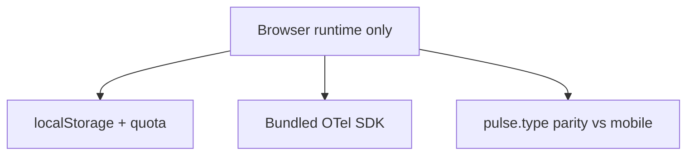
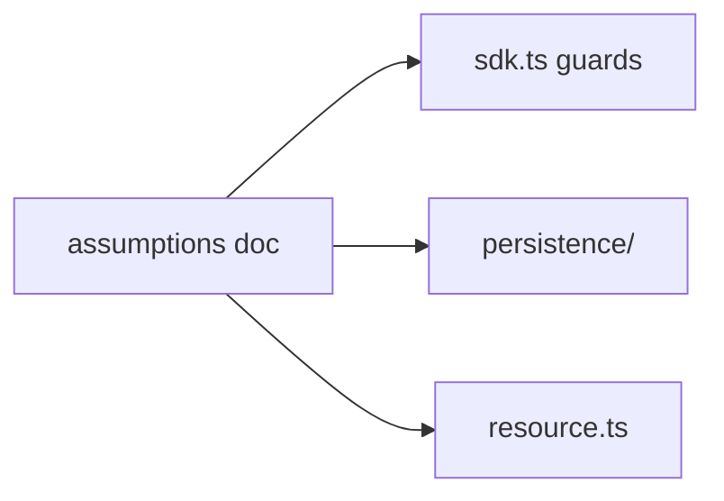
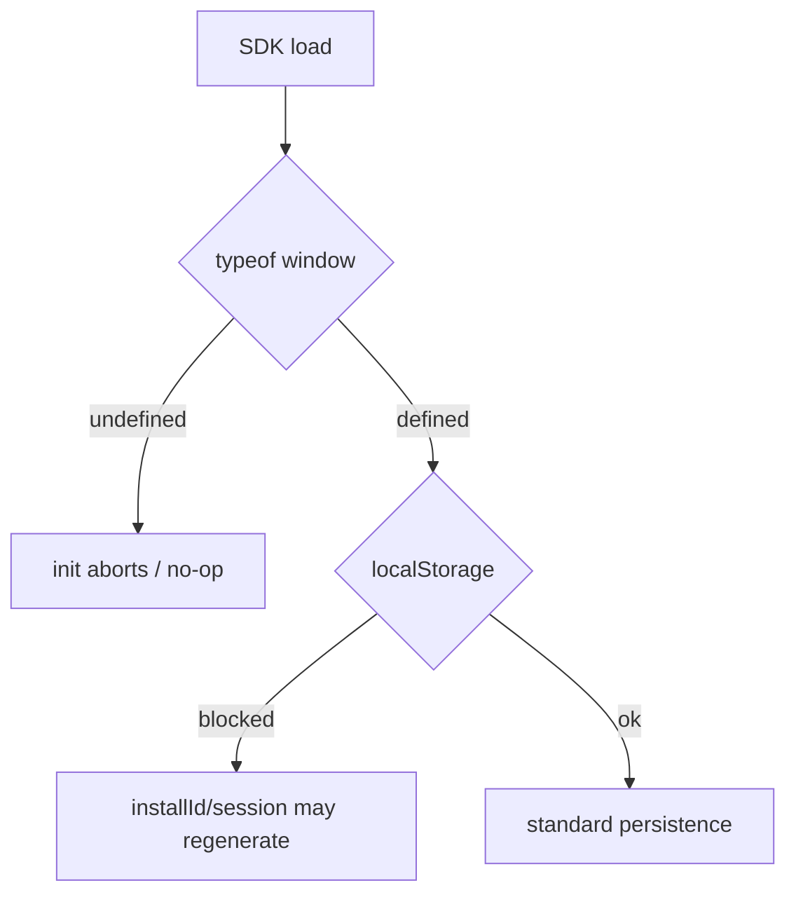

# SDK Core — Assumptions — SPEC.md

Package: `@dreamhorizonorg/pulse-web`  
File: `pulse-web-otel/docs/sdk-core/assumptions/SPEC.md`

---

## 1. Goal

Capture **platform and product assumptions** that bound the Pulse Web SDK core (browser-only delivery, storage expectations, bundled OTel, cross-platform `pulse.type` parity).

---

## 2. Assumptions

- The SDK runs in browser environments only. `window` / `globalThis.window` must be defined; SSR / Node environments receive a no-op init.
- The host app supplies `apiKey` and `dataCollectionState` at init time. Both are required.
- All instrumentations run on the browser main thread. No Web Worker support in v0.1.
- `localStorage` is available for session/user persistence and SDK config cache. A quota of ~5 MB is assumed; the persistence module truncates oldest-first on overflow.
- OTel SDK (traces, logs, metrics) is bundled with the SDK — not expected as a peer dep from the host.
- Android and React Native SDKs share the same `pulse.type` semantic convention; web must not diverge.
- Remote config is fetched in the background after init; the locally cached version from the previous session is used immediately to gate instrumentations.

---

## 3. Requirements

Numbered requirements **R1–R10** live in [`../requirements/SPEC.md`](../requirements/SPEC.md). This document does not restate them.

---

## 4. Architectural Design

### 4.1 HLD — assumption boundaries (Mermaid)

### 4.2 LD — where assumptions bind in code (Mermaid)

### 4.3 Flows — SSR and storage (Mermaid)

Bootstrap shape: [`../architecture-and-bootstrap/SPEC.md`](../architecture-and-bootstrap/SPEC.md).

---

## 5. LLD

### 5.1 Downstream consumers

| Consumer | Path |
|----------|------|
| Requirements index | [`../requirements/SPEC.md`](../requirements/SPEC.md) |
| Rollup / map | [`../SPEC.md`](../SPEC.md) |

### 5.2 Assumption → enforcement (`src/`)

| §2 assumption | Where it is enforced / observable |
|----------------|-----------------------------------|
| Browser-only; SSR no-op | `sdk.ts` — `abortInitIfUnavailable()` when `typeof window === "undefined"`; instrumentations guard `install()`. |
| `apiKey` + `dataCollectionState` required | `config.ts` — `validateConfig()` throws before consent gate if missing. |
| Main thread only | No worker entrypoints in package exports; all DOM/OTel on main thread. |
| `localStorage` + ~5 MB | `session.ts`, `remote-config.ts`, persistence — reads/writes; `persistence/` truncates oldest-first on quota. |
| Bundled OTel | `package.json` dependencies on `@opentelemetry/*`; `exporters.ts` wires providers. |
| `pulse.type` parity | `semconv.ts` + per-instrumentation SPECs; changes need cross-SDK review. |
| Remote config cached then background fetch | `SdkConfigFetcher.loadCached()` sync at init; `fetchInBackground()` after registry install — see [`../remote-config-features-and-sampling/SPEC.md`](../remote-config-features-and-sampling/SPEC.md). |

### 5.3 When an assumption is violated

| Violation | Expected behaviour |
|-----------|---------------------|
| `localStorage` throws (Safari private mode quirks) | Session/installation paths degrade where coded; **no automated test** asserts throw handling — matrix **AS-E1** is **missing** until a Vitest names this path. |
| Invalid cached SDK JSON | Treated as missing cache → `DEFAULT_SDK_CONFIG` merge. |

---

## 6. Test Coverage

### 6.1 Scenario matrix (Given / When / Then)

| ID | Type | Given | When | Then | Tests |
|----|------|-------|------|------|-------|
| AS-P1 | positive | browser + ALLOWED | init | providers wired | `sdk-lifecycle`, `m1` |
| AS-N1 | negative | no `window` | init | abort / no side effects | `sdk-lifecycle` SSR |
| AS-E1 | edge | localStorage blocked | persistence paths | graceful behaviour | **missing** — no Vitest asserts Safari private / `localStorage` throw; treat as **gap** until added (see §5.3) |

### 6.2 Indirect validation

Assumptions are validated indirectly via [`../test-coverage/SPEC.md`](../test-coverage/SPEC.md) (SSR abort, consent no-op, `localStorage` usage in integration tests).

---

## 7. Known Bugs & Gaps

No assumptions-specific P0 items. Product-level gaps: [`../known-gaps-and-open-questions/SPEC.md`](../known-gaps-and-open-questions/SPEC.md).

---

## 8. Redundancy & Cleanup Notes

None.

---

## 9. Open Questions

See [`../known-gaps-and-open-questions/SPEC.md`](../known-gaps-and-open-questions/SPEC.md) §9.
