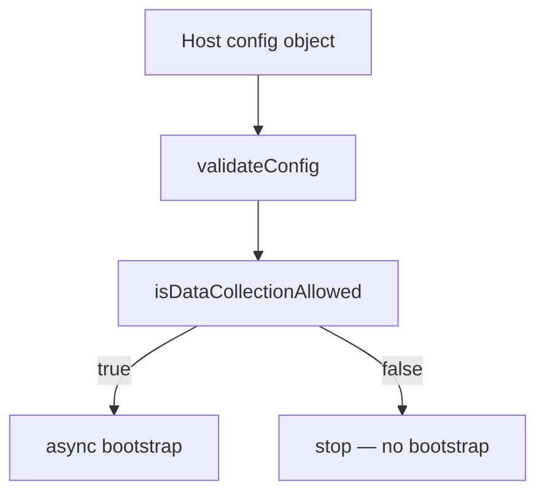
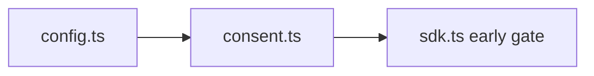
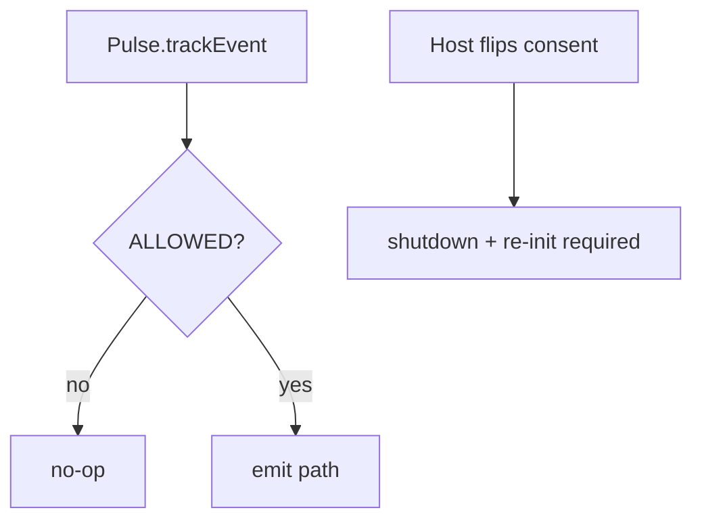

# SDK Core — Configuration and consent — SPEC.md

Package: `@dreamhorizonorg/pulse-web`  
File: `pulse-web-otel/docs/sdk-core/config-and-consent/SPEC.md`

---

## 1. Goal

Specify **`PulseWebConfig`** and the **consent gate** that blocks all telemetry when collection is not `ALLOWED`.

---

## 2. Assumptions

See [`../assumptions/SPEC.md`](../assumptions/SPEC.md).

---

## 3. Requirements

**R2 — Consent gate** — see [`../requirements/SPEC.md`](../requirements/SPEC.md). Config validation is covered by **R1** / `validateConfig` in [`../architecture-and-bootstrap/SPEC.md`](../architecture-and-bootstrap/SPEC.md).

---

## 4. Architectural Design

### 4.1 HLD — config vs consent gate (Mermaid)



### 4.2 LD — files (Mermaid)



### 4.3 Flows — runtime consent re-check (Mermaid)



`Pulse.init` → `PulseWebLogger.setLevel` → empty-`apiKey` short-circuit (warn, return) → `validateConfig` (when key present) → `isDataCollectionAllowed` before async bootstrap — see [`../architecture-and-bootstrap/SPEC.md`](../architecture-and-bootstrap/SPEC.md).

---

## 5. LLD

### 5.1 Config surface (`PulseWebConfig`)

```ts
{
  apiKey: string;                        // required — "projectId_secret"
  dataCollectionState: PulseDataCollectionConsent; // required — ALLOWED | DENIED | PENDING
  serviceName?: string;                  // defaults to empty string
  serviceVersion?: string;              // app build version
  globalAttributes?: Record<string, string>;
  resourceAttributes?: Record<string, string>;
  instrumentations?: InstrumentationConfig;
  export?: { format: "protobuf" | "json" };
  logLevel?: PulseLogLevel;
  diskBuffering?: PulseWebDiskBufferingConfig;
  beaconRelayUrl?: string;
  beforeSendData?: PulseWebBeforeSendConfig;
  endpoint?: string;                    // internal override; not in public docs
  pageHiddenTimeoutMs?: number;         // session rotation timeout
}
```

`PulseDataCollectionConsent` enum: `ALLOWED`, `DENIED`, `PENDING`.

### 5.2 Consent gate

`src/consent.ts`: `isDataCollectionAllowed(state)` returns `true` only for `PulseDataCollectionConsent.ALLOWED`. `PENDING` and `DENIED` both return `false`.

The consent check runs twice:

1. In `Pulse.init()` before any async work — prevents session/resource construction.
2. In `Pulse.trackEvent()` for the interaction path — runtime re-check.

If consent changes at runtime the host must unmount and remount `PulseProvider` (or call `shutdown()` then re-`init()`). The SDK does not support live consent flipping.

### 5.3 `InstrumentationConfig` (local kill switches)

Typed under `src/types/config.ts` (and related). Each key maps to `InstrumentationKeys.*` in `instrumentation-registry.ts`. **`enabled: false`** prevents install regardless of remote `FeatureGate` (remote cannot re-enable a locally disabled feature).

### 5.4 `validateConfig` — common failure modes

| Input problem | Stage | Outcome |
|---------------|-------|---------|
| Missing / empty `apiKey` | sync (`Pulse.init`) | **warn** + `Promise.resolve()` — telemetry disabled; **`validateConfig` is not called** |
| Missing `dataCollectionState` (when `validateConfig` runs) | sync | throws (via `validateConfig`) |
| Malformed `beforeSendData` (neither function nor object with callbacks) | sync (`validateConfig`, when reached) | throws if caller validates directly; **`Pulse.init`** logs warn + resolves — **TC-C3a** |
| Invalid `diskBuffering` numeric fields (non-positive, non-finite) | sync | throws |
| `DENIED` / `PENDING` consent | sync after validate | resolves without throwing; no providers |

### 5.5 Types barrel

Public config types re-export from `src/index.ts` as needed for host TS; authoritative shapes live in `src/types/config.ts` and `src/types/attributes.ts` (`PulseAttributes`).

---

## 6. Test Coverage

### 6.1 Scenario matrix (config + consent)

| ID | Type | Given | When | Then | Tests |
|----|------|-------|------|------|-------|
| CC-P1 | positive | valid `apiKey` + ALLOWED | init | passes validate | `integration-simplified-init` |
| CC-N1 | negative | missing / empty `apiKey` | `Pulse.init` | warn + resolve; no `validateConfig` | `integration-simplified-init.test.ts` — **TC-C1** |
| CC-N2 | negative | DENIED / PENDING | init | no init side effects | `sdk-lifecycle` |
| CC-E1 | edge | invalid `beforeSendData` shape | `Pulse.init` | warn + resolve (init never throws sync) | `integration-simplified-init.test.ts` — **TC-C3a** |

### 6.2 Index

[`../test-coverage/SPEC.md`](../test-coverage/SPEC.md) — `sdk-lifecycle.test.ts` (denied/pending), `integration-simplified-init.test.ts`.

---

## 7. Known Bugs & Gaps

[`../known-gaps-and-open-questions/SPEC.md`](../known-gaps-and-open-questions/SPEC.md) (e.g. consent API / enum ergonomics).

---

## 8. Redundancy & Cleanup Notes

`web-sdk-plan/INTEGRATION.md` config fragments absorbed here and in [`../public-api/SPEC.md`](../public-api/SPEC.md).

---

## 9. Open Questions

[`../known-gaps-and-open-questions/SPEC.md`](../known-gaps-and-open-questions/SPEC.md) §9.
