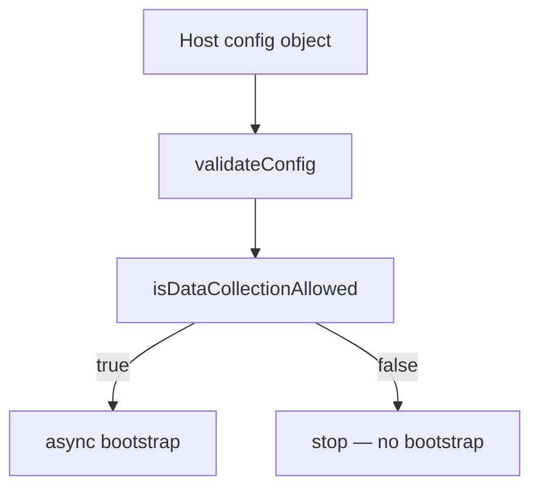
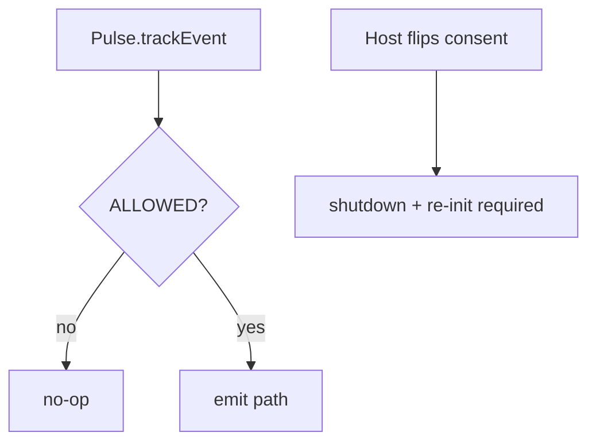
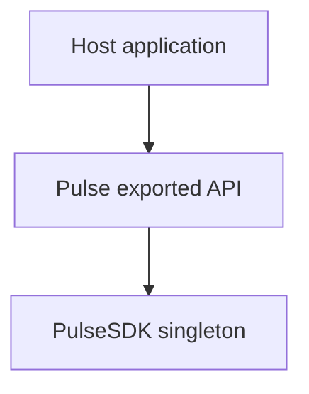
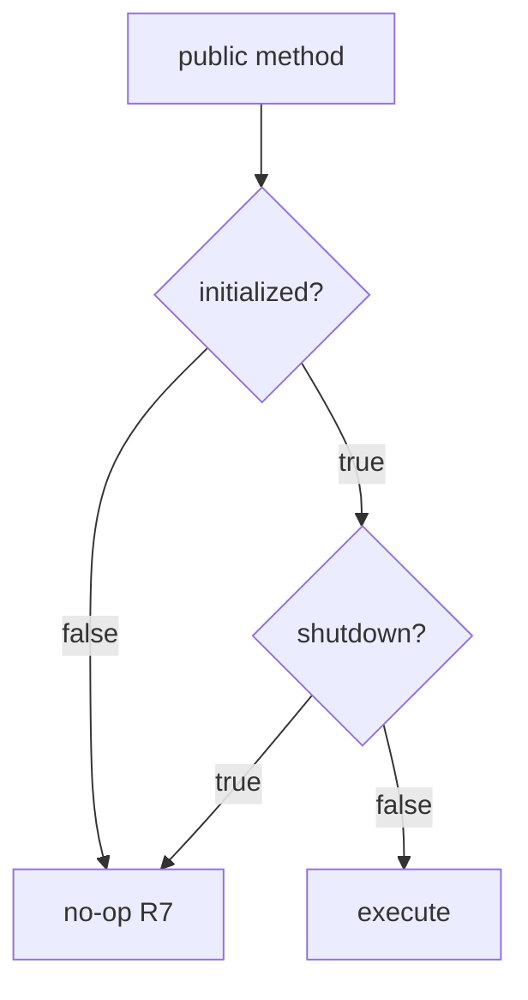

# SDK Core — Configuration, consent, and public API — SPEC.md

Package: `@dreamhorizonorg/pulse-web`  
File: `pulse-web-otel/docs/sdk-core/config-and-public-api/SPEC.md`

---

## 1. Goal

Specify **`PulseWebConfig`**, the **consent gate** that blocks telemetry when collection is not `ALLOWED`, and the **`Pulse` singleton surface** exported from `src/index.ts` (init lifecycle, identity helpers, manual signal APIs).

---

## 2. Assumptions

See [`../assumptions/SPEC.md`](../assumptions/SPEC.md).

---

## 3. Requirements

| ID | Topic | Reference |
|----|--------|-----------|
| **R1** / **R2** | Config validation + **consent gate** | [`../requirements/SPEC.md`](../requirements/SPEC.md); `validateConfig` detail in [`../architecture-and-bootstrap/SPEC.md`](../architecture-and-bootstrap/SPEC.md) |
| **R7** | **Public API** — methods no-op before init completes or after shutdown | [`../requirements/SPEC.md`](../requirements/SPEC.md) |

---

## 4. Architectural Design

### 4.1 Configuration and consent

#### 4.1.1 HLD — config vs consent gate



#### 4.1.2 LD — files


#### 4.1.3 Flows — runtime consent re-check



`Pulse.init` → `PulseWebLogger.setLevel` → empty-`apiKey` short-circuit (warn, return) → `validateConfig` (when key present) → `isDataCollectionAllowed` before async bootstrap — see [`../architecture-and-bootstrap/SPEC.md`](../architecture-and-bootstrap/SPEC.md).

### 4.2 Public API (`Pulse.*`)

#### 4.2.1 HLD — host vs `Pulse` facade



#### 4.2.2 LD — call categories


#### 4.2.3 Flows — pre-init and post-shutdown



`Pulse` delegates to `PulseSDK` singleton — see [`../architecture-and-bootstrap/SPEC.md`](../architecture-and-bootstrap/SPEC.md).

---

## 5. LLD

**Implementation index:** `src/types/config.ts`, `src/types/attributes.ts`, `src/config.ts`, `src/consent.ts`, `src/sdk.ts` (`Pulse` facade + `PulseSDK`).

### 5.1 `PulseWebConfig` — field reference

**Source of truth:** `src/types/config.ts`, `src/types/attributes.ts`, `src/types/before-send.ts`. The block below mirrors the **full exported shape** (keep in sync when types change).

#### 5.1.0 Canonical TypeScript shape

```ts
import type { ReadableSpan } from "@opentelemetry/sdk-trace-web";
import type { ReadableLogRecord } from "@opentelemetry/sdk-logs";
import type { ResourceMetrics } from "@opentelemetry/sdk-metrics";

// --- src/types/attributes.ts ---
export type PulseAttributePrimitive = string | number | boolean;
export type PulseAttributeValue =
  | PulseAttributePrimitive
  | string[]
  | number[]
  | boolean[];
export type PulseAttributes = Record<string, PulseAttributeValue>;

// --- src/pulse-log-level.ts ---
export enum PulseLogLevel {
  VERBOSE = 0,
  DEBUG = 1,
  INFO = 2,
  WARN = 3,
  ERROR = 4,
  NONE = 5,
}

// --- src/types/config.ts ---
export enum PulseDataCollectionConsent {
  ALLOWED = "ALLOWED",
  DENIED = "DENIED",
  PENDING = "PENDING",
}

export type PulseNetworkPropagateCorsUrls =
  | string
  | RegExp
  | Array<string | RegExp>;

export interface InstrumentationConfig {
  errors?: { enabled: boolean };
  network?: {
    enabled?: boolean;
    peerServiceMap?: Record<string, string>;
    blockedUrls?: Array<string | RegExp>;
    propagateTraceHeaderCorsUrls?: PulseNetworkPropagateCorsUrls;
    capturedRequestHeaders?: string[];
    capturedResponseHeaders?: string[];
    captureQueryParams?: boolean;
    emitRequestDurationMetric?: boolean;
  };
  clicks?: {
    enabled: boolean;
    captureContext?: boolean;
    rage?: {
      enabled?: boolean;
      timeWindowMs?: number;
      threshold?: number;
      radiusDp?: number;
    };
  };
  webVitals?: { enabled?: boolean };
  navigation?: { enabled: boolean };
  session?: { enabled: boolean };
  interactions?: { enabled: boolean };
  sessionReplay?: { enabled: boolean };
}

export interface PulseWebDiskBufferingConfig {
  enabled?: boolean;
  maxAgeMs?: number;
  maxCacheSizeBytes?: number;
}

// --- src/types/before-send.ts ---
export type PulseExportSignal =
  | ReadableSpan
  | ReadableLogRecord
  | ResourceMetrics;

export type PulseBeforeSendResult = PulseExportSignal | null;

export interface PulseWebBeforeSendCallbacks {
  beforeSend?: (signal: PulseExportSignal) => PulseBeforeSendResult;
  beforeSendSpan?: (span: ReadableSpan) => ReadableSpan | null;
  beforeSendLog?: (log: ReadableLogRecord) => ReadableLogRecord | null;
  beforeSendMetric?: (metrics: ResourceMetrics) => ResourceMetrics | null;
}

export type PulseWebBeforeSendConfig =
  | ((signal: PulseExportSignal) => PulseBeforeSendResult)
  | PulseWebBeforeSendCallbacks;

export interface PulseWebConfig {
  apiKey: string;
  dataCollectionState: PulseDataCollectionConsent;
  serviceName?: string;
  serviceVersion?: string;
  globalAttributes?: PulseAttributes;
  resourceAttributes?: PulseAttributes;
  beforeSendData?: PulseWebBeforeSendConfig;
  instrumentations?: InstrumentationConfig;
  routePatterns?: Array<{ pattern: string; name: string }>;
  export?: { format?: "protobuf" | "json" };
  logLevel?: PulseLogLevel;
  diskBuffering?: PulseWebDiskBufferingConfig;
  beaconRelayUrl?: string;
  endpoint?: string;
  pageHiddenTimeoutMs?: number;
}
```

#### 5.1.1 Required keys

| Key | Semantics |
|-----|-----------|
| **`apiKey`** | Pulse project credential (`<project_id>_<secret>`). Empty / missing → `Pulse.init` warns and resolves without bootstrapping; **`validateConfig` is not run** (§5.4). |
| **`dataCollectionState`** | Only **`ALLOWED`** enables bootstrap; **`DENIED`** / **`PENDING`** short-circuit after validation (§5.2). |

#### 5.1.2 Optional — service identity & attributes

| Key | Semantics |
|-----|-----------|
| **`serviceName`** | OTel **`service.name`**. Omitted → `window.location.hostname` when `window` exists, else **`"web-app"`** (`buildResource`). |
| **`serviceVersion`** | OTel **`service.version`** and **`app.build_name`**. Omitted → **`"0.0.0"`**. |
| **`globalAttributes`** | `PulseAttributes` merged on **every span, log, metric point** (`getCommonAttrs`). Merged after built-ins; **`user.id`** / **`pulse.user.*`** win last. See [`../data-contract/SPEC.md`](../data-contract/SPEC.md) §5.2.2. |
| **`resourceAttributes`** | `PulseAttributes` on the OTel **Resource** only; **Pulse wins** on key collision (`buildMergedResource`). |

#### 5.1.3 Optional — export, privacy, diagnostics, lifecycle

| Key | Semantics |
|-----|-----------|
| **`beforeSendData`** | `PulseWebBeforeSendConfig` — function **or** callback object (**§5.1.0**). Return **`null`** to drop. Invalid shape: `validateConfig` throws if called directly; **`Pulse.init`** warns + resolves (**TC-C3a**). See [`../exporters-and-persistence/SPEC.md`](../exporters-and-persistence/SPEC.md). |
| **`export`** | `{ format?: "protobuf" \| "json" }`. **`useProtobuf`** only when **`format === "protobuf"`**; otherwise JSON (`src/sdk.ts`). |
| **`logLevel`** | `PulseLogLevel` (**§5.1.0**). Omitted or **`NONE`** → no Pulse console diagnostics. |
| **`diskBuffering`** | `PulseWebDiskBufferingConfig` (**§5.1.0**). Defaults: **`enabled`** implicit **on**; **`maxAgeMs`** 24h; **`maxCacheSizeBytes`** ~10 MiB. Vite: `VITE_PULSE_DISK_BUFFER_MAX_AGE_MS`, `VITE_PULSE_DISK_BUFFER_MAX_SIZE_BYTES`. |
| **`beaconRelayUrl`** | Same-origin relay for **`sendBeacon`** so **`apiKey`** is not in query string; omit → query embedding + one-time console warning. |
| **`endpoint`** | OTLP base URL override (WebView / dev host). Omit → derived from **`apiKey`**. |
| **`pageHiddenTimeoutMs`** | Hidden-tab session expiry (ms) before next visible → new `session.id`. Default **15 min**. |

#### 5.1.4 `diskBuffering` fields

| Field | Type | Semantics |
|-------|------|------------|
| **`enabled`** | `boolean` | **`false`** disables IndexedDB buffering entirely. Omitted → **on** (Android parity). |
| **`maxAgeMs`** | `number` | Max buffered row age before prune. Default **24h**. |
| **`maxCacheSizeBytes`** | `number` | Approximate total buffered payload cap. Default **~10 MiB**. |

#### 5.1.5 `instrumentations` — per-area keys

All optional on `PulseWebConfig`. Each nested object is optional; within **`network`** / **`clicks`**, individual fields remain optional per **§5.1.0**.

| Key | Semantics |
|-----|-----------|
| **`errors`** | `{ enabled }` — global error / crash / non-fatal pipeline. |
| **`network`** | URL filters, trace-context propagation allowlist, captured headers, **`captureQueryParams`**, **`emitRequestDurationMetric`** (reserved, not wired). |
| **`clicks`** | **`enabled`** required when object present. **`captureContext`** defaults **true**. **`rage`** defaults on; **`rage.enabled: false`** → immediate per-click emit; tune **`timeWindowMs`**, **`threshold`**, **`radiusDp`**. |
| **`webVitals`** | `{ enabled? }` — CWV logs. |
| **`navigation`** | `{ enabled }` — `screen_load` / `screen_session`. |
| **`session`** | `{ enabled }` — session start/end logs. |
| **`interactions`** | `{ enabled }` — critical interaction spans. |
| **`sessionReplay`** | `{ enabled }` — replay capture. |

#### 5.1.5a `instrumentations.network` fields

| Field | Semantics |
|-------|-----------|
| **`enabled`** | When **`false`**, network instrumentation is not installed. |
| **`peerServiceMap`** | Map URL pattern / host keys → `peer.service` value on client spans. |
| **`blockedUrls`** | URLs matching these **string or RegExp** entries are not instrumented. |
| **`propagateTraceHeaderCorsUrls`** | `PulseNetworkPropagateCorsUrls` — which cross-origin requests receive W3C trace context headers. |
| **`capturedRequestHeaders`** | Header **names** to copy onto spans; sensitive names stripped (`utils/network-http.ts`). |
| **`capturedResponseHeaders`** | Same for response headers. |
| **`captureQueryParams`** | **`true`** — keep query on `url.full` but redact sensitive keys; default strips query. |
| **`emitRequestDurationMetric`** | Reserved (**not implemented**); ignored until wired in `NetworkInstrumentation`. |

#### 5.1.5b `beforeSendData` callbacks (`PulseWebBeforeSendCallbacks`)

| Callback | Input | Return | Order |
|----------|--------|--------|-------|
| **`beforeSend`** | `PulseExportSignal` (span **or** log **or** metrics batch item) | Same kind or **`null`** (drop); wrong-kind return → drop | Runs **first** when present. |
| **`beforeSendSpan`** | `ReadableSpan` | Span or **`null`** | After generic hook, for spans only. |
| **`beforeSendLog`** | `ReadableLogRecord` | Log or **`null`** | After generic hook, for logs only. |
| **`beforeSendMetric`** | `ResourceMetrics` | Metrics or **`null`** | After generic hook, for metrics only. |

Alternatively, **`beforeSendData`** may be a **single function** with the same contract as **`beforeSend`** above (union in **§5.1.0**).

#### 5.1.6 `routePatterns`

`Array<{ pattern: string; name: string }>` — first regex **`pattern`** matching **`location.pathname`** sets logical **`screen.name`** (invalid regex skipped). Works with `PulseGlobalAttributesProcessor` heuristics.

`PulseDataCollectionConsent` string values: **`ALLOWED`**, **`DENIED`**, **`PENDING`**.

### 5.2 Consent gate

`src/consent.ts`: `isDataCollectionAllowed(state)` returns `true` only for `PulseDataCollectionConsent.ALLOWED`. `PENDING` and `DENIED` both return `false`.

The consent check runs twice:

1. In `Pulse.init()` before any async work — prevents session/resource construction.
2. In `Pulse.trackEvent()` for the interaction path — runtime re-check.

If consent changes at runtime the host must unmount and remount `PulseProvider` (or call `shutdown()` then re-`init()`). The SDK does not support live consent flipping.

### 5.3 `InstrumentationConfig` (summary)

Full per-area behaviour and **`InstrumentationKeys`** ↔ remote **`PulseFeature`** mapping: [`../remote-config-features-and-sampling/SPEC.md`](../remote-config-features-and-sampling/SPEC.md). **Field-level toggles**: **§5.1.5**–**§5.1.5b** above. Rule: local **`enabled: false`** prevents install even if remote config would enable the feature.

### 5.4 `validateConfig` — common failure modes

| Input problem | Stage | Outcome |
|---------------|-------|---------|
| Missing / empty `apiKey` | sync (`Pulse.init`) | **warn** + `Promise.resolve()` — telemetry disabled; **`validateConfig` is not called** |
| Missing `dataCollectionState` (when `validateConfig` runs) | sync | throws (via `validateConfig`) |
| Malformed `beforeSendData` (neither function nor object with callbacks) | sync (`validateConfig`, when reached) | throws if caller validates directly; **`Pulse.init`** logs warn + resolves — **TC-C3a** |
| Invalid `diskBuffering` numeric fields (non-positive, non-finite) | sync | throws |
| `DENIED` / `PENDING` consent | sync after validate | resolves without throwing; no providers |

### 5.5 Types barrel

Public config types re-export from `src/index.ts` as needed for host TS; authoritative shapes live in `src/types/config.ts` and `src/types/attributes.ts` (`PulseAttributes`).

### 5.6 Public API (`Pulse.*`)

| Method | Description |
|---|---|
| `Pulse.init(config)` | Bootstrap the SDK. Returns `Promise<void>`. |
| `Pulse.shutdown()` | Tear down — uninstall instrumentations, flush, reset singleton. |
| `Pulse.whenReady()` | Resolves when async init finishes, or immediately if already initialized. |
| `Pulse.isInitialized()` | Sync check for whether init has completed. |
| `Pulse.setScreenName(name)` | Update `screen.name` on all subsequent signals. |
| `Pulse.setUserId(id \| null)` | Set / clear user identity. Emits user session transition signals. |
| `Pulse.setUserProperty(key, value)` | Set single user property (`pulse.user.<key>`). |
| `Pulse.setUserProperties(props)` | Batch set user properties. |
| `Pulse.clearUserIdentity()` | Clear persisted user ID and all properties. |
| `Pulse.trackEvent(name, attrs?, timestampMs?)` | Custom event signal (`pulse.type = custom_event`). **Also** requires `FeatureGate.isEnabled(PulseFeature.CUSTOM_EVENTS)` in addition to consent / init guards. |
| `Pulse.reportException(error, attrs?)` | Manual non-fatal (`pulse.type = non_fatal`, WARN severity). |
| `Pulse.reportDeviceCrash(error, attrs?)` | Fatal crash signal (`pulse.type = device.crash`, FATAL severity). |
| `Pulse.trackNonFatal(name, attrs?)` | Named non-fatal event (`pulse.type = non_fatal`). |
| `Pulse.startSpan(name, options?)` | Create and return a mutable span handle (`pulse.type = custom_span`). Returns `PulseSpan` with `end(status?)`, `addEvent`, `setAttributes`, `recordException` methods. Caller is responsible for calling `end()`. |
| `Pulse.trackSpan(name, fn, options?)` | Execute a function or async function within a span, auto-ending on success or error (`pulse.type = custom_span`). Returns the result of `fn`, preserving its type (sync or async). |

Manual error API names differ from Android **`trackNonFatal`** centric APIs — cross-platform map: [`../../instrumentations/integration/SPEC.md`](../../instrumentations/integration/SPEC.md) §5.10.

Custom span API: [`../../instrumentations/custom-span/SPEC.md`](../../instrumentations/custom-span/SPEC.md).

`pulse.type` / attribute contracts: [`../data-contract/SPEC.md`](../data-contract/SPEC.md). Errors instrumentation: [`../../instrumentations/errors/SPEC.md`](../../instrumentations/errors/SPEC.md).

### 5.7 Internal guards (`PulseSDK`)

| Guard | Purpose |
|-------|---------|
| `_initialized` | Public API methods no-op until `true` (R7). |
| `_initializing` | Concurrent `init` coalesces on same promise. |
| `_shuttingDown` | Prevents use-after-free during async teardown. |

### 5.8 Async vs sync on facade

| API | Sync? | Notes |
|-----|-------|------|
| `Pulse.init` | async (`Promise<void>`) | Await or `whenReady()` before asserting telemetry. |
| `Pulse.whenReady` | async | Resolves immediately if already initialized. |
| `Pulse.isInitialized` | sync | |
| `setScreenName` / identity / `trackEvent` | sync calls; async export | May queue OTLP asynchronously. |

### 5.9 `trackEvent` consent path

`Pulse.trackEvent` re-checks `isDataCollectionAllowed` at call time (defence in depth) in addition to init gate — see **§5.2** above.

---

## 6. Test Coverage

### 6.1 Scenario matrix (config + consent)

| ID | Type | Given | When | Then | Tests |
|----|------|-------|------|------|-------|
| CC-P1 | positive | valid `apiKey` + ALLOWED | init | passes validate | `integration-simplified-init` |
| CC-N1 | negative | missing / empty `apiKey` | `Pulse.init` | warn + resolve; no `validateConfig` | `integration-simplified-init.test.ts` — **TC-C1** |
| CC-N2 | negative | DENIED / PENDING | init | no init side effects | `sdk-lifecycle` |
| CC-E1 | edge | invalid `beforeSendData` shape | `Pulse.init` | warn + resolve (init never throws sync) | `integration-simplified-init.test.ts` — **TC-C3a** |

### 6.2 Scenario matrix (public API)

| ID | Type | Given | When | Then | Tests |
|----|------|-------|------|------|-------|
| API-P1 | positive | after init | `trackEvent` | `custom_event` log | `sdk-public-methods.test.ts` |
| API-N1 | negative | before init | any method | no-op | same |
| API-E1 | edge | after shutdown | `setScreenName` | no-op | `sdk-lifecycle` + public methods |

### 6.3 Index

[`../test-coverage/SPEC.md`](../test-coverage/SPEC.md) — `sdk-lifecycle.test.ts` (denied/pending), `integration-simplified-init.test.ts`, `sdk-public-methods.test.ts`.

### 6.4 Playwright E2E traceability

Consent / `PENDING` / `DENIED` OTLP silence: **`@M1 consent`**, **`@M3-errors gate and consent`**, **`@M4` C1**, and related rows in [`../test-coverage/SPEC.md`](../test-coverage/SPEC.md) §6.3.  
`trackEvent`, `reportException`, `setScreenName`, shutdown: **`@M1`**, **`@M3-errors`**, **`@M15`** in the same §6.3.

---

## 7. Known Bugs & Gaps

[`../../known-gaps-tradeoffs-and-plan.md`](../../known-gaps-tradeoffs-and-plan.md) (**O1** / **O2** in §2; **P1:7** blocked / **P2:11** deferred in §1). **P0:1** → [`../../review-fix.md`](../../review-fix.md) §7; **P2:12** → §9. **Code + test backlog:** [`../../review-fix.md`](../../review-fix.md) §3. Consumer Next tarball smoke: [`../test-coverage/SPEC.md`](../test-coverage/SPEC.md) §6.6.

---

## 8. Redundancy & Cleanup Notes

`web-sdk-plan/INTEGRATION.md` config + public API fragments absorbed here (previously split across `config-and-consent` and `public-api` SPECs — those paths now redirect to this file).

---

## 9. Open Questions

[`../../known-gaps-tradeoffs-and-plan.md`](../../known-gaps-tradeoffs-and-plan.md) §3 (`whenReady` semantics).
