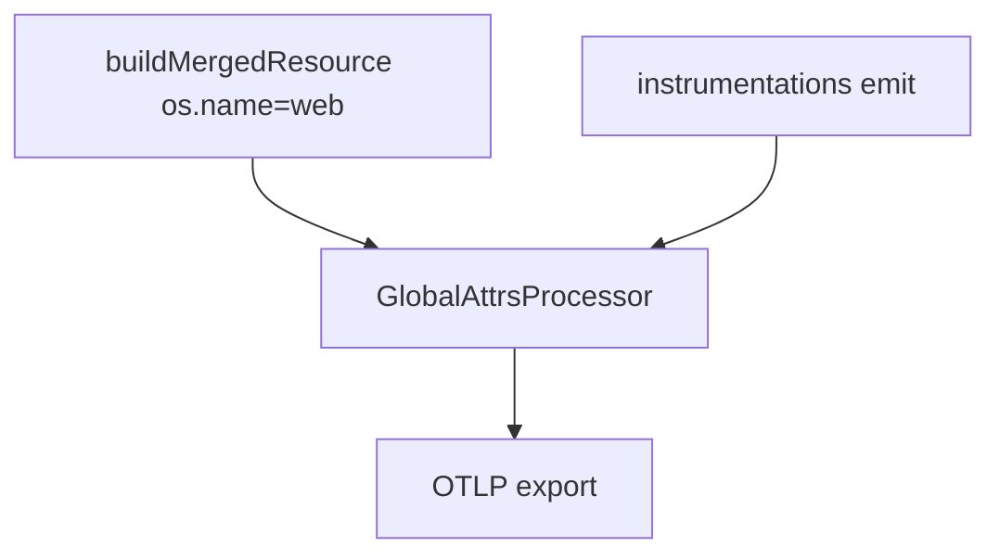
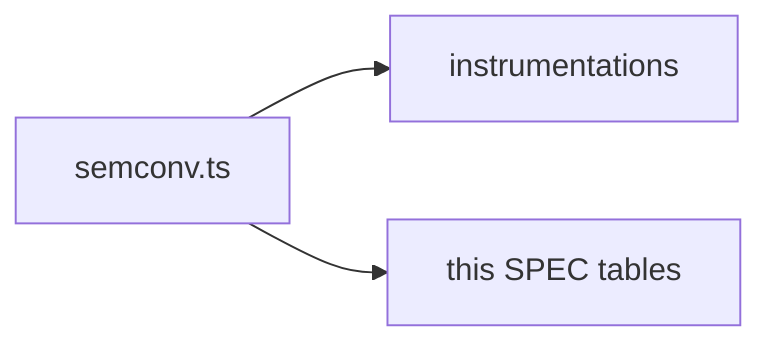
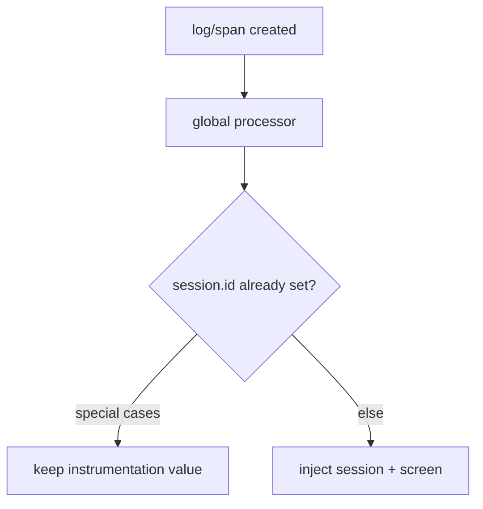

# SDK Core — Data contract — SPEC.md

Package: `@dreamhorizonorg/pulse-web`  
File: `pulse-web-otel/docs/sdk-core/data-contract/SPEC.md`

---

## 1. Goal

Define the **shared wire contract** (`pulse.type` catalogue and cross-cutting attributes) every instrumentation must respect. Canonical keys also live in `src/semconv.ts`.

---

## 2. Assumptions

See [`../assumptions/SPEC.md`](../assumptions/SPEC.md). **R8** (`platform = web` / resource) is restated in [`../requirements/SPEC.md`](../requirements/SPEC.md).

---

## 3. Requirements

**R8 — platform=web mandate** and attribute consistency — see [`../requirements/SPEC.md`](../requirements/SPEC.md).

---

## 4. Architectural Design

### 4.1 HLD — resource + processors + signals (Mermaid)

### 4.2 LD — semconv as single source (Mermaid)

### 4.3 Flows — attribute merge / overwrite rules (Mermaid)

Resource + global attribute processors merge host config with Pulse-built resource — see [`../architecture-and-bootstrap/SPEC.md`](../architecture-and-bootstrap/SPEC.md) and `src/resource.ts`, `src/processors/global-attrs-processor.ts`.

---

## 5. LLD

### 5.1 `pulse.type` enum

All `pulse.type` values are defined in `PulseWebSemconv.PulseType` (`src/semconv.ts`). The complete enum:

| pulse.type | Signal | Emitter | Notes |
|---|---|---|---|
| `interaction` | Span | `InteractionSpanBuilder` (interactions feature) | OTLP **span** with `pulse.type = interaction` (literal) and **`pulse.interaction.*`** attributes — see [`../../instrumentations/interactions/SPEC.md`](../../instrumentations/interactions/SPEC.md) §5.1 |
| `session.start` | Log | `SessionInstrumentation` | New `session.id` assigned |
| `session.end` | Log | `SessionInstrumentation` | Background timeout or explicit shutdown |
| `device.crash` | Log | `ErrorInstrumentation`, `PulseErrorBoundary` | `severityNumber = FATAL` |
| `non_fatal` | Log | `ErrorInstrumentation`, `Pulse.reportException`, `Pulse.trackNonFatal` | `severityNumber = WARN` |
| `network.<statusCode>` | Span | `NetworkInstrumentation` | Fetch + XHR; literal from `networkPulseType()` in `src/utils/network-http.ts` (e.g. `network.200`, `network.0` when status unknown) — not a fixed string `http` |
| `app.click` | Span | `ClicksInstrumentation` | DOM click events |
| `web_vital` | Log | `WebVitalsInstrumentation` | LCP, CLS, FID, INP, FCP, TTFB |
| `screen_load` | Span | `NavigationInstrumentation` | Route entry; carries `tti` |
| `screen_session` | Span | `NavigationInstrumentation` | Dwell / exit; OTLP span → `otel_traces` (not `otel_logs`; attrs applied at `span.end()`) |
| `custom_event` | Log | `Pulse.trackEvent` | Host-app custom events |
| `pulse.app.installation.start` | Log | `PulseSDK.emitInstallationStartIfNeeded` | First-ever install only; value is `PulseWebSemconv.PulseType.INSTALLATION_START` in `semconv.ts` |
| `pulse.user.session.start` | Log | `PulseSDK.setUserId` | User identity transition |
| `pulse.user.session.end` | Log | `PulseSDK.setUserId` | User identity transition |

**`platform = 'web'` mandate:** The OTel Resource sets **`os.name = 'web'`** and **`platform = 'web'`** in `buildMergedResource()` (`src/resource.ts`). Every signal inherits these via the resource — they are not per-signal overrides and host `resourceAttributes` cannot replace `os.name` with a non-web value.

### 5.2 Shared attribute table

Every signal emitted by the SDK carries the following attributes. Instrumentations may add signal-specific attributes on top; they must not conflict with these reserved keys.

| Attribute key | Type | Source | Required | Notes |
|---|---|---|---|---|
| `pulse.type` | `string` | `PulseWebSemconv.AttributeKey.PULSE_TYPE` | Yes | See enum above |
| `session.id` | `string` | `PulseGlobalAttributesProcessor` | Yes | UUID per session rotation |
| `user.id` | `string \| null` | `PulseGlobalAttributesProcessor` | No | Persisted in `localStorage` |
| `screen.name` | `string` | `PulseGlobalAttributesProcessor` | No | Set via `Pulse.setScreenName()` |
| `last.screen.name` | `string` | `PulseGlobalAttributesProcessor` | No | Previous screen before transition |
| `installation.id` | `string` | `SessionProvider` / `getOrCreateInstallationId()` | Yes | Stable UUID per browser install |
| `metering.session.id` | `string` | `PulseSDK.init()` / `PulseGlobalAttributesProcessor` | Yes | UUID per SDK init; for billing |
| `pulse.user.<name>` | `string` | `PulseGlobalAttributesProcessor` | No | Custom user properties |
| `os.name` | `string` | OTel Resource (`buildMergedResource`) | Yes | Always `'web'` |
| `os.version` | `string` | OTel Resource (`getOsVersionAsync`) | No | Browser UA / Client Hints |
| `browser.name` | `string` | OTel Resource | No | UA-parsed browser name |
| `app.build_name` | `string` | OTel Resource / config `serviceVersion` | No | App version string |
| `service.name` | `string` | OTel Resource / config `serviceName` | Yes | Identifies the app |
| `project.id` | `string` | OTel Resource / `extractProjectId(apiKey)` | Yes | Extracted from API key prefix |

### 5.3 Resource merge (`buildMergedResource`)

Order of precedence (simplified): Pulse-fixed resource attrs (`os.name = web`, project id, SDK name/version) **merged with** host `resourceAttributes` from config where keys do not violate non-override rules. Host cannot override `os.name` to a non-web value.

### 5.4 Processor chain (logs / spans)

`PulseGlobalAttributesProcessor` runs on export path (see `src/processors/global-attrs-processor.ts`) to inject `session.id`, `screen.name`, metering id, and user props. **`SignalFilterProcessor`** may drop signals per product rules. Instrumentations set signal-specific attrs **before** these processors on emit.

### 5.5 Drift control

Any new `pulse.type` or attribute key requires: **(1)** `semconv.ts` update, **(2)** this table, **(3)** ClickHouse / product dashboard impact — see [`../known-gaps-and-open-questions/SPEC.md`](../known-gaps-and-open-questions/SPEC.md) for API critique items that touch the same surface.

---

## 6. Test Coverage

### 6.1 Scenario matrix (contract)

| ID | Type | Given | When | Then | Tests |
|----|------|-------|------|------|-------|
| DC-P1 | positive | instrument emits | export | `pulse.type` in semconv set | per-instrumentation SPECs + `m1`/`m3` |
| DC-N1 | negative | host invents unknown `pulse.type` | — | reject / ADR required | convention |
| DC-E1 | edge | `interaction` span | complete | `pulse.interaction.*` keys | `interactions-span-builder.test.ts` |

### 6.2 Index

[`../test-coverage/SPEC.md`](../test-coverage/SPEC.md) — `m1.test.ts` (resource / global attrs), per-instrumentation SPECs for emitters.

### 6.3 Playwright E2E traceability

Contract attributes on exported OTLP payloads are asserted across **`@M1`–`@M4`**, **`@M2`**, **`@M3-*`**, **`@ScreenNav`**, **`@WebVitals`**, **`@M15`**, and CH suites — see [`../test-coverage/SPEC.md`](../test-coverage/SPEC.md) §6.3 for the authoritative title list.

---

## 7. Known Bugs & Gaps

Contract drift vs code (e.g. network `pulse.type` pattern) should be fixed here with code or ADR — track under [`../known-gaps-and-open-questions/SPEC.md`](../known-gaps-and-open-questions/SPEC.md) when product-visible.

---

## 8. Redundancy & Cleanup Notes

None.

---

## 9. Open Questions

[`../known-gaps-and-open-questions/SPEC.md`](../known-gaps-and-open-questions/SPEC.md) §9.
