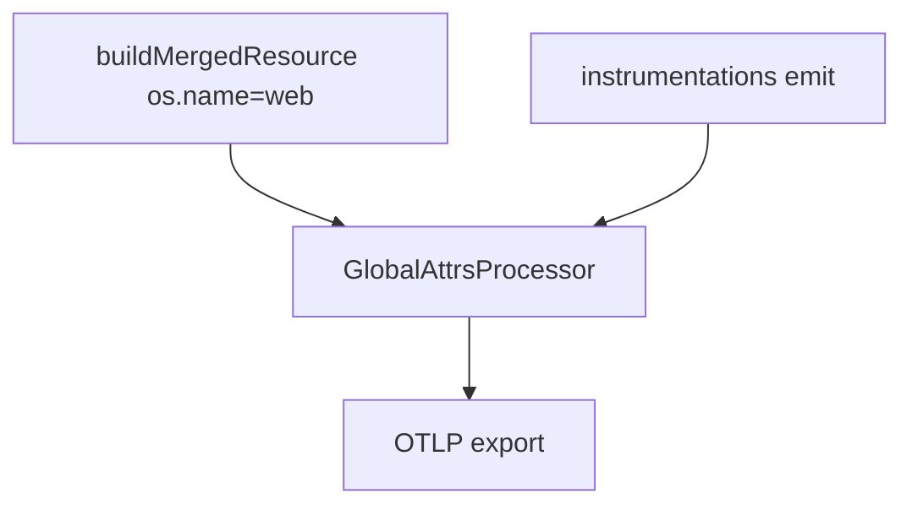
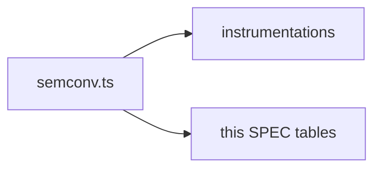
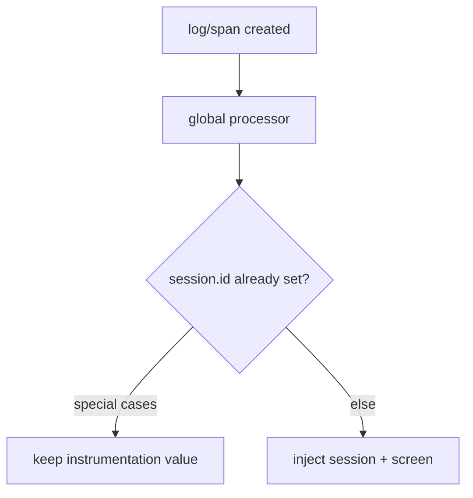

# SDK Core — Data contract — SPEC.md

Package: `@dreamhorizonorg/pulse-web`  
File: `pulse-web-otel/docs/sdk-core/data-contract/SPEC.md`

---

## 1. Goal

Define the **shared wire contract** (`pulse.type` catalogue and cross-cutting attributes) every instrumentation must respect. Canonical keys also live in `src/semconv.ts`.

---

## 2. Assumptions

See `[../assumptions/SPEC.md](../assumptions/SPEC.md)`. **R8** (`platform = web` / resource) is restated in `[../requirements/SPEC.md](../requirements/SPEC.md)`.

---

## 3. Requirements

**R8 — platform=web mandate** and attribute consistency — see `[../requirements/SPEC.md](../requirements/SPEC.md)`.

---

## 4. Architectural Design

### 4.1 HLD — resource + processors + signals

### 4.2 LD — semconv as single source

### 4.3 Flows — attribute merge / overwrite rules

Resource + global attribute processors merge host config with Pulse-built resource — see `[../architecture-and-bootstrap/SPEC.md](../architecture-and-bootstrap/SPEC.md)` and `src/resource.ts`, `src/processors/global-attrs-processor.ts`.

---

## 5. LLD

### 5.1 `pulse.type` enum

**Fixed literals** map to `PulseWebSemconv.PulseType` in `src/semconv.ts`. **Outbound HTTP client spans** use the dynamic pattern **`network.<statusCode>`** from `networkPulseType()` in `src/utils/network-http.ts` (not named entries on `PulseType`). Catalogue:

| pulse.type                     | Signal | Emitter                                                                | Notes                                                                                                                                                                                                    |
| ------------------------------ | ------ | ---------------------------------------------------------------------- | -------------------------------------------------------------------------------------------------------------------------------------------------------------------------------------------------------- |
| `interaction`                  | Span   | `InteractionSpanBuilder` (interactions feature)                        | OTLP **span** with `pulse.type = interaction` (literal) and `**pulse.interaction.*`** attributes — see `[../../instrumentations/interactions/SPEC.md](../../instrumentations/interactions/SPEC.md)` §5.1 |
| `session.start`                | Log    | `SessionInstrumentation`                                               | New `session.id` assigned                                                                                                                                                                                |
| `session.end`                  | Log    | `SessionInstrumentation`                                               | Background timeout or explicit shutdown                                                                                                                                                                  |
| `device.crash`                 | Log    | `ErrorInstrumentation`, `PulseErrorBoundary`                           | `severityNumber = FATAL`                                                                                                                                                                                 |
| `non_fatal`                    | Log    | `ErrorInstrumentation`, `Pulse.reportException`, `Pulse.trackNonFatal` | `severityNumber = WARN`                                                                                                                                                                                  |
| `network.<statusCode>`         | Span   | `NetworkInstrumentation`                                               | Fetch + XHR; literal from `networkPulseType()` in `src/utils/network-http.ts` (e.g. `network.200`, `network.0` when status unknown) — not a fixed string `http`                                          |
| `app.click`                    | Log    | `ClicksInstrumentation`                                                | OTLP **log** (`pulse.type = app.click`, body `app.widget.click`) — see [`../../instrumentations/clicks/SPEC.md`](../../instrumentations/clicks/SPEC.md)                                                  |
| `web_vital`                    | Log    | `WebVitalsInstrumentation`                                             | LCP, CLS, FID, INP, FCP, TTFB                                                                                                                                                                            |
| `screen_load`                  | Span   | `NavigationInstrumentation`                                            | Route entry; carries `tti`                                                                                                                                                                               |
| `screen_session`               | Span   | `NavigationInstrumentation`                                            | Dwell / exit; OTLP span → `otel_traces` (not `otel_logs`; attrs applied at `span.end()`)                                                                                                                 |
| `custom_event`                 | Log    | `Pulse.trackEvent`                                                     | Host-app custom events                                                                                                                                                                                   |
| `pulse.app.installation.start` | Log    | `PulseSDK.emitInstallationStartIfNeeded`                               | First-ever install only; value is `PulseWebSemconv.PulseType.INSTALLATION_START` in `semconv.ts`                                                                                                         |
| `pulse.user.session.start`     | Log    | `PulseSDK.setUserId`                                                   | User identity transition                                                                                                                                                                                 |
| `pulse.user.session.end`       | Log    | `PulseSDK.setUserId`                                                   | User identity transition                                                                                                                                                                                 |

`**platform = 'web'` mandate:**The OTel Resource sets `**os.name = 'web'`** and `**platform = 'web'**` in `buildMergedResource()` (`src/resource.ts`). Every signal inherits these via the resource — they are not per-signal overrides and host `resourceAttributes` cannot replace `os.name` with a non-web value.

### 5.2 Shared attribute catalogue

Cross-cutting keys are split by **where they live in OTLP**: **Resource** (one map per export batch for the SDK instance), **global signal attributes** (copied onto every span and log record, and onto metric data points via `GlobalAttributeInjectingMetricExporter`), and **instrumentation-only** keys (emitters own the value; must stay in the `pulse.type` / navigation contracts and not collide with reserved semantics).

Instrumentations may add further signal-specific attributes; they must not break the reserved keys below.

#### 5.2.1 Resource attributes (OTLP Resource)

Built in `buildResource()` then merged in `buildMergedResource()` (`src/resource.ts`). Declared once on the Resource; spans/logs/metrics reference it.

| Attribute key         | Type      | Source                                                           | Required | Notes                                            |
| --------------------- | --------- | ---------------------------------------------------------------- | -------- | ------------------------------------------------ |
| `service.name`        | `string`  | Config `serviceName` or `window.location.hostname` / `"web-app"` | Yes      |                                                  |
| `service.version`     | `string`  | Config `serviceVersion` or `"0.0.0"`                             | Yes      |                                                  |
| `app.build_name`      | `string`  | Same value as `service.version`                                  | Yes      | Android `AppVersion` / backend parity            |
| `platform`            | `string`  | Fixed `web`                                                      | Yes      | R8 — see §5.1                                    |
| `project.id`          | `string`  | `extractProjectId(apiKey)`                                       | Yes      |                                                  |
| `installation.id`     | `string`  | `getOrCreateInstallationId()`                                    | Yes      | Same stable id as signal-level `installation.id` |
| `rum.sdk.name`        | `string`  | Semconv fixed                                                    | Yes      |                                                  |
| `rum.sdk.version`     | `string`  | Package SDK version                                              | Yes      |                                                  |
| `telemetry.sdk.name`  | `string`  | Semconv fixed                                                    | Yes      |                                                  |
| `os.name`             | `string`  | Fixed `web`                                                      | Yes      | Materializes `Platform` in CH                    |
| `os.version`          | `string`  | UA / Client Hints (`getOsVersionAsync` at init)                  | No       |                                                  |
| `browser.name`        | `string`  | UA parser                                                        | No       |                                                  |
| `browser.version`     | `string`  | UA parser                                                        | No       |                                                  |
| `device.type`         | `string`  | UA parser                                                        | No       |                                                  |
| `screen.resolution`   | `string`  | `screen.width` × `screen.height`                                 | No       | Browser only                                     |
| `screen.aspect_ratio` | `string`  | Derived                                                          | No       | Browser only                                     |
| `screen.color_depth`  | `number`  | `screen.colorDepth`                                              | No       | Browser only                                     |
| `browser.language`    | `string`  | `navigator.language`                                             | No       |                                                  |
| `network.online`      | `boolean` | `navigator.onLine`                                               | No       |                                                  |
| `timezone`            | `string`  | `Intl` resolved zone                                             | No       |                                                  |

**Override — `PulseWebConfig.resourceAttributes`:** `buildMergedResource()` does `resourceFromAttributes(resourceAttributes).merge(pulseResource)`. In OTel JS merge, **the right-hand (Pulse-built) map wins on duplicate keys**, so the host **cannot** replace `project.id`, `platform`, `rum.sdk.*`, `telemetry.sdk.name`, `app.build_name`, or coerce `os.name` away from web. The host **can** add non-conflicting keys (e.g. `deployment.environment`).

#### 5.2.2 Global signal attributes (spans, logs, metric data points)

Injected from `PulseGlobalAttributesProcessor.getCommonAttrs()` (`src/processors/global-attrs-processor.ts`) on **every span** at `onStart`, **every log** at `onEmit`, and **metrics** via `getCommonAttrsForMetrics()` in `src/exporters.ts`. Only primitive `string | number | boolean` values.

| Attribute key                | Type     | Source                                          | Required | Notes                                                                                                                                                                      |
| ---------------------------- | -------- | ----------------------------------------------- | -------- | -------------------------------------------------------------------------------------------------------------------------------------------------------------------------- |
| `session.id`                 | `string` | `SessionProvider`                               | Yes      | **Logs only:** if the log already has a non-empty `session.id`, the processor **does not overwrite** (session lifecycle logs). **Spans:** always set from current session. |
| `window.id`                  | `string` | `SessionProvider`                               | Yes      | Tab / window scope                                                                                                                                                         |
| `installation.id`            | `string` | `getOrCreateInstallationId()`                   | Yes      | Duplicates resource for span/log query convenience                                                                                                                         |
| `app.installation.id`        | `string` | Same as `installation.id`                       | Yes      | Android naming parity                                                                                                                                                      |
| `screen.name`                | `string` | `resolveScreenName()` / `Pulse.setScreenName()` | No       | Heuristic or manual override                                                                                                                                               |
| `device.screen.aspect_ratio` | `string` | Processor ctor                                  | Yes      | Viewport aspect                                                                                                                                                            |
| `pulse.metering.session.id`  | `string` | `PulseSDK.init()`                               | Yes      | Billing / metering                                                                                                                                                         |
| `platform`                   | `string` | Fixed `web`                                     | Yes      | Also on resource; repeated on signal for parity with mobile pipelines                                                                                                      |
| `url.path`                   | `string` | `location.pathname`                             | No       | Browser only                                                                                                                                                               |
| `page.url`                   | `string` | `location.href`                                 | No       | Browser only                                                                                                                                                               |
| `network.connection.type`    | `string` | `navigator.connection`                          | No       |                                                                                                                                                                            |
| `network.effective_type`     | `string` | `navigator.connection`                          | No       |                                                                                                                                                                            |
| `network.rtt`                | `number` | `navigator.connection`                          | No       | When present                                                                                                                                                               |
| `network.downlink`           | `number` | `navigator.connection`                          | No       | When present                                                                                                                                                               |
| `user.id`                    | `string` | `setUserId` / hydrate                           | No       | After `globalAttributes` merge in `getCommonAttrs`                                                                                                                         |
| `pulse.user.<name>`          | `string` | `setUserProperty` / `setUserProperties`         | No       | Custom user properties                                                                                                                                                     |

**Override — `PulseWebConfig.globalAttributes`:** entries are merged **after** the built-in bucket in `getCommonAttrs()`. That means host `globalAttributes` **can overwrite** keys such as `session.id`, `screen.name`, `pulse.metering.session.id`, or URL/network keys if the same key is supplied — **avoid** reusing those reserved keys for unrelated data. `**user.id` and `pulse.user.*` are applied last**, so the identity API wins over `globalAttributes` for those keys.

**Override — `beforeSendData` / export-time hooks:** `PulseWebConfig.beforeSendData` (generic or typed hooks) may still remove or rewrite attributes before OTLP leaves the browser.

#### 5.2.3 Instrumentation / signal-specific (not from global processor)

| Attribute key      | Signals           | Source                                             | Required              | Notes                                           |
| ------------------ | ----------------- | -------------------------------------------------- | --------------------- | ----------------------------------------------- |
| `pulse.type`       | Span + log        | Each instrumentation / `PulseWebSemconv.PulseType` | Yes (for that signal) | Enum in §5.1; do not set via `globalAttributes` |
| `last.screen.name` | Span (navigation) | `NavigationInstrumentation`                        | No                    | Previous screen on route / screen transitions   |

Other keys (`pulse.interaction.*`, `http.*`, web vital names, etc.) are defined in the per-instrumentation SPECs.

#### 5.2.4 Precedence summary

1. **Resource:** duplicate key → **Pulse resource wins** over `resourceAttributes`.
2. **Span / log / metric point global attrs:** built-in processor map → `**globalAttributes` overwrite**on key collision → `**user.id` / `pulse.user.*` win** over both for identity keys.
3. **Logs `session.id`:** instrumentation-set non-empty value **preserved** (processor skip).
4. `**pulse.type` and instrumentation keys:** owned by the emitter; must match semconv / SPECs; `beforeSendData` hooks may drop or scrub.

### 5.3 Resource merge (`buildMergedResource`)

Same rules as §5.2.1 — implementation: `userLayer.merge(pulseLayer)` in `src/resource.ts`. Host `resourceAttributes` add keys freely; on overlap, **Pulse-built values replace** the host for the keys Pulse defines in `buildResource()`.

### 5.4 Processor chain (logs / spans)

`PulseGlobalAttributesProcessor` runs on export path (see `src/processors/global-attrs-processor.ts`) to inject the global signal attributes in §5.2.2 (session, screen, URLs, network, metering, identity, etc.). `**SignalFilterProcessor`** may drop signals per product rules. Instrumentations set signal-specific attrs **before** these processors on emit.

### 5.5 Drift control

Any new `pulse.type` or attribute key requires: **(1)** `semconv.ts` update, **(2)** the §5.2 tables, **(3)** ClickHouse / product dashboard impact — see `[../known-gaps-tradeoffs-and-plan.md](../known-gaps-tradeoffs-and-plan.md)` for API critique items that touch the same surface.

---

## 6. Test Coverage

### 6.1 Traceability matrix (contract → tests)

Paths are relative to the `pulse-web-otel/` package. **Playwright** lives under `examples/ecommerce-demo/e2e/`. The **default CI gate** (`yarn e2e:web-sdk-gates`) runs a subset of suites — see `[../test-coverage/SPEC.md](../test-coverage/SPEC.md)` §6.3 for the full title catalogue and which files are in vs outside the gate.

#### 6.1.1 `pulse.type` catalogue (§5.1)

| `pulse.type` / pattern | Vitest (primary) | Playwright (describe / file) | Gate note |
| --- | --- | --- | --- |
| `interaction` | `src/__tests__/interactions-span-builder.test.ts`, `interactions-sdk-wiring.test.ts`, `interaction-feature-integration.test.ts` | `@M2 interactions e2e` · `m2-interactions.spec.ts` | In gate |
| `session.start` / `session.end` | `src/__tests__/m1.test.ts` (session instrumentation) | `@M1 session lifecycle`, `@M1 payload attributes` · `m1.spec.ts` | In gate |
| `device.crash` / `non_fatal` | `src/__tests__/m3.test.ts`, `error-instrumentation-device-state.test.ts`, `sdk-public-methods.test.ts` | `@M3-errors contract floor` · `m3-errors.spec.ts`; CH mirrors `@M3-CH*` · `m3-ch.spec.ts` | m3-errors in gate |
| `network.<statusCode>` | `src/__tests__/network-http.test.ts`, `network-instrumentation.test.ts` | `@M4 network e2e` · `m4-network.spec.ts` | In gate |
| `app.click` | `src/__tests__/clicks-instrumentation.test.ts` | `@M3 clicks e2e` · `m3-clicks.spec.ts` | In gate |
| `web_vital` | `src/__tests__/web-vitals-instrumentation.test.ts` | `@WebVitals` · `web-vitals.spec.ts` | In gate |
| `screen_load` / `screen_session` | `src/__tests__/navigation-instrumentation.test.ts` | `@ScreenNav*` · `screen-navigation.spec.ts` | In gate |
| `custom_event` | `src/__tests__/sdk-public-methods.test.ts` | `@M1 batching` / trackEvent paths · `m1.spec.ts`; `@M16-CH*` may assert CH | Partial — see instrumentation SPECs |
| `pulse.app.installation.start` | `src/__tests__/m1.test.ts` (installation helpers) | `@M1 app.installation.start` · `m1.spec.ts` | In gate |
| `pulse.user.session.start` / `pulse.user.session.end` | `src/__tests__/user-identity.test.ts` | **missing** — no dedicated ecommerce-demo spec row for OTLP contract | **E2E gap** (unit covers lifecycle) |

#### 6.1.2 Cross-cutting attributes & processors (§5.2–§5.4)

| § ref | Contract surface | Vitest | Playwright | Known gap |
| --- | --- | --- | --- | --- |
| §5.2.1 | Resource keys + merge (`buildMergedResource`) | `src/__tests__/m1.test.ts`, `src/__tests__/resource-merge.test.ts` | `@M1 OTLP pipeline`, `@M1 resource attributes` (`os.name` = web, `platform`, headers) · `m1.spec.ts` | Optional: explicit Vitest that host `resourceAttributes["os.name"]` is overwritten by Pulse (see test plan) |
| §5.2.2 | Global attrs on span/log; `getCommonAttrsForMetrics` | `src/__tests__/m1.test.ts`, `src/__tests__/user-identity.test.ts`, `src/__tests__/screen-name-resolution.test.ts`, `src/__tests__/integration-simplified-init.test.ts` | `@M1 payload attributes`, `@M1 url attributes`, `@ScreenNav resource attributes` | **`onEmit` preserves non-empty log `session.id`** — **no dedicated Vitest** (risk: §5.2.2 / §5.2.4 row 3) |
| §5.2.2 | `user.id` / `pulse.user.*` win over `globalAttributes` | `src/__tests__/user-identity.test.ts` | No default-gate E2E dedicated to this row | E2E optional |
| §5.2.3 / §5.1 | `pulse.type` + reserved keys on emitters | Per-instrumentation `src/__tests__/*` | Per §6.1.1 | — |
| §5.2.4 | `beforeSendData` may rewrite attrs | `src/__tests__/integration-simplified-init.test.ts` (shape), exporter-level tests as applicable | Filtered export scenarios · `@M1 remote config + export gate` | No single matrix test for every attr key |
| §5.4 | `SignalFilterProcessor` drops / keeps | `src/__tests__/signal-filter-processor.test.ts` | `@M1` suites hitting `signals.filters` / blacklist | See network/errors SPECs for E2E detail |

#### 6.1.3 Policy / negative (not runtime-enforced)

| ID | Type | Given | When | Then | Tests |
| --- | --- | --- | --- | --- | --- |
| DC-N1 | negative / policy | New `pulse.type` or reserved key | change request | ADR + `semconv.ts` + tables §5.1–5.2 + CH/dashboard | **convention** — no automated “reject unknown string” at runtime |

### 6.2 Index

`[../test-coverage/SPEC.md](../test-coverage/SPEC.md)` — authoritative Playwright §6.3.

**Vitest — SDK core contract (this SPEC):** `src/__tests__/m1.test.ts` (resource, global processor, session logs), `src/__tests__/resource-merge.test.ts` (resource merge precedence), `src/__tests__/user-identity.test.ts` (identity attrs + `pulse.user.session.*` logs), `src/__tests__/signal-filter-processor.test.ts`, plus per-emitter files listed in §6.1.1.

### 6.3 Playwright E2E traceability

Contract attributes on exported OTLP payloads are asserted in Playwright suites indexed in `[../test-coverage/SPEC.md](../test-coverage/SPEC.md)` §6.3 (for example **@M1**, **@M2**, **@M3-errors**, **@M3 clicks**, **@M4**, **@ScreenNav**, **@WebVitals**, **@M15**, and **@M3-CH** / **@M16-CH** mirrors).

---

## 7. Known Bugs & Gaps

Contract drift vs code (e.g. network `pulse.type` pattern) should be fixed here with code or ADR — track under `[../known-gaps-tradeoffs-and-plan.md](../known-gaps-tradeoffs-and-plan.md)` when product-visible.

---

## 8. Redundancy & Cleanup Notes

None.

---

## 9. Open Questions

`[../known-gaps-tradeoffs-and-plan.md](../known-gaps-tradeoffs-and-plan.md)` §3.
