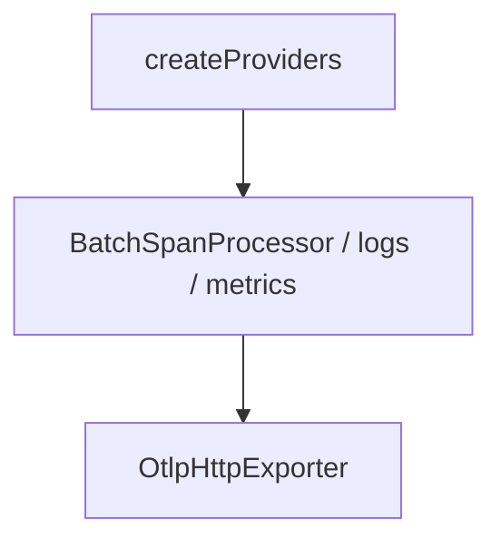
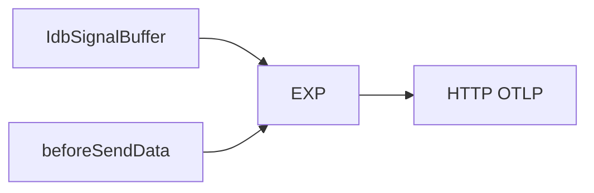
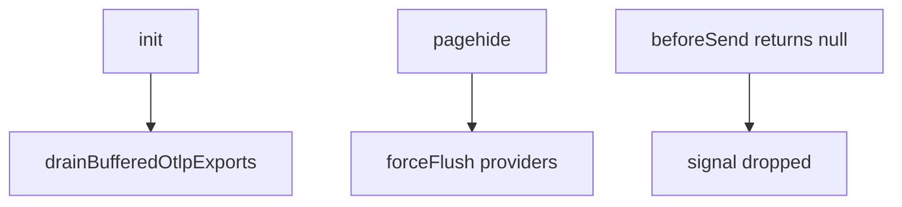

# SDK Core — Exporters and persistence — SPEC.md

Package: `@dreamhorizonorg/pulse-web`  
File: `pulse-web-otel/docs/sdk-core/exporters-and-persistence/SPEC.md`

---

## 1. Goal

Specify **OTLP provider wiring**, **IndexedDB disk buffering / drain**, **beacon relay**, and **`beforeSendData`** export hooks.

---

## 2. Assumptions

See [`../assumptions/SPEC.md`](../assumptions/SPEC.md).

---

## 3. Requirements

**R10 — IndexedDB drain** and export pipeline obligations — [`../requirements/SPEC.md`](../requirements/SPEC.md).

---

## 4. Architectural Design

### 4.1 HLD — providers to network (Mermaid)

### 4.2 LD — persistence + hooks in path (Mermaid)

### 4.3 Flows — drain, pagehide, drop (Mermaid)

`createProviders` → batch processors → OTLP HTTP exporters; optional IDB buffer layer; `drainBufferedOtlpExports` on next init — see [`../architecture-and-bootstrap/SPEC.md`](../architecture-and-bootstrap/SPEC.md).

---

## 5. LLD

### 5.1 OTLP exporters and providers

`src/exporters.ts`: `createProviders(exporterConfig, resource, spanProcessors, logProcessors)` builds three providers:

- `WebTracerProvider` → `BatchSpanProcessor` → `OtlpHttpExporter` → `/v1/traces`
- `LoggerProvider` → `BatchLogRecordProcessor` → `OtlpHttpLogExporter` → `/v1/logs`
- `MeterProvider` → `PeriodicExportingMetricReader` → `OtlpHttpMetricExporter` → `/v1/metrics`

Wire format: `protobuf` (default after `useProtobuf` flag) or `json`. `export.format: "json"` is intended for DevTools-readable debugging.

**IndexedDB disk buffering:** When `diskBuffering.enabled !== false` (on by default), the OTLP exporters write to an IndexedDB signal buffer (`IdbSignalBuffer`) before sending over the network. On the next init, `drainBufferedOtlpExports()` replays any unsent batches. Max age and max size are configurable; defaults enforced in `src/constants/disk-buffer.ts`.

**Beacon relay:** If `beaconRelayUrl` is set, `sendBeacon` calls are routed through a relay to avoid the API-key-in-querystring constraint of the native `sendBeacon` API.

**beforeSendData hooks:** `PulseWebBeforeSendConfig` — either a generic `beforeSend(signal) → signal | null` function or a typed object with `beforeSendSpan`, `beforeSendLog`, `beforeSendMetric`. Returning `null` drops the signal. Runs at export time in the exporter pipeline.

### 5.2 Processor attachment order

`createProviders` accepts **pre-built** `spanProcessors` and `logProcessors` arrays from `sdk.ts` — order matters: global attrs + export sampling + signal filter wrap exporters **after** batch processors in the construction order defined in `exporters.ts` (read file when changing).

### 5.3 IndexedDB buffer contract

| Constant / behaviour | Location |
|----------------------|----------|
| Default max age / size | `src/constants/disk-buffer.ts` |
| Buffer read/write | `src/persistence/` (`IdbSignalBuffer` and drain helper) |
| Drain trigger | Early in `finishInit` **after** providers exist, **before** `installAll` |

### 5.4 Compression + wire format

Protobuf default for bandwidth; `export.format: "json"` switches OTLP JSON encoding for debugging. Compression flags follow exporter config from `sdk.ts` / `PulseWebConfig` (see integration tests for `VITE_PULSE_COMPRESSION` in demo).

---

## 6. Test Coverage

### 6.1 Scenario matrix (export path)

| ID | Type | Given | When | Then | Tests |
|----|------|-------|------|------|-------|
| XP-P1 | positive | disk buffering on | crash last session | drain replays rows | `drain-buffered-exports.test.ts` |
| XP-N1 | negative | beforeSend drops | export batch | signal omitted | `before-send-exporter.test.ts` |
| XP-E1 | edge | pagehide | tab closing | forceFlush | `m8.test.ts` |

### 6.2 Index

[`../test-coverage/SPEC.md`](../test-coverage/SPEC.md) — `integration-simplified-init.test.ts`, [`../../../src/__tests__/drain-buffered-exports.test.ts`](../../../src/__tests__/drain-buffered-exports.test.ts), [`../../../src/__tests__/before-send-exporter.test.ts`](../../../src/__tests__/before-send-exporter.test.ts), persistence / beacon tests as listed there.

---

## 7. Known Bugs & Gaps

[`../known-gaps-and-open-questions/SPEC.md`](../known-gaps-and-open-questions/SPEC.md) (beforeSend naming P0:4).

---

## 8. Redundancy & Cleanup Notes

None.

---

## 9. Open Questions

[`../known-gaps-and-open-questions/SPEC.md`](../known-gaps-and-open-questions/SPEC.md) §9 (IDB drain vs first batch).
