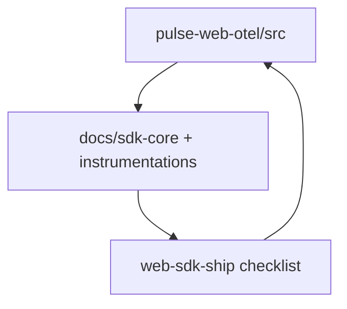
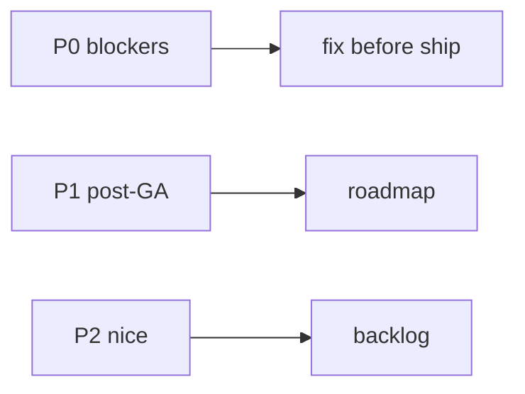
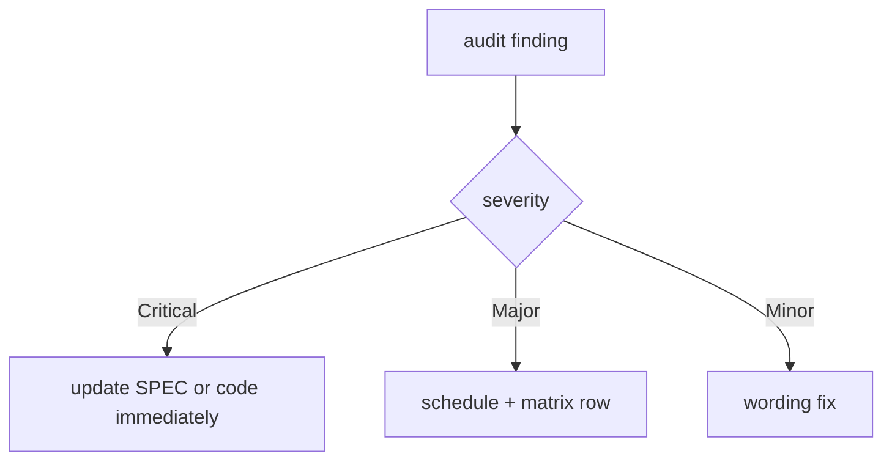

# SDK Core — Known gaps and open questions — SPEC.md

Package: `@dreamhorizonorg/pulse-web`  
File: `pulse-web-otel/docs/sdk-core/known-gaps-and-open-questions/SPEC.md`

---

## 1. Goal

Track **P0/P1/P2 product and API critique items**, **absorbed planning paths**, and **open design questions** for the SDK core surface.

---

## 2. Assumptions

None beyond [`../assumptions/SPEC.md`](../assumptions/SPEC.md).

---

## 3. Requirements

**N/A** — this document is meta; functional reqs remain in [`../requirements/SPEC.md`](../requirements/SPEC.md).

---

## 4. Architectural Design

### 4.1 HLD — feedback loop (Mermaid)

### 4.2 LD — P0 / P1 / P2 routing (Mermaid)

### 4.3 Flows — SPEC audit handoff (Mermaid)

---

## 5. LLD

### 5.1 Severity rubric (how to use §7)

| Tag | Ship impact | SPEC / code expectation |
|-----|--------------|-------------------------|
| **P0** | Blocks GA / wrong telemetry / broken integration | Must be fixed or explicitly waived with ADR + test proving safe behaviour. |
| **P1** | Post-GA ergonomics / perf / DX | Track in roadmap; update [`../public-api/SPEC.md`](../public-api/SPEC.md) or config SPEC when closing. |
| **P2** | Nice-to-have / style | Optional; avoid churn unless bundled with related P0/P1. |

### 5.2 Row schema (each P* item in §7)

Each item should include: **symptom** (user-visible), **root cause** (module), **recommended fix**, **owner** (web-sdk vs backend template). Numbering is stable (`P0:1`, …) — append new IDs; do not renumber without archival note in §8.

### 5.3 Closing a gap (workflow)

1. Implement or document waiver in `src/` + update the relevant SPEC (`sdk-core` topic or `instrumentations/<id>`).  
2. Add/extend Vitest (see [`../test-coverage/SPEC.md`](../test-coverage/SPEC.md) §5.7–5.8).  
3. Downgrade or remove the row from §7 only when shipped and reviewed.

### 5.4 Relation to open questions (§9)

Open questions are **unresolved product decisions**; P-items are **known defects or API debt**. If a P-item is “won’t fix”, move rationale to §9 and mark P row as **closed — see §9.x**.

---

## 6. Test Coverage

### 6.1 Scenario matrix (verification of fixes)

| ID | Type | Given | When | Then | Tests |
|----|------|-------|------|------|-------|
| KG-P1 | positive | gap closed in code | PR | linked test added | per-area `src/__tests__` |
| KG-E1 | edge | gap remains documented | release | still listed in §7 with severity | **manual** |

### 6.2 Index

**N/A** as a separate suite — regressions for closed gaps live under [`../test-coverage/SPEC.md`](../test-coverage/SPEC.md) and per-instrumentation SPECs.

### 6.3 Playwright E2E traceability

Closing a gap that affects exported telemetry should add or extend a Playwright title under `examples/ecommerce-demo/e2e/` (and mirror in `nextjs-demo` when framework-specific). Master list: [`../test-coverage/SPEC.md`](../test-coverage/SPEC.md) §6.3–§6.5.

---

## 7. Known Bugs & Gaps

Absorbs `docs/API-CRITIQUE.md` as structured P0/P1/P2 items.

### P0: Before GA / 1.0

**P0:1 — Ambiguous entry point.** `Pulse` is a pre-resolved singleton instance, not a class or factory. `Pulse.init()` is unusual — every peer SDK uses either `init()` (free function) or `new SDK().start()` (class). The current shape forces users to import the runtime even when they only want types. Recommendation: export `init` as a named free function alongside `Pulse` for method calls; make `Pulse.init` an alias. This matches `@sentry/browser` ergonomics exactly.

**P0:2 — Naming drift on capture API.** Four different verbs for "send a signal": `trackEvent`, `trackNonFatal`, `reportException`, `reportDeviceCrash`. Market standard is one verb (Sentry: `capture*`; Datadog: `add*`). Rename to `captureEvent`, `captureException`, `captureCrash`, `captureNonFatal` before 1.0.

**P0:3 — Identity API is split across three setters.** `setUserProperty(key, value)` + `setUserProperties(props)` + `setUserId(id)` + `clearUserIdentity()`. Sentry collapsed this to `setUser({id, ...props})`. Recommend: `setUser({ id, ...props })`, `getUser()`, `clearUser()`. Reduces method count and eliminates the `setUserProperty` / `setUserProperties` redundancy.

**P0:4 — `beforeSendData` naming.** Every peer SDK calls this `beforeSend`. The `Data` suffix adds nothing and breaks Sentry-native muscle memory. Rename to `beforeSend` at config surface.

**P0:5 — Missing `<PulseRouterEvents />` for `/react`.** The Next.js subpath has `<PulseNavigationEvents />`; the React subpath only exports `useRouterTracking` (hook) with no drop-in component equivalent. Forces users to write a null-rendering wrapper component. Add `<PulseRouterEvents />` to `/react` subpath.

**P0:6 — `shutdownOnUnmount` default.** `PulseProvider` defaults `shutdownOnUnmount` to `false` as a documented exception — which means users who accept the default get the wrong behaviour in tests. Default should explicitly be `false` with `true` reserved for test teardown; current code is already `false` but the docs imply it's a caveat rather than an intentional choice.

### P1: First minor after GA

**P1:7 — `globalAttributes` vs `resourceAttributes` scope invisible.** Both exist on `PulseWebConfig` but the difference (per-signal vs per-resource) is invisible from the names. Users will put tenant tags in the wrong one. Either auto-merge into one field or rename: `signalAttributes` (attached per-span/log) vs `resourceAttributes` (OTel Resource, once per init).

**P1:8 — `@dreamhorizonorg/pulse-web/next` ESM resolution not verified in clean `create-next-app`.** The ecommerce demo uses a webpack alias to resolve the workspace package. This may mask an ESM resolution failure for external consumers. Needs verification before GA.

**P1:9 — No Vite source-map upload.** `withPulseConfig` is Next-only. Vite, CRA, Webpack5, Rollup, and Rspack users must upload source maps manually. Document the manual path; consider `vite-plugin-pulse` in a future minor.

**P1:10 — `reportException` + `reportDeviceCrash` are one-parameter-different.** They differ only in `severityNumber` (WARN vs FATAL) and the `error.filename` attribute on crash. Collapsing to `captureException(err, { level: "fatal" | "warn" })` reduces surface without losing flexibility.

### P2: Nice to have

**P2:11 — Single `<PulseRouter />` for all framework routers.** Auto-detect React Router vs Next.js App Router vs Pages Router and do the right thing. Reduces integration to one component with no subpath import.

**P2:12 — Replace `dataCollectionState` enum with a string union.** `consent: "allowed" | "denied" | "pending"` is half the keystrokes and requires no enum import. The current `PulseDataCollectionConsent` enum is a migration hazard for anyone who tries to tree-shake enum-only imports.

**P2:13 — `PulseAttributes` type drift from OTel `Attributes`.** Currently a Pulse-specific alias. Users copy-pasting OTel snippets hit type mismatches. Align with `@opentelemetry/api` `Attributes` type exactly.

---

## 8. Redundancy & Cleanup Notes

The following planning documents were absorbed into the sdk-core spec set and deleted (triple-eval: pass 1 — all concepts captured; pass 2 — line-by-line scan; pass 3 — final confirm):

| Deleted path | Content absorbed into |
|---|---|
| `pulse-web-otel/web-sdk-plan/v1/01-foundation/README.md` | [`../architecture-and-bootstrap/SPEC.md`](../architecture-and-bootstrap/SPEC.md), [`../test-coverage/SPEC.md`](../test-coverage/SPEC.md), this table |
| `pulse-web-otel/web-sdk-plan/v1/01-foundation/sdk-lifecycle.md` | [`../architecture-and-bootstrap/SPEC.md`](../architecture-and-bootstrap/SPEC.md), [`../../instrumentations/session/SPEC.md`](../../instrumentations/session/SPEC.md), [`../public-api/SPEC.md`](../public-api/SPEC.md) |
| `pulse-web-otel/web-sdk-plan/INTEGRATION.md` | [`../config-and-consent/SPEC.md`](../config-and-consent/SPEC.md), [`../public-api/SPEC.md`](../public-api/SPEC.md), P0:5 in this file |
| `pulse-web-otel/docs/API-CRITIQUE.md` | Known bugs section above |

---

## 9. Open Questions

1. **`dataCollectionState` deprecation timeline.** P2:12 proposes `consent: string union`. Before 1.0, should we ship a deprecation warning when the enum form is detected and recommend the new shape?

2. **`globalAttributes` vs `resourceAttributes` merge strategy.** If we auto-merge (P1:7), do signal-level attributes overwrite resource attributes of the same key, or vice versa? Need a decision before touching the `PulseGlobalAttributesProcessor` merge logic.

3. **IndexedDB drain on slow networks.** The drain fires immediately at init. On a slow network, this competes with the `session.start` signal for the first-batch slot. Should drain be delayed until after the first flush, or run in a lower-priority microtask queue?

4. **`Pulse.whenReady()` — should it reject?** Currently it always resolves (even on consent-blocked init). If a consumer awaits `whenReady()` assuming `isInitialized()` will be true afterwards, they will be surprised. Consider: resolve with a boolean, or reject with a typed `PulseInitError` on `DENIED`/`PENDING`.

5. **React 19 / concurrent mode compatibility.** `PulseProvider` calls `Pulse.init()` in a `useEffect`. Under React 19 Strict Mode, effects fire twice in dev. The `_initializing` guard covers the double-init race, but the double `shutdown()` + re-init cycle during Strict Mode teardown has not been explicitly tested.
