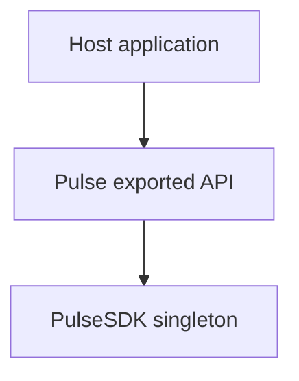
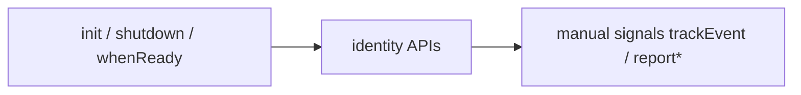
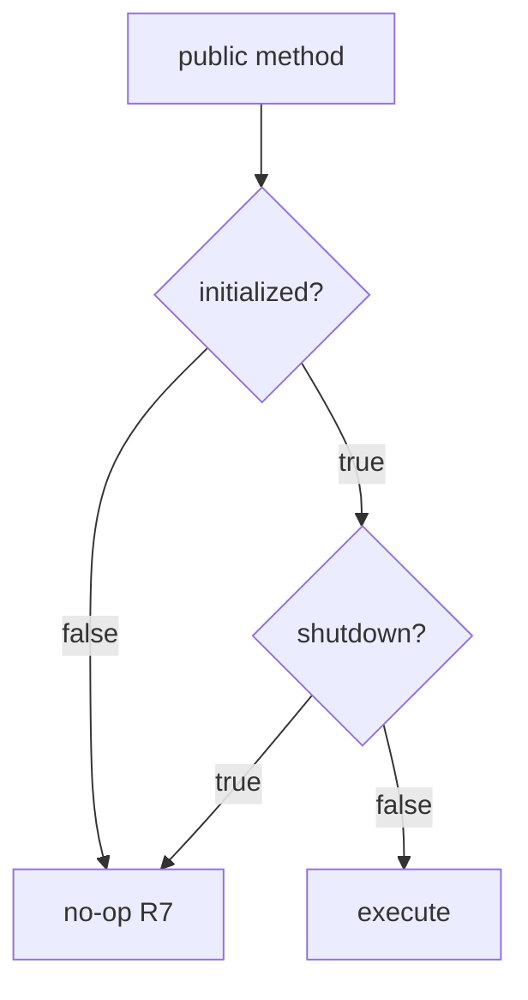

# SDK Core — Public API (`Pulse.*`) — SPEC.md

Package: `@dreamhorizonorg/pulse-web`  
File: `pulse-web-otel/docs/sdk-core/public-api/SPEC.md`

---

## 1. Goal

Document the **`Pulse` singleton surface** exported via `src/index.ts`: init lifecycle hooks, identity helpers, and manual signal APIs.

---

## 2. Assumptions

See [`../assumptions/SPEC.md`](../assumptions/SPEC.md).

---

## 3. Requirements

**R7 — Public API** — all methods no-op before init completes or after shutdown — [`../requirements/SPEC.md`](../requirements/SPEC.md).

---

## 4. Architectural Design

### 4.1 HLD — host vs `Pulse` facade (Mermaid)

### 4.2 LD — call categories (Mermaid)

### 4.3 Flows — pre-init and post-shutdown (Mermaid)

`Pulse` delegates to `PulseSDK` singleton — see [`../architecture-and-bootstrap/SPEC.md`](../architecture-and-bootstrap/SPEC.md).

---

## 5. LLD

### 5.1 Public API (`Pulse.*`)

| Method | Description |
|---|---|
| `Pulse.init(config)` | Bootstrap the SDK. Returns `Promise<void>`. |
| `Pulse.shutdown()` | Tear down — uninstall instrumentations, flush, reset singleton. |
| `Pulse.whenReady()` | Resolves when async init finishes, or immediately if already initialized. |
| `Pulse.isInitialized()` | Sync check for whether init has completed. |
| `Pulse.setScreenName(name)` | Update `screen.name` on all subsequent signals. |
| `Pulse.setUserId(id \| null)` | Set / clear user identity. Emits user session transition signals. |
| `Pulse.setUserProperty(key, value)` | Set single user property (`pulse.user.<key>`). |
| `Pulse.setUserProperties(props)` | Batch set user properties. |
| `Pulse.clearUserIdentity()` | Clear persisted user ID and all properties. |
| `Pulse.trackEvent(name, attrs?, timestampMs?)` | Custom event signal (`pulse.type = custom_event`). **Also** requires `FeatureGate.isEnabled(PulseFeature.CUSTOM_EVENTS)` in addition to consent / init guards. |
| `Pulse.reportException(error, attrs?)` | Manual non-fatal (`pulse.type = non_fatal`, WARN severity). |
| `Pulse.reportDeviceCrash(error, attrs?)` | Fatal crash signal (`pulse.type = device.crash`, FATAL severity). |
| `Pulse.trackNonFatal(name, attrs?)` | Named non-fatal event (`pulse.type = non_fatal`). |

`pulse.type` / attribute contracts: [`../data-contract/SPEC.md`](../data-contract/SPEC.md). Errors instrumentation: [`../../instrumentations/errors/SPEC.md`](../../instrumentations/errors/SPEC.md).

### 5.2 Internal guards (`PulseSDK`)

| Guard | Purpose |
|-------|---------|
| `_initialized` | Public API methods no-op until `true` (R7). |
| `_initializing` | Concurrent `init` coalesces on same promise. |
| `_shuttingDown` | Prevents use-after-free during async teardown. |

### 5.3 Async vs sync on facade

| API | Sync? | Notes |
|-----|-------|------|
| `Pulse.init` | async (`Promise<void>`) | Await or `whenReady()` before asserting telemetry. |
| `Pulse.whenReady` | async | Resolves immediately if already initialized. |
| `Pulse.isInitialized` | sync | |
| `setScreenName` / identity / `trackEvent` | sync calls; async export | May queue OTLP asynchronously. |

### 5.4 `trackEvent` consent path

`Pulse.trackEvent` re-checks `isDataCollectionAllowed` at call time (defence in depth) in addition to init gate — see [`../config-and-consent/SPEC.md`](../config-and-consent/SPEC.md) §5.2.

---

## 6. Test Coverage

### 6.1 Scenario matrix (public API)

| ID | Type | Given | When | Then | Tests |
|----|------|-------|------|------|-------|
| API-P1 | positive | after init | `trackEvent` | `custom_event` log | `sdk-public-methods.test.ts` |
| API-N1 | negative | before init | any method | no-op | same |
| API-E1 | edge | after shutdown | `setScreenName` | no-op | `sdk-lifecycle` + public methods |

### 6.2 Index

[`../test-coverage/SPEC.md`](../test-coverage/SPEC.md) — `sdk-public-methods.test.ts`, `sdk-lifecycle.test.ts`.

### 6.3 Playwright E2E traceability

`trackEvent`, `reportException`, `setScreenName`, shutdown, and consent gates appear under **`@M1`**, **`@M3-errors`**, **`@M15`** in [`../test-coverage/SPEC.md`](../test-coverage/SPEC.md) §6.3.

---

## 7. Known Bugs & Gaps

[`../known-gaps-and-open-questions/SPEC.md`](../known-gaps-and-open-questions/SPEC.md) (capture API naming P0:2, identity API P0:3).

---

## 8. Redundancy & Cleanup Notes

`web-sdk-plan/INTEGRATION.md` public API fragments absorbed here.

---

## 9. Open Questions

[`../known-gaps-and-open-questions/SPEC.md`](../known-gaps-and-open-questions/SPEC.md) §9 (`whenReady` semantics).
