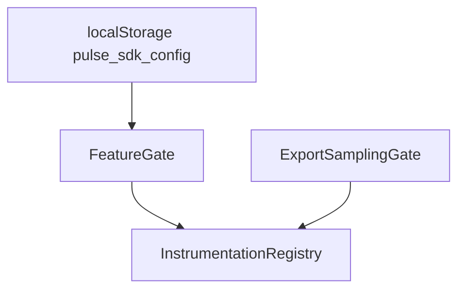
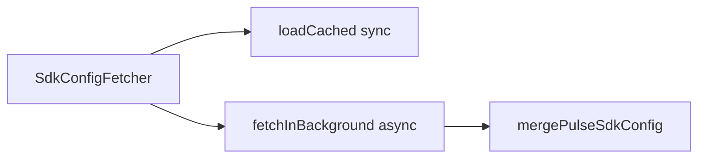
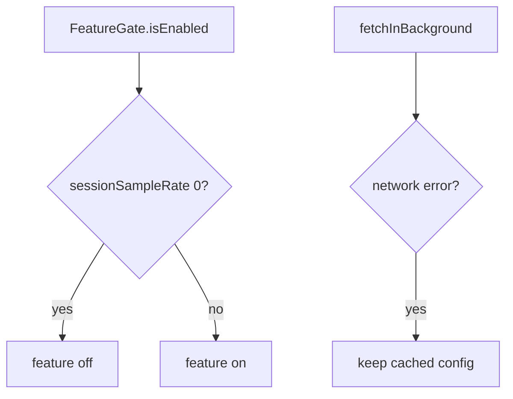

# SDK Core — Remote config, features, and sampling — SPEC.md

Package: `@dreamhorizonorg/pulse-web`  
File: `pulse-web-otel/docs/sdk-core/remote-config-features-and-sampling/SPEC.md`

---

## 1. Goal

Describe **remote `PulseSdkConfig`**, **feature gating** per instrumentation, and **export-time sampling** (`ExportSamplingGate`).

---

## 2. Assumptions

See [`../assumptions/SPEC.md`](../assumptions/SPEC.md) (background fetch + cached gate at init).

---

## 3. Requirements

**R3**, **R4**, **R9** — [`../requirements/SPEC.md`](../requirements/SPEC.md).

---

## 4. Architectural Design

### 4.1 HLD — cache + gates + install



### 4.2 LD — fetcher vs merge



### 4.3 Flows — feature off and fetch failure



`SdkConfigFetcher.loadCached` runs during init; `fetchInBackground` post-init. `FeatureGate` + `ExportSamplingGate` constructed from merged config — see [`../architecture-and-bootstrap/SPEC.md`](../architecture-and-bootstrap/SPEC.md).

Invalid cached JSON / invalid shape → `loadCached` keeps the fetcher’s default merged config (see `remote-config.ts`). Invalid or non-OK fetch responses → in-memory config unchanged; see §5.2 / §6.1 **RC-E1**. Cached `localStorage` invalid JSON does **not** auto-clear the bad string (operator or host may replace `pulse_sdk_config`).

---

## 5. LLD

### 5.1 Feature gate

`src/feature-gate.ts`: `FeatureGate.isEnabled(feature: PulseFeatureName)` maps `PulseFeature.*` names (e.g. `PulseFeature.SESSION`, `PulseFeature.WEB_VITALS`) to entries in the remote `PulseSdkConfig.features` array. A feature is enabled when:

- No matching entry in the features array (default: enabled), OR
- The SDK name `pulse_web_js` is not listed in `sdks`, OR
- `sessionSampleRate === 1`

When an entry matches the feature and lists `pulse_web_js` under `sdks`, **`sessionSampleRate === 1`** means the feature is fully on for that config row; values **strictly between `0` and `1`** mean probabilistic / partial session sampling (not the same as “always off” or “always on”).

`sessionSampleRate === 0` disables the feature for 100% of sessions.

`FeatureGate.getSampleRate(feature)` returns `sessionSampleRate` for the first config row matching `feature` **and** including `pulse_web_js` in `sdks`; if there is no such row, returns `1.0`.

`InstrumentationRegistry.shouldInstall(key)`:

- `configEnabled === false` → always false (local kill switch; remote cannot re-enable)
- `configEnabled !== false && gateEnabled` → install

### 5.2 Remote config fetch sequence

```text
init()
  └─ SdkConfigFetcher.loadCached()
        └─ localStorage.getItem("pulse_sdk_config")
              ├─ valid JSON + valid shape → mergePulseSdkConfig(parsed) → use
              └─ missing / invalid → DEFAULT_SDK_CONFIG

  └─ [post-init] SdkConfigFetcher.fetchInBackground()
        └─ fetch(configUrl, { "X-API-KEY": apiKey })
              ├─ response.ok + isValidSdkConfig(data) + data.version !== cached.version
              │     → mergePulseSdkConfig(data)
              │     → localStorage.setItem("pulse_sdk_config", JSON.stringify(merged))
              └─ error / no version change → no-op
```

**Version behavior (authoritative):** `fetchInBackground` applies and persists when `response.ok`, the body passes `isValidSdkConfig`, and **`data.version !==` the in-memory cached `version`** — including when the remote `version` is **numerically lower** than the cache. The Web SDK does **not** enforce monotonic versions or block “downgrades”; operators rely on server/CDN correctness.

Config URL resolution:

- `localhost` / `10.0.2.2` → `http://localhost:8080/v1/configs/active/`
- Production → `https://pulse-otel-collector.pulse-ux.com/config/projects/{projectId}/pulse-config.json`

### 5.3 Export sampling

`ExportSamplingGate` evaluates session-level sampling rules at export time (not span-creation time), preserving parent/child span sampling consistency. Authoritative LLD, decision flow, exporter wrapper order, and test matrix: [`../sampling-and-filtering/SPEC.md`](../sampling-and-filtering/SPEC.md). Implementation entrypoint: `src/sampling/export-sampling-gate.ts`.

### 5.4 `PulseFeature` ↔ `InstrumentationKeys`

Mapping is **authoritative** in `instrumentation-registry.ts` (`featureMap` inside `shouldInstall`):

| `InstrumentationKeys` (config + registry) | `PulseFeature` |
|---------------------------------------------|----------------|
| `errors` | `JS_CRASH` |
| `network` | `NETWORK_INSTRUMENTATION` |
| `clicks` | `CLICK` |
| `webVitals` | `WEB_VITALS` |
| `navigation` | `SCREEN_NAVIGATION` |
| `session` | `SESSION` |
| `interactions` | `INTERACTION` |
| `sessionReplay` | `SESSION_REPLAY` |

Local `instrumentations.<key>.enabled === false` **short-circuits** before gate evaluation (`shouldInstall`).

### 5.5 Merge rules (`mergePulseSdkConfig`)

Implementation: `src/remote-config.ts` (`mergePulseSdkConfig`). Input is a single JSON-shaped `PulseSdkConfig` (from `localStorage` or from a successful fetch). Output is **not** a three-way merge of “defaults + old cache + new remote” in one call: the fetcher **replaces** its in-memory config with `mergePulseSdkConfig(data)` when it accepts a new payload.

**Shape merge (normative):**

- Top-level: starts from `DEFAULT_SDK_CONFIG`, spreads `raw`, then overwrites **`sampling`**, **`signals`**, **`interaction`**, and **`features`** with computed fields (so `raw` cannot leave half-merged `sampling` / `signals`).
- **`sampling`:** merges `default`, replaces `rules` with `raw.sampling.rules ?? []`, maps `signalsToSample` with `normalizeSignalMatchCondition` on each entry, merges `criticalSessionPolicies.alwaysSend` when present, and strips legacy `criticalEventPolicies` from the merged object.
- **`signals`:** merges defaults with `raw.signals`; **`signals.filters`** merges default filter map with incoming then normalizes `values`; **`attributesToDrop`** / **`attributesToAdd`** / **`metricsToAdd`** are normalized (scopes, prop `name`→`key`, nested conditions).
- **`features`:** **`raw.features ?? []`** — the merged config’s `features` array is exactly the array from the payload (or empty). There is **no** per-`featureName` id merge across prior cache and new remote inside this function.

**Explicit non-goals (product):** no client-side “only accept `version` ≥ cached” rule; no id-based union of `features[]` rows across responses — **SPEC follows code**.

**Related types / defaults:** `src/types/remote-config.ts`, `src/constants/default-sdk-config.ts`.

**Bootstrap wiring (read when tracing init):** `src/sdk.ts` (constructs `SdkConfigFetcher`, `FeatureGate`, `ExportSamplingGate`), `src/exporters.ts` (wraps exporters with `ExportSamplingGate` when configured).

---

## 6. Test Coverage

### 6.1 Scenario matrix (remote config + gates)

| ID | Type | Given | When | Then | Tests |
|----|------|-------|------|------|-------|
| RC-P1 | positive | cached valid config | `loadCached` | merged config used | `m1.test.ts` (`SdkConfigFetcher`) |
| RC-P2 | positive | `resolveConfigUrl` inputs | call | localhost `:4318`→`:8080` path; prod `pulse-config.json` URL | `m1.test.ts` |
| RC-P3 | positive | raw SDK JSON | `mergePulseSdkConfig` | normalized `sampling` / `signals` / scopes | `merge-pulse-sdk-config.test.ts` |
| RC-N1 | negative | `sessionSampleRate=0` + `pulse_web_js` in `sdks` | `FeatureGate.isEnabled` | feature disabled | `m1.test.ts` |
| RC-N2 | negative | fractional `sessionSampleRate` | `FeatureGate.isEnabled` | disabled (not full on) | `m1.test.ts` |
| RC-N3 | negative | `instrumentations.<key>.enabled === false` | registry | instrumentation not installed | `web-vitals-instrumentation.test.ts`, `clicks-instrumentation.test.ts`, `errors-instrumentation-gate-and-ssr.test.ts` |
| RC-E1 | edge | active config HTTP error / empty cache | page load + background fetch | defaults or cached version unchanged | Playwright **`@M1 remote config fetch resilience`** (`m1.spec.ts`); Vitest for `!ok` / throw optional — [`review-fix.md`](../../review-fix.md) **RF-RC1** |
| RC-E2 | edge | fetch returns same `version` as cache | `fetchInBackground` | no `localStorage` write | `m1.test.ts` |
| RC-E3 | edge | remote `version` **lower** than cache | `fetchInBackground` | merged remote config still applied when valid (no monotonic guard) | **missing** (documented here; optional Vitest — **RF-RC1**) |
| RC-E4 | edge | matching feature row but `sdks` omits `pulse_web_js` | `FeatureGate.isEnabled` | enabled (`true`) | **missing** Vitest — **RF-RC1** |
| R9 | positive | sampling rules / export gate | export | spans/logs gated per [`../sampling-and-filtering/SPEC.md`](../sampling-and-filtering/SPEC.md) | `export-sampling-gate.test.ts`, `interactions-sdk-wiring.test.ts`; Playwright **`@M1 remote config + export gate`** |

### 6.2 Index

[`../test-coverage/SPEC.md`](../test-coverage/SPEC.md) — Vitest: `m1.test.ts` (`SdkConfigFetcher`, `resolveConfigUrl`, `FeatureGate`), `merge-pulse-sdk-config.test.ts`, `export-sampling-gate.test.ts`, `interactions-sdk-wiring.test.ts`, instrumentation registry tests under `src/__tests__/*instrumentation*`. Playwright: **`@M1 localStorage state`**, **`@M1 remote config fetch resilience`**, **`@M1 remote config + export gate`** (see §6.3).

### 6.3 Playwright E2E traceability

Seeded / 404 remote config, `pulse_sdk_config` localStorage, `sessionSampleRate`, and `signals.filters` BLACKLIST: **`@M1 localStorage state`**, **`@M1 remote config fetch resilience`**, **`@M1 remote config + export gate`** — [`../test-coverage/SPEC.md`](../test-coverage/SPEC.md) §6.3.

---

## 7. Known Bugs & Gaps

[`../known-gaps-tradeoffs-and-plan.md`](../known-gaps-tradeoffs-and-plan.md) §1.

---

## 8. Redundancy & Cleanup Notes

None.

---

## 9. Open Questions

[`../known-gaps-tradeoffs-and-plan.md`](../known-gaps-tradeoffs-and-plan.md) §3.
