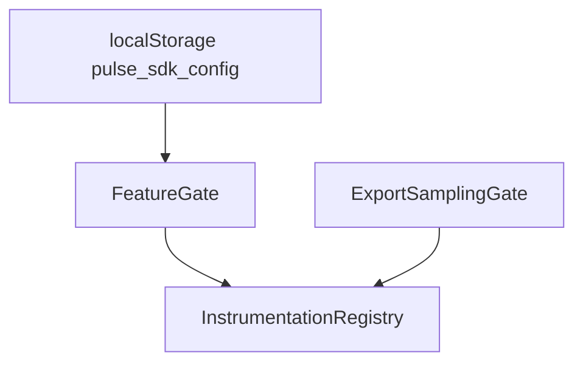
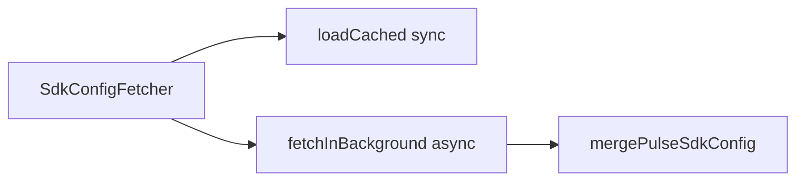
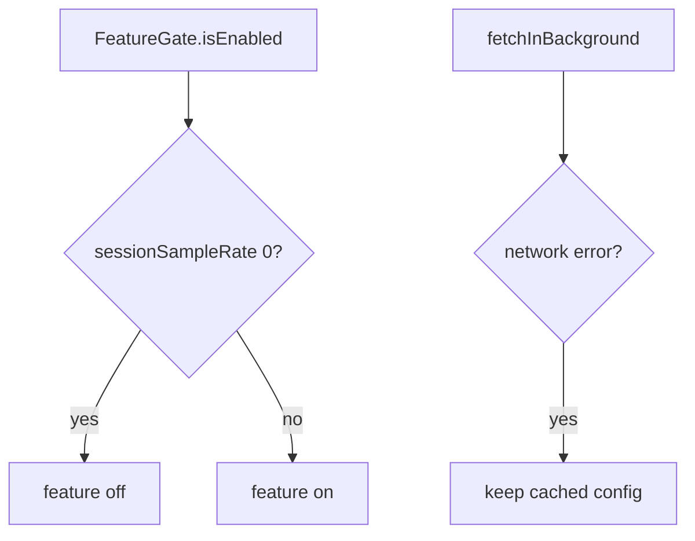

# SDK Core — Remote config, features, and sampling — SPEC.md

Package: `@dreamhorizonorg/pulse-web`  
File: `pulse-web-otel/docs/sdk-core/remote-config-features-and-sampling/SPEC.md`

---

## 1. Goal

Describe **remote `PulseSdkConfig`**, **feature gating** per instrumentation, and **export-time sampling** (`ExportSamplingGate`).

---

## 2. Assumptions

See [`../assumptions/SPEC.md`](../assumptions/SPEC.md) (background fetch + cached gate at init).

---

## 3. Requirements

**R3**, **R4**, **R9** — [`../requirements/SPEC.md`](../requirements/SPEC.md).

---

## 4. Architectural Design

### 4.1 HLD — cache + gates + install (Mermaid)



### 4.2 LD — fetcher vs merge (Mermaid)



### 4.3 Flows — feature off and fetch failure (Mermaid)



`SdkConfigFetcher.loadCached` runs during init; `fetchInBackground` post-init. `FeatureGate` + `ExportSamplingGate` constructed from merged config — see [`../architecture-and-bootstrap/SPEC.md`](../architecture-and-bootstrap/SPEC.md).

---

## 5. LLD

### 5.1 Feature gate

`src/feature-gate.ts`: `FeatureGate.isEnabled(feature: PulseFeatureName)` maps `PulseFeature.*` names (e.g. `PulseFeature.SESSION`, `PulseFeature.WEB_VITALS`) to entries in the remote `PulseSdkConfig.features` array. A feature is enabled when:

- No matching entry in the features array (default: enabled), OR
- The SDK name `pulse_web_js` is not listed in `sdks`, OR
- `sessionSampleRate === 1`

When an entry matches the feature and lists `pulse_web_js` under `sdks`, **`sessionSampleRate === 1`** means the feature is fully on for that config row; values **strictly between `0` and `1`** mean probabilistic / partial session sampling (not the same as “always off” or “always on”).

`sessionSampleRate === 0` disables the feature for 100% of sessions.

`InstrumentationRegistry.shouldInstall(key)`:

- `configEnabled === false` → always false (local kill switch; remote cannot re-enable)
- `configEnabled !== false && gateEnabled` → install

### 5.2 Remote config fetch sequence

```
init()
  └─ SdkConfigFetcher.loadCached()
        └─ localStorage.getItem("pulse_sdk_config")
              ├─ valid JSON + valid shape → mergePulseSdkConfig(parsed) → use
              └─ missing / invalid → DEFAULT_SDK_CONFIG

  └─ [post-init] SdkConfigFetcher.fetchInBackground()
        └─ fetch(configUrl, { "X-API-KEY": apiKey })
              ├─ response.ok + isValidSdkConfig(data) + data.version !== cached.version
              │     → mergePulseSdkConfig(data)
              │     → localStorage.setItem("pulse_sdk_config", JSON.stringify(merged))
              └─ error / no version change → no-op
```

Config URL resolution:

- `localhost` / `10.0.2.2` → `http://localhost:8080/v1/configs/active/`
- Production → `https://pulse-otel-collector.pulse-ux.com/config/projects/{projectId}/pulse-config.json`

### 5.3 Export sampling

`ExportSamplingGate` evaluates session-level sampling rules at export time (not span-creation time), preserving parent/child span sampling consistency. See `src/sampling/export-sampling-gate.ts`.

### 5.4 `PulseFeature` ↔ `InstrumentationKeys`

Mapping is **authoritative** in `instrumentation-registry.ts` (`featureMap` inside `shouldInstall`):

| `InstrumentationKeys` (config + registry) | `PulseFeature` |
|---------------------------------------------|----------------|
| `errors` | `JS_CRASH` |
| `network` | `NETWORK_INSTRUMENTATION` |
| `clicks` | `CLICK` |
| `webVitals` | `WEB_VITALS` |
| `navigation` | `SCREEN_NAVIGATION` |
| `session` | `SESSION` |
| `interactions` | `INTERACTION` |
| `sessionReplay` | `SESSION_REPLAY` |

Local `instrumentations.<key>.enabled === false` **short-circuits** before gate evaluation (`shouldInstall`).

### 5.5 Merge rules (`mergePulseSdkConfig`)

Remote payload is deep-merged with defaults + cached copy: array fields (e.g. `features`) replace by **id** match where applicable; version monotonicity prevents downgrade attacks from stale CDN responses (see implementation in `remote-config.ts`).

---

## 6. Test Coverage

### 6.1 Scenario matrix (remote config + gates)

| ID | Type | Given | When | Then | Tests |
|----|------|-------|------|------|-------|
| RC-P1 | positive | cached valid config | init | gates constructed | `m1.test.ts` |
| RC-N1 | negative | `sessionSampleRate=0` | gate check | feature disabled | `m1.test.ts` |
| RC-E1 | edge | fetch fails | background | cached config retained | **partial** — see open questions |

### 6.2 Index

[`../test-coverage/SPEC.md`](../test-coverage/SPEC.md) — `m1.test.ts` (`SdkConfigFetcher`, `FeatureGate`).

### 6.3 Playwright E2E traceability

Seeded / 404 remote config, `pulse_sdk_config` localStorage, `sessionSampleRate`, and `signals.filters` BLACKLIST: **`@M1 localStorage state`**, **`@M1 remote config fetch resilience`**, **`@M1 remote config + export gate`** — [`../test-coverage/SPEC.md`](../test-coverage/SPEC.md) §6.3.

---

## 7. Known Bugs & Gaps

[`../known-gaps-and-open-questions/SPEC.md`](../known-gaps-and-open-questions/SPEC.md).

---

## 8. Redundancy & Cleanup Notes

None.

---

## 9. Open Questions

[`../known-gaps-and-open-questions/SPEC.md`](../known-gaps-and-open-questions/SPEC.md) §9.
