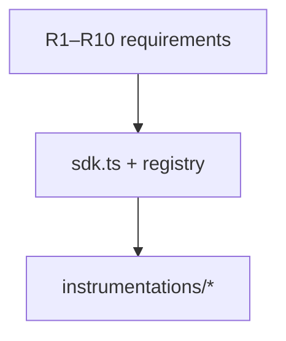
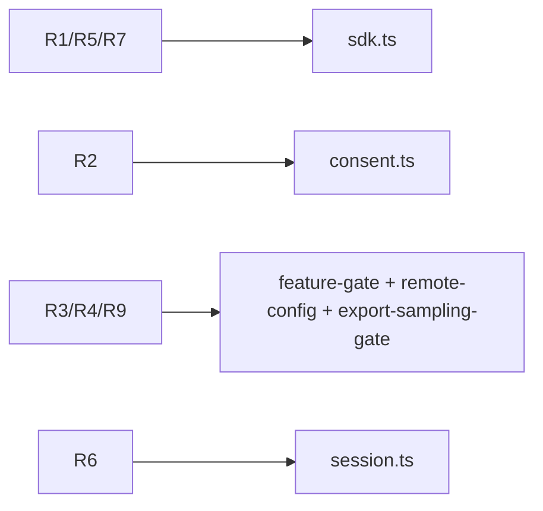
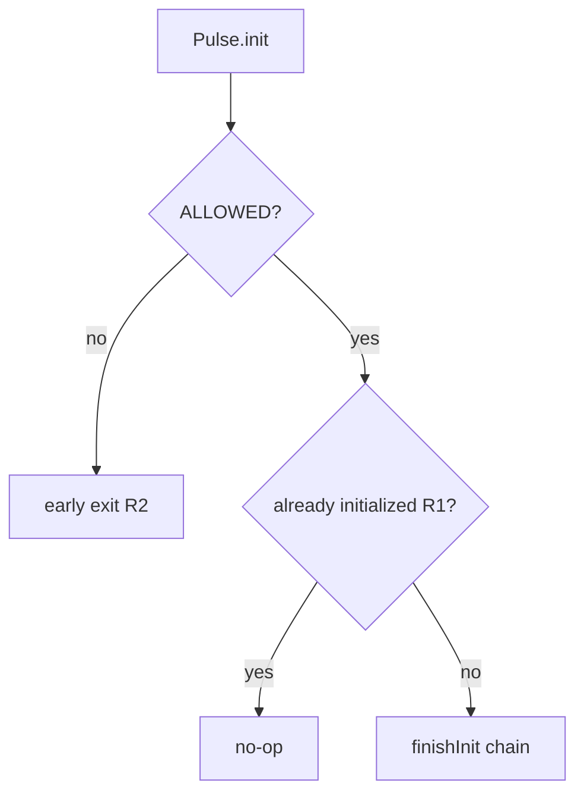

# SDK Core — Requirements — SPEC.md

Package: `@dreamhorizonorg/pulse-web`  
File: `pulse-web-otel/docs/sdk-core/requirements/SPEC.md`

---

## 1. Goal

Enumerate **functional and non-functional requirements (R1–R10)** for the SDK core. Session **implementation** detail and `session.start` / `session.end` contracts are expanded in [`../../instrumentations/session/SPEC.md`](../../instrumentations/session/SPEC.md).

---

## 2. Assumptions

See [`../assumptions/SPEC.md`](../assumptions/SPEC.md).

---

## 3. Requirements

### Functional

**R1 — Init:** `Pulse.init(config)` must be idempotent (double-call is a no-op). Returns a `Promise<void>` that resolves when async bootstrap (OS version resolution, provider wiring) completes.

**R2 — Consent gate:** `dataCollectionState !== ALLOWED` → no signals emitted, no listeners installed. The SDK must be callable (`Pulse.init`) even when consent is `PENDING` or `DENIED`; it simply exits early with no side effects.

**R3 — Feature gate:** Every instrumentation checks `FeatureGate.isEnabled(feature)` before installing event listeners. A remote config can reduce `sessionSampleRate` to 0 to disable a feature without re-deploying.

**R4 — Remote config:** `SdkConfigFetcher.loadCached()` reads `localStorage["pulse_sdk_config"]` synchronously at init. `fetchInBackground()` fires a `fetch` call post-init and persists a new version only if the remote version number differs.

**R5 — Shutdown:** `Pulse.shutdown()` must uninstall all instrumentations, remove the `pagehide` listener, force-flush all providers, and reset the singleton so a subsequent `Pulse.init()` re-bootstraps cleanly.

**R6 — Session:** `SessionProvider` assigns a `session.id` UUID on construction. It rotates the session after `pageHiddenTimeoutMs` of backgrounding (**default 15 minutes**, `DEFAULT_PAGE_HIDDEN_TIMEOUT_MS` in `src/session.ts`, overridable via config). Sessions persist `installationId` and `userId` to `localStorage`. **LLD:** [`../../instrumentations/session/SPEC.md`](../../instrumentations/session/SPEC.md).

**R7 — Public API:** All methods on `Pulse` must silently no-op when called before `init` completes or after `shutdown`. **Surface table:** [`../public-api/SPEC.md`](../public-api/SPEC.md).

**R8 — platform=web mandate:** Every signal emitted by the SDK must carry `platform = 'web'` as an OTel Resource attribute (`os.name = 'web'`). This is set once in `buildMergedResource()` and is not overridable by the host app.

**R9 — Export sampling:** `ExportSamplingGate` evaluates session-level sampling rules at export time (not span-creation time), preserving parent/child span sampling consistency.

**R10 — IndexedDB drain:** On init, if `diskBuffering.enabled !== false`, the SDK replays any buffered OTLP batches from IndexedDB that were written by a previous session that crashed before flushing.

### Non-functional

- **Bundle size:** gated by `size-limit` in CI. No lodash, moment, or Node-only deps.
- **Logging:** All internal logs route through `PulseWebLogger`; consumers can silence via `logLevel: PulseLogLevel.NONE`.
- **Thread safety:** Init is re-entrant safe via `_initializing` guard. Concurrent `init()` calls during async bootstrap return the same in-flight promise.

---

## 4. Architectural Design

### 4.1 HLD — requirements vs ship surface (Mermaid)

### 4.2 LD — requirement to module map (Mermaid)

### 4.3 Flows — consent and idempotent init (Mermaid)

Requirements trace to modules in [`../architecture-and-bootstrap/SPEC.md`](../architecture-and-bootstrap/SPEC.md).

---

## 5. LLD

### 5.1 Traceability sketch

| Req | Primary `src/` |
|-----|----------------|
| R1, R5, R7 | `sdk.ts` |
| R2 | `consent.ts`, `sdk.ts` |
| R3, R4, R9 | `feature-gate.ts`, `remote-config.ts`, `sampling/export-sampling-gate.ts` |
| R6 | `session.ts`, `instrumentations/session.ts` |
| R8 | `resource.ts`, `processors/global-attrs-processor.ts` |
| R10 | `persistence/`, `exporters.ts` |

### 5.2 Functional requirements — LLD notes

| Req | LLD (behaviour contract) |
|-----|---------------------------|
| **R1** | `_initialized` / `_initializing` on `PulseSDK`; second `init` returns resolved promise without re-running `finishInit`. |
| **R2** | Early return **before** `SessionProvider` or resource construction; no `LoggerProvider` until allowed path. |
| **R3** | `InstrumentationRegistry.shouldInstall` combines `InstrumentationConfig` + `FeatureGate.isEnabled(PulseFeature.*)`. |
| **R4** | `localStorage` key `pulse_sdk_config`; merge only bumps when remote `version` increases (see fetcher). |
| **R5** | Uninstall order: instrumentations → `pagehide` listener → `forceFlush` → reset singleton fields — see `sdk.ts`. |
| **R6** | `SessionProvider` visibility + timeout; OTLP emission in `instrumentations/session.ts` — session SPEC. |
| **R7** | Public methods delegate to `PulseSDK` and guard on `_initialized` / shutdown flags. |
| **R8** | `buildMergedResource` forces `os.name = web`; processors must not overwrite with host strings. |
| **R9** | `ExportSamplingGate` on export processors — drops whole batches consistently. |
| **R10** | `drainBufferedOtlpExports` before `installAll` so replayed payloads hit live exporters. |

### 5.3 Non-functional — LLD notes

| NFR | Enforcement |
|-----|----------------|
| Bundle size | `yarn size-limit` + `pulse-web-otel/.size-limit.json`. |
| Logging | `PulseWebLogger` — level from config step 4 of init sequence. |
| Init re-entrancy | Same in-flight `Promise` from concurrent `init()` during `getOsVersionAsync` — see `sdk-lifecycle` tests. |

---

## 6. Test Coverage

### 6.1 Scenario matrix (R1–R10 spot-check)

| Req | Type | Given | When | Then | Tests |
|-----|------|-------|------|------|-------|
| R1 | positive | valid config | double init | second no-op | `sdk-lifecycle` |
| R2 | negative | DENIED / PENDING | init | no providers | `sdk-lifecycle` |
| R3 | edge | feature off in remote | installAll | instrumentation skipped | `m1` FeatureGate |
| R5 | positive | initialized | shutdown | listeners cleared | `sdk-lifecycle` |
| R6 | positive | background > timeout | visible | session rotation | `m1`, session SPEC |
| R10 | positive | IDB batches exist | init | drain replay | persistence tests |

### 6.2 Index

See [`../test-coverage/SPEC.md`](../test-coverage/SPEC.md).

---

## 7. Known Bugs & Gaps

[`../known-gaps-and-open-questions/SPEC.md`](../known-gaps-and-open-questions/SPEC.md).

---

## 8. Redundancy & Cleanup Notes

None.

---

## 9. Open Questions

[`../known-gaps-and-open-questions/SPEC.md`](../known-gaps-and-open-questions/SPEC.md) §9.
