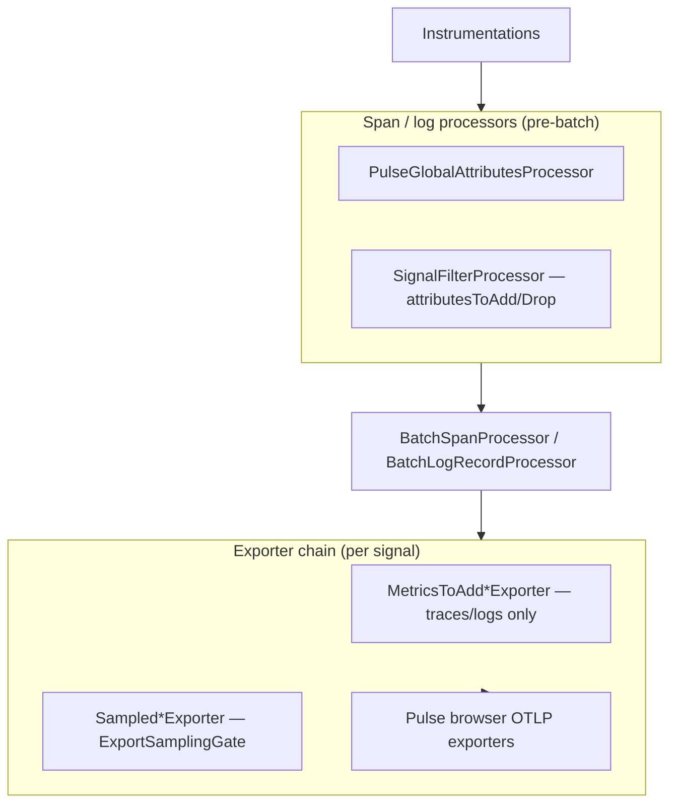
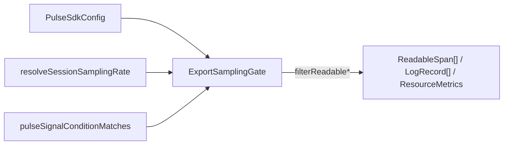
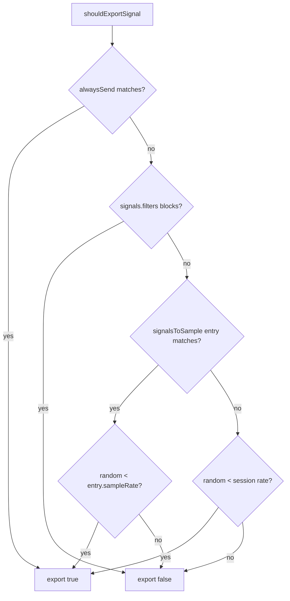

# SDK Core — Sampling and signal filtering — SPEC.md

Package: `@dreamhorizonorg/pulse-web`  
File: `pulse-web-otel/docs/sdk-core/sampling-and-filtering/SPEC.md`

---

## 1. Goal

Document **session-level export sampling**, **`signals.filters`** (BLACKLIST / WHITELIST), **`signalsToSample`** overrides, **`criticalSessionPolicies.alwaysSend`**, and **processor-time attribute filtering** (`attributesToAdd` / `attributesToDrop` keyed by signal match). Align behavior with **Android-style** export gating so parent/child spans stay consistent (filter at export, not at span creation).

Feature-level on/off for instrumentations remains in [`../remote-config-features-and-sampling/SPEC.md`](../remote-config-features-and-sampling/SPEC.md) (`FeatureGate`); this SPEC covers **what still reaches OTLP** after instrumentation runs.

---

## 2. Assumptions

- Remote `PulseSdkConfig` is merged and cached per [`../remote-config-features-and-sampling/SPEC.md`](../remote-config-features-and-sampling/SPEC.md).
- One **`ExportSamplingGate` instance per `Pulse.init`**: a single `Math.random()` draw drives session sampling for that page lifetime (new navigation full reload = new draw unless host reuses the same SDK instance in a way that preserves it — today: tied to init).
- Log signal “name” for matching is derived from the log record **body** string (see `logRecordBodyAsString` in `src/utils/session-sampling-rate.ts`).
- **NFR — ship checklist (lifecycle):** `SignalFilterProcessor` implements no-op `shutdown`/`forceFlush`; sampling gate is not a long-lived subscription. Empty export batches short-circuit with SUCCESS without calling the inner exporter.

---

## 3. Requirements

1. **R-SF1 (session rate resolution):** `resolveSessionSamplingRate` returns a clamped \([0,1]\) rate from `sampling.rules` (first matching rule for `pulse_web_js` and match context) or `sampling.default.sessionSampleRate`.
2. **R-SF2 (export session keep):** For signals without a matching `signalsToSample` entry and not blocked by filters or `alwaysSend`, export iff `sessionRandomDraw < resolvedSessionSampleRate`.
3. **R-SF3 (`signalsToSample`):** If an entry’s `condition` matches (scope, SDK, name, props), export iff `sessionRandomDraw < clamp01(entry.sampleRate)` regardless of default session keep for that signal. The **same** `sessionRandomDraw` computed at `ExportSamplingGate` construction is reused for session keep and for every matched `signalsToSample` rate comparison (`src/sampling/export-sampling-gate.ts`).
4. **R-SF4 (`signals.filters`):** With non-empty `values`, BLACKLIST drops when any condition matches; WHITELIST keeps only when at least one condition matches; empty `values` applies no filter mode restriction.
5. **R-SF5 (`alwaysSend`):** Conditions in `sampling.criticalSessionPolicies.alwaysSend` force export **before** `signals.filters` and session/`signalsToSample` decisions.
6. **R-SF6 (trace/log attr pipeline):** `SignalFilterProcessor` adds or removes attributes on **mutable** span/log records when `attributesToAdd` / `attributesToDrop` conditions match; trace key drops use regex patterns in `values` (Android-style).
7. **R-SF7 (export chain order — traces/logs):** From the batch processor toward the wire (outermost exporter = first to receive the batch from the batch processor / metric reader): optional **`BeforeSend*Exporter`** → **`MetricsToAdd*Exporter`** (mutates batch in place; traces/logs only) → **`Sampled*Exporter`** (`ExportSamplingGate`) → Pulse OTLP browser exporter. Derived metrics from `signals.metricsToAdd` are recorded **before** the sampling gate runs on that batch.
8. **R-SF8 (export chain order — metrics):** `SampledPushMetricExporter` filters whole metric streams by metric descriptor **name** with **`undefined`** attributes passed into `shouldExportSignal` (Android-style match surface). There is **no** `MetricsToAdd*` wrapper on the metric push path. **`src/exporters.ts`** builds the metric chain (**outer → inner** toward OTLP): optional **`BeforeSendMetricExporter`** → optional **`GlobalAttributeInjectingMetricExporter`** → **`SampledPushMetricExporter`** → Pulse OTLP metric exporter. On `export`, the batch flows **outer first**: `beforeSend` / global metric attrs see the batch **before** `SampledPushMetricExporter` applies export-time sampling on the delegate chain.

---

## 4. Architectural design

### 4.1 HLD — two layers: processor vs export gate

### 4.2 LD — gate internals

### 4.3 Flows — `shouldExportSignal` decision

---

## 5. LLD

### 5.1 Match surfaces (not a `pulse.type` emission contract)

This module **filters** telemetry; it does not define new `pulse.type` values. Match keys:

| Surface | Field used for `signalName` | Attributes in conditions |
|--------|-----------------------------|---------------------------|
| Traces | OTel span **name** | Span attributes (e.g. `pulse.type` in conditions) |
| Logs | String from **log body** | Log attributes |
| Metrics | Metric **descriptor.name** | `undefined` in current gate |

Optional span/log attribute **`pulse.sampled`** and other semconv keys are defined in `src/semconv.ts` and producer instrumentations — not owned here.

### 5.2 Config types (authoritative TypeScript)

`PulseSamplingConfig`, `PulseSignalConfig`, `PulseSignalFilter`, `PulseSignalsToSampleEntry`, `PulseSignalMatchCondition`: `src/types/remote-config.ts`.  
`PulseSignalScope`, `ExportSamplingGateInit`: `src/types/sampling.ts`.

### 5.3 Implementation index

| Path | Role |
|------|------|
| `src/sampling/export-sampling-gate.ts` | `ExportSamplingGate` — session draw, filters, `signalsToSample`, `alwaysSend` |
| `src/sampling/sampling-exporters.ts` | `Sampled*Exporter`, `MetricsToAdd*Exporter` wrappers |
| `src/sampling/metrics-to-add-apply.ts` | Apply `signals.metricsToAdd` at export for spans/logs |
| `src/sampling/metrics-to-add-recorder.ts` | Meter recorders for derived metrics |
| `src/sampling/sanitize-instrumentation-name.ts` | Instrumentation name sanitization for derived metrics |
| `src/utils/session-sampling-rate.ts` | `resolveSessionSamplingRate`, `logRecordBodyAsString`, `getCriticalAlwaysSendConditions` |
| `src/utils/sampling-signal-match.ts` | `pulseSignalConditionMatches`, key drop patterns, invalid-regex fallback |
| `src/processors/signal-filter-processor.ts` | `attributesToAdd` / `attributesToDrop` on span start and log emit |
| `src/exporters.ts` | Composes exporter wrapper order |
| `src/sdk.ts` | Constructs `ExportSamplingGate` + `SignalFilterProcessor` during init |
| `src/constants/default-sdk-config.ts` | Default sampling + empty filters |

---

## 6. Test coverage

### 6.1 Requirement → tests

| Requirement | Tests |
|---------------|-------|
| R-SF1 | `src/__tests__/session-sampling-rate.test.ts` |
| R-SF2–R-SF5 | `src/__tests__/export-sampling-gate.test.ts` (logs); `src/__tests__/sampling-signal-match.test.ts` (`pulseSignalConditionMatches`, invalid-regex literal fallback — supports R-SF4 condition matching) |
| R-SF6 | `src/__tests__/signal-filter-processor.test.ts` (`onStart` / `onEmit`, trace + log `attributesToDrop` / `attributesToAdd`) |
| R-SF7 | `src/__tests__/metrics-to-add.test.ts` + `export-sampling-gate.test.ts` + `src/exporters.ts` (wrapper order) |
| R-SF8 | **Vitest gap** — no focused unit test for `ExportSamplingGate.filterResourceMetrics` / `SampledPushMetricExporter` + metric fixtures; see [`review-fix.md`](../../review-fix.md) **RF-SF1** |

### 6.2 Scenario matrix

| ID | Type | Given | When | Then | Tests |
|----|------|-------|------|------|-------|
| SF-P1 | positive | `default.sessionSampleRate === 1`, no blocking filter | export log | kept | `export-sampling-gate.test.ts` |
| SF-P2 | positive | `signalsToSample` matches signal | export | uses entry `sampleRate` | `export-sampling-gate.test.ts` |
| SF-P3 | positive | `attributesToDrop` matches span / log | processor | attrs removed / added per rules | `signal-filter-processor.test.ts` |
| SF-N1 | negative | `default.sessionSampleRate === 0` | export | all logs dropped | `export-sampling-gate.test.ts` |
| SF-N2 | negative | BLACKLIST matches `pulse.type` / body | export | dropped | `export-sampling-gate.test.ts` |
| SF-E1 | edge | WHITELIST only allows matches | mixed logs | only matches kept | `export-sampling-gate.test.ts` |
| SF-E2 | edge | `alwaysSend` matches | BLACKLIST also matches | kept | `export-sampling-gate.test.ts` |
| SF-E3 | edge | UA / version / network rules | `resolveSessionSamplingRate` | expected rate | `session-sampling-rate.test.ts` |
| SF-E4 | edge | SDK wires gate from cached config rate 0 | init + `shouldExportSignal` | false | `interactions-sdk-wiring.test.ts` |
| SF-E5 | edge | invalid regex in `condition.name` | `pulseSignalConditionMatches` | literal fallback, not silent match-all | `sampling-signal-match.test.ts` |
| SF-E6 | edge | matched `signalsToSample` + `sampleRate` below session draw | export | log dropped while default session is “keep” | **missing** Vitest — **RF-SF1** |
| SF-E7 | edge | TRACES scope, BLACKLIST / WHITELIST on span **name** | `filterReadableSpans` | same semantics as logs | **missing** Vitest — **RF-SF1** |
| SF-E8 | edge | all spans/logs/metrics filtered out | `Sampled*Exporter.export` | `SUCCESS`, inner `export` not invoked | **missing** Vitest — **RF-SF1** |

### 6.3 Playwright traceability

[`../test-coverage/SPEC.md`](../test-coverage/SPEC.md) §6.3 — scenarios **`@M1 remote config + export gate`**, **`@M1 localStorage state`** (filters / sampling seed via `pulse_sdk_config`). Representative titles in `examples/ecommerce-demo/e2e/m1.spec.ts`: `signals.filters BLACKLIST drops matching custom_event logs at export`, `signalsToSample: rate 0 for one log body only blocks that body`, `sampling: platform web rule at sessionSampleRate 0 yields no session.start after batch window`, `BLACKLIST with multiple filter values drops each matching log body`, `custom_events sessionSampleRate 0 blocks trackEvent from OTLP`.

---

## 7. Known bugs and gaps

- **Gap (tests):** **R-SF8** — `filterResourceMetrics` / metric stream sampling: no Vitest (and no dedicated Playwright metric-OTLP assertion) in this repo’s matrix; backlog **RF-SF1** in [`review-fix.md`](../../review-fix.md).
- **Gap (tests):** **Traces** — `ExportSamplingGate.filterReadableSpans` + BLACKLIST/WHITELIST/`alwaysSend` for `TRACES` not covered at unit level (logs are covered in `export-sampling-gate.test.ts`); **RF-SF1**.
- **Gap (tests):** **`signalsToSample` probabilistic drop** when entry matches but `sessionRandomDraw >= clamp01(sampleRate)` while default session would keep — **RF-SF1**.
- **Gap (tests):** **Empty batch** short-circuit on `Sampled*Exporter` (NFR §2) — **RF-SF1**.

---

## 8. Redundancy and cleanup notes

[`../remote-config-features-and-sampling/SPEC.md`](../remote-config-features-and-sampling/SPEC.md) keeps **fetch, merge, and `FeatureGate`**; this file owns **export gate + signal match + attr processor** detail.

---

## 9. Open questions

[`../../known-gaps-tradeoffs-and-plan.md`](../../known-gaps-tradeoffs-and-plan.md) §3.
