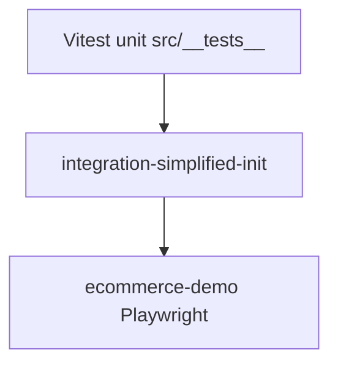
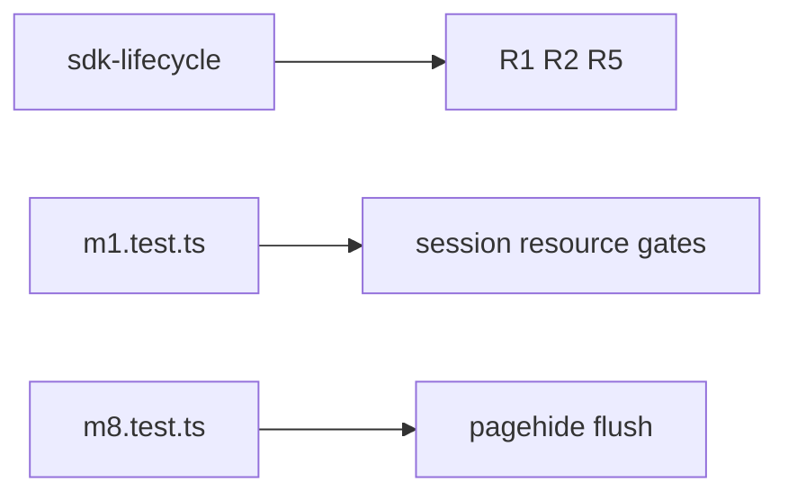
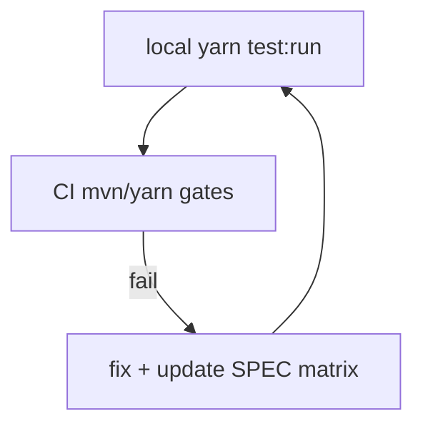

# SDK Core — Test coverage — SPEC.md

Package: `@dreamhorizonorg/pulse-web`  
File: `pulse-web-otel/docs/sdk-core/test-coverage/SPEC.md`

---

## 1. Goal

Index **Vitest coverage** for SDK core modules (lifecycle, config, resource, remote config, session provider hooks, pagehide, integration init).

---

## 2. Assumptions

Tests run in jsdom / Vitest with OTLP fakes — see package `CLAUDE.md`.

---

## 3. Requirements

Maps to **R1–R10** verification — [`../requirements/SPEC.md`](../requirements/SPEC.md).

---

## 4. Architectural Design

### 4.1 HLD — test layers

### 4.2 LD — suite → concern map

### 4.3 Flows — CI vs local

---

## 5. LLD

### 5.1 `src/__tests__/sdk-lifecycle.test.ts`

Tests for SDK singleton lifecycle, shutdown guards, restart cycles, and the race condition between `shutdown()` and `finishInit()`:

- `shouldInitializeSuccessfully` — `Pulse.init()` completes and `isInitialized()` returns true
- `shouldBeIdempotentOnDoubleInit` — second `init()` call is a no-op
- `shouldNoOpWhenConsentIsDenied` — `DENIED` state → `isInitialized()` false
- `shouldNoOpWhenConsentIsPending` — `PENDING` state → `isInitialized()` false
- `shouldShutdownAndResetState` — after `shutdown()`, `isInitialized()` returns false
- `shouldAllowReinitAfterShutdown` — shutdown then re-init works cleanly
- `shouldReturnSamePromiseOnConcurrentInit` — concurrent calls during async bootstrap return same promise
- `shouldAbortInitInSSR` — no `window` → init aborts without error
- `shouldHandleShutdownRaceWithFinishInit` — shutdown called before finishInit async chain settles

### 5.2 `src/__tests__/sdk-public-methods.test.ts`

Unit tests for public SDK methods covering previously-uncovered code paths:

- `trackEvent` — correct `pulse.type = custom_event`, correct attributes emitted
- `reportException` — correct `pulse.type = non_fatal`, `SeverityNumber.WARN`, non-Error coercion
- `reportDeviceCrash` — correct `pulse.type = device.crash`, `SeverityNumber.FATAL`, stack trace
- `trackNonFatal` — correct `pulse.type = non_fatal`, `non_fatal.is_manual = true`
- `setUserProperties` — merge semantics, null removes key
- `clearUserIdentity` — clears persisted userId + properties
- `setScreenName` — no-op before init; updates globalAttrsProcessor after init
- All methods are no-op before `init()` completes

### 5.3 `src/__tests__/m1.test.ts`

Foundation tests — validates M1 milestone contracts:

- `getOrCreateInstallationId` — creates UUID on first call, returns same on repeat
- `wasNewInstallation` — true first time, false thereafter
- `SessionProvider` — session ID assigned, rotation on backgrounding
- `validateConfig` — throws on missing `apiKey`, passes on valid config
- `isLocalEnvironment` / `resolveEndpointBaseUrl` — local dev key detection
- `buildResource` / `extractProjectId` — resource attribute correctness
- `SdkConfigFetcher.loadCached` — default config when no cache, parsed config from valid cache
- `resolveConfigUrl` — local vs prod URL resolution
- `FeatureGate.isEnabled` — default true when no config, disabled when `sessionSampleRate = 0`
- `PulseGlobalAttributesProcessor` — session ID, screen name, user ID stamped on all signals
- `global-attrs-processor.test.ts` — `navigation_id` omitted until `setNavigationId`; merged on spans/logs after set
- `SessionInstrumentation` — `session.start` emitted on install

### 5.4 `src/__tests__/m3.test.ts`

Error instrumentation / `device.crash` and `non_fatal` contract tests (cross-links errors SPEC).

### 5.5 `src/__tests__/m8.test.ts`

TC 8.x — `pagehide` listener lifecycle:

- Registration count: exactly one `pagehide` listener after init
- BFCache guard: `event.persisted = true` → no flush called
- `forceFlush` called on `pagehide` when `persisted = false`
- `shutdown()` removes the listener
- Restart (shutdown + re-init) rebalances listener count to one
- SSR guard: `window` undefined → no listener registration
- Post-shutdown: pagehide fires after shutdown → no-op (no double flush)

### 5.6 `src/__tests__/integration-simplified-init.test.ts`

Config surface tests — verifies Web SDK matches Android's minimal public API:

- `apiKey` required — throws without it
- `dataCollectionState` required at init
- `diskBuffering.enabled` defaults on (Android parity)
- `beforeSendData` shape validation (function vs object vs invalid)
- `diskBuffering.maxAgeMs` and `maxCacheSizeBytes` positive-finite validation
- `globalAttributes` and `resourceAttributes` accepted without error

### 5.7 Naming and placement conventions

| Convention | Rule |
|------------|------|
| File name | `*.test.ts` or `*.test.tsx` under `src/__tests__/` (or colocated `integrations/**` tests). |
| Describe blocks | Mirror class/module under test (`describe("PulseSDK", …)`). |
| OTLP fakes | Prefer mocking exporters / `LoggerProvider` emit spies — see existing `m1` / `m3` patterns. |
| E2E | `examples/ecommerce-demo/e2e/`; use workspace `fixture.ts` helpers; full title catalogue **§6.3**. |

### 5.8 Adding a new suite

1. Add `src/__tests__/<area>.test.ts` with happy path + one failure/edge.  
2. Register any new gate/feature in `instrumentation-registry` + remote template if needed.  
3. Extend **this** §5 with a new **§5.x** subsection + link from [`../requirements/SPEC.md`](../requirements/SPEC.md) trace table if a new R* is implied.

---

## 6. Test Coverage

### 6.1 Scenario matrix (meta — this file owns the catalogue)

| ID | Type | Given | When | Then | Tests |
|----|------|-------|------|------|-------|
| TC-P1 | positive | contributor runs | `yarn test:run` | green on touched suites | **Process** — local developer / CI; not a single Vitest file |
| TC-E1 | edge | PR touches web SDK | `e2e:web-sdk-gates` | Chromium gate green | package script; scenarios §6.3 |

### 6.2 Catalogue

This document **is** the detailed §5 catalogue; see subsections **§5.1–§5.6** above for file-level scenarios.

### 6.3 Playwright E2E — master catalogue

**Primary harness (React + Vite SPA):** `pulse-web-otel/examples/ecommerce-demo/e2e/`. **CI Chromium gate** (`cd pulse-web-otel && yarn e2e:web-sdk-gates`): `m1`, `m2-interactions`, `m3-errors`, `web-vitals`, `m3-clicks`, `m4-network`, `screen-navigation` only (**188** tests as of 2026-05-15). **Additional** Playwright files in the same folder (`m8`, `m15`, `m16-ch`, `m3-ch`, `synthetic-user`, …) run via `yarn workspace ecommerce-demo e2e` / per-file greps — they are **catalogued below** but **not** all are in the default gate script.

**Next.js App Router demo:** `pulse-web-otel/examples/nextjs-demo/e2e/` — `yarn workspace nextjs-demo e2e`. Mock OTLP; `nextjs-demo.ch.spec.ts` is the CH mirror subset.

Below: **Playwright `test()` titles** as registered in the repo (grouped by `test.describe` label). File names are omitted in per-feature SPECs; this subsection is the single exhaustive index.

#### `ecommerce-demo` — `@M1 session lifecycle`

- session.start emitted on page load
- session.end emitted on pagehide (non-BFCache)
- pagehide with persisted=true (BFCache) does NOT emit session.end
- double Pulse.init() is a no-op — exactly one session.start
- 3.3: session.end reaches OTLP on document unload (navigate to about:blank)
- pagehide then Pulse.shutdown emits only one session.end

#### `@M1 identity persistence`

- installation.id survives page reload
- installation.id stored in localStorage as pulse_installation_id
- installation.id falls back to sessionStorage when localStorage throws
- installation.id falls back to in-memory when both localStorage and sessionStorage are blocked
- new session.id on each fresh page load

#### `@M1 OTLP pipeline`

- x-api-key header sent on every OTLP request (logs, traces, metrics)
- Content-Type is application/json on logs, traces, and metrics
- resource attributes present on signal (platform, service.name, rum.sdk.version)

#### `@M1 SDK shutdown`

- Pulse.shutdown() force-flushes providers without error

#### `@M1 batching`

- multiple trackEvent calls coalesced into a single OTLP logs payload
- signals accumulate — first export happens after batch delay, not inline with SDK init
- pagehide force-flushes pending signals before batch timer fires
- session.end emitted before pagehide batch window when persisted=false

#### `@M1 payload attributes`

- session.start log carries required data-contract attributes
- every signal carries global attributes injected by GlobalAttributesProcessor
- resource carries service.name, platform=web, rum.sdk.version
- rum.sdk.init.* OTLP logs emitted (Android SdkInitializationEvents parity)
- no sdk.init span (matches Android — init is not a dedicated trace heartbeat)

#### `@M1 localStorage state`

- pulse_installation_id is a UUID stored in localStorage
- installation.id in localStorage matches the value in the session.start signal
- pulse_sdk_config in localStorage after background fetch completes
- pulse_sdk_config version: cache + reload, then new version after two reloads

#### `@M1 remote config fetch resilience`

- active config 404 + empty pulse_sdk_config → defaults, session.start exports
- cached pulse_sdk_config version unchanged when active fetch returns 404 on reload

#### `@M1 consent`

- DENIED consent → Pulse.isInitialized() returns false
- DENIED consent → zero OTLP calls made

#### `@M1 signal headers`

- X-Pulse-Metering-Session-ID header sent on logs, traces, and metrics OTLP requests
- X-Pulse-Metering-Session-ID is stable across multiple OTLP requests in the same session

#### `@M1 app.installation.start`

- emitted on first visit with empty storage
- NOT emitted on reload when installation ID already in localStorage

#### `@M1 trackNonFatal` / `@M1 reportException body` / `@M1 window.id uniqueness` / `@M1 clone detection` / `@M1 reload vs clone detection`

- trackNonFatal emits non_fatal log with correct attributes
- reportException uses error message as log body
- window.id is present on every signal; unique per page load; same across signals within one load
- session.id is stored in localStorage (shared across tabs); clone flag detects duplicate tab via sessionStorage inheritance
- reload: same session.id persisted (session reused silently, no new session.start); beforeunload removes clone flag, keeps session intact

#### `@M1 screen.name resolution` / `@M1 screen.name manual override` / `@M1 url attributes`

- screen.name from URL path /products, numeric segment normalization, root /, UUID segment normalization
- Pulse.setScreenName() override on next signal; persists across events; resets after full navigation and SPA navigation
- url.path after SPA navigation; screen.name on log records; page.url vs url.path

#### `@M1 Area 3 session lifecycle`

- 3.2: session.start does NOT fire on SPA navigation
- 3.6: session rotates after simulated 30-min inactivity
- 3.8: session.end on pagehide before reload; same session resumes silently
- 3.9: duplicate page in same context inherits session.id
- 3.10: fresh browser context creates new independent session
- 3.11/3.12: rotation emits session.end then session.start with different session IDs
- 3.14: session.end does NOT fire on in-app SPA navigation
- 3.13: very short session emits session.end with non-negative duration_ms
- 3.15: consent DENIED — no session.start or session.end

#### `@M1 resource attributes` / `@M1 remote config + export gate` / remaining `@M1`

- browser.name/version non-empty; os.name is web; device.type desktop; project.id present
- metricsToAdd counter on /v1/metrics after session.start; custom_events sessionSampleRate 0 blocks trackEvent; signals.filters BLACKLIST drops matching custom_event; PENDING consent → SDK does not init and zero OTLP

#### `@M2 interactions e2e` / `@M2 interactions edge cases`

- single-event / two-event / multi-event interactions emit success spans with contract attrs
- ignored event does not break in-flight interaction
- global blacklist cancels in-flight sequence without span
- local blacklisted step resets flow without terminal span
- timeout at stage-1 / stage-2 emits timeout error
- sequence violation at stage-1 / stage-2 emits sequence_violation
- two independent interactions each emit a span
- apdex categories Excellent / Good / Average / Poor; exact boundaries; 3-event durations; shared prefix branching
- complete_time nanos consistent with span start/end
- interaction config fetch unavailable → no interaction span, sdk still running
- property operators (matrix): positive match emits span; negative match blocks, positive still works
- exploratory: middle step not skippable; middle step present allows success
- overlapping configs on same stream each emit terminal span
- out-of-order event timestamp → timeout error
- restart after sequence violation emits error then new success
- multiple global blacklist hits cancel flow; later flow can succeed
- mixed valid + invalid config payload rejected as array
- user id updated mid-interaction stamps final span

#### `@M3 clicks e2e`

- Shop Now link emits app.click with good target and contract attrs
- click on non-interactive pad emits dead click without widget attrs
- triple tap on Shop Now yields one rage app.click with click.is_rage
- does not emit app.click when click feature gate is disabled

#### `@M3-errors contract floor` / `@M3-errors lifecycle` / `@M3-errors gate and consent`

- uncaught JS error emits device.crash with finite numeric attrs
- unhandled rejection emits non_fatal with manual=false
- manual reportException emits non_fatal with manual=true
- render error boundary emits device.crash with component stack
- dedupe burst / after window reset / different fingerprints not deduped
- string and undefined rejection reasons normalized
- cross-origin script error signature ignored
- error log timestamp near trigger; existing window error listener still receives events
- js_crash gate off exports zero error logs; DENIED consent exports zero errors

#### `@M4 network e2e`

- Network Lab: fetch GET → network.200 span; XHR timeout / abort → network.0, network_error, OTLP ERROR; fetch 404 → network.404
- P1/P2/P4: fetch span, strips query, optional http.duration; P3: XHR span with contract attrs; P5: OTLP export URLs not traced; G1: gate off no spans
- E1: 404/500 fetch error.type + OTLP ERROR; E3 cross-origin opaque cors_error; E4 route.abort / E5 aborted fetch; E2 local instrumentations.network.enabled false; C1 DENIED consent no session.start and no network spans

#### `@M8 pagehide flush` / `@M8 pagehide post-shutdown` / `@M8 BFCache cycle`

- TC 8.2/8.7: pagehide flushes pending — session.end arrives; TC 8.3 BFCache no session.end; 8.8 signals before pagehide flushed; 8.8b real navigation session.end; 8.2b single session.end
- TC 8.10: pagehide after shutdown no new logs
- TC 8.9b: persisted true then false → exactly one session.end

#### `@M15 PulseProvider` / `@M15 PulseErrorBoundary` / `@M15 useRouterTracking` / attributes

- TC 15.1 session.start with service.name; 15.6 StrictMode single session.start; 15.1b isInitialized after mount
- TC 15.2 / 15.2b boundary vs internal boundary device.crash; app stays alive
- TC 15.3 NavBar setScreenName; 15.5 skipInitial:false session.start initial screen.name; 15.4 / 15.3b route changes update screen.name
- TC 15.2d device.crash has react.component_stack

#### `@M16-CH` (ClickHouse)

- TC 16.1 session.start in otel_logs with installation.id; 16.4 one session.start per load (StrictMode)
- TC 16.2 / 16.2b PulseErrorBoundary device.crash in stack_trace_events + react.component_stack
- TC 16.3 / 16.5 custom event screen.name after route change (CH)

#### `@M3-CH` (ClickHouse — errors)

- TC1–TC6, TC9–TC10, TC12: device.crash / non_fatal / boundary / reportException / url.path / dedupe / consent+shutdown / cross-origin excluded

#### `@ScreenNav` (screen-navigation.spec.ts)

- Initial load: screen_load; start.type; TTI optional on screen_load
- SPA: screen_session on route change; new screen_load with spa start.type; screen.name matches route; multiple navigations; product detail nav
- Feature gate: screen_navigation on vs off (no screen_load)
- screen.name on screen_load / screen_session; url.path on screen_session; platform web; session.id; session.duration numeric; pulse.type on both span kinds

#### `@WebVitals`

- TTFB, FCP, LCP, INP (tab hide), CLS after layout shift + tab hide; **no `web_vital.name=FID`** (`web-vitals` v5+)
- Per-metric **G10:** on first captured TTFB / FCP / LCP log, `web_vital.delta` equals `web_vital.value` (not asserted in shared helper — INP/CLS may differ)
- `assertExportedWebVitalAttrs`: `platform` = `web`; `navigation_id`; **`web_vital.navigation_type`** in `navigate` \| `reload` \| `back-forward` \| `back-forward-cache` \| `prerender` \| `restore` \| `soft-navigation`; **`web_vital.value` ≥ 0**; **`session.id`** UUID shape; `web_vital.context` / `web_vital.delta` when present
- SPA navigation flushes TTFB with `screen.name` from initial route (`PulseRouterEvents` → `notifySoftNavigation` + batch); SPA `screen_load` span carries `navigation_id`; **second SPA nav** (`/products` → `/cart`) yields a **different** `navigation_id` on the latest `screen_load` than after the first client nav
- Remote gate off → no web_vital logs; local kill switch `?pulse_wv_enabled=false` → no web_vital logs (remote gate may stay on)

#### `@SyntheticUser`

- full app journey (parameterized iterations) — end-to-end smoke across catalog features

#### `nextjs-demo` (mock OTLP)

**session lifecycle:** session.start on first load; platform resource `web`; session ID consistent across navigations.

**screen tracking — App Router:** screen.name Home→Products; /cart; multi-hop / → /products → /cart.

**web vitals (mock OTLP):** `e2e/web-vitals.spec.ts` — TTFB + `navigation_id`; **TTFB** `web_vital.delta` === `web_vital.value`; client navigation adds a new `screen_load` span with `navigation_id`.

**error tracking:** PulseErrorBoundary device.crash; reportException non_fatal; reportDeviceCrash device.crash; session.id stamped on crash and non_fatal paths.

**`nextjs-demo.ch.spec.ts` (ClickHouse):** session.start in CH; screen.name /products in CH; device.crash / non_fatal / manual device.crash in CH.

### 6.4 Next.js E2E vs React ecommerce-demo (parity matrix)

| Area | ecommerce-demo (React) | nextjs-demo | Gap / note |
|------|-------------------------|-------------|------------|
| Session lifecycle + BFCache + batching + install persistence | Extensive `@M1`, `@M8` | session.start + stable session id only | **Major gap:** no BFCache, batching, installation persistence, clone/reload, remote config, consent matrix, metering headers in Next E2E |
| Screen OTLP spans (`screen_load` / `screen_session`) | `screen-navigation.spec.ts` + gate | Not asserted | **Gap:** Next demo asserts `screen.name` on **logs** after navigation, not navigation **spans** — add Playwright waits on spans if product requires parity |
| Web vitals | `web-vitals.spec.ts` | `e2e/web-vitals.spec.ts` (TTFB + SPA `screen_load`) | **Partial:** not the full ecommerce vitals matrix on Next |
| Network client spans | `m4-network.spec.ts` | None | **Gap** |
| Interactions | `m2-interactions.spec.ts` | None | **Gap** |
| Clicks | `m3-clicks.spec.ts` | None | **Gap** |
| Errors (full matrix) | `m3-errors`, `m3-ch` | Boundary + manual paths + CH subset | **Partial:** no uncaught global, dedupe, rejection normalization, cross-origin, gate-off E2E on Next |
| React provider / StrictMode | `@M15` | Implicit via single session.start in session tests | **Partial** — no dedicated TC 15.x clone |
| Pages Router | React Router in demo | Not covered | **Gap** if Pages Router is first-class — only App Router in nextjs-demo |
| `instrumentation.ts` / `withPulseConfig` / server `onRequestError` | Not in Playwright (build/server) | None | **Gap** — Vitest/unit only per nextjs-integration SPEC |

### 6.5 E2E validity and edge-case review (orchestrator sweep)

- **Aligned with current SDK:** ecommerce `e2e:web-sdk-gates` is the CI contract; scenarios above match grep of live `*.spec.ts` files in-repo.
- **ClickHouse specs (`m3-ch`, `m16-ch`, `nextjs-demo.ch`):** optional; require CH URL + credentials in env — not part of default `e2e:web-sdk-gates`.
- **Residual product gaps (not necessarily test bugs):** (1) Next demo does not exercise `NavigationInstrumentation` spans. (2) No **Next.js demo** E2E that asserts soft-nav web vitals flush via `Pulse.notifySoftNavigation` end-to-end (ecommerce-demo covers SPA + vitals via `PulseRouterEvents` / `@WebVitals`). (3) No E2E for `HashRouter` / hash-only navigation (documented as unsupported for SPA screen signals). (4) Interactions SPEC matrix row **INT-E1** (config fetch unavailable) marked **gap** in Vitest — M2 E2E covers “config fetch unavailable” at telemetry level but not every unit edge.

### 6.6 Consumer install smoke — published `@dreamhorizonorg/pulse-web/next` (P1:8)

**Goal:** Prove a clean **`create-next-app`** (or equivalent) can install the **published tarball** (not only workspace `file:`) and compile with documented Next settings.

| Step | Action | Pass criterion |
|------|--------|----------------|
| 1 | `cd pulse-web-otel && yarn pack` (or `npm pack`) from the release branch | Produces `.tgz` with expected `package/` layout |
| 2 | `npx create-next-app@latest pulse-next-smoke --ts --eslint --app --no-src-dir` (or team-standard flags) into a temp dir | App boots `yarn dev` |
| 3 | Install tarball: `yarn add ../path/to/dreamhorizonorg-pulse-web-*.tgz` (and subpath deps if any) | `yarn build` succeeds |
| 4 | Apply integration SPEC guidance: `transpilePackages: ['@dreamhorizonorg/pulse-web']`, `serverExternalPackages` / `experimental.serverComponentsExternalPackages` as required by Next version | No “package not transpiled” / ESM resolution errors |
| 5 | Wire minimal `instrumentation.ts` + `withPulseConfig` per [`../../instrumentations/nextjs-integration/SPEC.md`](../../instrumentations/nextjs-integration/SPEC.md) | `yarn build` + one manual page load without crash |

Record outcome in a **dated bullet under §6.6** below (or in `CHANGELOG.md` when tied to a release). This checklist is **process / release QA**, not a Vitest file.

### 6.7 Data-contract Vitest / Playwright follow-ups (RF-DC2–DC4)

Backlog from the data-contract audit (`docs/sdk-core/data-contract/SPEC.md` §6 matrices). Tracked for implementation in [`../../review-fix.md`](../../review-fix.md) **§3** (code/tests only).

| ID | What to implement | Why it matters |
|----|-------------------|----------------|
| **RF-DC2** | Unit test: `PulseGlobalAttributesProcessor.onEmit` when the log already has a **non-empty** `session.id` | Processor must **not** replace that value (session lifecycle logs keep the id attached before rotation). |
| **RF-DC3** | Optional: `buildMergedResource` + hostile `os.name` in `resourceAttributes` | Locks SPEC guarantee: Pulse resource wins on duplicate keys, **`os.name` = `web`** for ClickHouse `Platform`. |
| **RF-DC4** | Optional Playwright: assert `pulse.user.session.start` / `end` on exported OTLP | `user-identity.test.ts` covers unit path; E2E locks browser → OTLP for identity transitions. Waivable if team accepts unit-only. |

### 6.8 Sampling / export-gate Vitest follow-ups (RF-SF1)

Backlog from [`../sampling-and-filtering/SPEC.md`](../sampling-and-filtering/SPEC.md) §6–§7. Tracked in [`../../review-fix.md`](../../review-fix.md) **§3.4**.

| ID | What to implement | Why it matters |
|----|-------------------|----------------|
| **RF-SF1a**–**RF-SF1e** | Span + metric `ExportSamplingGate` coverage, `signalsToSample` probabilistic drop, empty-batch `Sampled*Exporter`, optional metric E2E | Locks R-SF8 and trace parity with log gate tests; see **review-fix** §3.4 table. |

---

## 7. Known Bugs & Gaps

[`../../known-gaps-tradeoffs-and-plan.md`](../../known-gaps-tradeoffs-and-plan.md) §1.

---

## 8. Redundancy & Cleanup Notes

Prior `web-sdk-plan/v1/01-foundation/README.md` test pointers absorbed here.

---

## 9. Open Questions

[`../../known-gaps-tradeoffs-and-plan.md`](../../known-gaps-tradeoffs-and-plan.md) §3.
