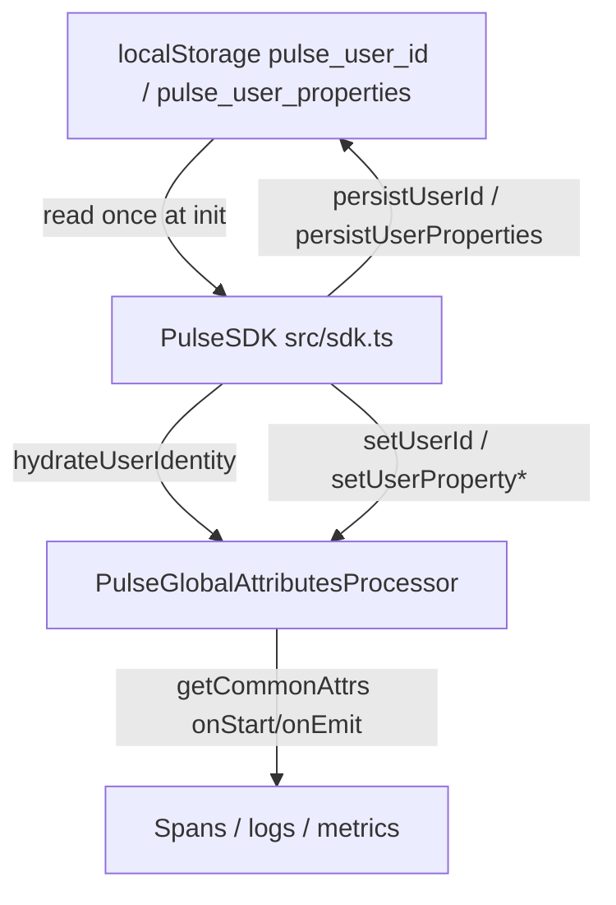
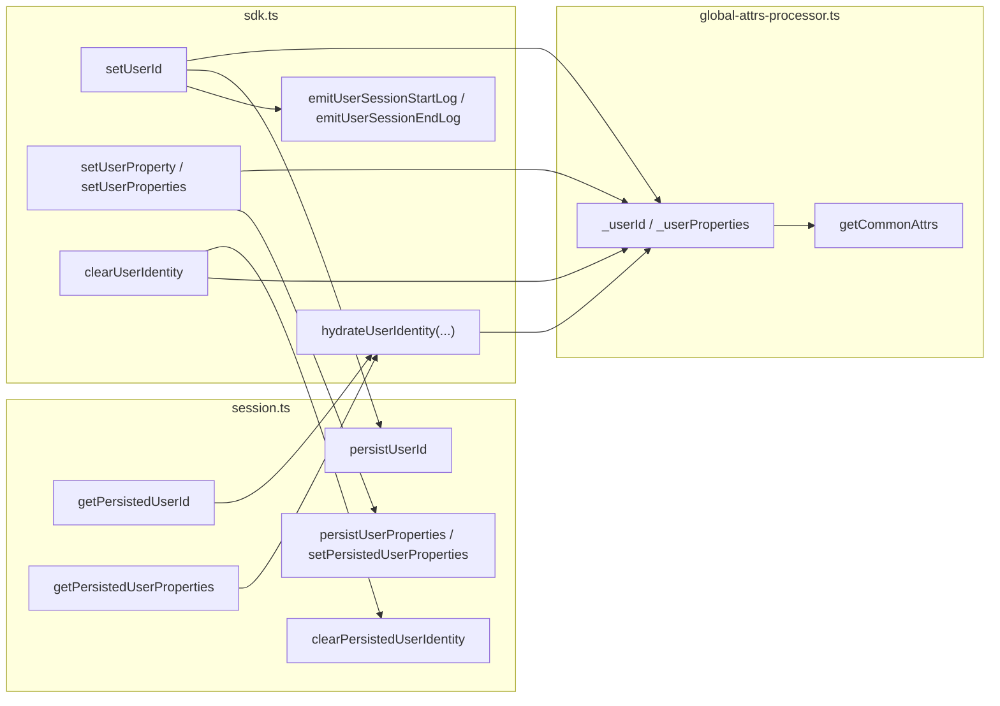
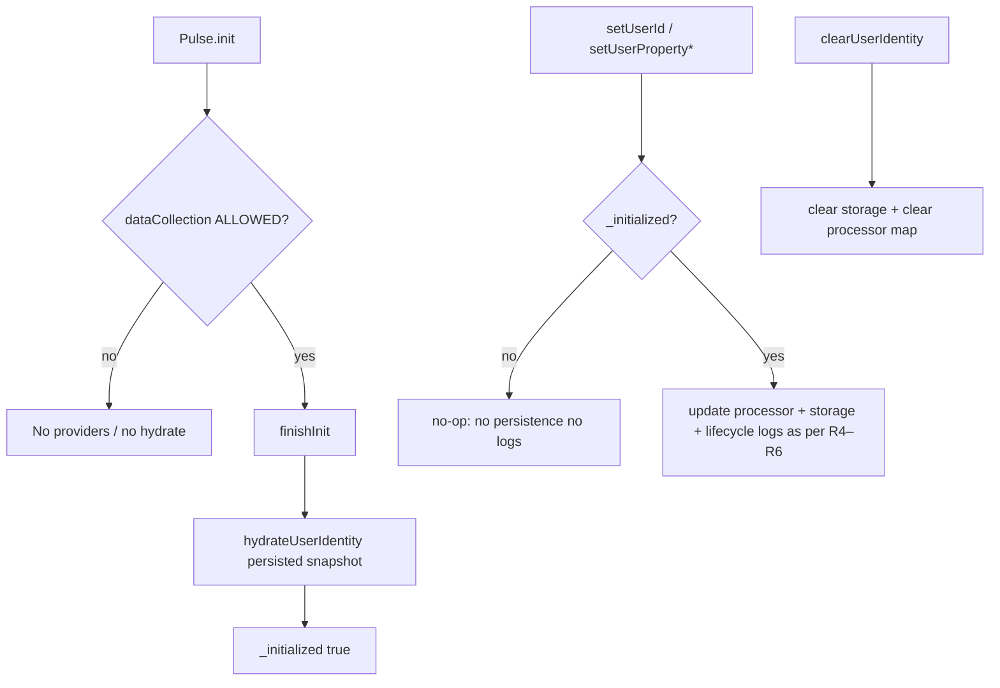

# User identity — SPEC.md

Package: `@dreamhorizonorg/pulse-web`  
File: `pulse-web-otel/docs/sdk-core/user-identity/SPEC.md`

---

## 1. Goal

Specify **end-user identity** for the Web SDK: persistence keys, **`Pulse.setUserId` / `setUserProperty` / `setUserProperties` / `clearUserIdentity`**, lifecycle OTLP logs (`pulse.user.session.*`), and how **`user.id`** and **`pulse.user.<key>`** reach **every span, log, and metric data point** via **`PulseGlobalAttributesProcessor`**.

**Android parity:** API shape and transition logs mirror mobile `PulseSDK` patterns; see [`../../known-gaps-tradeoffs-and-plan.md`](../../known-gaps-tradeoffs-and-plan.md) **O1** for API tradeoffs.

**Wire contract tables:** [`../data-contract/SPEC.md`](../data-contract/SPEC.md) §5.1 (`pulse.type` for user session logs) and §5.2.2 (global attribute keys).

---

## 2. Assumptions

- **`localStorage`** is available in normal browser runs; reads/writes can throw (quota, disabled storage) — helpers **swallow errors** and log at debug (see `src/session.ts`).
- **`Pulse.init`** has completed with **ALLOWED** consent before identity APIs mutate telemetry; **`setUserId` / `setUserProperty` / `setUserProperties`** are **no-ops** when the SDK is not initialized (`!_initialized`).
- **DENIED / PENDING** consent: `init` returns before provider construction — **no** `hydrateUserIdentity`, **no** identity on signals (same as rest of SDK).
- Property values on the wire are **strings** only; non-string JSON values in the persisted blob are **dropped** when reading.

---

## 3. Requirements

**R1 — Persistence keys:** User id is stored under **`localStorage["pulse_user_id"]`**. User properties are stored as JSON under **`localStorage["pulse_user_properties"]`** (object of string values). Clearing uses **`clearPersistedUserIdentity()`** (removes both keys).

**R2 — Hydration at bootstrap (exact runtime change):** After **`PulseGlobalAttributesProcessor`** is constructed inside **`PulseSDK.finishInit`**, the SDK calls **`hydrateUserIdentity(getPersistedUserId(), getPersistedUserProperties())`** **once**. The processor holds **`_userId`** and **`_userProperties`** in memory for stamping.

**R3 — No per-signal storage reads for identity:** **`getCommonAttrs()`** (span `onStart`, log `onEmit`, metrics via **`getCommonAttrsForMetrics`**) **does not** call **`getPersistedUserId`** or **`getPersistedUserProperties`**. Identity on exported signals reflects **processor memory** updated by **R2** and **R4–R6**.

**R4 — `Pulse.setUserId(id | null)`:** Normalizes **`""`** to **`null`**. If the resolved id equals the current processor id, **no-op**. Otherwise: updates **`globalAttrsProcessor.setUserId`**, **`persistUserId`**, then emits **`pulse.user.session.end`** (if there was a previous id) and **`pulse.user.session.start`** (if the new id is non-null). First-time set emits **start only** (no **`pulse.user.previous_id`**).

**R5 — `Pulse.setUserProperty` / `setUserProperties`:** Update processor state; **`null`** removes a key from the in-memory map and persisted snapshot. **`persistUserProperties`** writes the full snapshot from **`getUserPropertiesSnapshot()`**.

**R6 — `Pulse.clearUserIdentity()`:** Calls **`clearPersistedUserIdentity()`**; if **`globalAttrsProcessor`** exists, sets user id to **`null`** and clears each property key via **`setUserProperties`** with **`null`** values. **Does not** emit **`pulse.user.session.end`** (logout clear is storage + processor reset only).

**R7 — Global attributes:** When **`_userId`** is non-null and non-empty, **`user.id`** is set using **`PulseWebSemconv.AttributeKey.USER_ID`**. Each entry in **`_userProperties`** becomes **`pulse.user.<key>`**. Merge order vs **`globalAttributes`**: see [`../data-contract/SPEC.md`](../data-contract/SPEC.md) §5.2.2 — identity keys **win last**.

**R8 — Lifecycle logs:** Emitted via **`PulseSDK`** private helpers with **`PulseWebSemconv`** keys; bodies **`pulse.user.session.start`** / **`pulse.user.session.end`** per [`../data-contract/SPEC.md`](../data-contract/SPEC.md) §5.1.

---

## 4. Architectural design

### 4.1 HLD — storage, SDK, processor, OTLP

### 4.2 LD — modules

### 4.3 Flows — init, pre-init API, clear

---

## 5. LLD

### 5.1 Implementation index (`src/`)

| Concern | Path |
|--------|------|
| Bootstrap + public API | `src/sdk.ts` — **`hydrateUserIdentity`**, **`setUserId`**, **`setUserProperty`**, **`setUserProperties`**, **`clearUserIdentity`**, lifecycle **`logger.emit`** |
| Storage + parsers | `src/session.ts` — **`USER_ID_KEY`**, **`USER_PROPS_KEY`**, **`getPersistedUserId`**, **`getPersistedUserProperties`**, **`persistUserId`**, **`persistUserProperties`**, **`setPersistedUserProperties`**, **`clearPersistedUserIdentity`** |
| Global stamping | `src/processors/global-attrs-processor.ts` — **`hydrateUserIdentity`**, **`setUserId`**, **`setUserProperty`**, **`setUserProperties`**, **`getUserPropertiesSnapshot`**, **`getCommonAttrs`** |
| Semconv | `src/semconv.ts` — **`PulseWebSemconv.AttributeKey.USER_ID`**, **`PULSE_USER_PREVIOUS_ID`**, **`PulseType.USER_SESSION_START` / `USER_SESSION_END`**, log bodies |

### 5.2 Attribute and log contract (summary)

| Artifact | Keys / body | Notes |
|----------|----------------|-------|
| Global attrs | `user.id`, `pulse.user.*` | From processor; omitted when user id empty / unset |
| User session logs | `pulse.type` = `pulse.user.session.start` / `end`, `user.id`, optional `pulse.user.previous_id` | Emitted only from **`setUserId`** transitions per **R4** |

Full tables: [`../data-contract/SPEC.md`](../data-contract/SPEC.md) §5.1–§5.2.2.

### 5.3 Non-functional

- **Performance:** Identity is **not** re-read from **`localStorage`** on every span/log (see **R3**).
- **Privacy / logout:** Host should call **`clearUserIdentity()`** on logout so the next visitor does not inherit **`user.id`** from storage.

---

## 6. Test coverage

### 6.1 Vitest — primary (`src/__tests/`)

| ID | Type | Scenario | File / describe |
|----|------|----------|-----------------|
| UI-V1 | positive | Processor stamps **`user.id`** + **`pulse.user.*`** | `user-identity.test.ts` — `PulseGlobalAttributesProcessor — user identity attrs` |
| UI-V2 | positive | **`setUserProperty(null)`** removes **`pulse.user`** key from attrs | `user-identity.test.ts` — same block |
| UI-V3 | positive | **`hydrateUserIdentity`** restores attrs without **`setUserId`** | `user-identity.test.ts` — same block |
| UI-V4 | positive | **`globalAttributes["user.id"]`** overridden by **`setUserId`** | `user-identity.test.ts` — `config globalAttributes applied before user id layer` |
| UI-V5 | positive | First **`setUserId`** emits **`pulse.user.session.start`** only | `user-identity.test.ts` — `Pulse — setUserId lifecycle + persistence` |
| UI-V6 | negative | Same **`setUserId`** value → no lifecycle logs | `user-identity.test.ts` |
| UI-V7 | edge | Switch user → **end** then **start** with **`pulse.user.previous_id`** | `user-identity.test.ts` |
| UI-V8 | edge | **`setUserId(null)`** → **end** only | `user-identity.test.ts` |
| UI-V9 | edge | Persist id → **`shutdown`** → **`init`** → **no** lifecycle logs; storage still set | `user-identity.test.ts` |
| UI-V10 | positive | **`setUserProperty`** persists / **`null`** removes key in storage | `user-identity.test.ts` |
| UI-V11 | negative | **`setUserId` / `setUserProperty`** before **`init`** → silent, no persistence | `user-identity.test.ts` |
| UI-V12 | edge | **`setUserId("")`** → end only + storage cleared | `user-identity.test.ts` |
| UI-V13 | edge | **`setUserProperties`** merge + persist + rehydrate without lifecycle | `user-identity.test.ts` |
| UI-V14 | edge | Multiple switches → ordered end/start pairs | `user-identity.test.ts` |
| UI-V15 | edge | **`getPersistedUserProperties`** invalid JSON / non-object / non-string values | `user-identity.test.ts` — `User identity persistence helpers` |
| UI-V16 | positive | **`clearPersistedUserIdentity`** removes keys | `session-persistence.test.ts` — `clearPersistedUserIdentity` |
| UI-V17 | positive | Processor **`onEmit`** injects **`user.id`** from hydrated storage | `session-persistence.test.ts` — `PulseGlobalAttributesProcessor user identity injection` |
| UI-V18 | negative | No **`user.id`** in attrs when unset | `session-persistence.test.ts` — same |
| UI-V19 | positive | In-memory **`setUserId`** overrides stored id in attrs | `session-persistence.test.ts` — same |
| UI-V20 | edge | **`setUserId("")`** clears **`user.id`** from attrs | `session-persistence.test.ts` — same |
| UI-V21 | edge | **`setUserProperties({k:null})`** removes **`pulse.user.k`** | `session-persistence.test.ts` — same |
| UI-V22 | positive | In-memory props override hydrated props | `session-persistence.test.ts` — same |
| UI-V23 | positive | **`setUserProperties`** merge / **`null`** removes persisted key | `sdk-public-methods.test.ts` — `setUserProperties()` |
| UI-V24 | positive | **`clearUserIdentity`** clears storage | `sdk-public-methods.test.ts` — `clearUserIdentity()` |
| UI-V25 | positive | After **`clearUserIdentity`**, **`trackEvent`** has no **`user.id`** | `sdk-public-methods.test.ts` — same |
| UI-V26 | negative | **`clearUserIdentity`** safe when unset / before **`init`** | `sdk-public-methods.test.ts` — same |
| UI-V27 | positive | Global processor injects **`session.id`** / **`platform`** etc. (shared path with identity) | `m1.test.ts` — `M1 — GlobalAttributesProcessor` |

### 6.2 Playwright / demo

| ID | Type | Scenario | Location |
|----|------|----------|----------|
| UI-E1 | positive | **`user id updated mid-interaction stamps final interaction span`** — **`user.id`** on span | `examples/ecommerce-demo/e2e/m2-interactions.spec.ts` |
| UI-E2 | harness | Demo toggles user via query / **`Pulse.setUserId`** | `examples/ecommerce-demo/src/App.tsx` (query params **`pulse_user_enabled`**, **`pulse_user_id`**) |

**Gap (documented elsewhere):** No default-gate Playwright row dedicated to **`pulse.user.session.start` / `end`** OTLP bodies — see [`../data-contract/SPEC.md`](../data-contract/SPEC.md) §6.1.1 matrix and [`../test-coverage/SPEC.md`](../test-coverage/SPEC.md) **RF-DC4**.

---

## 7. Related SPECs

| Topic | Link |
|-------|------|
| Bootstrap sequence (step **g** hydrate) | [`../architecture-and-bootstrap/SPEC.md`](../architecture-and-bootstrap/SPEC.md) |
| `pulse.type` + global attrs | [`../data-contract/SPEC.md`](../data-contract/SPEC.md) |
| Public API table | [`../config-and-public-api/SPEC.md`](../config-and-public-api/SPEC.md) |
| Session lifecycle (distinct from user identity) | [`../../instrumentations/session/SPEC.md`](../../instrumentations/session/SPEC.md) |
| Vitest rollup | [`../test-coverage/SPEC.md`](../test-coverage/SPEC.md) |

---

## 8. Known gaps and open questions

- **`clearUserIdentity`** vs **`setUserId(null)`:** **`setUserId(null)`** emits **`pulse.user.session.end`**; **`clearUserIdentity`** does **not** — intentional for “wipe storage for next user” without an extra log; hosts that need an end log should call **`setUserId(null)`** first if required.
- Single-object identity API: [`../../known-gaps-tradeoffs-and-plan.md`](../../known-gaps-tradeoffs-and-plan.md) **O1**.

---

## 9. Changelog (implementation doc)

| Change | Behavior |
|--------|----------|
| Hydrate once | **`getPersistedUserId` / `getPersistedUserProperties`** read at **`finishInit`** only; passed to **`hydrateUserIdentity`**. |
| Processor | Stamps **`user.id` / `pulse.user.*`** from **`_userId` / `_userProperties`** only — **no** storage read inside **`getCommonAttrs`**. |
| Property map | **`Record<string, string>`** in processor; **`null`** on setters **deletes** the key (not a sentinel stored in the map). |
