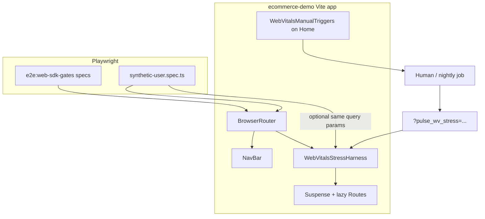

# ecommerce-demo — Web Vitals stress harness & synthetic E2E

**Scope:** `pulse-web-otel/examples/ecommerce-demo/` only.  
**Out of scope:** `@dreamhorizonorg/pulse-web` package internals (no new public SDK API), Pulse UI, ClickHouse.

This document is the **authoritative HLD + LLD** for:

1. **URL-driven Web Vitals stress** — optional CLS / paint delay (LCP/FCP proxy) / INP spin, shared across all routes.
2. **Synthetic user Playwright spec** — long journey for manual/nightly validation, **not** part of `yarn e2e:web-sdk-gates`.

---

## 1. Goals and non-goals

### 1.1 Goals

- **G1 — Single contract:** One documented query-string contract so humans, automation, and docs agree on parameter names and semantics.
- **G2 — Route-agnostic stress:** Apply stress inside `<main>` without editing each route component.
- **G3 — Determinism when needed:** Optional seed so Playwright and local QA can reproduce arm decisions and delay bands.
- **G4 — CI stability:** Default PR gate (`e2e:web-sdk-gates`) excludes the synthetic spec; stress defaults to off when params absent.
- **G5 — Parity with manual QA:** CLS uses timer-driven layout change (not synchronous with click); INP uses ~70 ms main-thread spin aligned with `e2e/web-vitals.spec.ts` and `WebVitalsManualTriggers`.

### 1.2 Non-goals

- **NG1:** Faking **TTFB** in JavaScript (navigation-bound; use throttling or reload).
- **NG2:** Replacing **Home-only manual buttons** (`WebVitalsManualTriggers`); harness is complementary (navigation-bound / probabilistic).
- **NG3:** Changing SDK sampling, `pulse.type` values, or exporter behavior.

---

## 2. High-level design (HLD)

### 2.1 System context



- **NavBar** sits **outside** `<main>` so CLS strip in the harness does not cover primary nav targets.
- **Harness** wraps **only** `<Suspense><Routes/></Suspense>` so lazy route modules load **after** paint gate lifts (LCP/FCP stress targets route content, not the shell).

### 2.2 Control plane vs data plane

| Plane | Responsibility |
|--------|------------------|
| **Control** | `URLSearchParams` → `parseWebVitalsStressSearchParams` → `computeWebVitalsStressPlan` → React state + timers + optional document listener. |
| **Data** | Pulse Web SDK continues to emit `web_vital` logs per remote config + `web-vitals` library; harness only shapes **when** DOM paints and **when** layout shifts occur. |

### 2.3 Stress modes (product semantics)

| `pulse_wv_stress` | When `armed` (see §3) |
|-------------------|------------------------|
| `off` / absent | No harness effects. |
| `cls` | Timer CLS strip only. |
| `lcp` / `fcp` | Paint gate only (same implementation; both delay first meaningful paint of routed subtree). |
| `inp` | First user click per navigation: capture listener + 70 ms spin (once). |
| `all` | CLS + paint + INP as above. |

**Note:** LCP and FCP share one **paint gate** today (one delayed reveal of `children`). Documented as intentional simplification; split gates would be an LLD change.

### 2.4 Synthetic E2E placement

| Script | Includes synthetic? |
|--------|---------------------|
| `yarn e2e:web-sdk-gates` | **No** — unchanged list of specs. |
| `yarn e2e:synthetic` | **Yes** — `e2e/synthetic-user.spec.ts`, Chromium only. |
| `yarn e2e` | **Yes** — matches `*.spec.ts` under `e2e/`. |

---

## 3. Low-level design (LLD)

### 3.1 File map

| File | Role |
|------|------|
| `src/webVitalsStressConfig.ts` | Pure parser: `parseWebVitalsStressSearchParams` → `WebVitalsStressParams`. |
| `src/components/WebVitalsStressHarness.tsx` | UI + timers + INP listener; `computeWebVitalsStressPlan` for testability / reuse. |
| `src/App.tsx` | Mounts harness inside `<main>`, wrapping `<Suspense>` + `<Routes>`. |
| `src/components/WebVitalsManualTriggers.tsx` | Manual CLS/INP; copy points to demo README + this SPEC path (see README). |
| `e2e/synthetic-user.spec.ts` | Serial synthetic journey + optional stress query builder. |
| `e2e/fixture.ts` | OTLP capture; synthetic imports `test` / `expect` from here. |
| `e2e/playwright.config.ts` | `workers: 1`, `fullyParallel: false`; synthetic relies on serial describe. |
| `src/__tests__/webVitalsStressConfig.test.ts` | Unit tests for parser. |

### 3.2 URL parameter contract

All parsing is case-sensitive on **keys** (standard `URLSearchParams`); mode and severity values are **case-insensitive** where noted.

#### 3.2.1 Parameters

| Key | Alias | Type | Default | Description |
|-----|--------|------|---------|-------------|
| `pulse_wv_stress` | — | enum string | `off` if absent | `off` \| `cls` \| `lcp` \| `fcp` \| `inp` \| `all`. Unknown values → `off`. |
| `pulse_wv_stress_p` | `_p` | number | `0.35` | Arm probability per navigation: `rng() < p` after mode ≠ `off`. Clamped to `[0, 1]`. Non-finite → default. |
| `pulse_wv_stress_seed` | `_seed` | integer | none | Mixed into Mulberry32 seed with `location.key` and pathname for reproducible **per-navigation** rolls. |
| `pulse_wv_stress_severity` | `_severity` | `mild` \| `severe` | `mild` | Widens delay bands for paint + CLS timers. |

#### 3.2.2 Example URLs

- Always arm, all effects, deterministic family:  
  `/?pulse_wv_stress=all&pulse_wv_stress_seed=42&pulse_wv_stress_p=1`
- Probabilistic mild:  
  `/?pulse_wv_stress=cls&pulse_wv_stress_p=0.2`

### 3.3 Parser LLD (`parseWebVitalsStressSearchParams`)

- **Input:** `URLSearchParams` (typically `new URLSearchParams(location.search)`).
- **Output:** `WebVitalsStressParams` — `{ mode, probability, seed, severity }`.
- **Side effects:** none (pure function; safe for tests and SSR if ever reused).

### 3.4 Plan computation LLD (`computeWebVitalsStressPlan`)

**Signature:** `computeWebVitalsStressPlan(pathname, search, locationKey) → WebVitalsStressPlan`

**Steps (ordered — RNG consumption matters):**

1. `config = parseWebVitalsStressSearchParams(new URLSearchParams(search))`.
2. `rng = mulberry32(seedBase)` where  
   `seedBase = (config.seed * 2654435761) ^ fnv1a32(\`${locationKey}:${pathname}\`)`, with `0x9e3779b9` if base is 0.
3. `armed = (config.mode !== "off") && (rng() < config.probability)`.
4. Derive booleans: `wantCls`, `wantPaint` (lcp/fcp/all), `wantInp` (inp/all).
5. If `wantPaint`: `paintMs = mild ? [2000, 2800) : [3500, 5000)` using next `rng()` draws.
6. If `wantCls`: `clsMs = mild ? [500, 800) : [800, 1200)` using next `rng()` draws.

**Export:** `WebVitalsStressPlan` type and function are **public from the harness module** for unit tests or future instrumentation.

### 3.5 Harness runtime LLD (`WebVitalsStressHarness`)

#### 3.5.1 State variables

| State | Meaning |
|-------|---------|
| `paintBlocked` | When true, render paint gate instead of `children`. |
| `clsVisible` | When true, render CLS strip above `children` (or above gate if paint still blocked — see sequencing). |

#### 3.5.2 `useMemo`

- Recomputes `plan` when `location.key`, `location.pathname`, or `location.search` changes.

#### 3.5.3 `useLayoutEffect` (sync with paint)

- Sets `paintBlocked = plan.wantPaint`, `clsVisible = plan.wantCls && !plan.wantPaint` so first paint after navigation does not flash stale strip during paint-only mode.

#### 3.5.4 `useEffect` (timers)

| Condition | Timer behavior |
|-----------|----------------|
| `wantPaint && wantCls` | After `paintMs`: `paintBlocked=false`, `clsVisible=true`; nested after `clsMs`: `clsVisible=false`. |
| `wantPaint` only | After `paintMs`: `paintBlocked=false`. |
| `wantCls` only | After `clsMs`: `clsVisible=false` (strip was shown immediately). |

Cleanup clears all timeout IDs on dependency change or unmount.

#### 3.5.5 INP `useEffect`

- If `plan.wantInp`: register `document.addEventListener("click", handler, { capture: true })`.
- Handler: at most **once** per navigation, busy-wait ~70 ms (same order of magnitude as `web-vitals.spec.ts` INP setup).
- Removes listener on cleanup.

**Caveat:** Stress mode can make the first click feel sluggish; acceptable under explicit `inp` / `all`.

#### 3.5.6 DOM / test hooks

| `data-testid` | When present |
|----------------|--------------|
| `wv-stress-cls-bar` | CLS strip visible (48 px tall). |
| `wv-stress-paint-gate` | Paint gate visible (placeholder copy). |

### 3.6 App integration LLD (`App.tsx`)

Structure inside `BrowserRouter` → `PulseProvider` → … → `<main>`:

```text
<main>
  <WebVitalsStressHarness>
    <Suspense fallback={...}>
      <Routes>...</Routes>
    </Suspense>
  </WebVitalsStressHarness>
</main>
```

- **Router context:** Harness uses `useLocation()`; must remain a descendant of `BrowserRouter` (satisfied).

### 3.7 Manual triggers LLD (`WebVitalsManualTriggers`)

- **CLS:** `setTimeout` ~600 ms then DOM insert + `requestAnimationFrame` height change — avoids “recent input” exclusion.
- **INP:** synchronous ~70 ms spin in click handler.
- **Docs link:** User-facing text references demo `README.md` **Web Vitals stress** section (and this SPEC via README if linked).

### 3.8 Synthetic E2E LLD (`e2e/synthetic-user.spec.ts`)

#### 3.8.1 Execution model

- `test.describe.configure({ mode: "serial", timeout: … })` — `timeout` scales with `SYNTHETIC_ITERATIONS` (min 120 s, `ITERATIONS × 55 s`, cap 900 s) so the single long test does not hit the repo default **30 s** Playwright test limit.
- **Single test** loops `ITERATIONS` times to keep OTLP/session story in one scenario (easier logs).

#### 3.8.1b Real collector ingest (optional)

- **Env:** `E2E_REAL_OTLP=1` or `E2E_REAL_OTLP_INGEST=1` (used by `yarn e2e:synthetic:ingest`).
- **Fixture behavior** (`e2e/fixture.ts`): skips `attachOtlpCapture` so the browser sends OTLP to the SDK-resolved base URL (dev keys in `.env.test` → `http://localhost:4318`). Skips `attachDefaultSdkConfigStub` unless `E2E_STUB_ACTIVE_CONFIG=1` (so `/v1/configs/active` can reach pulse-server on `:8080`).
- **`waitForLog` / `waitFor*`:** do not poll captured OTLP; they **sleep** (capped) so batches can flush to the real collector. Assertions on `otlp.captured` are invalid in this mode.
- **Prerequisites:** OTEL collector listening where the SDK posts (e.g. Docker `pulse-otel-collector` → ClickHouse pipeline). **Do not** enable real OTLP for `e2e:web-sdk-gates` or specs that require `otlp.captured`.

#### 3.8.2 Environment variables

| Variable | Default | Meaning |
|----------|---------|---------|
| `SYNTHETIC_ITERATIONS` | `5` | Loop count (minimum 1). |
| `SYNTHETIC_CLEAR_STORAGE_EVERY` | `2` | When `i > 0 && i % N === 0`, clear cookies + `localStorage` + `sessionStorage`, then `goto("/")`. |
| `SYNTHETIC_STRESS` | unset | If `1`, every `goto` path from helper includes `pulse_wv_stress=all&pulse_wv_stress_seed=<i>&pulse_wv_stress_p=1`. |

#### 3.8.3 `withStressPath(path, iteration)`

- If `STRESS` false: returns `path` unchanged (Shop Now navigates to `/products` without query — intentional CTA coverage).
- If `STRESS` true: merges stress params onto pathname via `URL` API.

#### 3.8.4 `settleRoute(page)`

- If the current `page.url()` has no active paint-related stress (`pulse_wv_stress` absent, `off`, or only `cls` / `inp`), skips the gate poll and waits **150 ms** (SPA / batch breathing room).
- Otherwise polls until `wv-stress-paint-gate` is absent or not visible (**20 s** max), then **250 ms** fixed wait.
- Use after each `goto` that may include `lcp` / `fcp` / `all` stress (paint delay up to ~5 s in `severe` mode).

#### 3.8.5 Per-iteration journey (ordered)

1. Optional storage reset (see §3.8.2).
2. `goto` home → `otlp.waitForLog("session.start", 20_000)` → `settleRoute`.
3. Assert Home hero; **Shop Now** link click → Products.
4. `goto` `/products` with stress (re-applies query after SPA link).
5. Rage button ×5; first **Add to cart**; waits.
6. `goto` `/products/1`; assert `h1`.
7. `goto` `/cart`; assert cart heading or empty copy; optional **Remove** + re-add flow if Remove exists.
8. `goto` `/checkout`; three-step checkout via `data-testid` buttons.
9. `goto` `/network-lab`; run `network-lab-fetch-get-local`; poll row text for `ok` + `status`.
10. `goto` `/error-demo`; render bomb → assert **Render error caught** → **Home** button.
11. `goto` `/products`; navbar **Cart** link; `goBack`; optional `goForward`.
12. `page.reload()` → wait `session.start` again → `settleRoute`.

#### 3.8.6 Key selectors

| Step | Selector / strategy |
|------|---------------------|
| Shop Now | `getByRole("link", { name: /Shop Now/ })` |
| Products grid | `getByTestId("product-card")`, `getByTestId("rage-click-button")` |
| Add to cart | `getByTestId("product-add-to-cart")` |
| Checkout steps | `checkout-step-1-next`, `checkout-step-2-next`, `checkout-step-3-confirm` |
| Network Lab | `network-lab-fetch-get-local` |
| Error demo | `throw-render-error`, then `getByRole("button", { name: "Home" })` |
| Nav Cart | `getByRole("link", { name: "Cart", exact: true })` |

### 3.9 Vitest LLD

- `yarn test` (from `ecommerce-demo`) runs `examples/ecommerce-demo/src/__tests__/**/*.ts(x)` including parser tests.
- Harness is not shallow-rendered in App unit tests today; parser tests lock the URL contract.

---

## 4. Risks and limits

- **RISK — Long main-thread blocks:** `severe` paint band can approach ~5 s; synthetic `settleRoute` uses a 20 s gate poll when the URL enables paint stress.
- **RISK — INP listener:** Capture listener affects first click globally on the document while active.
- **LIMIT — LCP vs FCP:** Single gate; splitting requires separate state machine and tests.

---

## 5. Change process

When modifying behavior:

1. Update **this SPEC** and `examples/ecommerce-demo/README.md` (user-facing table).
2. Update `parseWebVitalsStressSearchParams` tests for any new keys or parsing rules.
3. If timers or test IDs change, update `WebVitalsStressHarness` + `synthetic-user.spec.ts` together.
4. Run `yarn test`, `yarn e2e:web-sdk-gates`, and `yarn e2e:synthetic` (with and without `SYNTHETIC_STRESS=1`).

---

## 6. Revision history

| Date | Author / context | Summary |
|------|-------------------|---------|
| 2026-05-13 | Agent + product branch | Initial SPEC from implemented harness + synthetic E2E. |
