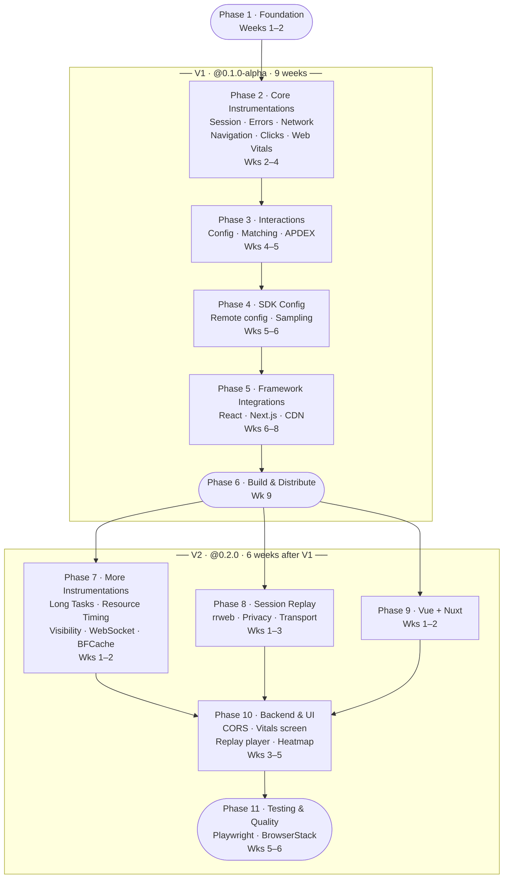

# Pulse Web SDK — Project Plan

**Date:** April 2026 | **Status:** Planning Complete

---

## Objective

Bring Pulse observability to web browsers. A customer adds one line of code; Pulse automatically captures errors, performance, network, user interactions, and session replays — the same data Pulse already collects on Android and iOS, over the same pipeline.

---

## V1 vs V2 at a Glance

The full plan is split into two versions to keep scope manageable and ship value early.

| | V1 (`@0.1.0-alpha`) | V2 (`@0.2.0`) |
|---|---|---|
| **Timeline** | ~9 weeks | ~6 weeks after V1 |
| **Foundation** | ✅ | — |
| **Core signals** (session, errors, network, navigation, clicks, vitals) | ✅ | — |
| **Additional signals** (long tasks, resource timing, visibility, websocket, bfcache) | — | ✅ |
| **Interactions + APDEX** | ✅ | refinements |
| **SDK Config (remote config)** | ✅ | web UI for it |
| **React + Next.js** | ✅ | — |
| **CDN / Vanilla JS** | ✅ | — |
| **Vue + Nuxt** | — | ✅ |
| **Session Replay** | — | ✅ |
| **Backend & UI changes** | — | ✅ |
| **BrowserStack E2E suite** | — | ✅ |

**Detailed plans:** [V1-PLAN.md](./v1/PLAN.md) · [V2-PLAN.md](./v2/PLAN.md)

---

## What Gets Captured

| Signal | What It Covers |
|---|---|
| Errors & Crashes | Unhandled JS errors, promise rejections |
| Network | All fetch/XHR — URL, status, duration, failures |
| Clicks & Rage Clicks | Every tap with element context; rage click detection |
| Web Vitals | LCP, CLS, INP, FCP, TTFB with attribution |
| Navigation | Page load timing, SPA route changes, time-on-screen |
| Long Tasks | Main thread blocks > 50ms (jank) |
| Resource Timing | JS, CSS, image, font load times |
| Connectivity | Tab visibility, online/offline transitions |
| WebSocket | Connection lifecycle, message counts, errors |
| BFCache | Browser back/forward cache restores |
| **Interactions** | Multi-step journey tracking with APDEX (same config system as mobile) |
| **Session Replay** *(opt-in)* | DOM-level recording with privacy masking |

---

## Delivery Plan

> **V1 = Phases 1–6 below · V2 = Phases 7–8 + additional instrumentations.**
> See [V1-PLAN.md](./v1/PLAN.md) and [V2-PLAN.md](./v2/PLAN.md) for the full breakdown.

### Phase 1 — Foundation `Weeks 1–2` `V1`
Production-grade SDK core. The foundation is built to support everything that follows without retrofits.

| Area | What's Built |
|---|---|
| Core | Init / shutdown lifecycle, session + identity management, OTLP HTTP export, consent |
| Batching | 5s flush, 2048 queue, 512 batch — configurable; `pagehide` force-flush via `sendBeacon` |
| Persistence | IndexedDB signal buffer — failed exports survive tab crash, drained on next load |
| Payload | JSON (default) or Protobuf; gzip compression via browser-native `CompressionStream` |
| Instrumentation registry | `install()` / `uninstall()` contract; every instrumentation togglable at init |
| Session instrumentation | `session.start` / `session.end` signals (separate from session ID management) |
| Shutdown API | Force flush all providers → uninstall all instrumentations → clear state |

**Exit:** A heartbeat span from a test page appears in ClickHouse with `Platform = 'web'`. Shutdown flushes cleanly. Instrumentation toggle verified.

---

### Phase 2 — Core Instrumentations `Weeks 2–4` `V1`
Six instrumentations built in parallel after Foundation. Each independently togglable at init.

| Instrumentation | Signal | Doc |
|---|---|---|
| Session | `session.start`, `session.end` | `01.1` |
| Errors | `device.crash`, `non_fatal` | `02.1` |
| Network (Fetch + XHR) | `http` span | `02.2` |
| Navigation | `screen_load`, `screen_interactive`, `screen_session` | `02.5` |
| Clicks + Rage Clicks | `app.click` | `02.3` |
| Web Vitals | `web_vital` (LCP, CLS, INP, FCP, TTFB) | `02.4` |

**Exit:** All 6 signal types visible under `platform = 'web'`. No signals emitted when consent is DENIED.

---

### Phase 3 — Interactions `Weeks 4–5` `V1`
Port the server-driven multi-step journey tracking from Android/iOS to web. No backend or dashboard changes needed — span attributes are identical across platforms.

| Sub-doc | What It Does |
|---|---|
| `03.1` | CDN config fetch + in-memory cache |
| `03.2` | State machine, step matching, timeout handling |
| `03.3` | APDEX scoring, OTel span creation |

**Exit:** An interaction span with correct APDEX score appears in the existing Pulse Interactions tab.

---

### Phase 4 — SDK Config (Remote Config) `Weeks 5–6` `V1`
Server-driven config so any SDK behaviour can be changed without an SDK release. Session sampling, feature gates, attribute manipulation, collector URL overrides — all remotely controllable.

**Exit:** Web SDK reads config from `/v1/configs/active`. Disabling a feature via server config is confirmed without an SDK update.

---

### Phase 5 — Framework Integrations `Weeks 6–8` `V1`
React, Next.js, and CDN/Vanilla JS. Vue + Nuxt are V2.

| Framework | Integration | Doc |
|---|---|---|
| React + React Router v6 | `<PulseProvider>`, `<PulseErrorBoundary>` | `05.1` |
| Next.js (App + Pages Router) | Provider with SSR guard | `05.2` |
| CDN / Vanilla JS | Async `<script>` snippet, `window.PulseWeb` queue drain | `05.4` |

**Exit:** Each framework has a working example app. Route changes tracked automatically. SDK initialises exactly once.

---

### Phase 6 — Build & Distribution `Week 9` `V1`
Production npm package (`@dreamhorizon/pulse-web`) + CDN artifact. Automated publish on release tag.

**Exit:** `npm install @dreamhorizon/pulse-web` works. CDN URL live. CI green. Core bundle < 30 KB gzip enforced.

---

### Phase 7 — Additional Instrumentations `V2 · Weeks 1–2`
Five remaining auto-instrumentations. Each follows the same `install()` / `uninstall()` contract.

| Instrumentation | Signal | Doc |
|---|---|---|
| Long Tasks | `app.jank.slow` | `02.6` |
| Resource Timing | `resource_load` | `02.7` |
| Visibility & Online | `app.visibility`, `network.change` | `02.8` |
| WebSocket | `websocket` | `02.9` |
| BFCache | `screen_load` (bfcache variant) | `02.10` |

---

### Phase 8 — Session Replay + Vue + Backend & UI `V2 · Weeks 1–5`
Three workstreams run in parallel, then converge:

| Workstream | What Ships | Weeks |
|---|---|---|
| Session Replay | rrweb DOM recording, privacy masking, OTLP delivery | 1–3 |
| Vue + Nuxt | `PulseVuePlugin`, vue-router, Nuxt 3 module | 1–2 |
| Backend & UI | CORS headers, Web Vitals screen, rrweb player, heatmap, config UI | 3–5 |

**Exit:** All signals visible in all dashboards. Replay plays back. BrowserStack E2E suite green.

---

## Phase Dependency Diagram

> **V1** is linear — each phase unlocks the next. **V2** fans out in parallel (Instrumentations, Replay, Vue) then converges at Backend & UI, and closes with the cross-browser test suite.

---

## Instrumentations & Signals

### Auto-Instrumentations — 10 modules, 13 signal types

| # | Instrumentation | Signal(s) Produced | Signal Kind | Version |
|---|---|---|---|---|
| 01.1 | Session | `session.start`, `session.end` | Log | **V1** |
| 02.1 | Errors | `device.crash`, `non_fatal` | Log | **V1** |
| 02.2 | Network (Fetch / XHR) | `http` | Span | **V1** |
| 02.3 | Clicks & Rage Clicks | `app.click` | Log | **V1** |
| 02.4 | Web Vitals | `web_vital` (LCP, CLS, INP, FCP, TTFB) | Metric | **V1** |
| 02.5 | Navigation | `screen_load`, `screen_interactive`, `screen_session` | Span | **V1** |
| 02.6 | Long Tasks | `app.jank.slow` | Log | V2 |
| 02.7 | Resource Timing | `resource_load` | Span | V2 |
| 02.8 | Visibility & Online | `app.visibility`, `network.change` | Log | V2 |
| 02.9 | WebSocket | `websocket` | Span | V2 |
| 02.10 | BFCache | `bfcache.restore` | Span | V2 |

### Opt-In Features

| Feature | Signal Produced | Signal Kind | Version |
|---|---|---|---|
| Interactions | `interaction` (with APDEX score) | Span | **V1** |
| Session Replay | `session_replay` (compressed DOM chunks) | Log | V2 |

### Global Attributes on Every Signal

Every signal — regardless of instrumentation — automatically carries:

`session.id` · `screen.name` · `url.path` · `browser.name` · `browser.version` · `os.name` · `device.type` · `network.connection.type` · `installation.id` · `project.id` · `platform` · `rum.sdk.version`

---

## Key Decisions

| Decision | Rationale |
|---|---|
| OpenTelemetry (OTLP) | Same wire format as mobile — zero new backend pipeline |
| Framework integrations in Phase 2 (early) | Real app context for testing all subsequent instrumentation work |
| Session Replay opt-in only | rrweb adds ~50 KB — keeps default bundle lean |
| Interactions in v1 | High funnel value; same config system as mobile; no new backend work |
| Version starts at `0.1.0-alpha` | Freedom for breaking API changes before GA |

---

## Top Risks

| Risk | Mitigation |
|---|---|
| CORS not configured → zero data flows | First backend task; unblocks all testing |
| rrweb bundle too large for some customers | Separate import; core bundle unaffected |
| `screen.name` high cardinality without route config | Heuristic fallback; documented setup guide |

---

## Open Points

### Metrics

| # | Question | Options |
|---|---|---|
| M1 | Custom metric recording API (`PulseWeb.trackMetric`) — include in v1 or post-v1? | v1 adds cross-platform parity with iOS; post-v1 keeps scope lean |
| ~~M2~~ | ~~Web Vitals output format~~ | ✅ **Resolved** — emitted as OTLP gauge observations (`createObservableGauge`) → `otel_metrics_gauge` in ClickHouse. See `v1/02-instrumentations/web-vitals.md`. |
| M3 | Memory gauge (`performance.memory.usedJSHeapSize`) — worth capturing given it's Chrome-only and requires COOP/COEP headers? | Opt-in, low priority candidate |
| M4 | Derived metrics via SDK Config (server-side signal-to-metric rules, same as mobile) — v1 or post-v1? | Post-v1 recommended; unblock after signal pipeline is stable |

---

### Screen Name

`screen.name` is the web equivalent of Android's `ActivityName`. Raw URLs are high-cardinality; the SDK resolves them via a 4-step chain: manual override → route pattern config → heuristic (strip IDs) → raw pathname.

| # | Question | Options |
|---|---|---|
| S1 | Hash-based routing (`/#/products/123`) — listen to `hashchange` events as route changes? | Opt-in flag `enableHashRouting: true`; off by default |
| S2 | URL-not-changing navigation (tabs, wizard steps, modals) — expose a `startView(name)` API that creates a session boundary without a URL change? | Required for SPAs that don't reflect all screens in the URL |
| S3 | Query-param routing (`/search?tab=flights` vs `?tab=hotels`) — track `?key=value` changes as route changes? | Opt-in config `queryParamRoutingKey: 'tab'` |
| S4 | Should `routePatterns` config be required for go-live, or is the heuristic fallback acceptable for v1? | Heuristic covers most cases; patterns are needed for clean dashboard grouping |

---

## Deferred

- **Click Heatmap** — data contract complete (normalised coordinates in every click event); UI visualisation deferred.
- **Metrics gaps** — detail in `deferred-metrics.md`.
