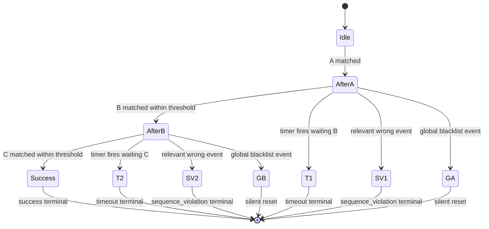

# Interaction instrumentation — scenario matrix (deep dive)

**Purpose:** Map **interaction configs** (ordered steps `events[]`, timing `thresholdInMs`, **global** blacklist, **per-step** flags) to **runtime outcomes**: success span, `timeout` error, `sequence_violation` error, silent cancel/restart, or ignore.

**Implementation references (Web SDK, Android parity):**

| Layer | Path |
|-------|------|
| Capture + timer | `pulse-web-otel/src/interactions/interaction-tracker.ts` |
| Sequence match | `pulse-web-otel/src/interactions/interaction-sequence-matcher.ts` |
| Config models | `pulse-web-otel/src/interactions/interaction-models.ts` |
| Name + property match | `pulse-web-otel/src/utils/interactions/event-matching.ts` |
| First-step restart helper | `pulse-web-otel/src/utils/interactions/interaction-events.ts` |

---

## 1. Glossary

| Term | Meaning |
|------|---------|
| **Step / config event** | One entry in `InteractionConfig.events[]`: `{ name, isBlacklisted, props? }`. |
| **Local event** | Something `trackEvent` (or pipeline) produced: `{ name, timeInNano, props? }`. |
| **`thresholdInMs`** | Inter-step budget. After matching step *k*, the tracker arms `setTimeout(thresholdInMs + 10)` waiting for step *k+1*. |
| **Global blacklist** | `globalBlacklistedEvents[]`. While a match is **in progress** (`isMatchOnGoing`), **any** local event that matches this list **aborts** the flow (buffer cleared, **no** terminal span from that matcher pass). |
| **Per-step `isBlacklisted`** | Two behaviors (same as Android `InteractionUtil.matchSequence`): **(a)** If the local event **matches** this config step → treat as **forbidden**: abort matching (**no** success payload from that branch). **(b)** If the local event does **not** match this step but the step is marked blacklisted → treat step as **optional / skippable**: advance the config index **without** consuming the current local event (`continue` in the matcher loop — same local event is retried against the next step). |
| **Unrelated event** | Local event whose `name` (+ `props`) does **not** match **any** entry in `events[]` **nor** `globalBlacklistedEvents[]`. **Never inserted** into the tracker buffer → downstream matcher never sees it. |
| **Markers** | Separate timeline (`localMarkers`) sliced into `[INTERACTION_PROP_KEYS.MARKER_EVENTS]` on the terminal `PulseInteraction` for the time span derived from matched steps + error semantics (`buildPulseInteraction`). |

**Property filters:** Each step may require `props` with operators `EQUALS`, `NOTEQUALS`, `CONTAINS`, `NOTCONTAINS`, `STARTSWITH`, `ENDSWITH` (`event-matching.ts`). Same **event name** with wrong props ⇒ **no match** for that step.

**`localEventMatchesConfigEvent`:** Used **inside** `matchInteractionSequence` to compare one buffered local event to **one** config step (name + optional `props` filters). It does **not** implement the “relevant / irrelevant to tracker” gate — that is `checkAndAdd` + `localMatchesAnyEvent` against all of `events[]` and `globalBlacklistedEvents[]` **before** insert.

---

## 1.1 Execution model — full-buffer replay (not a running pointer)

On **every** `InteractionTracker.checkAndAdd`, the tracker calls `matchInteractionSequence` with the **entire** sorted `localEvents` array. The matcher **re-derives** state from scratch: `configEventIndex`, `isMatchOnGoing`, and `stepWiseTimeInNano` are **local to that function** and reset at the start of each call. There is **no** persistent “match cursor” across invocations—**replaying the full buffer** is the source of truth.

Diagrams and scenario tables below describe **outcomes** in timeline form; mentally substitute “the matcher, when it walks the full buffer, eventually …” for any phrasing that sounds like a single incremental state machine.

---

## 2. End states (terminal `PulseInteraction`)

| Outcome | `props.is_error` | `error_type` | Typical trigger |
|---------|-------------------|--------------|-----------------|
| **Success** | `false` | — | All non-blacklisted steps matched in order; duration drives Apdex (`uptimeLower/Mid/UpperLimitInMs`). |
| **Timeout** | `true` | `timeout` | After last matched step, **no** next step within `thresholdInMs + 10` ms (tracker timer). |
| **Sequence violation** | `true` | `sequence_violation` | `isMatchOnGoing` is true, the current config step is **not** the optional-skip case (`!configEvent.isBlacklisted` on the branch that leads here), and the current local event **fails** `localEventMatchesConfigEvent(local, currentConfigStep)` (wrong name and/or props). The event need not be a “near miss” of the expected step—**any** non-match in that situation produces a violation. |
| **Silent abort** | — | — | Matcher returns `no_ongoing` with reset: global blacklist hit mid-flow, forbidden step matched, or matcher yields `null` (tracker closes config without emitting a terminal from that pass). |

---

## 3. Two-step flow **A → B**

Assume config `events = [A, B]` (both normal steps unless noted). **Irrelevant** events are dropped before the buffer.

### 3.1 Decision sketch

*Outcome-oriented* flow; each `checkAndAdd` still runs the matcher over the **whole** buffer (§1.1).

```mermaid
flowchart TD
  subgraph ingest [Ingest]
    E[Local event E]
    E --> Q{E matches events[] or globalBlacklistedEvents[]?}
    Q -->|No| DROP[Drop — invisible to matcher]
    Q -->|Yes| BUF[Sorted insert buffer]
  end

  BUF --> MATCH[matchInteractionSequence]
  MATCH --> G{In progress AND E matches global blacklist?}
  G -->|Yes| ABORT[Reset buffer — no terminal]
  G -->|No| STEP[Walk buffer vs config index]

  STEP --> H{Match current step?}
  H -->|Yes| BL{Step isBlacklisted?}
  BL -->|Yes| ABORT2[Reset — forbidden step matched]
  BL -->|No| ADV[Advance index / maybe complete]

  H -->|No| OPT{Current step isBlacklisted optional?}
  OPT -->|Yes| SKIP[Advance config only — retry same local row]
  OPT -->|No| ONG{isMatchOnGoing?}
  ONG -->|Yes| SV[Terminal: sequence_violation]
  ONG -->|No| NULL[No state from this advance]

  ADV --> DONE{B completed?}
  DONE -->|Yes| OK[Terminal: success]
  DONE -->|No| ARM[Arm inter-step timer]
  ARM --> TO{Timer fires before B?}
  TO -->|Yes| TOUT[Terminal: timeout]
  TO -->|No| WAIT[Continue]
```

### 3.2 Scenario table — **A → B**

| # | Scenario | Event stream (relevant only) | Result |
|---|----------|------------------------------|--------|
| S1 | **Happy path** | `A` → `B` (B within `thresholdInMs` of matcher advancing past A) | **Success** span; Apdex from `A.time` → `B.time`. |
| S2 | **Inter-step timeout** | `A` → *(silence)* until timer `(thresholdInMs + 10)` | **Timeout**; expects event name of **B** (`timeoutExpectedEventName`). |
| S3 | **Sequence violation (wrong second event)** | `A` → `X` where `X` is relevant (matches some config or global list) but **not** valid **B** at next position | **Sequence violation** (`expected=B`, `received=X`). Tracker then **may** restart if `X` matches **first** step — see S8. |
| S4 | **Global blacklist after A** | `A` → `G` with `G` ∈ `globalBlacklistedEvents` | Matcher returns reset **without** success terminal; buffer cleared — **no** interaction span for this cancel (silent abort path). |
| S5 | **Unrelated noise** | `A` → `U` → `B` where `U` is **not** in `events[]` nor `globalBlacklistedEvents` | `U` **never buffered**; timeline behaves like `A` → `B` ⇒ **Success** if `B` in time. |
| S6 | **Blacklist noise that matters** | `A` → `G` (global blacklist) | **Abort** as S4 — **not** like unrelated `U`. |
| S7 | **Wrong props on B** | `A` → `B'` same name as B but **fails** `props` filters | Treated as **non-match** at B ⇒ **Sequence violation** (received event is the local `B'`). |
| S8 | **Violation then restart** (`sequence_violation_restart`) | After a sequence-violation terminal, the **last entry** in `localEvents` (`localEvents[localEvents.length - 1]`) is tested with `localEventMatchesFirstConfigEvent` (first **non-blacklisted** config step). If it matches, tracker clears buffers and **re-inserts only that last event**, assigns a **new** `interactionId`, and continues mid-flow with `interaction: null`. If multiple events sat in the buffer before the violation, **only the last one** participates in this restart decision — usually that is the violating event. See `interaction-tracker.ts` `shouldTakeFirstEvent` branch. |
| S9 | **Only B arrives first** | `B` then `A` (both relevant) | Buffer order is time-sorted; matcher sees earliest first — typically **violation** or **no match** until ordering aligns; depends on timestamps. |

### 3.3 Timing detail

- **Inter-step deadline:** `scheduleTimer` uses **`thresholdInMs + 10`** ms after each partial match (`interaction == null`, `kind === ongoing`).
- **Apdex / duration** (success): wall-clock **nanoseconds** between **first** and **last** **matched** step events (`buildPulseInteraction`).
- **Timeout span:** synthetic end time uses threshold logic in `computeInteractionTimeSpanInNanos` for `timeout` errors.

---

## 4. Three-step flow **A → B → C**

Same machinery; config index runs `0 → 1 → 2`.

### 4.1 High-level chart

*Logical* progression for readability; matching is still **full-buffer replay** each time (§1.1).



### 4.2 Scenario table — **A → B → C**

| # | Scenario | Pattern | Result |
|---|----------|---------|--------|
| T1 | **Full success** | `A` → `B` → `C` (each next step within its inter-step window) | **Success**; Apdex uses `A.time` … `C.time`. |
| T2 | **Timeout waiting B** | `A` only, then silence | **Timeout** expecting **B**. |
| T3 | **Timeout waiting C** | `A` → `B`, then silence | **Timeout** expecting **C**. |
| T4 | **Skip-unrelated throughout** | `A` → `U1` → `B` → `U2` → `C` with `U*` unrelated | Same as T1 (**Success**) — noise invisible. |
| T5 | **Violation early** | `A` → `C` (C relevant but **early**) | **Sequence violation** at position expecting **B** (received **C**). |
| T6 | **Violation mid** | `A` → `B` → `A` (second `A` wrong for slot expecting `C`) | **Sequence violation** expecting **C**, received **A** (if `A` still “relevant”). |
| T7 | **Global blacklist between** | `A` → `G` → … | After **A**, flow **aborts** on **G** (silent reset) — no success. |
| T8 | **Optional / forbidden steps** | Mix of `isBlacklisted` per Android semantics | **Forbidden** step name matched ⇒ abort; **optional** skipped step ⇒ matcher advances without consuming event — use carefully when authoring JSON (mirrors Android). |
| T9 | **Overlapping configs** | Two configs share event names | Coordinator runs **multiple** trackers; same event may advance **each** config whose union matches — **E2E** `overlapping configs` in `m2-interactions.spec.ts`. |

---

## 5. Blacklist semantics — quick reference

| Layer | When it fires | Effect |
|-------|----------------|--------|
| **Unrelated** | Event ∉ `events[]` ∪ `globalBlacklistedEvents` | **Dropped** — no buffer, no timer change. |
| **Global blacklist** | **During** `isMatchOnGoing` and event matches list | **Immediate** matcher return: reset list, **no_ongoing** — **no** terminal interaction from that pass. |
| **Step `isBlacklisted: true`** | Local event **matches** that step | **Abort** matching (reset). |
| **Step `isBlacklisted: true`** | Local event does **not** match that step | **Skip** config row (`continue` — optional step). |

---

## 6. Authoring implications (JSON / backend)

- **`thresholdInMs`** bounds **each** gap between consecutive matched steps — not total wall time for the whole interaction unless only two steps exist.
- **Renaming** events in product code without updating config ⇒ events become **unrelated** ⇒ flow never starts or stalls.
- **Stricter** props on later steps increase **sequence_violation** rate (same name, wrong attributes).

---

## 7. Related automated coverage

### 7.1 Vitest — matrix row validation (revalidation checklist)

Primary sources: `interactions-tracker.test.ts`, `interactions-sequence-matcher.test.ts`, `interactions-coordinator.test.ts`, `interactions-events-utils.test.ts`; supporting: `interactions-span-builder.test.ts`, wiring/feature tests.

| Matrix | Hypothesis (short) | Vitest evidence | Status |
|--------|---------------------|-----------------|--------|
| §1 **Unrelated** | Dropped in tracker before buffer | — | **Gap** — no test asserts `checkAndAdd` no-op + buffer unchanged for names ∉ config ∪ global blacklist |
| §1.1 **Full-buffer replay** | Matcher resets each call | — | **Implicit** — covered by behavior; no dedicated test for “two calls same buffer → same result” |
| §2 **Success** | Terminal `is_error` false | `InteractionTracker` “emits terminal interaction on success”; `matchInteractionSequence` happy path | **Confirmed** |
| §2 **Timeout** | `thresholdInMs + 10`, `error_type` timeout | `InteractionTracker` “TIMEOUT after threshold + 10ms” + `buildPulseInteraction` timeout scoring | **Confirmed** |
| §2 **Sequence violation** | Non-match while ongoing, non-optional step | `matchInteractionSequence` “relevant wrong step” (A→C expects B); **not** matcher-only irrelevance | **Confirmed** (matcher); tracker **gap** for same path |
| §2 **Silent abort** (global blacklist) | Reset, no terminal from pass | `InteractionTracker` “silent reset… no terminal”; matcher “global blacklist… no_ongoing” | **Confirmed** |
| S1 | A→B success | Same as §2 success | **Confirmed** |
| S2 | Inter-step timeout | Tracker fake timers test | **Confirmed** |
| S3 | Relevant wrong step ⇒ violation | Matcher three-step A,C test | **Confirmed** (matcher); **gap** at full tracker |
| S4 / S6 | Global blacklist mid-flow | Tracker + matcher tests | **Confirmed** |
| S5 | Unrelated invisible | — | **Gap** (see §1 unrelated) |
| S7 | Wrong props ⇒ non-match ⇒ violation | `localEventMatchesConfigEvent` props only | **Partial** — operators tested; **no** `InteractionTracker` / full-buffer violation with wrong props |
| S8 | Restart: last buffer vs `localEventMatchesFirstConfigEvent` | `localEventMatchesFirstConfigEvent` skips leading blacklisted steps | **Partial** — helper only; **no** tracker test for `shouldTakeFirstEvent` / new `interactionId` / re-push last event |
| S9 | Time-order / `B` before `A` | — | **Gap** |
| T1–T7 | Three-step flows | — | **Gap** — no Vitest with three named steps (coordinator test uses two parallel **two-step** configs, ≈ T9 overlap not T1–T7) |
| T8 | Optional vs forbidden `isBlacklisted` steps | — | **Gap** |
| T9 | Overlapping configs (shared event names) | `InteractionCoordinator` “fans out… F1, F2” with two configs both using `step_a` / `step_b` | **Confirmed** (success). The checkout/signup test uses **disjoint** names — useful for multi-flow but not the T9 “shared name” pattern |
| §5 **Blacklist table** | Same as S4 / T8 rows | Global blacklist covered | **Partial** — per-step optional/forbidden not unit-tested |

**Conclusion:** Documented behavior matches **`interaction-tracker.ts` / `interaction-sequence-matcher.ts` / `event-matching.ts`** on review; Vitest **does not** prove every row. Highest-value gaps if tightening proof: **S5/S7/S8 at tracker**, **three-step T-row**, **T8 blacklist semantics**.

### 7.2 E2E and other

- E2E: `examples/ecommerce-demo/e2e/m2-interactions.spec.ts` — timeout, sequence violation, blacklist, Apdex, overlapping configs (fills some tracker-level gaps not covered in Vitest).
- Wiring: `m1.test.ts` interaction paths as applicable.

---

*Generated for lifecycle documentation — behaviour tied to `interaction-tracker.ts` + `interaction-sequence-matcher.ts` as of the matrix authoring date.*
