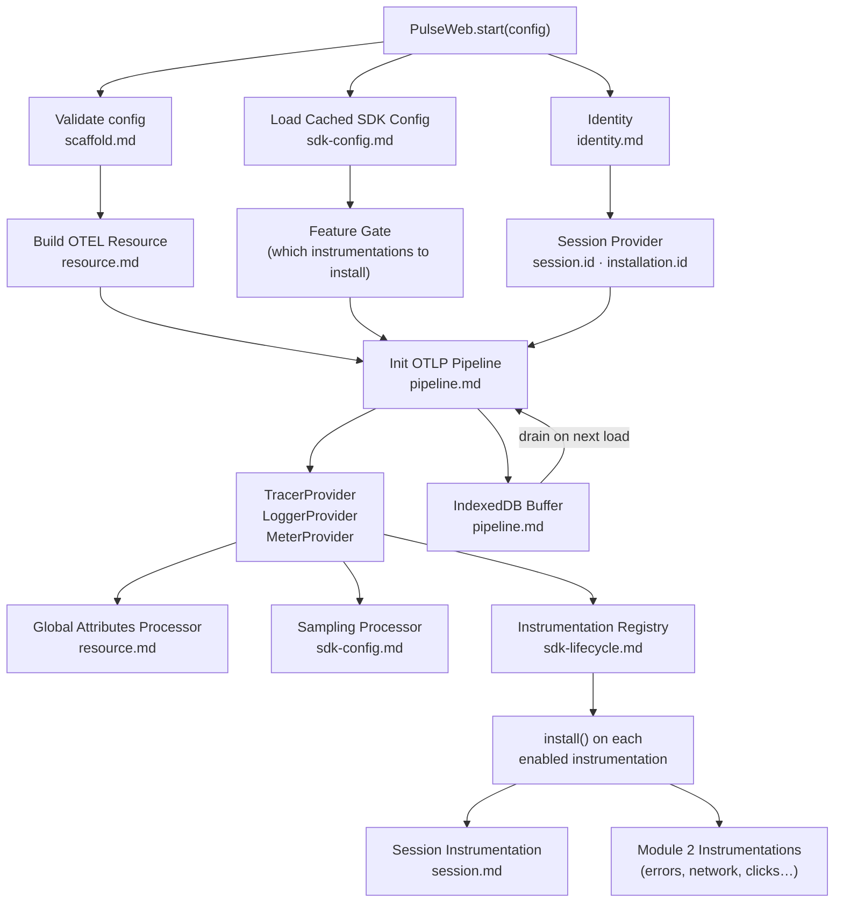

# Foundation — Flow & Summary

The SDK core layer that everything else builds on. Handles identity, attribute enrichment, the OTLP export pipeline, and the instrumentation registry — before any auto-instrumentation runs.

---

## Flow

---

## Sub-Documents

| File | What It Covers |
|---|---|
| [scaffold.md](./scaffold.md) | Repo structure, package.json, OTEL dependencies, `PulseWebConfig` types |
| [identity.md](./identity.md) | Installation ID (3-tier localStorage→sessionStorage→memory), Session Provider |
| [resource.md](./resource.md) | Static OTEL Resource attributes + dynamic per-signal global attributes |
| [pipeline.md](./pipeline.md) | OTLP exporters, batching (5s/2048/512), IndexedDB persistence, gzip compression |
| [sdk-lifecycle.md](./sdk-lifecycle.md) | SDK singleton, shutdown API, instrumentation registry, CORS requirement |
| [session.md](./session.md) | Session signal emission (`session.start` / `session.end`) |
| [sdk-config.md](./sdk-config.md) | Remote sampling, feature gates, signal filters, attribute manipulation |

---

## Key Design Decisions

| Decision | Rationale |
|---|---|
| Singleton pattern | Prevents double-instrumentation in React StrictMode and hot-reload environments |
| 3-tier storage fallback for `installation.id` | Mirrors Android's graceful degradation; works in incognito and sandboxed iframes |
| Session Provider separate from Session Instrumentation | Signals can be disabled without breaking `session.id` stamping on every span |
| IndexedDB persistence opt-in (default off) | Zero overhead for most users; opt-in for customers with unreliable connectivity |
| `CompressionStream` for gzip | Zero bundle cost; falls back transparently on older browsers |
| OTLP same endpoints as mobile | Zero backend changes — only CORS headers needed |
