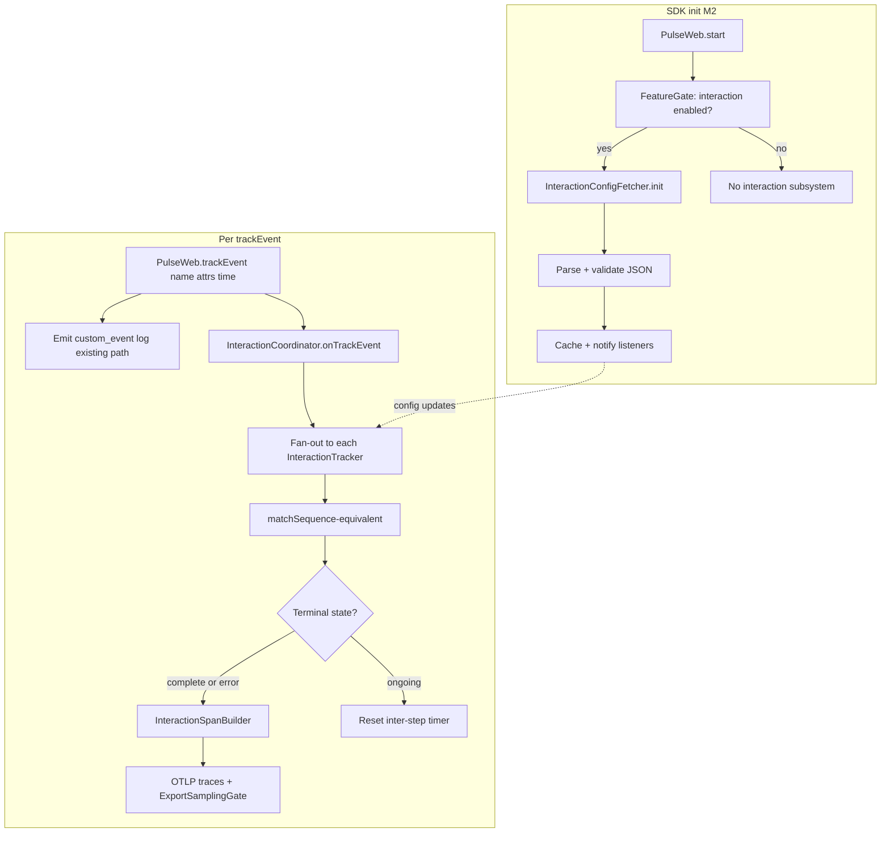

# Web SDK — Pulse Interactions (M2) Implementation Plan

**Status:** Engineering reference (Android + backend parity).  
**Scope:** M2 interactions from [`v1/MILESTONES.md`](../MILESTONES.md) — Phase 3 only; sampling, React, and publish are covered elsewhere in M2.

**Source of truth:** When this plan disagrees with [`matching.md`](./matching.md) or [`span.md`](./span.md), prefer **Android** (`pulse-android-otel/instrumentation/interaction/`) and **backend** span attribute usage unless a browser-only exception is explicitly documented.

---

## 1. Goal (M2)

- Load **server-driven** interaction definitions.
- Match sequences from **`PulseWeb.trackEvent(name, attrs)`** (plus optional explicit timestamps when exposed).
- Emit **`pulse.type = interaction`** spans that the existing **Interactions** dashboard and ClickHouse queries already understand.
- Fail gracefully when config fetch fails; respect **feature gate** `interaction`, **consent**, and **export sampling**.

Milestone table (excerpt): config fetcher, matching state machine, span + scoring — see M2 in `MILESTONES.md`.

---

## 2. Target module layout (web)

The file map in [`WEB-SDK-AGENT-CONTEXT.md`](../../WEB-SDK-AGENT-CONTEXT.md) remains valid. Recommended split for parity and testing:

| File / module | Responsibility |
|---------------|----------------|
| `interaction-models.ts` | Types aligned with server JSON (`InteractionConfig`, events, `props`, operators, `globalBlacklistedEvents`, `thresholdInMs`, `uptime*LimitInMs`). |
| `interaction-config-fetcher.ts` | Fetch, parse, validate, cache, periodic refresh; SSR-safe. |
| `interaction-sequence-matcher.ts` | Logic equivalent to Android `InteractionUtil.matchSequence`. |
| `interaction-tracker.ts` | One server config → one tracker: buffer, inter-step timer (`thresholdInMs`), state — Android `InteractionEventsTracker`. |
| `interaction-coordinator.ts` | N trackers, fan-out from `trackEvent`, subscribe to config updates. |
| `interaction-span-builder.ts` | Span + attributes + span events — Android `InteractionInstrumentation.handleSuccessInteraction` + `InteractionDefaultAttributesExtractor`. |
| `interaction-feature.ts` | Glue: feature gate, consent, `ExportSamplingGate`, tracer, `shutdown` / timer cleanup. |

---

## 3. End-to-end flow

**Inter-step timeout (Android parity):** While matching is ongoing, Android schedules delay `thresholdInMs + 10` and on expiry emits a **timeout** error interaction. Web should mirror **inter-step** timeout, not only a single “whole flow” timer, unless product documents an intentional deviation.

---

## 4. Parity matrix: Android / backend / web phase docs

| Topic | Android | Backend (e.g. `ClickhouseConstants`, session DAOs) | Web `03-interactions` drafts | Action |
|--------|---------|---------------------------------------------------|------------------------------|--------|
| Span attribute keys | `pulse.interaction.*` (`InteractionConstant`) | `SpanAttributes['pulse.interaction.*']` | `interaction.*` without `pulse.` | Implement and document **`pulse.interaction.*` only**. |
| `user_category` | `Excellent`, `Good`, `Average`, `Poor` | Aggregations count those strings | `satisfied` / `tolerating` / `frustrated` | **Port Android** `TimeCategory` + `uptimeLower/Mid/Upper` bucketing. |
| Score field | `pulse.interaction.apdex_score` as `upTimeIndex` (0.0–1.0) | Same | Simplified 1.0 / 0.5 / 0.0 from generic APDEX | **Port** `InteractionUtil.buildPulseInteraction` scoring. |
| Duration | `pulse.interaction.complete_time` (nanos) | Used in queries | `interaction.duration` (ms) in examples | **Align names and units** with Android. |
| Errors | `pulse.interaction.is_error`, `pulse.interaction.error.type`, `pulse.interaction.error.message` | Used | `interaction.status` / `interaction.error_reason` only | **Emit Android’s three fields**; add milestone note if status string is still desired for debugging. |
| Config / display name | `pulse.interaction.config.id`, `pulse.interaction.config.name`, runtime `pulse.interaction.id` | — | Partial | **Emit** on web. |
| Step timeline | Span **events** per matched local event; markers from log pipeline | Session views | JSON string of step names only in draft | **Span events** for steps; markers **M2:** optional hook; **M3+:** wire log types mirroring Android `InteractionLogListener`. |
| Property filters | Operators: EQUALS, NOTEQUALS, CONTAINS, NOTCONTAINS, STARTSWITH, ENDSWITH | Same config shape from API | `attributes[key] === expected` | **Implement full operator set**. |
| Blacklists | `globalBlacklistedEvents`; per-event `isBlacklisted` | Same JSON | Omitted in simplified matcher | **Implement**; global blacklist during ongoing match resets per Android. |
| Wrong event while ongoing | `SEQUENCE_VIOLATION` → error interaction | — | Draft matcher often ignores | **Emit error interaction** per Android. |
| Config URL | e.g. `InteractionConfigRestFetcher` → `/v1/interaction-configs/` | Server-owned | CDN `{cdn}/interactions/{projectId}.json` in examples | **Pick one delivery mechanism** for web (REST with auth vs CDN) that serves the **same schema** as mobile; document in `config.md`. |
| Markers | Logs with selected `pulse.type` → `addMarkerEvent` | — | N/A until instrumentations | Document **deferred** until M3 logs exist or stub interface. |

---

## 5. Workstreams (recommended order)

1. **Models + validation** — Parse and validate server payload; invalid file → empty trackers, log once.
2. **Config fetcher** — Implement cache, refresh, `onChange`, SSR guard; align URL and headers with backend/CDN decision.
3. **Matching engine** — Port `InteractionUtil.matchSequence` + `InteractionEventsTracker` behaviour (including reset and `shouldTakeFirstEvent` paths), not only the shortened `InteractionMatcher` sample in `matching.md`.
4. **Span builder** — Span name = interaction config name; root span (`setNoParent` equivalent in JS SDK); attributes from `InteractionConstant`; `addEvent` for each step; `StatusCode.ERROR` when `isErrored`.
5. **SDK wiring** — After consent + `FeatureGate.isEnabled('interaction')`, start coordinator; every `trackEvent` forwards to coordinator **in addition** to existing custom log path; apply `ExportSamplingGate` per `SAMPLING-RULES-WEB-PARITY.md`; clear timers on `shutdown` / destroy.
6. **Milestone wording** — `MILESTONES.md` test “timeout → no span emitted” **conflicts** with Android (timeout → **error** interaction span). Resolve by aligning milestone with Android **or** explicitly documenting web-only behaviour and dashboard impact.
7. **Doc corrections** — Update [`span.md`](./span.md), [`matching.md`](./matching.md), and [`WEB-SDK-AGENT-CONTEXT.md`](../../WEB-SDK-AGENT-CONTEXT.md) data contract table to list `pulse.type: interaction` and real `pulse.interaction.*` keys so future work does not reintroduce wrong enums.

---

## 6. Testing

| Layer | Focus |
|--------|--------|
| Unit | Operators; blacklists; global blacklist; full sequence; sequence violation; timeout; parallel configs; config refresh; timestamp handling (prefer event time from `trackEvent` for parity with Android nanos). |
| Integration | Mock `fetch` + in-memory tracer: `trackEvent` × N → one span; `user_category` bands for representative durations vs `uptime*`. |
| E2E | Playwright + test exporter or ClickHouse checks: `platform = 'web'`, `pulse.type = interaction`. |
| Dashboard smoke | Traces visible where backend expects `pulse.interaction.name` / `apdex_score` / `user_category`. |

---

## 7. Self-review notes (gaps caught in planning)

1. **Contract:** Phase docs used wrong attribute prefix and wrong `user_category` vocabulary vs `ClickhouseConstants` and Android — fixed in this plan (§4).
2. **Behaviour:** Draft matcher omitted blacklists, operators, inter-step timeout, sequence violation, span events — implementation must follow Android core, not draft pseudo-code alone.
3. **Ops / product:** Config URL divergence; M2 timeout span wording vs Android; markers depend on M3 logs; feature gate + sampling must gate interaction spans.

---

## 8. Exit checklist (interactions slice of M2)

- [ ] Span carries `pulse.type = interaction` and full **`pulse.interaction.*`** set aligned with Android `InteractionConstant`.
- [ ] `pulse.interaction.user_category` ∈ {`Excellent`, `Good`, `Average`, `Poor`}.
- [ ] `pulse.interaction.apdex_score` matches Android `upTimeIndex` behaviour for completed flows.
- [ ] Span events represent step timeline; no `pulse.internal.*` on exported attributes.
- [ ] `FeatureGate`, consent, and export sampling applied to interaction spans.
- [ ] Config fetch failure: no throw; interactions disabled or stale cache only.
- [ ] Concurrent interactions behave per Android rules.
- [ ] Sub-docs and agent context updated so contract stays single-source.

---

## 9. Primary references (code)

- Android: `pulse-android-otel/instrumentation/interaction/core/` — `InteractionManager.kt`, `InteractionEventsTracker.kt`, `InteractionUtil.kt`, `InteractionConstant.kt`.
- Android OTel: `instrumentation/interaction/library/InteractionInstrumentation.kt`, `InteractionDefaultAttributesExtractor.kt`, `InteractionLogListener.kt`.
- Backend: `backend/server/.../ClickhouseConstants.java` and DAOs referencing `pulse.interaction.*`.
- Milestones: `pulse-web-otel/web-sdk-plan/v1/MILESTONES.md` (M2).
