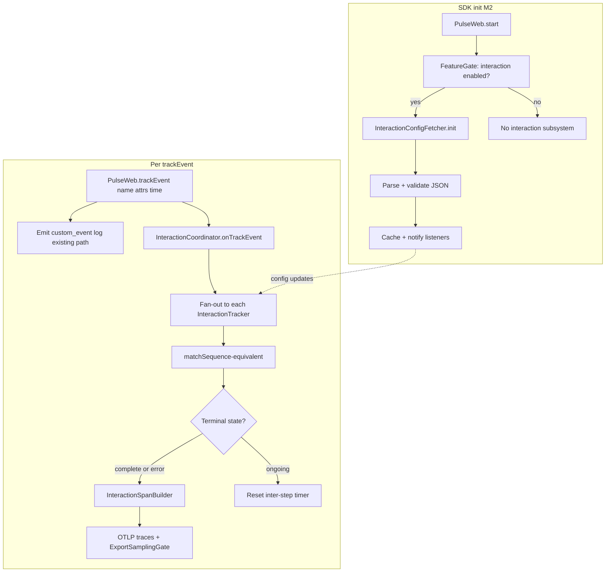

# Web SDK — Pulse Interactions (M2) Implementation Plan

**Status:** Engineering reference (Android + backend parity).  
**Scope:** M2 interactions from [`v1/MILESTONES.md`](../MILESTONES.md) — Phase 3 only; sampling, React, and publish are covered elsewhere in M2.

**Source of truth:** When this plan disagrees with [`matching.md`](./matching.md) or [`span.md`](./span.md), prefer **Android** (`pulse-android-otel/instrumentation/interaction/`) and **backend** span attribute usage unless a browser-only exception is explicitly documented.

---

## 1. Goal (M2)

- Load **server-driven** interaction definitions.
- Match sequences from **`PulseWeb.trackEvent(name, attrs)`** (plus optional explicit timestamps when exposed).
- Emit **`pulse.type = interaction`** spans that the existing **Interactions** dashboard and ClickHouse queries already understand.
- Fail gracefully when config fetch fails; respect **feature gate** `interaction`, **consent**, and **export sampling**.

Milestone table (excerpt): config fetcher, matching state machine, span + scoring — see M2 in `MILESTONES.md`.

---

## 2. Target module layout (web)

The file map in [`WEB-SDK-AGENT-CONTEXT.md`](../../WEB-SDK-AGENT-CONTEXT.md) remains valid. Recommended split for parity and testing:

| File / module | Responsibility |
|---------------|----------------|
| `interaction-models.ts` | Types aligned with server JSON (`InteractionConfig`, events, `props`, operators, `globalBlacklistedEvents`, `thresholdInMs`, `uptime*LimitInMs`). |
| `interaction-config-fetcher.ts` | Fetch, parse, validate, cache, periodic refresh; SSR-safe. |
| `interaction-sequence-matcher.ts` | Logic equivalent to Android `InteractionUtil.matchSequence`. |
| `interaction-tracker.ts` | One server config → one tracker: buffer, inter-step timer (`thresholdInMs`), state — Android `InteractionEventsTracker`. |
| `interaction-coordinator.ts` | N trackers, fan-out from `trackEvent`, subscribe to config updates. |
| `interaction-span-builder.ts` | Span + attributes + span events — Android `InteractionInstrumentation.handleSuccessInteraction` + `InteractionDefaultAttributesExtractor`. |
| `interaction-feature.ts` | Glue: feature gate, consent, `ExportSamplingGate`, tracer, `shutdown` / timer cleanup. |

---

## 3. End-to-end flow

**Inter-step timeout (Android parity):** While matching is ongoing, Android schedules delay `thresholdInMs + 10` and on expiry emits a **timeout** error interaction. Web should mirror **inter-step** timeout, not only a single “whole flow” timer, unless product documents an intentional deviation.

---

## 4. Parity matrix: Android / backend / web (current state)

> This table shows the **current correct web implementation** vs Android reference. All gaps listed here have been fixed in `matching.md`, `span.md`, `config.md`, and `WEB-SDK-AGENT-CONTEXT.md`.

| Topic | Android | Backend | Web (current — correct) | Status |
|--------|---------|---------|--------------------------|--------|
| Span attribute keys | `pulse.interaction.*` (`InteractionConstant`) | `SpanAttributes[‘pulse.interaction.*’]` | `pulse.interaction.*` — all keys prefixed | ✅ Fixed |
| `user_category` | `Excellent`, `Good`, `Average`, `Poor` | Aggregations count those strings | `Excellent` / `Good` / `Average` / `Poor` | ✅ Fixed |
| Score field | `pulse.interaction.apdex_score` (0.0–1.0) | Same | `pulse.interaction.apdex_score`; 4-bucket scoring via `uptimeLower/Mid/Upper` | ✅ Fixed |
| Duration | `pulse.interaction.complete_time` (nanos) | Used in queries | `pulse.interaction.complete_time` in nanos (`ms * 1_000_000`) | ✅ Fixed |
| Errors | `pulse.interaction.is_error` (bool), `pulse.interaction.error.type`, `pulse.interaction.error.message` | Used | All three fields emitted | ✅ Fixed |
| Config / display name | `pulse.interaction.config.id`, `pulse.interaction.config.name`, runtime `pulse.interaction.id` | — | All three emitted | ✅ Fixed |
| Step timeline | Span **events** per matched step | Session views | Span events via `span.addEvent()` | ✅ Fixed |
| Property filters | Operators: `EQUALS`, `NOT_EQUALS`, `CONTAINS`, `NOT_CONTAINS`, `STARTS_WITH`, `ENDS_WITH` | Same config shape from API | Full operator set implemented in `InteractionTracker.propMatches()` | ✅ Fixed |
| Blacklists | `globalBlacklistedEvents`; per-event `isBlacklisted` | Same JSON | Both in `InteractionConfig` schema; global blacklist resets ongoing match | ✅ Fixed |
| Wrong event while ongoing | `SEQUENCE_VIOLATION` → error interaction | — | `SEQUENCE_VIOLATION` error span emitted; see `shouldTakeFirstEvent` rule | ✅ Fixed |
| Config URL | REST `/v1/interaction-configs/` (local dev) + prod `.../interaction-config.json` on `pulse-otel-collector.pulse-ux.com` | Server-owned | Same URL strategy as Android `PulseEndpointUtils.getInteractionConfigUrl()` — REST+`X-API-KEY` when `isLocalEnvironment(apiKey)` (Android `isApiLocalDev` parity); otherwise prod collector path — same JSON array schema | ✅ Decided |
| Timeout behavior | Timeout → error interaction span | — | Error span with `TIMEOUT` (Android parity) | ✅ Decided |
| Markers | Logs with selected `pulse.type` → `addMarkerEvent` | — | Deferred to M3 (depends on log instrumentations) | 🔜 M3 |

---

## 5. Workstreams (recommended order)

1. **Models + validation** — Parse and validate server payload (JSON array of `InteractionConfig`); invalid/empty response → empty coordinator, log once.
2. **Config fetcher** — Implement cache, refresh, `onChange`, SSR guard; use prod collector JSON (Android prod branch) or REST+`X-API-KEY` (local ingest) per `config.md` URL strategy.
3. **Matching engine** — Implement `InteractionTracker` + `InteractionCoordinator` per `matching.md`: inter-step timer, global blacklist reset, sequence violation error span, `shouldTakeFirstEvent` restart, all 6 operators.
4. **Span builder** — Implement `InteractionSpanBuilder` per `span.md`: `ROOT_CONTEXT`, all `pulse.interaction.*` attributes, nanos for `complete_time`, span events for steps, `Excellent/Good/Average/Poor` categories.
5. **SDK wiring** — After consent + `FeatureGate.isEnabled('interaction')`, start coordinator; `PulseWeb.trackEvent(name, attrs?, timestampMs?)` forwards to coordinator **in addition** to existing custom log path; apply `ExportSamplingGate`; call `coordinator.shutdown()` in `PulseWeb.shutdown()`.
6. ~~**Milestone wording** — Resolved: `MILESTONES.md` test case 2 updated to Android parity (timeout → error span).~~ ✅ Done
7. ~~**Doc corrections** — Resolved: `span.md`, `matching.md`, `WEB-SDK-AGENT-CONTEXT.md` all updated with correct `pulse.interaction.*` keys and vocabulary.~~ ✅ Done

---

## 6. Testing

| Layer | Focus |
|--------|--------|
| Unit | Operators; blacklists; global blacklist; full sequence; sequence violation; timeout; parallel configs; config refresh; timestamp handling (prefer event time from `trackEvent` for parity with Android nanos). |
| Integration | Mock `fetch` + in-memory tracer: `trackEvent` × N → one span; `user_category` bands for representative durations vs `uptime*`. |
| E2E | Playwright + test exporter or ClickHouse checks: `platform = 'web'`, `pulse.type = interaction`. |
| Dashboard smoke | Traces visible where backend expects `pulse.interaction.name` / `apdex_score` / `user_category`. |

---

## 7. Self-review notes

### Resolved decisions (previously blocking)

1. **Config URL** — Prod uses the same collector-hosted JSON path as Android: `https://pulse-otel-collector.pulse-ux.com/config/projects/{projectId}/interaction-config.json`. Local/dev uses REST `/v1/interaction-configs/` with `X-API-KEY`. Web chooses local vs prod using `isLocalEnvironment(apiKey)` (Android `isApiLocalDev` parity). The REST host is still derived from the browser’s resolved OTLP `endpointBaseUrl` via `:4318 → :8080` rewrite (web-only transport detail).

2. **Timeout behavior** — **Android parity**: inter-step timer expiry → emit **error interaction span** with `pulse.interaction.is_error = true`, `pulse.interaction.error.type = 'TIMEOUT'`. `MILESTONES.md` test case 2 updated to match. "No span on timeout" was wrong.

3. **`trackEvent` timestamp** — **Android parity**: `PulseWeb.trackEvent(name, attrs?, timestampMs?)` adds optional `timestampMs` (Unix epoch ms, defaults to `Date.now()`). Mirrors Android `addEvent(eventName, params, eventTimeInNano)` defaulting to `System.currentTimeMillis() * 1_000_000`.

### Remaining notes

4. **Contract fixed:** All sub-docs now use `pulse.interaction.*` prefix and `Excellent`/`Good`/`Average`/`Poor` vocabulary — `matching.md`, `span.md`, `WEB-SDK-AGENT-CONTEXT.md`, `MILESTONES.md` all updated.

5. **Behaviour fixed:** `matching.md` rewritten to include inter-step timer (not whole-flow), global blacklist reset, sequence violation error span, `shouldTakeFirstEvent` overlapping restart, full operator set, synchronous fan-out.

6. **Markers:** Deferred to M3 (depends on log instrumentations). No stub needed at M2 — `InteractionCoordinator` has no marker path until M3.

7. **`pulse.internal.*` on exports:** Processor layer (global-attrs) must not stamp interaction spans with internal-only keys. Interaction spans flow through the same `BeforeSendSpanExporter` as all spans — no special case needed.

---

## 8. Exit checklist (interactions slice of M2)

- [ ] Span carries `pulse.type = interaction` and full **`pulse.interaction.*`** set aligned with Android `InteractionConstant`.
- [ ] `pulse.interaction.user_category` ∈ {`Excellent`, `Good`, `Average`, `Poor`}.
- [ ] `pulse.interaction.apdex_score` matches Android `upTimeIndex` behaviour for completed flows.
- [ ] Span events represent step timeline; no `pulse.internal.*` on exported attributes.
- [ ] `FeatureGate`, consent, and export sampling applied to interaction spans.
- [ ] Config fetch failure: no throw; interactions disabled or stale cache only.
- [ ] Concurrent interactions behave per Android rules.
- [ ] Sub-docs and agent context updated so contract stays single-source.

---

## 9. Primary references (code)

- Android: `pulse-android-otel/instrumentation/interaction/core/` — `InteractionManager.kt`, `InteractionEventsTracker.kt`, `InteractionUtil.kt`, `InteractionConstant.kt`.
- Android OTel: `instrumentation/interaction/library/InteractionInstrumentation.kt`, `InteractionDefaultAttributesExtractor.kt`, `InteractionLogListener.kt`.
- Backend: `backend/server/.../ClickhouseConstants.java` and DAOs referencing `pulse.interaction.*`.
- Milestones: `pulse-web-otel/web-sdk-plan/v1/MILESTONES.md` (M2).
