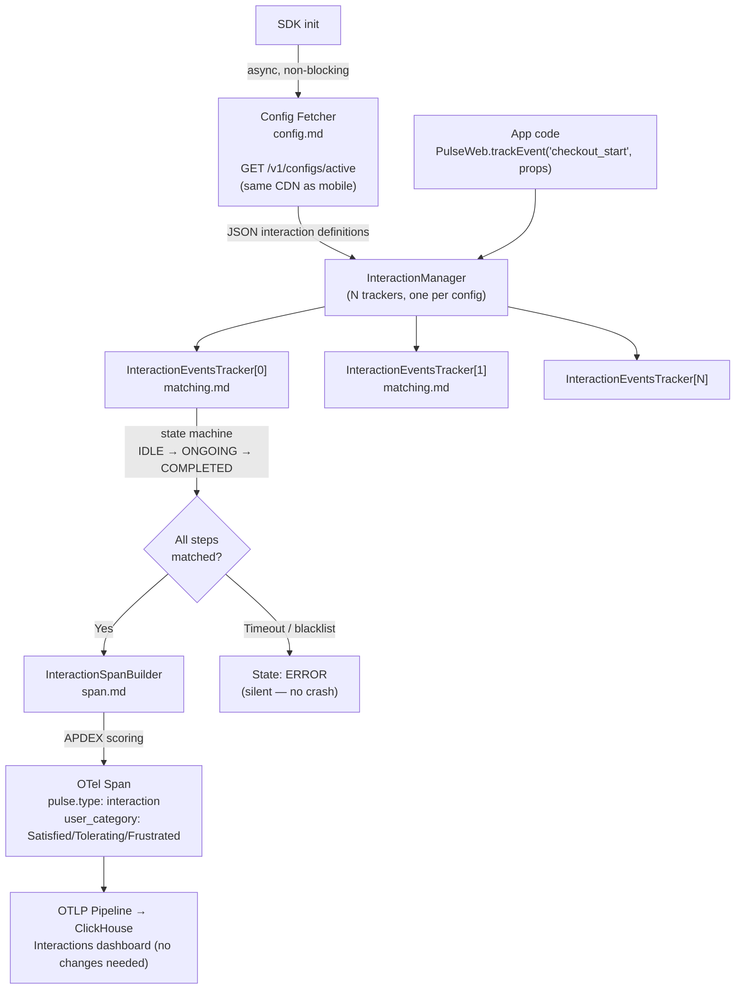

# Interactions — Flow & Summary

A TypeScript port of the server-driven multi-step journey tracking system from Android/iOS. Zero new public API — plugs into `PulseWeb.trackEvent()`. The same Interactions dashboard that works for mobile works for web without backend changes.

---

## Flow

---

## Sub-Documents

| File | What It Does |
|---|---|
| [index.md](./index.md) | Overview, how it fits together, signal output, done criteria |
| [config.md](./config.md) | Config fetcher — CDN fetch, JSON parse, in-memory cache, failure handling |
| [matching.md](./matching.md) | State machine, step sequence matching, operator evaluation, timeout/blacklist |
| [span.md](./span.md) | APDEX scoring (Satisfied/Tolerating/Frustrated), OTel span creation, attribute contract |

---

## APDEX Scoring

| User Category | Condition | Score |
|---|---|---|
| **Satisfied** | `duration ≤ threshold` | 1.0 |
| **Tolerating** | `threshold < duration ≤ 4×threshold` | 0.5 |
| **Frustrated** | `duration > 4×threshold` | 0.0 |

Thresholds are defined per-interaction in the server config — same values as Android/iOS configs, so cross-platform comparison is meaningful.

---

## Key Design Decisions

| Decision | Rationale |
|---|---|
| Config fetched from same CDN endpoint as mobile | Zero new infrastructure; web interactions reuse existing mobile config tooling |
| Config failure is silent — SDK does not crash | Resilience: if CDN is down, the SDK still works, just without interaction tracking |
| Pure TypeScript port of Java/Swift matching algorithm | Ensures identical behaviour across platforms; same test cases apply |
| Two concurrent trackers run independently | Multi-funnel support: user can be mid-checkout AND mid-search simultaneously |
| No new backend/UI changes needed | `pulse.type: interaction` span attributes are identical to mobile — existing dashboard works |
