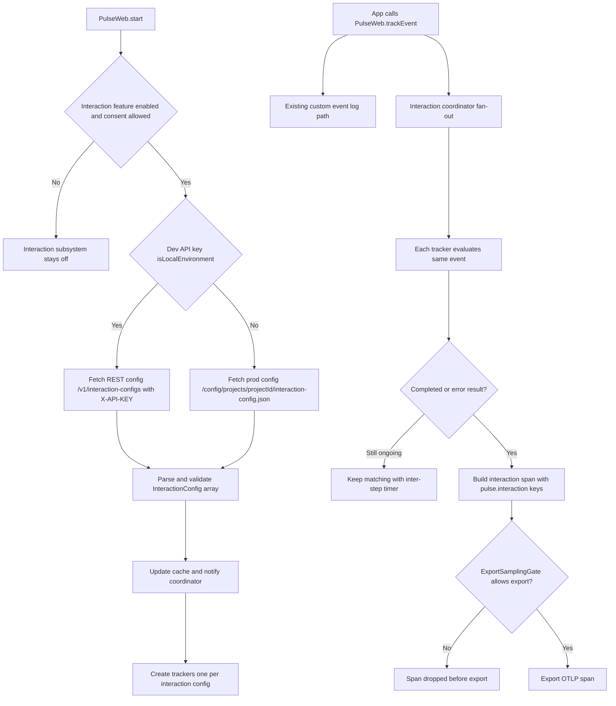
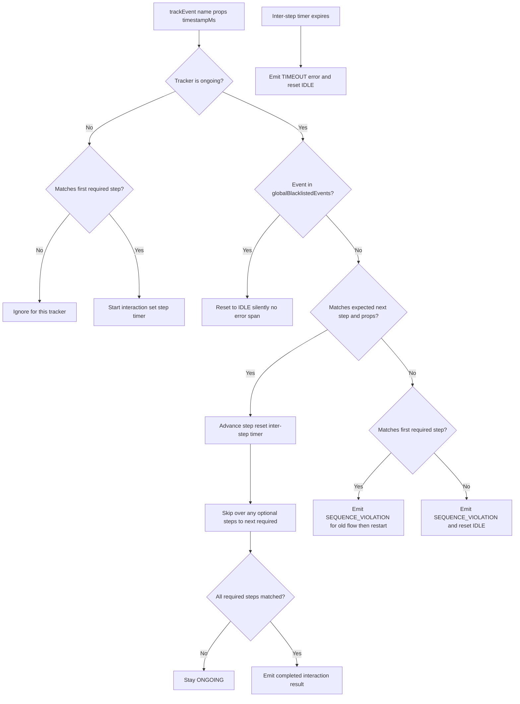

# Pulse Interactions — Simple Explanation

This document explains how web interactions work in plain language, including all important success, failure, and edge cases.

---

## What is an interaction?

An interaction is a multi-step user journey, for example:
- `cart_viewed` -> `checkout_started` -> `order_placed`

The SDK listens to `PulseWeb.trackEvent(...)` calls and tries to match those events against server-provided interaction definitions.  
When a journey completes (or fails), the SDK emits one `pulse.type = interaction` span.

---

## Big Picture Flow

---

## Runtime Behavior (All Cases)

---

## Important Rules

- **Inter-step timeout (not whole-flow timeout)**: timer resets after each matched step.
- **Global blacklist event**: if seen during an ongoing interaction, tracker resets silently.
- **Wrong next event**: emits `SEQUENCE_VIOLATION` error interaction.
- **First-step restart during ongoing flow**: emits `SEQUENCE_VIOLATION` for old flow, then starts a new flow from that event.
- **Synchronous matching**: every `trackEvent` is immediately evaluated by all trackers.
- **Per-event timestamp support**: `trackEvent(name, attrs?, timestampMs?)` uses provided time or `Date.now()`. Note: `timestampMs` is a new optional parameter added in M2 — the pre-M2 signature is `trackEvent(name, attrs?)` only.

---

## How scoring and span fields work

For every completed or errored result, the span builder emits:
- `pulse.type = interaction`
- `pulse.interaction.id`
- `pulse.interaction.name`
- `pulse.interaction.config.id`
- `pulse.interaction.config.name`
- `pulse.interaction.complete_time` (nanoseconds)
- `pulse.interaction.apdex_score`
- `pulse.interaction.user_category` (`Excellent`, `Good`, `Average`, `Poor`)
- `pulse.interaction.is_error`
- `pulse.interaction.error.type` and `pulse.interaction.error.message` (error only)

Scoring:
- <= lower limit -> `Excellent`, score `1.0`
- <= mid limit -> `Good`, score `0.75`
- <= upper limit -> `Average`, score `0.5`
- > upper limit -> `Poor`, score `0.0`
- any error -> always `Poor`, score `0.0`

Unit rule:
- `pulse.interaction.complete_time` must be in nanoseconds (`durationMs * 1_000_000`), not milliseconds.

---

## Non-Happy Paths and Safety

- **Config fetch failure**: no crash; interactions remain disabled or continue with cached config.
- **Missing CDN base URL in non-local mode**: interactions disable silently; SDK does not throw.
- **Corrupt cache or storage errors**: ignored safely; runtime continues.
- **Consent denied**: interaction tracking is not started.
- **Feature gate off**: interaction tracking is not started.
- **Sampling drop**: interaction span can be built but dropped before export.
- **Config refresh while flow is ongoing**: old trackers are shut down; in-flight match is discarded silently; new trackers start with new config.
- **Shutdown**: clears interaction timers and refresh timers.

---

## What app developers need to do

- Call `PulseWeb.start(...)` once.
- Call `PulseWeb.trackEvent(name, attrs?, timestampMs?)` at meaningful flow steps.
- Keep event names and props aligned with interaction definitions from backend config.

No extra interaction API is needed beyond `trackEvent`.

---

## Quick Debug Checklist

- No interaction spans at all:
  - check feature gate `interaction`
  - check consent state
  - check config fetch success (REST/CDN mode)
  - check network request to `pulse-otel-collector.pulse-ux.com/config/projects/{projectId}/interaction-config.json`
- Spans exist but wrong analytics:
  - verify all keys are `pulse.interaction.*` (not bare `interaction.*`)
  - verify `complete_time` is nanos
  - verify user category strings are `Excellent/Good/Average/Poor`
- Flows failing unexpectedly:
  - check `globalBlacklistedEvents`
  - check property filters/operator matches
  - check timeout threshold for each step
