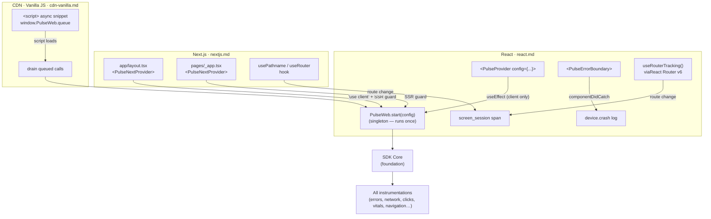

# Framework Integrations — Flow & Summary

Idiomatic wrappers for React, Next.js, and CDN/Vanilla JS. Each is a separate entry point — unused framework code is fully tree-shaken. All three call the same underlying `PulseWeb.start()` singleton under the hood.

---

## Flow



---

## Sub-Documents

| File | Integration | Key Component |
|---|---|---|
| [react.md](./react.md) | React 17+ | `<PulseProvider>`, `<PulseErrorBoundary>`, React Router v6 hook |
| [nextjs.md](./nextjs.md) | Next.js 13+ | App Router + Pages Router providers, SSR guard |
| [cdn-vanilla.md](./cdn-vanilla.md) | Any site / Vanilla JS | Async `<script>` snippet, `window.PulseWeb` global, queue drain |

---

## Package Entry Points

```json
{
  ".":        "@dreamhorizon/pulse-web",
  "./react":  "@dreamhorizon/pulse-web/react",
  "./nextjs": "@dreamhorizon/pulse-web/nextjs"
}
```

Each entry point is a separate tsup bundle — unused framework integrations do not appear in the final bundle.

---

## Key Design Decisions

| Decision | Rationale |
|---|---|
| SSR guard (`typeof window !== 'undefined'`) on all init | Prevents `localStorage is not defined` crashes during Next.js server render |
| Singleton guard in `useEffect` | React StrictMode double-invokes effects; the singleton prevents double-instrumentation |
| Async CDN snippet with queue drain | `PulseWeb.start()` calls made before the script loads are buffered and replayed |
| React Router v6 hook (not v5) | V6 is the current standard; v5 apps can use the CDN/vanilla approach |
| Framework wrappers are thin | All logic lives in the SDK core — framework packages just handle init lifecycle |
