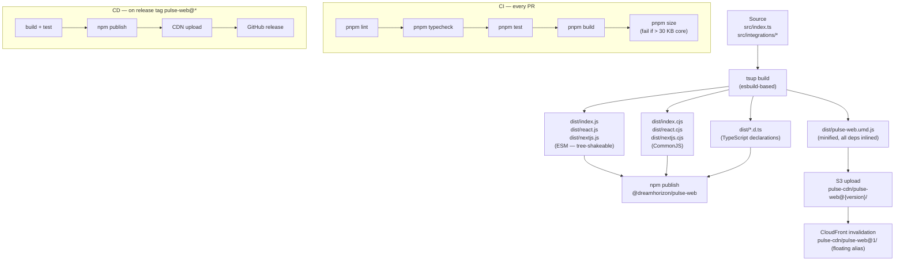

# Build & Distribution — Flow & Summary

Produces production-ready npm packages and CDN artifacts from source, with automated CI/CD that enforces bundle size budgets and publishes on release tags.

---

## Flow

---

## Bundle Size Budget

| Entry | Limit |
|---|---|
| Core SDK (`dist/index.js`) | **< 30 KB gzip** |
| React integration (`dist/react.js`) | < 2 KB gzip |
| CDN UMD build | < 80 KB gzip |

`size-limit` enforces this in CI — PRs fail if the budget is exceeded.

---

## Sub-Documents

| File | What It Covers |
|---|---|
| [index.md](./index.md) | Full build config, package.json exports map, CDN upload script, GitHub Actions CI/CD, done criteria |

---

## Key Design Decisions

| Decision | Rationale |
|---|---|
| tsup (esbuild-based) over Rollup | Simpler config for multi-entry-point packages; fast enough for this bundle size |
| ESM + CJS dual output | Supports both modern bundlers (Vite, webpack 5) and legacy CJS consumers (Jest, older Node) |
| SDK version injected at build time (`define`) | `rum.sdk.version` in emitted spans always matches the actual published package version |
| Floating CDN alias (`pulse-web@1`) with short TTL | Customers on the CDN snippet get patch updates automatically without changing their snippet |
| Immutable versioned CDN path with long TTL | `pulse-web@0.1.0/pulse-web.js` is forever cacheable — no stale-cache issues |
| `peerDependencies` for React/Next | Framework packages not bundled into the SDK — consumers already have them |
