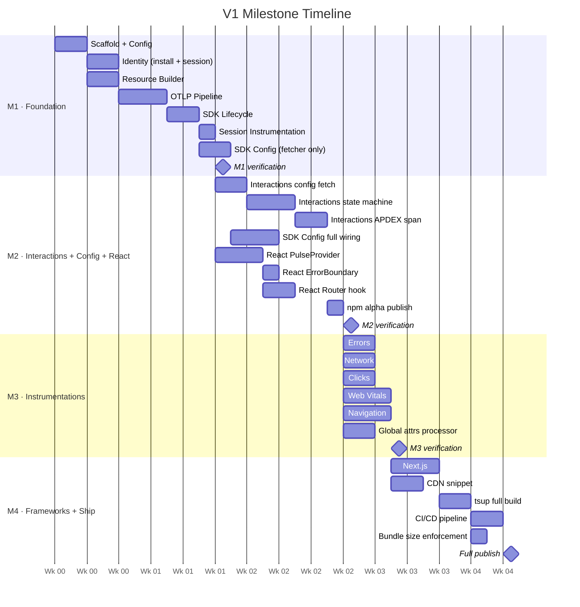

# V1 Milestones

**4 milestones. Each ships something real. Each has one testable story.**

Milestones ≠ phases. Phases are technical groupings. Milestones are shippable capability chunks — ordered by business value, not technical dependency.

---

## M1 — Foundation Live

> **Goal:** SDK initialises, session tracked, data reaches ClickHouse. Pipeline proven end-to-end. No instrumentation yet — just the skeleton.

**From Phase 1 (all of it):**


| Area                         | What gets built                                                                                                                                                                                                                                                           |
| ---------------------------- | ------------------------------------------------------------------------------------------------------------------------------------------------------------------------------------------------------------------------------------------------------------------------- |
| Scaffold + Config            | Repo, package.json, `PulseWebConfig` type                                                                                                                                                                                                                                 |
| Identity                     | `installation.id` (3-tier), `session.id` (30-min rotation), Session Provider                                                                                                                                                                                              |
| Resource Builder             | All static browser attributes stamped on every signal                                                                                                                                                                                                                     |
| OTLP Pipeline                | HTTP exporters (traces/logs/metrics), batch processor (5s/2048/512). Wire format: **protobuf** (`application/x-protobuf`) by default; configurable to JSON via `export.format = 'json'` (dev/DevTools mode). Browser gzip via custom `CompressionStream` exporter — TODO. |
| SDK Lifecycle                | `PulseWeb.start()` singleton, `shutdown()`, instrumentation registry                                                                                                                                                                                                      |
| Session Instrumentation      | `session.start` / `session.end` log signals                                                                                                                                                                                                                               |
| SDK Config (foundation only) | `SdkConfigFetcher` — load from localStorage + fetch in background                                                                                                                                                                                                         |
| Persistence                  | IndexedDB signal buffer (opt-in), drain on next load                                                                                                                                                                                                                      |


**What ships:** Internal build. Not published to npm. Engineers can point it at dev ingest and see sessions.

**Testing scope:**

```
1. PulseWeb.start() → no console errors in Chrome, Firefox, Safari
2. ClickHouse query:
     SELECT platform, project_id, session_id, rum_sdk_version
     FROM otel.otel_logs
     WHERE pulse_type = 'session.start'
     AND platform = 'web'
     LIMIT 5
   → rows appear
3. Reload page → same installation.id, new session after 30-min gap
4. CORS preflight OPTIONS → correct headers returned
5. PulseWeb.shutdown() → no pending requests after await
```

**Exit criteria:**

- Heartbeat span in ClickHouse: `platform = 'web'`, correct `project.id`, `session.id`, `rum.sdk.version` — verified 2026-04-15
- `session.start` emitted on init; `session.end` emitted on `pagehide`
- `installation.id` survives page reload (localStorage)
- CORS verified on `/v1/traces`, `/v1/logs`, `/v1/metrics` — 204 on all three after adding `cors:` to otel-collector.yaml
- Unit tests green: identity, resource, config validation, sdk singleton (26/26 passing)
- E2E tests green: 12/12 Playwright tests passing (session lifecycle, identity, OTLP pipeline, shutdown)

---

## M2 — Interactions + Interaction Config +SDK Config + React + First Publish

> **Goal:** The highest-value Pulse-specific feature ships. Teams can track multi-step user journeys, control the SDK remotely, and integrate with React. First npm alpha published.

**Why interactions before instrumentations?**
Interactions don't depend on auto-instrumentations — they hook into manual `trackEvent()`. Highest business value (parity with mobile). SDK Config is needed *with* interactions to control sampling before going live.

**From Phase 3 — Interactions (all):**


| Area                | What gets built                                                                         |
| ------------------- | --------------------------------------------------------------------------------------- |
| Config Fetcher      | CDN fetch at init, JSON parse, in-memory cache, graceful failure                        |
| Matching Algorithm  | State machine (IDLE → ONGOING → COMPLETED/ERROR), step sequence, timeout, blacklists    |
| Span + APDEX Output | APDEX scoring (Satisfied/Tolerating/Frustrated), OTel span with full attribute contract |


**From Phase 4 — SDK Config (all):**


| Area                    | What gets built                                                                            |
| ----------------------- | ------------------------------------------------------------------------------------------ |
| Sampling Processor      | Session-level sampling decision (once per session), rule evaluation, critical event bypass |
| Feature Gate            | `isEnabled(featureName)` — reads remote config, gates instrumentation install              |
| Signal Filter Processor | Attribute drop/add, signal blacklist/whitelist — stateless, applies immediately            |
| Config wire-up          | Wired into `sdk.ts` init sequence — gates all instrumentation installs                     |


**From Phase 5 — React only:**


| Area                   | What gets built                                                       |
| ---------------------- | --------------------------------------------------------------------- |
| `<PulseProvider>`      | Initialises SDK once with SSR guard (`typeof window !== 'undefined'`) |
| `<PulseErrorBoundary>` | Catches React render errors → `device.crash` log                      |
| React Router v6 hook   | `useRouterTracking()` → `screen_session` spans on route change        |


**From Phase 6 — publish only:**


| Area              | What gets built                                                            |
| ----------------- | -------------------------------------------------------------------------- |
| npm alpha publish | `@dreamhorizon/pulse-web@0.1.0-alpha.1` — internal teams can `npm install` |
| Basic tsup build  | ESM + CJS outputs, TypeScript types — no CDN yet                           |


**What ships:** `@dreamhorizon/pulse-web@0.1.0-alpha.1` on npm. React teams can install and use. Interactions visible in existing Pulse Interactions dashboard (no backend changes needed).

**Testing scope:**

```
Interactions:
1. Call trackEvent('step_1') → trackEvent('step_2') matching config
   → interaction span in ClickHouse with correct APDEX score
2. Timeout mid-sequence → no crash, no span emitted
3. Two concurrent interactions → both tracked independently
4. CDN config fetch fails → SDK still works, interactions disabled silently

SDK Config:
5. Set sessionSampleRate: 0 in remote config → no signals exported
6. Disable a feature via config → instrumentation not installed on next load
7. Config fetch fails → default config (100% sampling, all features on)

React:
8. React app with <PulseProvider> → SDK inits once (not twice in StrictMode)
9. React Router route change → screen_session span
10. Component throw in <PulseErrorBoundary> → device.crash log

Publish:
11. npm install @dreamhorizon/pulse-web → works in clean project
12. import { PulseWeb } from '@dreamhorizon/pulse-web' → no TypeScript errors
```

**Exit criteria:**

- Interaction span with correct `user_category` and APDEX visible in Interactions dashboard
- Config fetch failure → no crash, tracking disabled gracefully
- `sessionSampleRate: 0` → zero signals exported
- React app tracks route changes without manual wiring
- SSR guard: no `localStorage is not defined` in server render
- `npm install @dreamhorizon/pulse-web@0.1.0-alpha.1` works
- Unit tests: state machine all transitions, sampling edge cases, feature gate

---

## M3 — Instrumentations

> **Goal:** Full observability. Every meaningful browser event captured automatically. Zero app code changes needed beyond the existing `PulseWeb.start()`.

**From Phase 2 — all 6 instrumentations (built in parallel):**


| Instrumentation | Signals                                               | Key detail                                                                  |
| --------------- | ----------------------------------------------------- | --------------------------------------------------------------------------- |
| Errors          | `device.crash`, `non_fatal`                           | `window.onerror` + `unhandledrejection`; deduplication                      |
| Network         | `http` span                                           | Patch `fetch` + `XHR`; exclude Pulse endpoints; GraphQL op name             |
| Clicks          | `app.click`                                           | Rage click (3 clicks / 700ms); dead click detection; normalised x/y coords  |
| Web Vitals      | `web_vital` Metric (OTLP Gauge)                       | LCP, CLS, INP, FCP, TTFB via `web-vitals` library with attribution          |
| Navigation      | `screen_load`, `screen_interactive`, `screen_session` | Navigation Timing API + History API patching                                |
| Session signals | `session.start`, `session.end`                        | Already wired in M1; this milestone polishes edge cases (BFCache, rotation) |


**SDK changes needed alongside instrumentations:**

- Global attributes processor fully wired (dynamic attrs on every span/log)
- `screen.name` resolution chain complete (manual → pattern → heuristic → raw path)
- `PulseWeb.setScreenName()` public API
- `PulseWeb.trackEvent()` public API (needed for custom events + interaction trigger)
- `beforeSend` hook plumbed through (signal-level filtering for app developers) — spec: `v1/01-foundation/before-send-web-android-parity.md`
- Consent guard (`DENIED` → zero signals) verified across all 6 instrumentations

**What ships:** SDK now captures what matters. Teams using M2's React integration automatically get all instrumentations. Dashboard shows crashes, API calls, page loads, web vitals.

**Testing scope:**

```
Errors:
1. window.onerror fires → device.crash log with stack trace in ClickHouse
2. Promise.reject() unhandled → non_fatal log
3. Same error repeated 10x → deduplication → only 1 log

Network:
4. fetch('https://api.example.com') → http span with status + duration
5. fetch to Pulse ingest endpoint → NOT traced (excluded)
6. GraphQL POST → http span with operation name extracted

Clicks:
7. Single click → app.click log with element.tag, click.x/y
8. 3 clicks in 600ms same element → app.click.rage: true

Web Vitals:
9. Page load → LCP metric in otel_metrics_gauge with metric.rating
10. CLS metric present with attribution (which element shifted)

Navigation:
11. Initial load → screen_load span with ttfb_ms, load.duration_ms
12. React Router push → screen_session span ends old, new starts
13. screen.name heuristic: /products/12345 → 'products/:id'

Consent:
14. PulseDataCollectionConsent.DENIED → zero signals emitted (all 6 checked)
```

**Exit criteria:**

- All 6 signal types visible in Pulse dashboard under `platform = 'web'`
- Rage click detection working
- Web Vitals attribution populated (LCP element, CLS node)
- SPA route changes tracked automatically (React Router)
- No signals emitted when consent is DENIED
- Pulse ingest endpoints excluded from network tracing
- No errors on Firefox or Safari (graceful no-ops for Chrome-only APIs)
- Unit tests green for all 6 instrumentations

---

## M4 — Framework Completion + Publish Pipeline

> **Goal:** Every web project type can use the SDK. CI/CD enforces quality on every PR. Bundle fits the 30 KB budget. Production npm + CDN release.

**From Phase 5 — remaining frameworks:**


| Integration      | What gets built                                                                                                  |
| ---------------- | ---------------------------------------------------------------------------------------------------------------- |
| Next.js          | App Router (`app/layout.tsx`) + Pages Router (`_app.tsx`); SSR guard; `usePathname` / `useRouter` route tracking |
| CDN / Vanilla JS | Async `<script>` snippet; `window.PulseWeb` queue drain; non-bundler usage                                       |


**From Phase 6 — full build + distribution:**


| Area                    | What gets built                                                      |
| ----------------------- | -------------------------------------------------------------------- |
| tsup full config        | ESM + CJS + UMD; separate bundles per entry point                    |
| TypeScript declarations | `*.d.ts` for all entry points                                        |
| npm exports map         | `.`, `./react`, `./nextjs` entry points                              |
| CDN upload              | S3 + CloudFront; versioned + floating alias                          |
| GitHub Actions CI       | lint → typecheck → test → build → bundle size check on every PR      |
| GitHub Actions CD       | build → test → npm publish → CDN upload → GitHub release on tag      |
| Bundle size enforcement | `size-limit`: core < 30 KB, react < 2 KB, CDN UMD < 80 KB            |
| SDK version injection   | `rum.sdk.version` in spans matches npm package version at build time |


**What ships:** `@dreamhorizon/pulse-web@0.1.0-alpha` (full alpha). Any web project — React, Next.js, or plain HTML — can integrate. CI enforces quality going forward.

**Testing scope:**

```
Next.js:
1. App Router: PulseNextProvider in app/layout.tsx → no SSR errors
2. Pages Router: PulseNextProvider in _app.tsx → no SSR errors
3. next/navigation usePathname change → screen_session span

CDN:
4. <script async src="..."> → window.PulseWeb.start() calls before load drain correctly
5. window.PulseWeb.trackEvent() queued before load → emitted after SDK ready

Build:
6. pnpm build → all dist/ entry points exist, valid JS
7. node -e "require('@dreamhorizon/pulse-web')" → no errors (CJS works)
8. import { PulseWeb } from '@dreamhorizon/pulse-web' → tree-shakes (ESM works)
9. size-limit: core < 30 KB gzip ← CI enforced
10. rum.sdk.version in emitted span = package.json version

CI/CD:
11. PR with bundle regression → size-limit fails CI, blocks merge
12. Release tag pulse-web@0.1.0-alpha → npm publish + CDN upload run
13. CDN URL returns 200, Content-Encoding: gzip
```

**Exit criteria:**

- Next.js App + Pages Router both work, zero SSR errors
- CDN async snippet queues and drains correctly
- `npm install @dreamhorizon/pulse-web` works in fresh project (ESM + CJS + types)
- CDN URL serves gzip-encoded bundle with correct `rum.sdk.version`
- Core bundle < 30 KB gzip enforced in CI (PR fails if exceeded)
- Release tag triggers full publish pipeline
- Example apps for React, Next.js, CDN all working under `examples/`

---

## Timeline Overview




---

## Milestone Exit Gates Summary


| Milestone                   | Ships                 | Key Gate                                                                   |
| --------------------------- | --------------------- | -------------------------------------------------------------------------- |
| **M1** Foundation           | Internal build only   | Heartbeat span in ClickHouse · CORS verified · Session signals flowing     |
| **M2** Interactions + React | `@0.1.0-alpha.1` npm  | Interaction span in dashboard · React app works · SDK Config gates working |
| **M3** Instrumentations     | Updated alpha         | All 6 signal types in dashboard · No signals on DENIED consent             |
| **M4** Full ship            | `@0.1.0-alpha` stable | Next.js SSR clean · CDN snippet works · Core < 30 KB · CI/CD live          |


