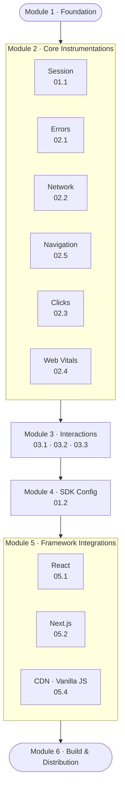

# Pulse Web SDK — V1 Plan

**Target:** `@dreamhorizon/pulse-web@0.1.0-alpha`
**Goal:** A production-grade web SDK that captures the most critical signals, integrates with React and Next.js out of the box, and ships as a usable npm package.

---

## What V1 Delivers

A customer adds **one line of code** and immediately gets:

| Signal | Status |
|---|---|
| Session start / end | ✅ V1 |
| JS crashes & unhandled rejections | ✅ V1 |
| All network requests (fetch + XHR) | ✅ V1 |
| Page load & SPA route changes | ✅ V1 |
| Clicks & rage clicks | ✅ V1 |
| Web Vitals (LCP, CLS, INP, FCP, TTFB) | ✅ V1 |
| Multi-step interaction tracking (APDEX) | ✅ V1 |
| Remote SDK config & feature gates | ✅ V1 |
| React integration (`<PulseProvider>`) | ✅ V1 |
| Next.js integration (App + Pages Router) | ✅ V1 |
| CDN / Vanilla JS snippet | ✅ V1 |
| npm package + CDN artifact | ✅ V1 |

Everything else — long tasks, resource timing, websocket, session replay, Vue, backend UI changes — is **V2**.

---

## Module Dependency Diagram



> All 6 instrumentations in Module 2 are built in parallel. Interactions (Module 3) start once navigation is stable — it depends on `screen.name` resolution from the navigation instrumentation.

---

## Module 1 — Foundation
**Doc: `v1/01-foundation/index.md`**

Everything that follows builds on this. The foundation must be production-grade from day one — retrofitting batching, persistence, or shutdown later is significantly harder.

### What Gets Built

| Area | Detail |
|---|---|
| SDK init / shutdown | `PulseWeb.start(config)` → `PulseWeb.shutdown()` singleton lifecycle |
| Session & identity | Installation ID (3-tier: localStorage → sessionStorage → memory), 30-min session rotation |
| OTLP export pipeline | HTTP exporters for traces, logs, metrics — same endpoints as mobile |
| Batching | 5s flush, 2048 queue, 512 batch — matches Android/iOS defaults |
| Persistence | IndexedDB signal buffer — failed exports survive tab crash, drained on next load |
| Payload & compression | JSON (default) or Protobuf; gzip via native `CompressionStream` |
| Instrumentation registry | `install()` / `uninstall()` contract; every instrumentation togglable at init |
| Global attributes | Every signal carries: `session.id`, `screen.name`, `url.path`, `browser.*`, `os.*`, `device.type` |
| Consent | `PulseDataCollectionConsent.DENIED` gates all signal emission |

### Exit Criteria
- `PulseWeb.start()` runs in Chrome, Firefox, Safari without errors
- A heartbeat span appears in ClickHouse with `platform = 'web'`, correct `project.id`, `session.id`, `rum.sdk.version`
- `pagehide` triggers force-flush; `shutdown()` cleanly uninstalls all instrumentations
- CORS headers verified on ingest endpoints (blocker for everything else)

---

## Module 2 — Core Instrumentations
**Docs: `01.1`, `02.1–02.5`**

Six instrumentations built in parallel. Each implements `install()` / `uninstall()` and is independently togglable via config.

### Session Instrumentation (`v1/01-foundation/session.md`)

| Signal | Kind | When emitted |
|---|---|---|
| `session.start` | Log | On SDK init and after 30-min timeout rotation |
| `session.end` | Log | On `pagehide` / `visibilitychange: hidden` |

Attributes: `session.id`, `session.previous_id`, `session.duration_ms`, `session.screens_visited`.

---

### Errors (`v1/02-instrumentations/errors.md`)

| Signal | Kind | Trigger |
|---|---|---|
| `device.crash` | Log | `window.onerror` — unhandled JS exception |
| `non_fatal` | Log | `window.onunhandledrejection` — unhandled Promise |

Captures: error message, stack trace, file, line, column. Deduplication prevents the same error flooding the pipeline.

---

### Network (`v1/02-instrumentations/network.md`)

| Signal | Kind | What's captured |
|---|---|---|
| `http` | Span | Every `fetch` and `XHR` call |

Attributes: `http.url`, `http.method`, `http.status_code`, `http.duration_ms`, `http.request_size`, `http.response_size`, `http.error`.
URL blocklist: Pulse's own ingest endpoints are always excluded.

---

### Navigation (`v1/02-instrumentations/navigation.md`)

| Signal | Kind | Trigger |
|---|---|---|
| `screen_load` | Span | Initial page load (with Performance API timing) |
| `screen_interactive` | Span | TTI reached |
| `screen_session` | Span | SPA route change via History API / hash |

`screen.name` resolution chain:
1. Manual override (`PulseWeb.setScreenName()`)
2. Route pattern config (`routePatterns`)
3. Heuristic (strip numeric IDs from path)
4. Raw `window.location.pathname`

---

### Clicks (`v1/02-instrumentations/clicks.md`)

| Signal | Kind | Trigger |
|---|---|---|
| `app.click` | Log | Every document click |

Rage click detection: 3+ clicks within 700ms on same target → `app.click.rage: true`.
Attributes: `element.tag`, `element.text`, `element.id`, `element.classes`, normalised `click.x` / `click.y` (for heatmap — V2 UI visualisation deferred).

---

### Web Vitals (`v1/02-instrumentations/web-vitals.md`)

| Signal | Metric | Source |
|---|---|---|
| `web_vital` | LCP | Largest Contentful Paint |
| `web_vital` | CLS | Cumulative Layout Shift |
| `web_vital` | INP | Interaction to Next Paint |
| `web_vital` | FCP | First Contentful Paint |
| `web_vital` | TTFB | Time to First Byte |

Uses `web-vitals` library. Emitted as OTLP Gauge metrics. Attribution included (which element caused LCP, which node caused CLS shift).

### Module 2 Exit Criteria
- All 6 signal types visible in Pulse dashboard under `platform = 'web'`
- No signals emitted when `dataCollectionState: DENIED`
- Each instrumentation correctly disabled when set to `enabled: false` in config
- No errors on Firefox or Safari

---

## Module 3 — Interactions
**Docs: `v1/03-interactions/index.md`, `03.1`, `03.2`, `03.3`**

Port of the server-driven multi-step journey tracking from Android/iOS. No backend changes needed — the span output is attribute-identical to mobile.

### How It Works

```
PulseWeb.trackEvent('event_name', props)
    │
    ├─ emits custom event log (existing behaviour)
    │
    └─ InteractionManager.addEvent()
         │
         └─ InteractionEventsTracker[N].addEvent()   ← step matching
               │
               └─ on sequence complete:
                    InteractionSpanBuilder.create()   ← APDEX scoring
                          └─ OTel span → ClickHouse
```

### Sub-Modules

| Doc | File | What It Does |
|---|---|---|
| `03.1` | `src/interactions/config-fetcher.ts` | CDN config fetch at init, JSON parse, in-memory cache |
| `03.2` | `src/interactions/interaction-matcher.ts` | State machine, step sequence matching, timeout handling |
| `03.3` | `src/interactions/interaction-span.ts` | APDEX scoring (Satisfied / Tolerating / Frustrated), span creation |

### Signal Output

| `pulse.type` | Kind |
|---|---|
| `interaction` | Span with APDEX score |

### Exit Criteria
- Interaction span visible in the existing Pulse Interactions tab (no UI changes needed)
- APDEX score correct for all threshold bands
- Config fetch failure is silent — tracking simply disabled, no crash
- Two concurrent interactions tracked independently

---

## Module 4 — SDK Config (Remote Config)
**Doc: `v1/01-foundation/sdk-config.md`**

Server-driven configuration so any SDK behaviour can be changed without an SDK release or customer redeploy.

### What It Controls

| Capability | Example |
|---|---|
| Session sampling | Reduce to 5% on a high-traffic customer |
| Feature gates | Disable click tracking for a specific browser version |
| Attribute manipulation | Strip a PII attribute remotely |
| Collector URL overrides | Route logs to a different endpoint per project |
| Batch flush interval | Override the 5s default remotely |

### Config Load Strategy

```
SDK init
  │
  ├─ Step 1: Load from localStorage (sync, instant)
  │          Apply immediately — no blocking
  │
  └─ Step 2: Fetch /v1/configs/active/ (async, background)
               │
               ├─ version changed → persist to localStorage
               │                  → takes effect on NEXT session
               └─ error / same version → keep using cached config
```

Config changes apply on the **next session** (not mid-session) to keep sampling decisions stable. Signal filters and attribute drops are the exception — they apply immediately since they're stateless.

### Exit Criteria
- SDK reads cached config from `localStorage` on init without blocking
- Background fetch hits `/v1/configs/active/` with `x-pulse-sdk-name: pulse_web_js`
- Setting `sessionSampleRate: 0` on a feature completely disables that instrumentation
- Sampling decision is made once per session; critical error signals always exported

---

## Module 5 — Framework Integrations
**Docs: `05.1`, `05.2`, `05.4`**

Three idiomatic integrations. Each is a separate package entry point — unused framework code is fully tree-shaken.

### React (`v1/04-frameworks/react.md`)

```tsx
import { PulseProvider } from '@dreamhorizon/pulse-web/react';

function App() {
  return (
    <PulseProvider config={{ endpointBaseUrl, apiKey, serviceName }}>
      <YourApp />
    </PulseProvider>
  );
}
```

- `<PulseProvider>` initialises the SDK once with SSR guard (`typeof window !== 'undefined'`)
- `<PulseErrorBoundary>` catches render errors and emits `device.crash`
- React Router v6 hook for automatic route tracking

### Next.js (`v1/04-frameworks/nextjs.md`)

- Supports both **App Router** (`app/layout.tsx`) and **Pages Router** (`_app.tsx`)
- SSR guard prevents `localStorage is not defined` errors during server render
- Route changes tracked via `next/navigation` (`usePathname`) and `next/router` hooks

### CDN / Vanilla JS (`v1/04-frameworks/cdn-vanilla.md`)

```html
<script>
  window.PulseWeb=window.PulseWeb||{queue:[]};
  window.PulseWeb.start=function(c){window.PulseWeb.queue.push(['start',c])};
  (function(d,s){var t=d.createElement(s);t.async=1;
    t.src='https://cdn.pulse.io/pulse-web@1/pulse-web.js';
    d.head.appendChild(t);})(document,'script');
  window.PulseWeb.start({ endpointBaseUrl: '...', apiKey: '...', serviceName: '...' });
</script>
```

Calls queued before the script loads are drained automatically when the bundle arrives.

### Exit Criteria
- Each framework has a working example app under `examples/`
- SDK initialises exactly once (singleton guard tested)
- Route changes tracked automatically without manual wiring
- No SSR errors in Next.js

---

## Module 6 — Build & Distribution
**Doc: `v1/05-build-distribution/index.md`**

Production npm package + CDN artifact. Automated publish on release tag.

### Outputs

| Artifact | Target |
|---|---|
| `@dreamhorizon/pulse-web` | npm registry |
| `dist/index.js` (ESM) + `dist/index.cjs` (CJS) | npm consumers |
| `dist/react.js`, `dist/nextjs.js` | Framework-specific imports |
| `dist/pulse-web.umd.js` (minified) | CDN `<script>` tag |
| TypeScript types (`*.d.ts`) | All entry points |

### Bundle Budget

| Entry | Budget |
|---|---|
| Core SDK (no replay) | **< 30 KB gzip** |
| React integration | < 2 KB |
| CDN UMD build | < 80 KB |

### CI/CD

- **Every PR:** lint → typecheck → unit tests → build → bundle size check
- **Release tag** (`pulse-web@*`): build → test → `npm publish` → S3 CDN upload → CloudFront invalidation → GitHub release

### Exit Criteria
- `npm install @dreamhorizon/pulse-web` works in a fresh project
- CDN URL returns 200 with gzip encoding
- `rum.sdk.version` in spans matches package version
- Bundle < 30 KB gzip enforced in CI

---

## V1 Done Criteria (Complete Checklist)

### Foundation
- [ ] Heartbeat span visible in ClickHouse with `platform = 'web'`
- [ ] CORS verified on all ingest endpoints
- [ ] Session ID rotates after 30 min inactivity
- [ ] `shutdown()` force-flushes and uninstalls cleanly
- [ ] IndexedDB buffer drains stale signals on next load

### Instrumentations
- [ ] All 6 signal types (`session`, `device.crash`, `http`, `screen_load`, `app.click`, `web_vital`) visible under `platform = 'web'`
- [ ] Rage click detection working
- [ ] Web Vitals attribution populated (which element caused LCP/CLS)
- [ ] SPA route changes tracked automatically
- [ ] No signals emitted when consent is DENIED

### Interactions
- [ ] Interaction span with correct APDEX score visible in Interactions tab
- [ ] Config fetch failure doesn't crash the SDK

### SDK Config
- [ ] Remote feature gate disables instrumentation without SDK release
- [ ] Session sampling decision is stable per session

### Framework Integrations
- [ ] Working example app for React, Next.js, CDN
- [ ] No SSR errors in Next.js

### Distribution
- [ ] `npm install @dreamhorizon/pulse-web` works
- [ ] CDN URL serves gzip-encoded bundle
- [ ] Core bundle < 30 KB gzip in CI

---

## What's Deferred to V2

| Feature | Reason |
|---|---|
| Long Tasks, Resource Timing, Visibility/Online, WebSocket, BFCache | Lower priority signals — core crash/network/vitals ship first |
| Full Interactions refinement | Core APDEX flow ships in V1; edge cases polished in V2 |
| Session Replay (rrweb) | Separate opt-in bundle; significant scope |
| Vue + Nuxt integration | React/Next.js covers most customers first |
| Backend & UI changes | Existing dashboards work via `platform` filter; new screens (Web Vitals UI, replay player) are V2 |
| BrowserStack / E2E test suite | V1 uses unit tests + manual QA; full cross-browser automation is V2 |
| Click Heatmap UI | Data contract is ready (coordinates captured in V1 clicks); visualisation deferred |
