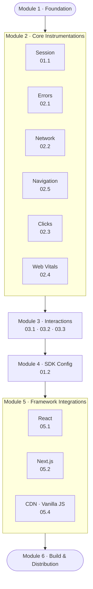

# Pulse Web SDK — V1 delivery overview

Combined view of `PLAN.md` (what ships, module dependencies) and `MILESTONES.md` (how we ship it in four milestones). **V1** is the program; **M1–M4** are the delivery milestones.

---

## What V1 Delivers

*(from `PLAN.md` § What V1 Delivers)*

**Target:** `@dreamhorizon/pulse-web@0.1.0-alpha`  
**Goal:** A production-grade web SDK that captures the most critical signals, integrates with React and Next.js out of the box, and ships as a usable npm package.

A customer adds **one line of code** and immediately gets:

| Signal | Status |
|---|---|
| Session start / end | ✅ V1 |
| JS crashes & unhandled rejections | ✅ V1 |
| All network requests (fetch + XHR) | ✅ V1 |
| Page load & SPA route changes | ✅ V1 |
| Clicks & rage clicks | ✅ V1 |
| Web Vitals (LCP, CLS, INP, FCP, TTFB) | ✅ V1 |
| Multi-step interaction tracking (APDEX) | ✅ V1 |
| Remote SDK config & feature gates | ✅ V1 |
| React integration (`<PulseProvider>`) | ✅ V1 |
| Next.js integration (App + Pages Router) | ✅ V1 |
| CDN / Vanilla JS snippet | ✅ V1 |
| npm package + CDN artifact | ✅ V1 |

Everything else — long tasks, resource timing, websocket, session replay, Vue, backend UI changes — is **V2**.

---

## Module dependency diagram

*(from `PLAN.md` § Module Dependency Diagram)*

Technical layering: what depends on what in the **module** model. Execution order for engineering is the **milestone** sequence below (M2 ships interactions and full config *before* M3 ships all auto-instrumentations).

> All 6 instrumentations in Module 2 are built in parallel. Interactions (Module 3) start once navigation is stable — it depends on `screen.name` resolution from the navigation instrumentation.

### Modules → milestones (where work lands)

| Module (PLAN) | Milestone(s) |
|----------------|--------------|
| 1 · Foundation | **M1** (full); **M2** builds on it |
| 2 · Core instrumentations | **M3** (all six in parallel) |
| 3 · Interactions | **M2** |
| 4 · SDK Config | **M1** (fetcher only) + **M2** (sampling, gates, filters, wire-up) |
| 5 · Framework integrations | **M2** (React) + **M4** (Next.js, CDN) |
| 6 · Build & Distribution | **M2** (first npm alpha) + **M4** (full pipeline, CDN, CI/CD) |

---

## M1 — Foundation Live

*(from `MILESTONES.md`)*

**Goal:** SDK initialises, session tracked, data reaches ClickHouse. Pipeline proven end-to-end. No full auto-instrumentation yet — skeleton + session.

**From Phase 1 (all of it):**

| Area | What gets built |
|---|---|
| Scaffold + Config | Repo, package.json, `PulseWebConfig` type |
| Identity | `installation.id` (3-tier), `session.id` (30-min rotation), Session Provider |
| Resource Builder | All static browser attributes stamped on every signal |
| OTLP Pipeline | HTTP exporters (traces/logs/metrics), batch processor (5s/2048/512). Wire format: **protobuf** (`application/x-protobuf`) by default; configurable to JSON via `export.format = 'json'` (dev/DevTools mode). Browser gzip via custom `CompressionStream` exporter — TODO. |
| SDK Lifecycle | `PulseWeb.start()` singleton, `shutdown()`, instrumentation registry |
| Session Instrumentation | `session.start` / `session.end` log signals |
| SDK Config (foundation only) | `SdkConfigFetcher` — load from localStorage + fetch in background |
| Persistence | IndexedDB signal buffer (opt-in), drain on next load |

**What ships:** Internal build. Not published to npm. Engineers can point it at dev ingest and see sessions.

**Exit criteria:** See `MILESTONES.md` M1 checklist (heartbeat in ClickHouse, session signals, `installation.id` across reload, CORS, unit + E2E tests).

---

## M2 — Interactions + SDK Config + React + First Publish

**Goal:** Highest-value Pulse-specific capability: multi-step journeys, remote control of the SDK, React integration. First npm alpha.

**Why interactions before instrumentations?** Interactions use manual `trackEvent()` — they do not depend on auto-instrumentations. SDK Config is needed with interactions to control sampling before broad rollout.

**From Phase 3 — Interactions (all):**

| Area | What gets built |
|---|---|
| Config Fetcher | CDN fetch at init, JSON parse, in-memory cache, graceful failure |
| Matching Algorithm | State machine (IDLE → ONGOING → COMPLETED/ERROR), step sequence, timeout, blacklists |
| Span + APDEX Output | APDEX scoring (Satisfied/Tolerating/Frustrated), OTel span with full attribute contract |

**From Phase 4 — SDK Config (all):**

| Area | What gets built |
|---|---|
| Sampling Processor | Session-level sampling decision (once per session), rule evaluation, critical event bypass |
| Feature Gate | `isEnabled(featureName)` — reads remote config, gates instrumentation install |
| Signal Filter Processor | Attribute drop/add, signal blacklist/whitelist — stateless, applies immediately |
| Config wire-up | Wired into `sdk.ts` init sequence — gates all instrumentation installs |

**From Phase 5 — React only:**

| Area | What gets built |
|---|---|
| `<PulseProvider>` | Initialises SDK once with SSR guard (`typeof window !== 'undefined'`) |
| `<PulseErrorBoundary>` | Catches React render errors → `device.crash` log |
| React Router v6 hook | `useRouterTracking()` → `screen_session` spans on route change |

**From Phase 6 — publish only:**

| Area | What gets built |
|---|---|
| npm alpha publish | `@dreamhorizon/pulse-web@0.1.0-alpha.1` — internal teams can `npm install` |
| Basic tsup build | ESM + CJS outputs, TypeScript types — no CDN yet |

**What ships:** `@dreamhorizon/pulse-web@0.1.0-alpha.1` on npm. React teams can install and use. Interactions visible in existing Pulse Interactions dashboard (no backend changes needed).

**Exit criteria:** See `MILESTONES.md` M2 checklist (interaction span + APDEX, config failure behaviour, `sessionSampleRate: 0`, React/SSR, npm install).

---

## M3 — Instrumentations

**Goal:** Full observability. Meaningful browser events captured automatically. No extra app code beyond existing `PulseWeb.start()` (plus M2 React wiring where applicable).

**From Phase 2 — all 6 instrumentations (built in parallel):**

| Instrumentation | Signals | Key detail |
|---|---|---|
| Errors | `device.crash`, `non_fatal` | `window.onerror` + `unhandledrejection`; deduplication |
| Network | `http` span | Patch `fetch` + `XHR`; exclude Pulse endpoints; GraphQL op name |
| Clicks | `app.click` | Rage click (3 clicks / 700ms); dead click detection; normalised x/y coords |
| Web Vitals | `web_vital` Metric (OTLP Gauge) | LCP, CLS, INP, FCP, TTFB via `web-vitals` library with attribution |
| Navigation | `screen_load`, `screen_interactive`, `screen_session` | Navigation Timing API + History API patching |
| Session signals | `session.start`, `session.end` | Already wired in M1; this milestone polishes edge cases (BFCache, rotation) |

**SDK changes needed alongside instrumentations:** Global attributes processor; `screen.name` resolution chain; `PulseWeb.setScreenName()` / `trackEvent()`; `beforeSend`; consent `DENIED` across all six.

**What ships:** Updated alpha. Dashboard shows crashes, API calls, page loads, web vitals for apps on M2 integration path.

**Exit criteria:** See `MILESTONES.md` M3 checklist (all six signal types, rage click, vitals attribution, consent, cross-browser).

---

## M4 — Framework Completion + Publish Pipeline

**Goal:** Every common web project type can use the SDK; CI/CD and bundle budgets enforced.

**From Phase 5 — remaining frameworks:**

| Integration | What gets built |
|---|---|
| Next.js | App Router (`app/layout.tsx`) + Pages Router (`_app.tsx`); SSR guard; `usePathname` / `useRouter` route tracking |
| CDN / Vanilla JS | Async `<script>` snippet; `window.PulseWeb` queue drain; non-bundler usage |

**From Phase 6 — full build + distribution:**

| Area | What gets built |
|---|---|
| tsup full config | ESM + CJS + UMD; separate bundles per entry point |
| TypeScript declarations | `*.d.ts` for all entry points |
| npm exports map | `.`, `./react`, `./nextjs` entry points |
| CDN upload | S3 + CloudFront; versioned + floating alias |
| GitHub Actions CI | lint → typecheck → test → build → bundle size check on every PR |
| GitHub Actions CD | build → test → npm publish → CDN upload → GitHub release on tag |
| Bundle size enforcement | `size-limit`: core < 30 KB, react < 2 KB, CDN UMD < 80 KB |
| SDK version injection | `rum.sdk.version` in spans matches npm package version at build time |

**What ships:** `@dreamhorizon/pulse-web@0.1.0-alpha` (full alpha). React, Next.js, or plain HTML. CI enforces quality going forward.

**Exit criteria:** See `MILESTONES.md` M4 checklist (Next SSR, CDN queue, npm + CDN, size-limit in CI, release tag pipeline, examples).

---

## Milestone exit gates summary

*(from `MILESTONES.md` § Milestone Exit Gates Summary)*

| Milestone | Ships | Key Gate |
|---|---|---|
| **M1** Foundation | Internal build only | Heartbeat span in ClickHouse · CORS verified · Session signals flowing |
| **M2** Interactions + React | `@0.1.0-alpha.1` npm | Interaction span in dashboard · React app works · SDK Config gates working |
| **M3** Instrumentations | Updated alpha | All 6 signal types in dashboard · No signals on DENIED consent |
| **M4** Full ship | `@0.1.0-alpha` stable | Next.js SSR clean · CDN snippet works · Core < 30 KB · CI/CD live |

---

**Canonical detail:** `PLAN.md` (module specs, exit criteria per module), `MILESTONES.md` (full testing scope, gantt, checkbox exit criteria).
